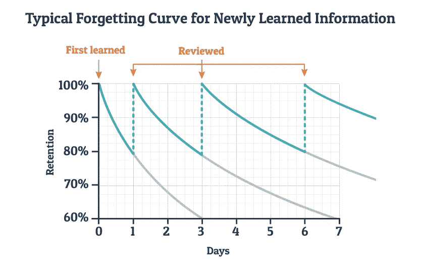

# 如何在找数据科学工作时保持你的技能

> 原文：<https://towardsdatascience.com/how-to-keep-your-skills-sharp-while-data-science-job-hunting-f29ce8003ae6?source=collection_archive---------21----------------------->

这是我写的系列文章的第二篇，内容是关于我公司内部的对话。[你可以在这里看第一部。](/the-hardest-question-youve-been-asked-in-a-data-science-interview-f3eb16b889cb)

如果你现在加入我们，我们运行一个私有的 Slack 组，一半是有经验的数据科学家，一半是有抱负的数据科学家。有抱负的那一半往往会提出很棒的问题，有经验的那一半往往会给出很棒的答案。

我们今天要讨论的问题是:**当你积极找工作时，你应该如何分配你在*找工作本身*——申请、面试、建立关系网——和*保持你的专业技能*之间的时间？**

这个问题经常出现*。两者兼顾非常难！幸运的是，在今天的对话中，你会发现有很好的策略可以让这变得更容易。*

# *[Jiri Stodulka](http://jiristodulka.com) 问道:*

*我已经花了大约两个月的时间在找工作上——结果，在这段时间里我没有做很多编码工作。*

*昨天我在做一些 EDA，我震惊地发现我不得不谷歌一切来完成它——我已经忘记了很多语法。*

*你如何处理这个问题？假设你在积极地找工作，你现在编码多少？*

## *杰瑞米·哈里斯的回答:*

*我通常建议把你的一周分成两天的技能维护和五天的应用和项目，当他们积极寻找的时候。但因人而异。*

*一种常见的划分方式是周末做项目工作，工作日做工作申请和面试。*

*****:*****

***是的，解决方案是明确地安排编码时间。每个人的正确时间表会有所不同。***

***如果工作日/周末分开对你不起作用，一个很好的方法是每天做最小量的编码——比如 15 分钟——并安排在特定的时间。这是一种个人习惯触发器，叫做 [**实现意图**](https://jamesclear.com/implementation-intentions) 。***

## ***Karthik Subramanian 的回答:***

***事实上，在我被雇佣之前，我在这个州呆了很长时间。我忙于应付全职课程、个人项目和找工作。***

***除了半定期的练习，很有帮助的是**文档**。你练习的任何东西，**你都需要记录**。***

***光练习编码是不够的。你应该很好地记录你的工作，这样当你回头看的时候，你可以马上说，“是的，我有一个关于如何做这件事的想法。”例如，我记得在 [LeetCode](http://leetcode.com) 上做了大量的问题——当我想为即将到来的面试修改它时，很多工作都浪费了，因为我没有费心记录我的解决方案。***

***记录资料也给你一个简单的方法来查找资料，而不需要依赖谷歌搜索，因为你已经做了艰苦的跑腿工作。**我喜欢添加一两个帮助我快速找到解决方案的最佳链接**，这样下次会更快。***

***[**引来了乐和**](https://www.linkedin.com/in/drew-lehe/) **:*****

***我以为只有我一个人受这种苦！我总是牢记“遗忘曲线”——所以我花在编码上的时间比申请工作的时间还多:***

******

***除了这些很棒的回答，下面是我自己的策略:*为自己建立一个奖励系统*。***

***在你必须完成的所有任务中——工作申请、编码项目等等。—其中一些任务*给你能量*，一些*消耗你的能量*。你可以把给予能量的任务作为完成消耗能量任务的奖励。这就像在吃甜点之前先吃蔬菜一样:小而持续的奖励可以创造并保持良好的习惯。***

***例如，比起发送求职申请，你可能更喜欢编写软件和分析数据。***

***然后，你可以给自己**设定一个求职申请的最低目标**(例如每天一个)和**一天中处理求职申请的具体时间段**(例如下午 6-6:30)。在你发送了当天的工作申请后，你就可以继续你的编码项目了。***

***我可能会在未来发布更多这样的对话——如果有你特别感兴趣的话题，在 Twitter 上 [ping 我](https://twitter.com/_edouardharris)！***