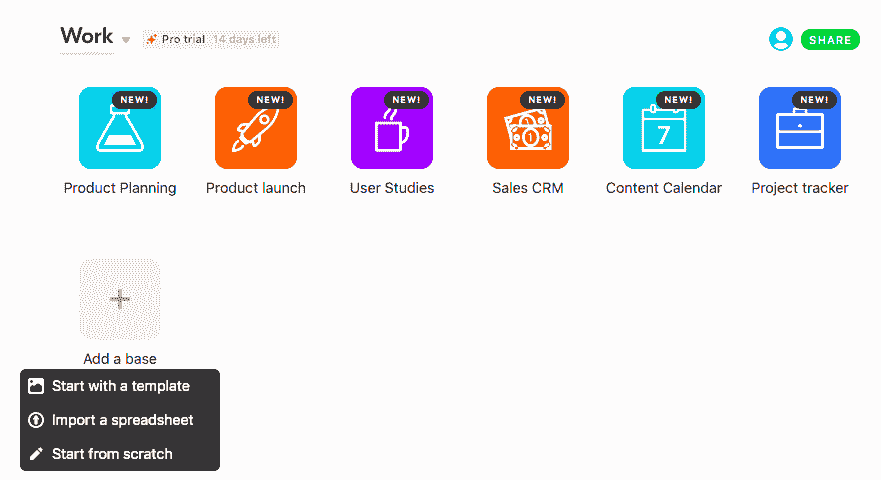
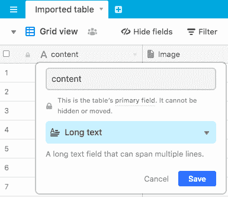
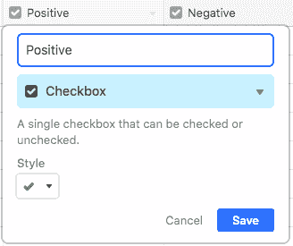
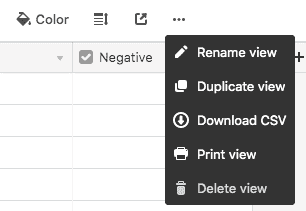
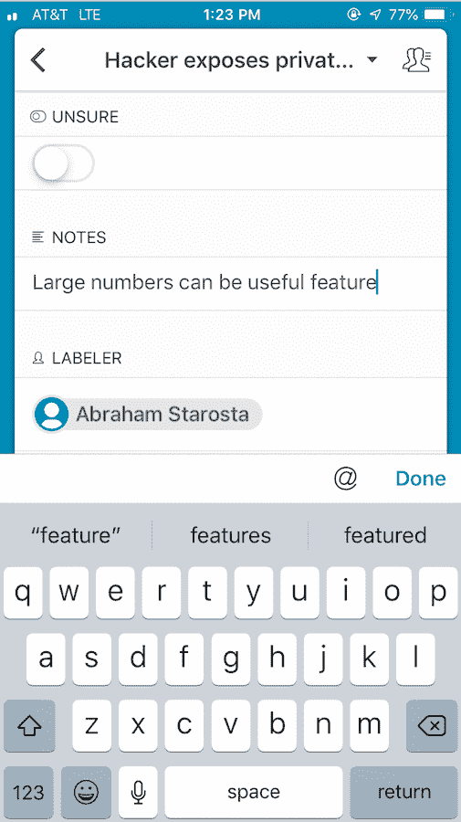

# 如何免费在手机上标记数据

> 原文：<https://towardsdatascience.com/how-to-label-data-on-your-mobile-phone-9913fc7bd852?source=collection_archive---------38----------------------->

## 厌倦了电子表格？在您的手机上更轻松地添加标签

Label data on your phone!

我们将通过使用 [Airtable](https://medium.com/u/40fe149223fd?source=post_page-----9913fc7bd852--------------------------------) 在您的手机上随时随地标记数据的步骤。自从我开始在手机上做标记，我的标记速度至少提高了 3 倍，而且更加愉快了。*注:以上为个人观点，与 Airtable 无关。*

在博客的最后，这是它如何标记图像的:

Labeling images with Airtable

## 第一步:创建账户

在这里创建您的账户[。](http://www.airtable.com)

## 第二步:下载他们的手机应用程序

点击下载 Airtable 的手机应用[。](https://apps.apple.com/us/app/airtable/id914172636)

## 步骤 3:上传数据集

*   收集您未标记的示例，并将其保存为带标题的 CSV 格式。
*   打开电脑应用程序，点击“添加底座”。
*   选择“导入电子表格”并上传您的 CSV 文件。

Adding a base

*   如果你想给图片加标签，[这里有](https://www.youtube.com/watch?v=ucoXsRejUT0)一个批量上传图片的步骤。

## 步骤 4:选择列类型

既然您已经上传了 CSV，我们需要自定义字段类型。对于文本栏，我们将使用“长文本”，对于图像，我们使用“附件”。

Customizing column types.

## 步骤 5:添加标签复选框

现在我们已经上传了数据集，我们将设置用于标注的列。根据我的经验，最简单的标记方法是为每个类创建一个复选框字段列。下面是我们如何设置复选框字段:

Adding a checkbox for “Positive” class.

## 第六步:开始贴标签！

## 第 7 步:将标签数据导出为 CSV 格式

Download CSV

希望你试试 Airtable out！如果你有任何问题，请让我知道。

# 额外的糖果

## 与团队合作:

*   邀请其他贴标机到你的飞行台基地。
*   创建一个名为“Labeler”的列，类型为“Collaborator ”,并分配谁来标记哪些例子。
*   为每个标签创建一个视图，并在每个视图中创建一个过滤器，以便每个标签只能看到它们被分配到的示例。这里就不多赘述了。

## 标记时记笔记:

有时在标记示例时做笔记很有用，为此我们添加了一个名为“笔记”的“长文本”栏。

Taking notes as you label

## 使用 Zapier 进一步自动化流程:

你想在贴标机工作时得到通知吗？或者，当你不确定一个例子的标签时，你想自动松弛你的一个队友吗？那么[扎皮尔](https://zapier.com/?utm_source=google&utm_medium=cpc&utm_campaign=gaw-usa-nua-search-all-brand_exact&utm_term=zapier&utm_content=JChiQv5G_pcrid_336225187084_pkw_zapier_pmt_e_pdv_c_slid__pgrid_61320304925_ptaid_kwd-298647606221_&gclid=EAIaIQobChMIgNuesfaC4wIVmNlkCh3KVwsDEAAYASAAEgJYg_D_BwE)就是你的答案。我也不会详细介绍，但是如果你感兴趣，请在下面评论，我会写另一篇关于如何将 Zapier 与 Airtable 集成的博客。