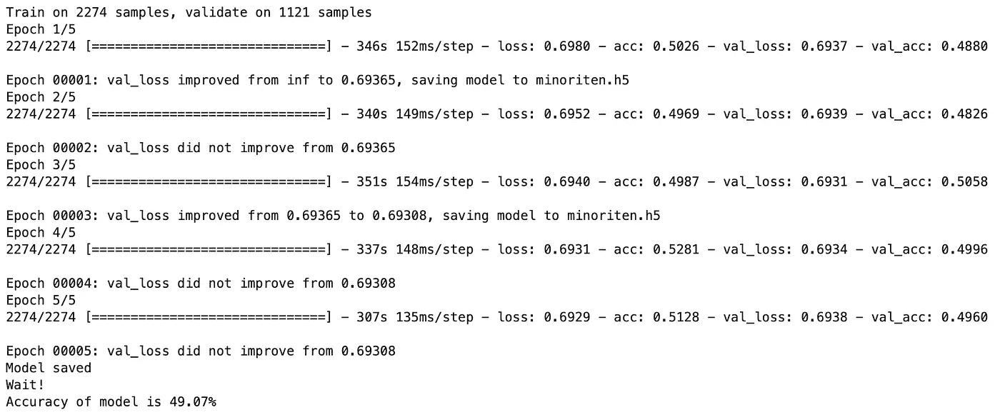

# 如何标记文本以进行情感分析——良好实践

> 原文：<https://towardsdatascience.com/how-to-label-text-for-sentiment-analysis-good-practises-2dce9e470708?source=collection_archive---------8----------------------->

你是否曾经开始一个情感分析或其他文本分类任务，却发现你没有得到好的结果？要研究的可能问题的列表很长，但是有两个方面你可能会按这个顺序忽略。

第一个方面是训练数据集标签的质量，第二个方面是模型本身。我们倾向于花很多时间调整模型，因为——嗯，我们学会了这样做。当你开始你的第一个项目时，你通常会得到一个已经整理好的数据集。在预处理方面没有什么或很少要做。

当我说预处理时，忘记删除重音符号——标记化——删除停用词 bla，bla，关注所有事情的第一步:数据的质量。

 [## 处理数据预处理问题

### 使用来自互联网知识库的数据来研究机器学习(ML)是很棒的，但这也是有代价的:大量的…

medium.com](https://medium.com/@wilamelima/dealing-with-data-preprocessing-problems-b9c971b6fb40)  [## 为什么删除停用词并不总是一个好主意

### 删除停用词是一个困难的选择。您不应该每次都删除它们。但是这一步什么时候才是真正的…

medium.com](https://medium.com/@wilamelima/why-is-removing-stop-words-not-always-a-good-idea-c8d35bd77214) 

# 即使对人类来说，贴标签也很难

你有没有试过给东西贴标签，却发现自己做得很差？如果你还没有，这是一个发现这项任务有多难的好机会。我敢肯定，如果你从一个情感分析问题开始你的机器学习之旅，你多半会下载一个数据集，其中有许多关于酒店/电影/歌曲的预先标记的评论。我的问题是:你有没有停下来读一些呢？

如果你这样做了，你会发现有些标签并不完全是你一开始给的。你可能不同意一些评论是积极的还是消极的。这是因为负/正标签是非常主观的。

如果你不能分辨什么是积极的，什么是消极的，你的电脑肯定会和你一样糟糕。这就是为什么我会坚持认为:给数据贴标签是一门艺术，应该由对你试图从人类的角度解决的问题有着深刻了解的人来完成。但是你可以训练自己变得更好。

# 定义清晰的规则

给文本加标签的一个好方法是定义什么应该接受什么标签的明确规则。一旦你列出了规则，就要保持一致。如果你将亵渎归类为负面，不要将数据集的另一半标记为正面，如果它们包含亵渎。

但是这并不总是有效的。根据问题的不同，即使是讽刺也可能是一个问题和消极的标志。因此，标注文本的第二条经验法则是首先标注最简单的例子。显而易见的正面/反面例子应该尽快标记出来，最难的应该留到最后，当你对问题有更好的理解时。

另一种可能性是预先标记最简单的例子，并用它们建立第一个模型。然后，您可以将剩余的示例提交给该模型，并检查该模型对最难的示例的“意见”。

# 测试随机性

如果你做了以上所有的事情，你仍然不确定你的分类或者你的模型的质量，你可以试着测试随机性。执行以下操作:获取用于创建模型的示例，并为其分配随机标签。你可以用[阿鲁纳](https://aruana.nheeng.com)来做。

当您随机标记您的示例时，您可以检查这些标签对预测的重要性。换句话说，你检查文本是否有好的标签。如果您不确定标签的正确性(假设您认为示例首先收到了错误的标签)，您可以分配随机标签并观察模型的表现。

还有一种可能是模型本身坏了。为了测试模型是否总是给出相同的预测，不管它接收的是什么样的例子，我们可以给模型输入随机的文本。在这种情况下，除了只更改标签，您还可以创建没有任何意义的文本块，并查看模型的执行情况。

# 做实验

我用上面的两个理论来测试我正在工作的一个模型。我不确定是我的模型坏了，还是我正在处理的例子没有贴好标签。

下面是我如何进行体验的:使用相同的例子，我用相同的配置训练了一个模型三次(但是总会存在一点随机性)。第一次运行时，我用随机标签测试了模型。第二次运行时，我使用了文本 blobs，第三次运行时，我使用了正确的示例。很重要的一点是，我研究的是一个平衡的数据集。

我把数据加载到一个熊猫数据集中，有两列:“文本”和“情绪”。情感栏保存文本分类。

## 首轮放映

`from aruana import Aruana
aruana = Aruana('pt-br')
sentiment = [aruana.random_classification](https://aruana.nheeng.com/docs/aruana-class#random_classification)(data['text'], classes=[0,1], balanced=True)
data['sentiment'] = sentiment`

结果是:

正如你所看到的，一般的准确率是 50%，这意味着这个模型并不比随机猜测好多少。

## 二轮放映

`from aruana import Aruana
aruana = Aruana('pt-br')
texts = [aruana.replace_with_blob](https://aruana.nheeng.com/docs/aruana-class#replace_with_blob)(data['text'])
data['text'] = texts`

结果是:

将文本更改为随机斑点也会降低模型的性能。

## 第三轮

第三次运行时，我用好的文本/标签填充模型，结果如下:

看看它是如何改进的！因此，文本和标签在这里并不重要。

# 结论

如果你正在处理情感分析问题，小心文本标签。如果你一生中从未给文本加过标签，这是一个很好的练习。如果你仅仅依靠干净/处理过的文本来学习，你可能会面临一个问题，这个问题不是你的模型，而是你用来训练它的信息。