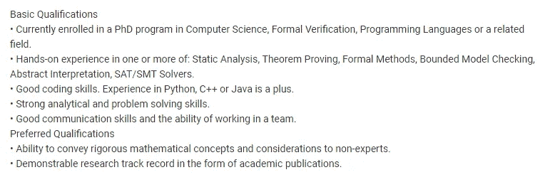

# 如何获得机器学习领域的实习机会

> 原文：<https://towardsdatascience.com/how-to-land-an-internship-in-machine-learning-20bb9b65ad79?source=collection_archive---------11----------------------->

作为一名本科生，获得机器学习的实习机会是很艰难的。真的很难……大部分知名公司都在找在知名期刊发表论文的博士生。如果不能满足以上几点，如何增加获得 ML 实习的机会？

Photo by [Hunters Race](https://unsplash.com/@huntersrace?utm_source=medium&utm_medium=referral) on [Unsplash](https://unsplash.com?utm_source=medium&utm_medium=referral)

去年，我已经花了几个小时发送申请，申请机器学习/人工智能实习。作为一名电子工程专业的学生，我发现甚至连面试都特别困难，尽管我在机器学习方面有一些相关经验。在我寻找实习机会的过程中，我注意到了一些公司都在寻找的共同点。基于这些事实，我决定改变发送简历的策略，这最终导致我获得了一份机器学习研究实习生的工作。如果你正计划申请机器学习实习，或者你正在努力获得一份实习，我希望这篇文章能帮助你找到你梦想的工作！

我还写了另一篇帮助你准备面试的文章。 [*链接就在这里。*](/interviewing-for-data-science-internship-how-to-prepare-f6b9c2c7fa97)

## 大公司=激烈的竞争

Photo by [Paweł Czerwiński](https://unsplash.com/@pawel_czerwinski?utm_source=medium&utm_medium=referral) on [Unsplash](https://unsplash.com?utm_source=medium&utm_medium=referral)

我犯的第一个错误是申请知名的大公司。谷歌(Google)、亚马逊(Amazon)或苹果(Apple)等公司每天都会收到数百份申请，甚至很难通过实习的第一个招聘阶段。如果你觉得你在机器学习方面有很好的技能，在这个领域有丰富的经验，那就去做吧。否则，最好把目标放在规模较小、知名度较低的公司，以最大化你被聘用的机会。例如，看看亚马逊机器学习实习生所需的基本资格:

Internship requirements for Machine Learning Internship at Amazon, found on [Linkedin](https://uk.linkedin.com/jobs/view/machine-learning-intern-at-amazon-1258229249?utm_campaign=google_jobs_apply&utm_source=google_jobs_apply&utm_medium=organic)

哇哦。你看，这就是我所说的严格要求的意思。最好，你应该是一个在机器学习方面有几个出版物的哲学博士。如果你是本科，和我一样，在这里明显处于劣势。

看看你周围有没有涉及机器学习的公司。给他们发邮件，或者在 LinkedIn 上联系他们，询问他们是否提供 ML 的实习机会。他们有可能会这样做，这让你处于一个非常有利的位置，因为不会有那么多申请人，工作要求也不会那么高。

你可以做的另一件事是询问你大学里专注于 ML 研究的教授。他们可能会在研究项目中寻求帮助，或者认识业内的相关人士。这也是我去年在[网络物理系统研究小组](https://www.cps.ecs.soton.ac.uk/)实习的原因。

## 证明你是好的

Photo by [Lee Campbell](https://unsplash.com/@leecampbell?utm_source=medium&utm_medium=referral) on [Unsplash](https://unsplash.com?utm_source=medium&utm_medium=referral)

在 ML 中投入大量时间在你的自我教育上。您可能知道，这是一个非常广泛的主题，需要对统计学、算法和编程有很好的理解。你需要证明你对 ML 的各个方面都有很好的理解，并且你也是一名优秀的程序员。

个人项目是一条路要走！为 [Kaggle](https://www.kaggle.com/kernels) 写一个内核，在 Github 上发布你的代码或者贡献给开源项目。招聘人员希望有证据证明你作为实习生会给公司带来积极的贡献。

通过参加 Kaggle 比赛，在其他机器学习爱好者中测试自己。起初它们可能很难，但这是一个加深你对算法理解的绝佳机会，它也推动你学习新的 ML 概念。

在你的大学创建一个人工智能社团或学习小组。这就是我去年所做的，它对我的自我发展的贡献令人惊讶。出于对社会的责任感，我必须为每周的研讨会制作大量各种各样的材料，并提高我的领导技能。它也能让你在你的大学里处于一个 ML 专家的位置！如果你玩得好，你还可以通过邀请当地公司做演讲或为学生准备研讨会来参与其中。

## 提高你在行业中的地位

Photo by [Miguel Henriques](https://unsplash.com/@miguel_photo?utm_source=medium&utm_medium=referral) on [Unsplash](https://unsplash.com?utm_source=medium&utm_medium=referral)

在线状态确实有助于与其他人建立联系，并获得认可。你可以成为机器学习的专家，但谁会在乎没人听说过你呢？定期在 ML 媒体上发表文章以吸引眼球，或者创建自己的博客。

也可以加入 AI 会议或活动。走出你的舒适区，和尽可能多的人交谈。这是结识来自不同公司的专业人士的最佳场所，也是与能帮你获得 ML 实习机会的人建立良好联系的潜在场所。

希望这篇文章对你获得 ML 实习有所帮助。你有什么其他的想法吗？你能做些什么来增加你得到那份工作的机会？请在评论中告诉我！