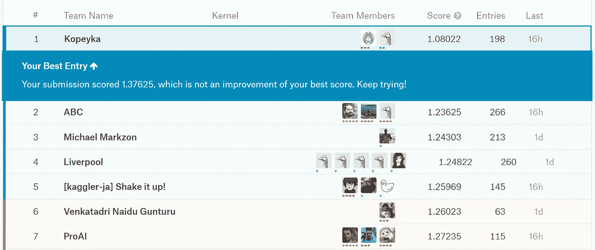
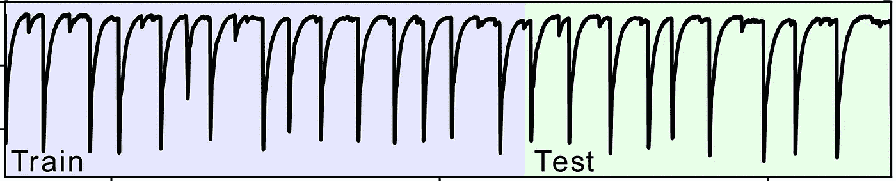

# 如何在 Kaggle 上安装 LB 探针

> 原文：<https://towardsdatascience.com/how-to-lb-probe-on-kaggle-c0aa21458bfe?source=collection_archive---------21----------------------->

在 Kaggle 的 LANL 地震预测竞赛中，我们的团队使用 LB 探测策略，与 4500 个参赛团队一起获得了公共排行榜第一名。这是描述该策略的概述。

我们从简短介绍比赛环境开始。然后，我们继续我们对测试数据的发现，最后描述我们采用的主要方法——混合整数规划，通过分数逐渐提高来迭代可行的解决方案。



Top of the public leader-board

比赛训练数据由 6.29 亿次连续测量组成，这些测量跨越了 163 秒的实验室实验，包括 16 个地震周期。列车数据中的地震间隔时间从 7 秒到 16 秒不等。基于该训练信号，要求竞争者在 2624 个测试段上预测下一次故障的剩余时间，每个测试段包含 150k 连续测量值或大约 0.038 秒的测试数据。目标是最小化预测的平均绝对误差。

大约在比赛结束前一个月，论坛上有报道称数据可能来自一个特定的实验室实验，而[一篇描述该实验的学术文章](https://arxiv.org/pdf/1810.11539.pdf)中有一张与比赛列车组完全匹配的列车组图片。



train vs test data from the article

该图片还包含可疑的测试集，并且可以安全地假设，测试数据段是从列车集之后的 108 秒长的连续间隔中截取的。

组织者进一步将测试数据细分为公共和私有数据集，已知公共数据包含 13%的数据。然而，没有公开在公共部分中确切有多少段，也没有公开哪一个是私有的，哪一个是公共的。

每个团队每天有两次提交，参与者被要求对所有 2624 个测试段做出预测。系统使用公共集 MAE 分数进行回答，该分数仅在公共部分子集上进行内部计算，每个团队的最佳分数显示在公共排行榜上。

一份全部 10 分的提交给我的分数是 5.982，全部 20 分是 15.982，这意味着在公共领导板上没有高于 10 的值。

然后，我们通过将所有值设置为 10，但另外将 60 个随机段值更改为 10000，进行了另一次提交。分数是 293.051，由此很容易得出结论，公共集合中唯一可能的整数段数是 348，并且我们碰巧在所选的 60 个段中找到了 10 个公共段。

接下来，我们为以下值列表的所有预测提交了相同的值:[0，2，3，3.25，3.5，3.75，4，4.25，4.5，5，9，9.72，10]。基于得到的分数，并假设片段的密度对于每个区间是恒定的，可以计算每个区间上片段的密度。事实上，这个问题甚至是过度约束的，需要一些优化技术或启发式方法来解决它。

注意，上次地震设定的列车被截断，停在 9.76。因此，测试集最早从 9.72 开始(减去一个片段持续时间 0.038)。这就是上面列表中值 9.72 的来源，只是猜测这个值可能是相关的。


fig. 1: density of public segments targets

不赘述，我们将问题公式化为二次规划凸优化问题，用 [cvxopt 包](https://cvxopt.org/examples/tutorial/qp.html)求解。这导致图像上描绘的片段密度(见图 1)。


fig. 2: density of public segments targets only with scores 0, 4.5, 9.72 and 10

所获得的结果是有噪声的，因为对于每个区间段的密度恒定的假设并不精确，毕竟我们只有大约 348 个离散值，它既不是均匀的也不是连续的。但人们仍然可以清楚地看到，我们有两种制度。通过在模型中只保留 4.5 和 9.72 的值，我们得到了更清晰的结果，见图 2。计算出的密度为 0.141、0.070 和 0.001。如果您有兴趣自己进行计算并验证该结果，分数如下:

```
4.017 for all 0
2.379 for all 4.5
5.702 for all 9.72
5.982 for all 10
```

上面的计算决定性地向我们证明，公共集由两个连续的区间组成:9.72 到零，这显然是上次火车地震的延续，另一个区间从 4.5 到零。我敢打赌，这最后的 4.5 秒是取自最后一次测试数据地震，使私人测试数据连续。

通过了解文章中的总测试持续时间，我们还估计在连续的测试段之间平均有 7500 个样本的差距。考虑到这一差距，可以计算出 0 到 9.72 和 0 到 4.5 这两个区间正好符合 348 个区间，进一步证实了结论。

接下来，我们提交了 88 份材料，以发现哪些部分是公开的，哪些是私人的(是的，花了 44 天！).


the expected reaction

在每个这样的提交中，我们将所有值设置为 10，除了 30 个段，我们为其选择值

```
val[i] = 10 + 0.348*2^i
```

以二进制表示的结果提交分数减去 5.982(全部 10 个的分数)给出了这 30 个分段的公共/私有掩码。

现在，当我们知道公共段索引时，发现公共段值的一种方法是提交所有值 10，并且一次将一个公共段更改为零。这个过程需要 348 个提交来覆盖整个集合，这是不可行的。

我们采用的方法是基于混合整数规划(MIP)的，这种神奇的方法让我们能够以更快的速度提高我们的公共 LB 分数。问题公式是我们需要将 348 个段匹配到 348 个值，其中这些值从 0 到 9.72 和从 0 到 4.5 等间距分布，如上所述。我们所做的每一次提交都是对这个公式的约束。下面给出了完整的 MIP 问题公式，我们使用了 [pulp python 包](https://pythonhosted.org/PuLP/)和 cplex 作为求解器(学术许可)。代码中的语法是纸浆的语法。

```
# decision variables
# matrix of indicators if a segment selects a value
pp=LpVariable.dicts("mix",(range(D),range(D)),0,1,LpInteger)
# absolute value of errors for submission-segment pairs
tt=LpVariable.dicts("err",(range(S),range(D)),0,20,cat='Continuous')
# margins for submission scores
dd=LpVariable.dicts("div",(range(S)),0,100,cat='Continuous')# D is number of segments = 348
# S is number of submissions available
# den is a probability density of a segment to have a value
# sub is predictions for public segments in each submission
# times is a list of all 348 public segments values
# sc is the submissions scores# objective
prob += lpSum(lpSum(pp[d][i] * den[d,i] for i in range(D)) for d in range(D)) + 1000*lpSum(dd[s] for s in range(S))

# constraints
for d in range(D):
   # one selected for each segment
   prob += lpSum(pp[d][i] for i in range(D)) == 1

for i in range(D):
   # one selected for each value
   prob += lpSum(pp[d][i] for d in range(D)) == 1

for s in range(S):
   for d in range(D):
      # error of each submission-segment
      prob += tt[s][d] == lpSum(pp[d][i] * abs(sub[s,d] - times[i]) for i in range(D))

for s in range(S):
   # sum of errors is +-0.0005 rounding error plus margin
   prob += lpSum(tt[s][d] for d in range(D))<=D*(sc[s]+0.0005+dd[s])
   prob += lpSum(tt[s][d] for d in range(D))>=D*(sc[s]-0.0005-dd[s])
```

我们最小化的目标函数由两部分组成。首先，我们希望找到可行的解决方案，因此我们希望将利润率设为零(决策变量 dd)。其次，在所有可行的解决方案中，我们希望选择可能性最大的一个。为此，我们使用了一个单独的 LGBM 分类模型的输出，该模型定期在训练集上进行训练。

MIP 迭代的过程如下。对于给定的一组可用提交，我们运行模型，获得可行的最大似然解，这是我们提交给 Kaggle 的结果。可行解决方案的集合仍然很大，我们通常每次都将分数提高 0.000–0.080。然后，我们将新的提交添加到集合中，并使用新的约束重复这个过程。

注意这个 MIP 问题还是挺大的，最后达到 245k 变量和 124k 约束。我们每次迭代都要运行几个小时的模型，即使这样也达不到精确可行的解决方案。所有提交的平均利润率在最后是 0.003(实际上非常好)。

最后，我们有 353 份以分数为约束条件的提交，其中包括所有我们自己的相关提交+ 261 份我们从公共内核下载的提交。

作为总结，我们开发了一个 MIP 模型公式，它在 348 个公共段和我们知道的构成公共测试集的值之间寻找可行的匹配。在每一次迭代中，模型都会生成一个满足所有约束条件的可行解决方案，即带有我们已有分数的提交。从某种意义上说，这是一个可行的解决方案，如果提交了这个解决方案，模型认为 0 分是可能的。在实际提交生成的值后，我们得到了一个真实的分数，而不是 0，并再次运行模型，这样它就可以根据新的信息进行自我修正。

该模型的特性是它生成满足所有提交的匹配。也就是说，如果您计算生成的解决方案和任何提交公共条目之间的 MAE 度量，您将获得实际的提交分数(如上所述，平均误差为 0.003)。

令人着迷的是，我们添加了如此多的公共内核提交，以至于我们完全覆盖了那个特定的子空间。当我们观察到我们的模型解决方案预测了 95%的分数，最大误差为 0.02，而没有专门学习它们时，我们停止了获取更多的公共内核提交！另一方面，该模型生成的提交物的预测值为零，与所有其他提交物正交，并提供了大量新信息。

在最后一个比赛日期间，MIP 解决方案生成的在“常规”提交的子空间上预测分数非常好，以至于我们使用它来估计所有最终提交候选人的公共 LB 分数(参与者被要求选择两个提交作为最终提交)。

不幸的是，我们在比赛中很晚才准备好运行 MIP 模型，只有时间提交 17 份这样的提交材料。他们的分数如下所示。

```
1.641 MIP 1th
1.511 MIP 2th
1.681 MIP 3th - Me giving only 20% to make any significant progress
1.304 MIP 4th - Better score than our best model
1.409 MIP 5th
1.326 MIP 6th
1.357 MIP 7th
1.306 MIP 8th
1.412 MIP 9th
1.231 MIP 10th - First place reached
1.226 MIP 11th
1.225 MIP 12th
1.145 MIP 13th
1.110 MIP 14th
1.101 MIP 15th
1.080 MIP 16th
1.104 MIP 17th
```

衷心感谢我的 Kaggle 队友 [Ido Greenberg](https://www.linkedin.com/in/ido-greenberg-87245852) 在这个过程中给予的帮助和支持，即使我估计它只有 20%的机会产生任何有价值的东西。这是一个冒险的策略，但实际上奏效了。


thanks for reading!