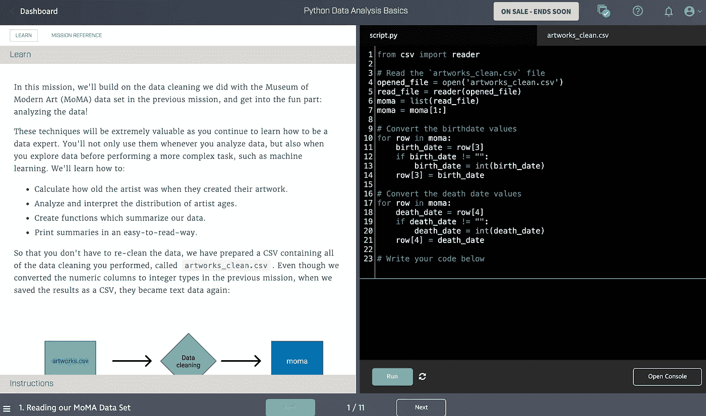
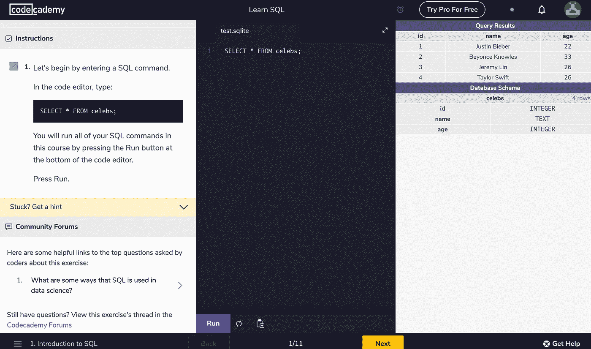
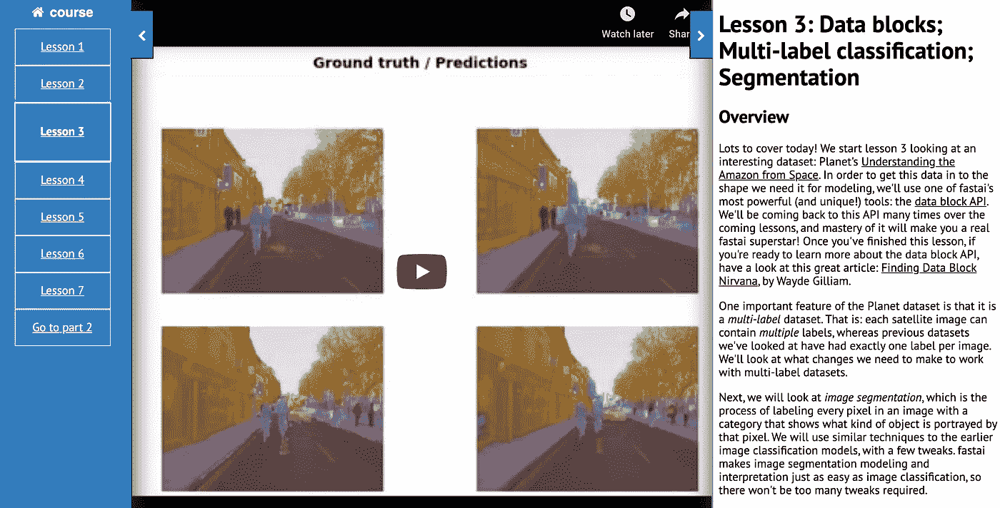
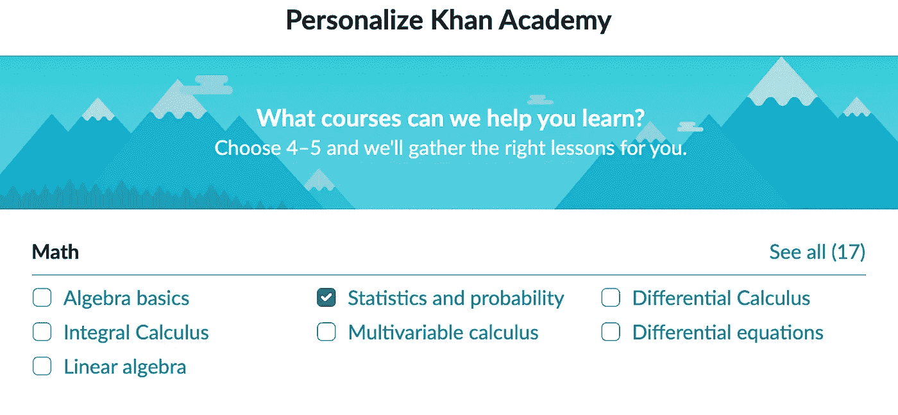
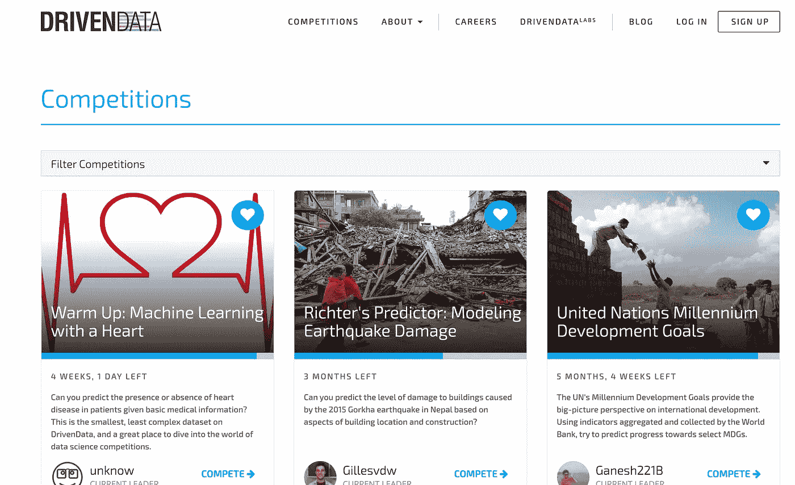
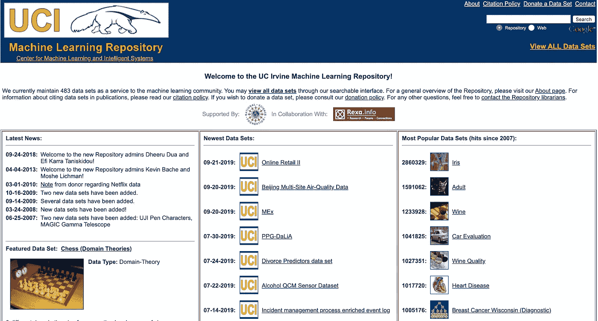

# 如何免费学习数据科学

> 原文：<https://towardsdatascience.com/how-to-learn-data-science-for-free-eda10f04d083?source=collection_archive---------0----------------------->

Photo by [Josh Appel](https://unsplash.com/@joshappel?utm_source=unsplash&utm_medium=referral&utm_content=creditCopyText) on [Unsplash](https://unsplash.com/s/photos/money?utm_source=unsplash&utm_medium=referral&utm_content=creditCopyText)

## 一个完整的学习路径，包括不花你一分钱的资源

在传统的实体院校获得硕士学位的平均费用会让你花费在 3 万到 12 万美元之间。即使是在线数据科学学位课程也不便宜，最低费用为[9000 美元](https://www.insidehighered.com/news/2018/10/12/edx-launches-nine-low-cost-online-degrees)。那么如果你想学数据科学但是又付不起这个费用怎么办？

我接受了数据科学家的职业培训，但没有接受过这方面的任何正规教育。在本文中，如果你不能或不想支付数千美元进行更正式的学习，我将与你分享我自己学习数据科学的个人课程。

该课程将包括 3 个主要部分，技术技能，理论和实践经验。我将包括学习路径的每个元素的免费资源的链接，也将包括一些额外的“低成本”选项的链接。因此，如果你想花一点钱来加快你的学习，你可以将这些资源添加到课程中。我将包括每个项目的估计成本。

## 技术

课程的第一部分将侧重于技能。我建议先学习这些，这样你就可以先采取实用的方法，而不是说先学习数学理论。到目前为止，Python 是用于数据科学的最广泛使用的编程语言。在 2018 年进行的 [Kaggle 机器学习和数据科学](https://www.kaggle.com/sudhirnl7/data-science-survey-2018)调查中，83%的受访者表示他们每天都在使用 Python。因此，我建议把重点放在这种语言上，但也花一点时间在其他语言上，比如 r。

## Python 基础

在开始将 Python 用于数据科学之前，您需要基本掌握这门语言背后的基础知识。所以你会想参加 Python 入门课程。有很多免费的，但我最喜欢 Codeacademy 的，因为它们包含了在浏览器中动手编码。

我建议参加入门课程学习 [Python](https://www.codecademy.com/learn/learn-python) 。这包括基本语法、功能、控制流、循环、模块和类。

## 使用 python 进行数据分析

接下来，您将希望很好地理解使用 Python 进行数据分析。这方面有许多好的参考资料。

首先，我建议至少参加 [dataquest.io](https://app.dataquest.io/dashboard) 上的免费数据分析师学习课程。Dataquest 为数据分析师、数据科学家和数据工程师提供完整的学习路径。相当多的内容，尤其是关于数据分析师路径的内容是免费的。如果你确实有一些钱用于学习，那么我强烈建议你把它用于支付几个月的高级订阅费。我参加了这门课程，它为数据科学的基础知识打下了良好的基础。我花了 6 个月的时间完成了数据科学家之路。价格从每月 24.50 美元到 49 美元不等，取决于你是否按年付费。如果你负担得起的话，购买[年度订阅](https://www.dataquest.io/subscribe/)更划算。

[The Dataquest platform](https://app.dataquest.io/dashboard)

## 用于机器学习的 Python

如果你选择在 Dataquest 上付费学习完整的数据科学课程，那么你将会很好地掌握 Python 机器学习的基础知识。如果没有，那么有大量的其他免费资源。我将重点从 scikit-learn 开始，这是迄今为止最常用的用于机器学习的 Python 库。

在我学习的时候，我有幸参加了由 scikit-learn 的核心开发者之一 [Andreas Mueller](https://amueller.github.io/) 举办的为期两天的研讨会。然而，他已经在这个 [Github repo](https://github.com/amueller) 上发表了本课程的所有材料和其他材料。这些包括幻灯片、课程笔记和笔记本，您可以浏览。我肯定会推荐你阅读这些材料。

然后我会建议参加 [scikit-learn 文档](https://scikit-learn.org/stable/tutorial/basic/tutorial.html)中的一些教程。在那之后，我会建议构建一些实用的机器学习应用程序，并学习模型如何工作背后的理论——我稍后会谈到这一点。

**SQL**

如果你想成为一名数据科学家，SQL 是一项至关重要的技能，因为数据建模的基本过程之一是首先提取数据。这通常会涉及到对数据库运行 SQL 查询。同样，如果你没有选择参加完整的 Dataquest 课程，那么这里有一些免费的资源来学习这项技能。

Codeacamdemy 有免费介绍 [SQL 课程](https://www.codecademy.com/learn/learn-sql)。同样，这对于浏览器内编码非常实用。如果你也想了解基于云的数据库查询，那么 Google Cloud BigQuery 是非常方便的。有一个免费层，所以你可以免费尝试查询，大量的公共数据集可以尝试，非常好的[文档](https://cloud.google.com/bigquery/docs/tutorials)。

[Codeacademy SQL course](https://www.codecademy.com/courses/learn-sql/lessons/manipulation/exercises/sql?action=resume_content_item)

## 稀有

要想成为一名全面的数据科学家，从 Python 开始尝试多样化是一个好主意。因此，我建议在 R. Codeacademy 上一门入门课，介绍他们的[免费计划](https://www.codecademy.com/learn/learn-r)。这里可能值得注意的是，与 Dataquest Codeacademy 类似，它也提供完整的数据科学学习计划作为其 pro 帐户的一部分(每月费用从 31.99 美元到 15.99 美元不等，取决于您预先支付的月数)。我个人认为 Dataquest 课程更全面，但如果你想在单一平台上学习，这可能会便宜一点。

## 软件工程

掌握软件工程技能和最佳实践是一个好主意。这将有助于您的代码对自己和他人来说更具可读性和可扩展性。此外，当您开始将模型投入生产时，您将需要能够编写高质量且经过充分测试的代码，并使用版本控制等工具。

这里有两个很棒的免费资源。 [Python 如你所愿](https://www.pythonlikeyoumeanit.com/Module5_OddsAndEnds/Writing_Good_Code.html)涵盖了 PEP8 风格指南、文档等内容，也很好地涵盖了面向对象编程。

scikit-learn [贡献指南](https://scikit-learn.org/stable/developers/contributing.html)，虽然是为了方便对库的贡献而写的，但实际上很好地涵盖了最佳实践。这涵盖了 Github、单元测试和调试等主题，并且都是在数据科学应用程序的上下文中编写的。

## 深度学习

对于深度学习的全面介绍，我不认为你能得到比完全免费和完全无广告的 [fast.ai](https://www.fast.ai) 更好的了。本课程包括机器学习介绍、实用深度学习、计算线性代数和自然语言处理的代码优先介绍。他们所有的课程都有实用的第一方法，我强烈推荐他们。

[Fast.ai platform](https://www.fast.ai/)

## 理论

当你在学习课程的技术元素时，你会遇到你正在实现的代码背后的一些理论。我建议你在学习实践的同时学习理论知识。我这样做的方式是，我学习代码，以便能够实现一种技术，让我们以 KMeans 为例，一旦我有了工作，我就会更深入地研究惯性等概念。同样，scikit-learn [文档](https://scikit-learn.org/stable/modules/clustering.html#k-means)包含算法背后的所有数学概念。

在这一部分，我将介绍你应该学习的理论的关键基础元素以及更实用的元素。

[可汗学院](http://www.khanacademy.org)几乎涵盖了我下面免费列出的所有概念。当你注册时，你可以定制你想学习的科目，然后你就有了一个很好的定制课程来学习这一部分。勾选下面所有的框会让你对我下面列出的大部分元素有一个大致的了解。

[The Khan Academy](https://www.khanacademy.org/profile/kaid_1087555291555708517075942/courses)

## 数学

***演算***

[微积分](https://en.wikipedia.org/wiki/Calculus)被维基百科定义为“对连续变化的数学研究。”换句话说，微积分可以找到函数之间的模式，例如，在导数的情况下，它可以帮助你理解函数如何随时间变化。

许多机器学习算法利用微积分来优化模型的性能。如果你学过一点机器学习，你可能会听说过梯度下降。这通过迭代调整模型的参数值来找到最佳值，以最小化[成本函数](https://en.wikipedia.org/wiki/Cost_function)来实现。梯度下降是微积分如何用于机器学习的一个很好的例子。

您需要了解的内容:

***衍生***

*   几何定义
*   计算函数的导数
*   非线性函数

***链式法则***

*   复合函数
*   复合函数导数
*   多重功能

***渐变***

*   偏导数
*   方向导数
*   积分

***线性代数***

许多流行的机器学习方法，包括 XGBOOST，都使用矩阵来存储输入和处理数据。矩阵与向量空间和线性方程一起形成了被称为线性代数的数学分支。为了理解有多少机器学习方法起作用，很好地理解这个领域是至关重要的。

您需要学习的内容:

***向量和空格***

*   向量
*   线性组合
*   线性依赖和独立
*   向量点积和叉积

***矩阵变换***

*   函数和线性变换
*   矩阵乘法
*   反函数
*   矩阵的转置

## 统计数字

以下是您需要了解的一些关键概念:

[***【描述性/汇总统计】***](https://en.wikipedia.org/wiki/Descriptive_statistics)

*   如何总结数据样本
*   不同类型的分布
*   偏斜度、峰度、集中趋势(如均值、中值、众数)
*   相关性的度量，以及变量之间的关系，如相关性和协方差

***实验设计***

*   假设检验
*   抽样
*   显著性测试
*   随机性
*   可能性
*   置信区间和双样本推断

***机器学习***

*   关于斜率的推断
*   线性和非线性回归
*   分类

## 实践经验

课程的第三部分是实践。为了真正掌握上面的概念，你需要在一些项目中使用技巧，这些项目非常类似于真实世界的应用程序。通过这样做，你将会遇到一些需要解决的问题，比如缺失的和错误的数据，并且在这个主题上有更深层次的专业知识。在最后一部分，我将列出一些你可以免费获得这种实践经验的好地方。

> “然而，经过深思熟虑的练习，你的目标不仅仅是发挥你的潜力，而是开发它，让以前不可能的事情成为可能。这需要挑战体内平衡——走出你的舒适区——并迫使你的大脑或身体适应。”，**安德斯爱立信，** [**巅峰:来自新科学的秘密**](https://www.goodreads.com/work/quotes/46312952)

## Kaggle 等人

机器学习竞赛是练习构建机器学习模型的好地方。他们可以访问广泛的数据集，每个数据集都有一个特定的问题要解决，并且有一个排行榜。排行榜是一个很好的方式来衡量你在开发一个好模型方面的知识水平，以及你可能需要进一步提高的地方。

除了 [Kaggle](https://www.kaggle.com/) 之外，还有包括 [Analytics Vidhya](https://www.analyticsvidhya.com/) 和 [DrivenData](https://www.drivendata.org/) 在内的其他机器学习竞赛平台。

[Driven data competitions page](https://www.drivendata.org/)

## UCI 机器学习知识库

[UCI 机器学习库](https://archive.ics.uci.edu/ml/index.php)是一个公共可用数据集的大型来源。您可以使用这些数据集来整合您自己的数据项目，这可能包括数据分析和机器学习模型，您甚至可以尝试构建一个具有 web 前端的部署模型。将你的项目存放在公开的地方是一个好主意，比如 Github，因为这可以创建一个展示你的技能的作品集，用于未来的工作申请。

[UCI repository](https://archive.ics.uci.edu/ml/index.php)

## 对开源的贡献

另一个可以考虑的选择是为开源项目做贡献。有许多 Python 库依靠社区来维护，并且经常在聚会和会议上举行黑客马拉松，甚至初学者也可以参加。参加这些活动之一肯定会给你一些实践经验和一个环境，在那里你可以向别人学习，同时回报一些东西。 [Numfocus](https://numfocus.org) 是这类项目的一个很好的例子。

在这篇文章中，我描述了一个学习路径和免费的在线课程和教程，可以让你免费学习数据科学。以作品集的形式展示你所能做的是未来工作申请的一个很好的工具，代替了正式的资格和证书。我真的相信教育应该对每个人开放，当然，至少对数据科学来说，互联网提供了这样的机会。除了这里列出的资源之外，我之前还在[这里](https://medium.com/vickdata/10-free-data-science-books-you-must-read-in-2019-2d4f32793a51)发布了一份学习数据科学的推荐书目。这些都可以在网上免费获得，是补充上面提到的更实用的资源的好方法。

感谢阅读！

我每月都会发一份简讯，如果你想加入，请点击此链接注册。期待成为您学习旅程的一部分！