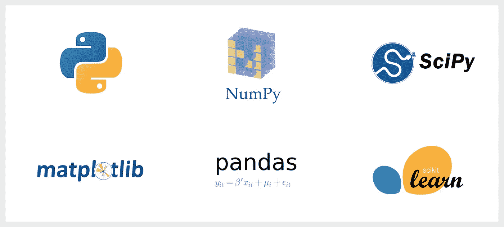
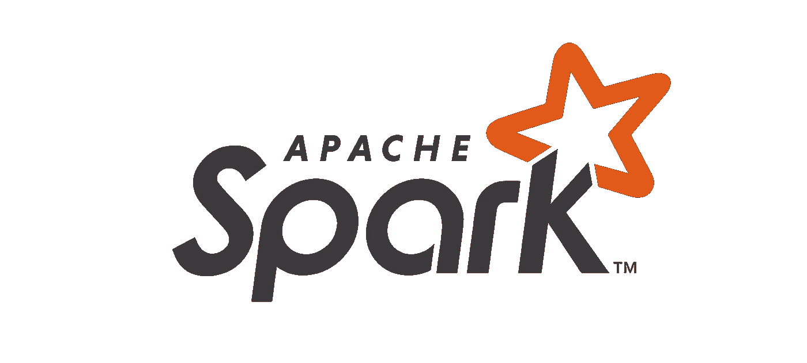
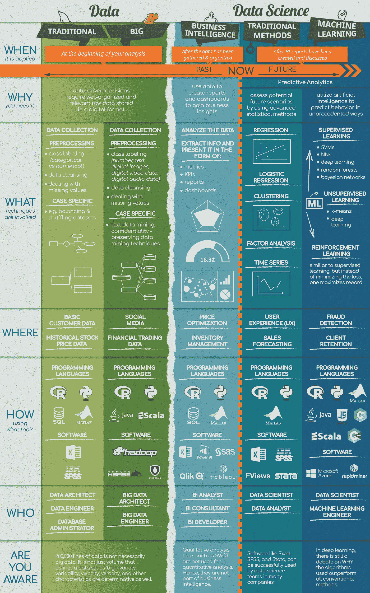
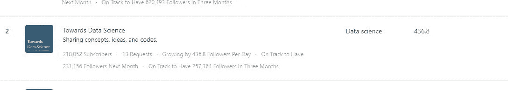

# 如何学习数据科学-我的道路

> 原文：<https://towardsdatascience.com/how-to-learn-data-science-my-path-ba7b9aa94f63?source=collection_archive---------2----------------------->

## 我使用的工具和资源

上周，我在 TDS 上发表了我的第三篇文章。在下一个帖子之前，我想发布这个快速的帖子。希望这篇帖子对想进入数据科学或者刚开始学习数据科学的人有所帮助。在这篇文章中，我将分享我使用的资源和工具。这基本上是我日常活动中使用的所有应用程序和链接。以下所有我用过或将来会用到的。如果你想让我添加任何其他信息，请张贴在评论区，我会包括它。

# **我的数据科学课程**

我制作的这张图表。这应该给出了在 DS 和 ML 中需要什么工具和技能的基本概念。

 [## Roadmapedia -让我们分享知识

### 编辑描述

www.roadmapedia.com](https://www.roadmapedia.com/roadmap/5d595ab0b3e31200174ad787) 

感谢陈楚翔提出了路线图。请检查上面的链接。

## **另一个我在网上找到的**

## **编程语言:**

我从 R 编程开始。然后我转向 python，几乎一直使用 python 和 Jupyter Notebook。所以对我来说，python 和 SQL 是必须的。

## **1。Python 或者 R**

 [## 从“R 与 Python”到“R 与 Python”

### 根据你的需要而不是受欢迎程度来选择编程语言。

towardsdatascience.com](/from-r-vs-python-to-r-and-python-aa25db33ce17) 

## **2。SQL**

## **Python:**

## 使用的重要库:

*   **NumPy**
*   熊猫
*   **Matplotlib**
*   **SciPy**
*   **Scikit-Learn**
*   **张量流**
*   **Keras**
*   **Seaborn**
*   **NLTK**
*   **Gensim**

一些有用的资源开始

1.基本 python 技巧

 [## gpetepg/python_tips

### 如果页面笔记本无法在 GitHub 上加载，请在这里查看:注意，这些是用 Python 3 (3.6)编写的，这些文件…

github.com](https://github.com/gpetepg/python_tips) 

2.一些例子

 [## donne Martin/数据科学 ipython 笔记本

### 演示深度学习功能的 IPython 笔记本电脑。其他 TensorFlow 教程:IPython 笔记本电脑…

github.com](https://github.com/donnemartin/data-science-ipython-notebooks) 

3.Youtube 频道

 [## Python YouTube 频道的终极列表-真正的 Python

### 我们在网上找不到一个好的、最新的 Python 开发者或 Python 编程 YouTube 频道列表。学习…

realpython.com](https://realpython.com/python-youtube-channels/) 

## **SQL**

 [## 现代 SQL:自 SQL-92 以来发生了很多变化

### 传统 SQL /trəˈdɪʃəˌnəl ˈɛs kjuː ˈɛl/众所周知的 SQL-92 子集。仅限于关系模型。经常…

modern-sql.com](https://modern-sql.com/)  [## SQLBolt -学习 SQL-SQL 介绍

### 欢迎使用 SQLBolt，这是一系列交互式课程和练习，旨在帮助您在工作中快速学习 SQL

sqlbolt.com](https://sqlbolt.com/)  [## SQLZOO

### 使用 SQL Server、Oracle、MySQL、DB2 和 PostgreSQL 学习 SQL。如何从数据库中读取数据？2 创建和…

sqlzoo.net](https://sqlzoo.net/)  [## 数据分析的 SQL 教程

### 本教程是为想用数据回答问题的人设计的。对许多人来说，SQL 是“肉和土豆”…

mode.com](https://mode.com/sql-tutorial/introduction-to-sql/) 

## **2。数据可视化:**

*   **马特里布**
*   **Seaborn**
*   **牛郎星**
*   **阴谋地**
*   **画面**
*   **D3.js**
*   **散景**

 [## Python Seaborn 初学者教程

### 让别人理解你的观点的最好但也是更具挑战性的方法之一是将它们可视化:这样，你可以更多地…

www.datacamp.com](https://www.datacamp.com/community/tutorials/seaborn-python-tutorial)  [## clair 513/Seaborn-教程

### 数据可视化是追求职业生涯所需要的一项关键但被削弱的技能。这个知识库是一个尝试…

github.com](https://github.com/clair513/Seaborn-Tutorial)  [## 牛郎星-viz/牛郎星-教程

### 在 PyCon 2018 上发布的 Altair 教程的笔记本，请查看笔记本/Index.ipynb 上的内容介绍幻灯片…

github.com](https://github.com/altair-viz/altair-tutorial)  [## rougier/matplotlib-教程

### 来源可从 github 获得，所有代码和材料都是在知识共享署名-共享的情况下获得许可的…

github.com](https://github.com/rougier/matplotlib-tutorial)  [## d3/d3

### 用 SVG、Canvas 和 HTML 赋予数据生命。:bar _ chart::chart _ with _ upward _ trend::tada:-D3/D3

github.com](https://github.com/d3/d3/wiki/tutorials)  [## 什么是 Tableau？-分析师指南和教程

### 在我的职业生涯中，我有机会使用许多工具。很少有产品像 Tableau 一样给我留下如此深刻的印象。在…

www.projectbi.net](https://www.projectbi.net/what-tableau-guide-tutorial-analysts/) 

## **3。网页抓取:**

*   **美汤**
*   **刺儿头**
*   **Urllib**
*   **硒**
*   **类似 Twitter API 的 API**

## **4。流程**

数据分析有 5 个核心活动:

**1。陈述和提炼问题**

**2。探索数据**

**3。建立正式的统计模型**

**4。解读结果**

**5。传达结果**

 [## 数据科学的艺术

### 这本书描述了分析数据的过程。作者有丰富的经验，既管理数据分析师…

leanpub.com](https://leanpub.com/artofdatascience) 

## **5。DS/ML 中的数学**

## **资源:**

 [## 19 门面向数据科学和机器学习的数学和统计学 MOOCs

### 在创造之前，上帝只做纯数学。然后他认为这将是一个愉快的变化，做一些应用-约翰…

www.analyticsvidhya.com](https://www.analyticsvidhya.com/blog/2017/01/19-mooc-mathematics-statistics-datascience-machine-learning/)  [## 15 门面向数据科学的数学 MOOCs

### 作者马修·梅奥。数据科学所需的大部分数学属于统计学和代数领域…

www.kdnuggets.com](https://www.kdnuggets.com/2015/09/15-math-mooc-data-science.html)  [## 可汗学院

### 免费学习数学、艺术、计算机编程、经济学、物理学、化学、生物学、医学、金融…

www.khanacademy.org](https://www.khanacademy.org/math/linear-algebra)  [## 数据科学基础数学和统计教程| Edureka

### 正如乔希·威尔斯曾经说过的，数据科学的数学和统计学是必不可少的，因为这些学科构成了基础…

www.edureka.co](https://www.edureka.co/blog/math-and-statistics-for-data-science/) 

[http://www.cis.upenn.edu/~jean/gbooks/linalg.html](http://www.cis.upenn.edu/~jean/gbooks/linalg.html)

## **6。机器学习:**

## **资源:**

## **7。大数据**

来自 365 数据科学的不错的一个

4v 的

## **资源:**

## 1.数据工程指南。

 [## andkret/烹饪书

### 我经常被问到如何成为一名数据工程师。这就是为什么我决定以所有的话题开始这本食谱…

github.com](https://github.com/andkret/Cookbook) 

## 2.学习数据工程

 [## 教程和练习|数据工程|学习数据工程

### 编辑描述

www.learndata.engineering](https://www.learndata.engineering/tutorials-exercises) 

## **8。我的 IDE**

## Jupyter 笔记本

## 皮查姆

## r 工作室

## 智能理念

 [## Jupyter 笔记本快捷方式

### Jupyter 笔记本是什么？

towardsdatascience.com](/jypyter-notebook-shortcuts-bf0101a98330) 

以下应用程序非常有用，我也在使用

## **** Quora***

## ****中等***

## ****盲***

## **** Reddit***

## ****领英***

## **** Udemy***

## **** Coursera***

## **** Youtube***

## **** Meetup***

## ***数据营**

## 1.Reddit:

我已经订阅了以下的 Reddit，它非常有帮助

*   **数据工程**
*   **数据美丽**
*   **数据集**
*   **学习数据科学**
*   **学习编程**
*   **Learnpython**
*   **机器学习**
*   **学习机器学习**
*   **Python**
*   **Rstats**
*   **计算机视觉**
*   **学习编程**
*   **商业智能**
*   **编程**
*   语言
*   **Scala**
*   **AWS**
*   **bigdata**
*   **SQL**

通过订阅上述子编辑创建个性化订阅源。在应用程序中，你可以按日、周、月、年、全天等热门程度对帖子进行排序。

## 2.盲人:

这是一个有用的社区。你可以了解到其他公司的 DS、ML 和软件工程正在发生什么。

## 3.商务 Udemy:

我认为大多数公司都与 Udemy 有业务往来，我通过我的雇主与 Udemy 有业务往来。这个非常好，超级有帮助。大约有 3000 道菜。比如我在尝试安装 spark，Hadoop，scala。网上没有太多的信息，很难把它安装到我的电脑上。我刚刚去了 Udemy，参加了一个教授 apache spark 的课程，几乎在不到一个小时的时间里就安装好了。这对我真的很有帮助。此外，价格非常合理，如 9.99 美元。有好的课程可供选择。

## 4.Linkedin 学习:

同样，我可以访问所有 LinkedIn 学习课程。它是由我的雇主提供的，也是当地县图书馆会员免费提供的。我在 Linkedin Learning 上发现了一些很棒的 python 和 R 课程。

## 此外，查看 **Linkedin 群组**

*   **数据挖掘、统计、大数据、数据可视化和数据科学**
*   **人工智能、深度学习、机器学习**
*   **大数据、分析、商业智能&可视化专家社区**
*   **kdnugges 机器学习、数据科学、数据挖掘、大数据、AI**
*   **云计算，SaaS &虚拟化**
*   **数据仓库—大数据— Hadoop —云—数据科学— ETL**
*   **人工智能、深度学习和物联网**
*   **SQL Server 商业智能(BI)**
*   **物联网**
*   **银行和金融科技——金融科技银行系统金融高管**
*   **云计算**
*   **Python 社区**
*   **Python 数据科学与机器学习**

## 5.中等:

这是学习和发表文章的最佳平台。

我关注的一些出版物有

*   **走向数据科学**
*   **启动**
*   **HackerNoon.com**
*   **freeCodeCamp.org**

我发表于

## 走向数据科学

TDS 是 DS 中增长最快的出版物。

*   **218，052 名用户**
*   **每天增长 436.8 个关注者**

## 6.Youtube:

显然，DS、ML 和 AI 都有很多可用的渠道。我跟着几个

*   **数据学校**
*   **谷歌云平台**
*   **学 R**
*   **数据营**
*   **Simplilearn**
*   **爱德华卡**
*   **海洋统计讲座**
*   **send ex**
*   **Siraj Rawal 频道**

## 7.Udacity:

我没有在 Udacity 上任何付费课程。有一些免费的课程，你可以去看看。

## 8.其他有用的网站

*   **Kdnuggets.com**

*   Datacamp.com

****

*   **【Khanacademy.org **

****

*   ****geeksforgeeks.org****

****

## **9.卡格尔:**

**我想每个人都知道 Kaggle，不需要介绍**

****

**此外，**看看他们有帮助的迷你课程****

 **[## 学习| Kaggle

### 编辑描述

www.kaggle.com](https://www.kaggle.com/learn/overview)** 

## **10.Github:**

**显然，你可以建立你的投资组合。我有几个项目，如网络抓取，twitter 分析，使用 python 的数据可视化等。我计划今后增加更多。它也是一个搜索类似项目的好地方，你可以从 Github 发布的其他项目中获得很多帮助和想法。**

****

## **11.会议:**

**我参加了一些圣何塞和旧金山当地的聚会。可惜我没有时间经常做。这对学习和人脉很有帮助。我在 Linkedin 大楼里见过一个 python 聚会，有几百名开发者参加。所以很明显，这是一个认识人和向人学习的黄金机会。甚至有一些聚会在工作日期间一次或隔天进行实践工作。整个周末都有一些研讨会。几乎所有的工作坊都是免费的，或者有些收取很少的费用。**

****

## **12.Quora:**

**我订阅了以下订阅源**

*   ****算法****
*   ****竞争性编程****
*   ****数据科学****
*   ****机器学习****
*   ****深度学习****
*   ****大数据****
*   ****数据分析****
*   ****数据可视化****
*   ****Python****
*   ****Hakon Hapnes 链****
*   ****麦克西****
*   ****威廉·陈****
*   ****姜黎黎****

****

## **13.播客**

*   ****数据怀疑论者(Spotify)****
*   ****机器学习和人工智能周(Spotify )****
*   ****Superdatascience.com****
*   **【https://talkpython.fm/**T42****

****

**另外，请检查以下内容**

****Paysa.com&关卡.参考消息****

**** **[## 你拿到市场工资了吗？

### Paysa 是为企业员工提供薪酬补偿和职位匹配的个性化职业服务。

www.paysa.com](https://www.paysa.com/)** ** [## Levels.fyi -比较不同公司的职业水平

### Levels.fyi 便于比较和对比不同公司的不同职业水平。找出您的新…

www.levels.fyi](https://www.levels.fyi/) 

## 14.Stackoverflow

我认为没有 StackOverflow 你就不能编码:-)

## **15。解题地点:**

1.  哈克兰克([http://hackerrank.com/](http://hackerrank.com/))
2.  厨师长([http://codechef.com/](http://codechef.com/))
3.  黑客地球(【http://hackerearth.com/】T2
4.  leet code(【http://leetcode.com/】T4)
5.  top coder([http://topcoder.com/](http://topcoder.com/))
6.  卡格尔([http://kaggle.com/](http://kaggle.com/))
7.  挑战者邮报([http://challengepost.com/](http://challengepost.com/)
8.  code forces([http://codeforces.com/](http://codeforces.com/))
9.  辉煌([http://brilliant.org/](http://brilliant.org/))
10.  SPOJ([http://www.spoj.com/](http://www.spoj.com/))
11.  欧拉项目([https://projecteuler.net/](https://projecteuler.net/))
12.  编码蝙蝠([http://codingbat.com/](http://codingbat.com/)
13.  codewars([http://www.codewars.com/](http://www.codewars.com/))
14.  codi ity([https://codility.com/](https://codility.com/))
15.  柯丁加姆([https://www.codingame.com/](https://www.codingame.com/))
16.  科德比特([https://coderbyte.com/](https://coderbyte.com/))
17.  代码评估([https://www.codeeval.com/](https://www.codeeval.com/))
18.  UVA 在线评委([https://uva.onlinejudge.org/](https://uva.onlinejudge.org/))
19.  格斗大赛([https://codefights.com/](https://codefights.com/))
20.  http://www.checkio.org/
21.  塔兰特巴迪([http://talentbuddy.co/](http://talentbuddy.co/))
22.  python 挑战([http://pythonchallenge.com/](http://pythonchallenge.com/))
23.  lint code(【http://www.lintcode.com/en/】T42)
24.  罗莎琳德([http://rosalind.info/problems/locations/](http://rosalind.info/problems/locations/))
25.  CrowdANALYTIX(【https://www.crowdanalytix.com/】T2
26.  SQL-EX。茹(【http://sql-ex.ru/】)
27.  卡特斯([http://www.kattis.com/](http://www.kattis.com/))
28.  代码卡塔([http://codekata.com/](http://codekata.com/))
29.  CodeAbbey([http://codeabbey.com/](http://codeabbey.com/))
30.  战斗代码([http://fightcodegame.com/](http://fightcodegame.com/))
31.  节拍码([http://www.beatmycode.com/](http://www.beatmycode.com/))
32.  http://tunedit.org/
33.  http://mlcomp.org/
34.  HPC 大学([http://hpcuniversity.org/students/weeklyChallenge/](http://hpcuniversity.org/students/weeklyChallenge/)
35.  [https://practiceit.cs.washington.edu/](https://practiceit.cs.washington.edu/)

## 16。免费课程:

芬兰赫尔辛基大学推出了一门关于人工智能的课程，完全免费向全世界所有人开放。与卡耐基梅隆大学新的人工智能本科学位不同，赫尔辛基大学提供的课程对那些想了解更多的人来说更像是初学者课程。

 [## 面向非专家的免费人工智能在线介绍

### 2018 年春天，Reaktor 和赫尔辛基大学携手合作，旨在帮助人们获得力量…

www.elementsofai.com](https://www.elementsofai.com/) 

## **机器学习**

 [## 免费在线课程:来自 edX | Class Central 的机器学习

### 第一周:最大似然估计，线性回归，最小二乘法第二周:岭回归，偏差-方差，贝叶斯…

www.classcentral.com](https://www.classcentral.com/course/edx-machine-learning-7231?utm_source=qz&utm_medium=web&utm_campaign=ivy_league_courses_2019) 

## **人工智能**

 [## 免费在线课程:edX | Class Central 的人工智能(AI)

### 上过这门课吗？与其他学生分享你的经验。写评论什么做自动驾驶汽车，人脸识别…

www.classcentral.com](https://www.classcentral.com/course/edx-artificial-intelligence-ai-7230?utm_source=qz&utm_medium=web&utm_campaign=ivy_league_courses_2019) 

## **面向数据科学和分析的机器学习**

 [## 免费在线课程:edX | Class Central 的数据科学和分析机器学习

### 从不错过一门课程。没有垃圾邮件。随时退订。班级中心是一个免费的搜索引擎和评论网站…

www.classcentral.com](https://www.classcentral.com/course/edx-machine-learning-for-data-science-and-analytics-4912?utm_source=qz&utm_medium=web&utm_campaign=ivy_league_courses_2019) 

## **机器学习**

 [## 免费在线课程:来自 Udacity | Class Central 的机器学习

### 这门课在佐治亚理工学院作为 CS7641 提供，是在线硕士学位(OMS)的一部分。拿着这个…

www.classcentral.com](https://www.classcentral.com/course/udacity-machine-learning-1020?utm_source=qz&utm_medium=web&utm_campaign=ivy_league_courses_2019) 

## **机器学习无监督学习**

 [## 免费在线课程:机器学习:来自 Udacity 的无监督学习

### 有没有想过网飞如何预测你会喜欢什么电影？或者亚马逊如何在你买之前知道你想买什么…

www.classcentral.com](https://www.classcentral.com/course/udacity-machine-learning-unsupervised-learning-1848?utm_source=qz&utm_medium=web&utm_campaign=ivy_league_courses_2019) 

## **数据科学 21 门课程**

 [## 2019 年，你可以在线学习 400 门免费的常春藤大学课程

### 八所常春藤盟校是世界上最负盛名的大学之一。他们包括布朗大学，哈佛大学…

qz.com](https://qz.com/1514408/400-free-ivy-league-university-courses-you-can-take-online-in-2019/) 

## **大数据、Ai、ML 方面的证书**

 [## 分析、大数据、数据科学、机器学习方面的证书和认证

### 关于学位，请参见在线学位页面|美国/加拿大|欧洲。此页面用于获取证书的选项和…

www.kdnuggets.com](https://www.kdnuggets.com/education/analytics-data-mining-certificates.html) 

## **免费的谷歌机器学习课程**

 [## 教育-谷歌人工智能

### 用谷歌 AI 学习。无论你是刚刚学习编码，还是经验丰富的机器学习实践者，你都会…

ai.google](https://ai.google/education/) 

## **17。书籍**

 [## 免费的编程书籍；HTML5，CSS3，JavaScript，PHP，Python...

### 最新消息，书籍每周更新:2019 年 8 月:部分书籍小幅更新 2019 年 7 月:部分书籍小幅更正…

goalkicker.com](https://goalkicker.com/)  [## mravendi/数据科学机器学习人工智能资源

### 此时您不能执行该操作。您已使用另一个标签页或窗口登录。您已在另一个选项卡中注销，或者…

github.com](https://github.com/mravendi/data-science-machine-learning-ai-resources/tree/master/books)  [## sayantanmitra 87/数据-科学-书籍-1

### 此时您不能执行该操作。您已使用另一个标签页或窗口登录。您已在另一个选项卡中注销，或者…

github.com](https://github.com/SayantanMitra87/Data-Science-Books-1) 

一些我经常参考的重要书签

## 1.所有 DS 备忘单放在一处

 [## FavioVazquez/ds-cheatsheets

### 统治世界的数据科学清单— FavioVazquez/ds-cheatsheets

github.com](https://github.com/FavioVazquez/ds-cheatsheets) 

## 2.DS 资源在一个地方

 [## 数据-科学-资源

### 一个精心策划的资源链接宝库(软件、平台、语言、技术等)。)对于数据科学，all in…

数据-科学-资源. readthedocs.io](https://data-science-resources.readthedocs.io/en/latest/#data-science-curated-resources) 

## 3.DS 笔记

 [## 克里斯·阿尔邦

### 我是一名数据科学家，有十年应用统计学习、人工智能和软件的经验…

chrisalbon.com](https://chrisalbon.com/) 

## 4.DS 教程

 [## 数据科学初学者教程

### 使用口袋妖怪-韦德尔洞穴的数据

www.kaggle.com](https://www.kaggle.com/kanncaa1/data-sciencetutorial-for-beginners) 

## 5.ML 教程

 [## 初学者的机器学习教程

### 使用来自骨科患者的生物力学特征的数据

www.kaggle.com](https://www.kaggle.com/kanncaa1/machine-learning-tutorial-for-beginners) 

## 6.DS 词汇表

 [## Kaggle 上的数据科学术语表

### 使用来自[数据集不再可用]的数据

www.kaggle.com](https://www.kaggle.com/shivamb/data-science-glossary-on-kaggle) 

## 7.DS 工具箱

 [## 数据科学家工具箱教程— 1

### 使用房价数据:高级回归技术

www.kaggle.com](https://www.kaggle.com/mjbahmani/the-data-scientist-s-toolbox-tutorial-1) 

## 8.Plotly 教程

 [## 初学者的 Plotly 教程

### 使用来自世界大学排名的数据

www.kaggle.com](https://www.kaggle.com/kanncaa1/plotly-tutorial-for-beginners) 

## 9.DS Github 存储库

 [## donne Martin/数据科学 ipython 笔记本

### 演示深度学习功能的 IPython 笔记本电脑。其他 TensorFlow 教程:IPython 笔记本电脑…

github.com](https://github.com/donnemartin/data-science-ipython-notebooks) 

## 10.开源代码库

 [## Andrey Lukyanenko 的数据科学作品集

### 这个文件夹是我为数据分析或探索机器学习而创建的笔记本的汇编…

erlemar.github.io](https://erlemar.github.io/) 

## 11.工业机器学习

 [## 企业/工业机器学习

### 此外，你可以加入链接信，而不是“观看”,它已经发送给了大约 90 人，你是…

github.com](https://github.com/firmai/industry-machine-learning) 

## 12.数据工程指南。

 [## andkret/烹饪书

### 我经常被问到如何成为一名数据工程师。这就是为什么我决定以所有的话题开始这本食谱…

github.com](https://github.com/andkret/Cookbook) 

## 13.学习数据工程

 [## 教程和练习|数据工程|学习数据工程

### 编辑描述

www.learndata.engineering](https://www.learndata.engineering/tutorials-exercises) 

## 14.谷歌数据集搜索

 [## 谷歌推出寻找数据集的新搜索引擎——搜索引擎杂志

### 谷歌推出了一种新型搜索引擎，专门帮助人们查找数据。简单的叫…

www.searchenginejournal.com](https://www.searchenginejournal.com/google-introduces-new-search-engine-for-finding-datasets/268337/) 

## 15.数据工程研究指南；

 [## 数据工程学习指南—大纲(复制一份:)，然后从那里开始

### 数据工程学习指南联系我们的问题，完成日期，笔记，个人困难 1-5 介绍这是一个…

docs.google.com](https://docs.google.com/spreadsheets/d/1GOO4s1NcxCR8a44F0XnsErz5rYDxNbHAHznu4pJMRkw/edit#gid=0) 

## 16。正则表达式

## https://regex101.com/

## **17。Google OpenRefine**

OpenRefine(前身为 Google Refine)是处理杂乱数据的强大工具:清理它；将它从一种格式转换成另一种格式；并用 web 服务和外部数据来扩展它。

 [## openrefine.github.com

### OpenRefine(前身为 Google Refine)是处理杂乱数据的强大工具:清理它；将 it 从…

openrefine.org](http://openrefine.org/) 

## 18。更多 ML Youtube 频道:

 [## 深度学习和计算机视觉的 Youtube 频道终极列表——编码女人

### 我想收集 Youtube 频道上关于深度学习和计算机视觉相关主题的视频…

www.codingwoman.com](http://www.codingwoman.com/youtube-channels-for-deep-learning-and-computer-vision/) 

## **19。自制机器学习**

 [## trekhleb/自制机器学习

### 对于这个库的 Octave/MatLab 版本，请检查机器学习 Octave 项目。此存储库包含…

github.com](https://github.com/trekhleb/homemade-machine-learning) 

## **20。机器学习术语:**

 [## 机器学习术语词汇表

### 准确性是衡量分类模型好坏的标准。它由正确分类的数量给出…

塞曼迪](https://semanti.ca/blog/?glossary-of-machine-learning-terms) 

## **21。令人敬畏的数据科学**

 [## 学术/令人敬畏的数据科学

### 这部分是为数据科学新手准备的。这是开始学习数据科学的捷径。只是…

github.com](https://github.com/academic/awesome-datascience) 

## **22。数据科学博客**

 [## rushter/数据科学博客

### 数据科学博客的精选列表一个人类工程师——http://www.erogol.com/(RSS)的博客

github.com](https://github.com/rushter/data-science-blogs) 

## **23。数据科学专业课程**

 [## 数据科学专业化/课程

### 这些是约翰霍普金斯大学数据科学专业的课程材料

github.com](https://github.com/DataScienceSpecialization/courses) 

## **24.100 页机器学习书籍:**

 [## 安德烈·布尔科夫的百页机器学习书

### 关于机器学习，你只需要知道一百页。监督和非监督学习，支持向量…

themlbook.com](http://themlbook.com/) 

## **25。数据营信息表**

***希望这篇帖子对大家有帮助。如果你想添加任何东西，请在评论区发表。感谢您阅读我的帖子:-)***

# **通过张量流考试:**

我刚刚通过了 TensorFlow 开发者证书考试，并想分享对我有帮助的源代码。

 [## 谷歌的“vs”把戏

### 自我图如何帮助你了解人工智能、下棋、吃得更健康、买狗和寻找爱情。

medium.com](https://medium.com/applied-data-science/the-google-vs-trick-618c8fd5359f) 

绝对有意思，值得准备。我认为对于有经验的 TensorFlow 开发者来说，这可能是简单和容易的。

# **我使用的来源:**

主要的是 Coursera 的 TensorFlow in Practice 或者 Udacity 的 tensor flow Intro。其他来源帮助我在更广泛的理解。从认证的角度来说，在 Coursera 的实践中，无论是 Udacity 还是 TensorFlow 都足够了。

仅用于认证:Coursera 或 Udacity

*   **Coursera 的 tensor flow in Practice**
*   **tensor flow—uda city 简介**

 [## 获得 TensorFlow 开发者证书- TensorFlow

### 通过 TensorFlow 开发者证书脱颖而出展示您使用 TensorFlow 的熟练程度…

www.tensorflow.org](https://www.tensorflow.org/certificate) 

## **每月 49 美元。Coursera。**

 [## 实践中的张量流

### 探索软件开发人员用来构建可扩展的人工智能算法的工具…

www.coursera.org](https://www.coursera.org/specializations/tensorflow-in-practice?utm_source=gg&utm_medium=sem&utm_content=01-CatalogDSA-ML1-US&campaignid=9918777773&adgroupid=100491712477&device=c&keyword=&matchtype=b&network=g&devicemodel=&adpostion=&creativeid=432357975999&hide_mobile_promo&gclid=Cj0KCQjw0Mb3BRCaARIsAPSNGpWPXfJhc2jxl9lDZBKDZNXg9ryaHv0rGmoikUZUHgGZd3JRTWS3-y8aAp8_EALw_wcB) 

## **Udacity 免费课程——类似 Coursera one。**

 [## 深度学习 TensorFlow 简介

### 免费课程由本课程是一个实用的方法，以深度学习的软件开发人员开始免费课程约…

www.udacity.com](https://www.udacity.com/course/intro-to-tensorflow-for-deep-learning--ud187) 

## **Udacity — Github**

 [## 张量流/示例

### 此时您不能执行该操作。您已使用另一个标签页或窗口登录。您已在另一个选项卡中注销，或者…

github.com](https://github.com/tensorflow/examples/tree/master/courses/udacity_intro_to_tensorflow_for_deep_learning) 

## **本书:**

 [## 使用 Scikit-Learnã€Keras 和 TensorFlow 进行机器实践学习，第二版

### 通过最近的一系列突破，深度学习推动了整个机器学习领域。现在，甚至…

www.oreilly.com](https://www.oreilly.com/library/view/hands-on-machine-learning/9781492032632/) 

## **其他来源:**

## **Youtube 频道**

 [## 张量流

### 欢迎来到官方 TensorFlow YouTube 频道。了解最新的 TensorFlow 新闻、教程和最佳…

www.youtube.com](https://www.youtube.com/channel/UC0rqucBdTuFTjJiefW5t-IQ) 

# 皮查姆

## **谷歌可乐布**

## 张量流基础

## **TensorFlow 2.0 备忘单**

## 梯度下降一步一步解释:我最喜欢的一个

 [## 教育-谷歌人工智能

### 用谷歌 AI 学习。无论你是刚刚学习编码，还是经验丰富的机器学习实践者，你都会…

ai.google](https://ai.google/education/)  [## 机器学习速成班|谷歌开发者

### 学习和应用基本的机器学习概念的速成课程，获得现实世界的经验与…

developers.google.com](https://developers.google.com/machine-learning/crash-course)  [## 我如何通过 TensorFlow 开发人员认证考试

### 你也可以

towardsdatascience.com](/how-i-passed-the-tensorflow-developer-certification-exam-f5672a1eb641)  [## Tensorflow 开发者证书考试的一些小技巧

### 如你所知，Tensorflow 团队开放了 Tensorflow 开发者证书，从我们的口袋里掏出 100 美元…

medium.com](https://medium.com/@yrc602/some-tips-for-tensorflow-developer-certificate-exam-9d7a7b4495ae)  [## 查看 Google 的“Tensorflow 开发者认证”

### 关于认证你需要知道的一切

medium.com](https://medium.com/analytics-vidhya/reviewing-the-tensorflow-developer-certification-by-google-45e913152def) 

**AWS 机器学习专业**

 [## 机器学习大学

### 欢迎来到机器学习大学频道！我们的使命是让任何人都可以使用机器学习…

www.youtube.com](https://www.youtube.com/channel/UC12LqyqTQYbXatYS9AA7Nuw)  [## AWS 认证机器学习专业 2020 -动手！

### 夏羽是一名解决方案架构师、顾问和软件开发人员，他对所有事物都有特殊的兴趣…

www.udemy.com](https://www.udemy.com/course/aws-machine-learning/)  [## AWS 机器学习认证考试|2020 完整指南

### 机器和深度学习是目前最热门的技术领域！机器/深度学习技术被广泛…

www.udemy.com](https://www.udemy.com/course/amazon-web-services-machine-learning/)  [## 云计算介绍免费课程| Udacity 免费课程

### 机器学习有望改变我们今天所知的几乎所有行业和客户体验。然而…

www.udacity.com](https://www.udacity.com/course/aws-machine-learning-foundations--ud090)  [## AWS-样本/AWS-机器学习-大学-加速-标签

### 此时您不能执行该操作。您已使用另一个标签页或窗口登录。您已在另一个选项卡中注销，或者…

github.com](https://github.com/aws-samples/aws-machine-learning-university-accelerated-tab/tree/master/notebooks) 

如有任何问题，请发电子邮件至 esenthil@hotmail.com 给我

一切顺利，同样，目标是学习 TensorFlow，而不是认证。

**如果你喜欢这个帖子，就按一下鼓掌按钮，不要按一次**😝

***希望这篇帖子对你们有帮助。如果你想添加任何东西，请在评论区发表。感谢您阅读我的帖子:-)*****