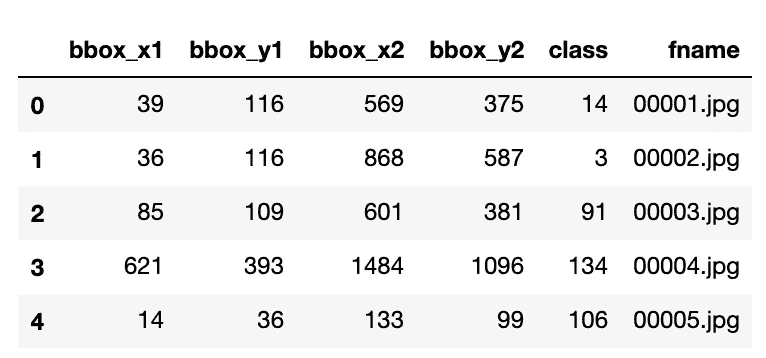

# 如何加载 Matlab？Python 中的 mat 文件

> 原文：<https://towardsdatascience.com/how-to-load-matlab-mat-files-in-python-1f200e1287b5?source=collection_archive---------1----------------------->


Matlab 是学术界非常流行的科学计算平台。我在攻读工程学位的过程中一直在使用它，有可能你会遇到。大学发布的数据集的 mat 文件。

这是一个简短的帖子，解释了如何使用 python 加载这些文件，python 是当今最流行的机器学习语言。

# 数据

我想建立一个分类器来检测不同型号和品牌的汽车，所以斯坦福汽车数据集似乎是一个很好的起点。来自学术界，数据集的注释在。mat 格式。你可以在这里获得这篇文章[中使用的文件。](https://ai.stanford.edu/~jkrause/cars/car_devkit.tgz)

# 正在加载。mat 文件

Scipy 是一个非常流行的用于科学计算的 python 库，很自然地，他们有一个方法可以让你读入。mat 文件。阅读它们绝对是最简单的部分。您可以用一行代码完成它:

```
from scipy.io import loadmat
annots = loadmat('cars_train_annos.mat')
```

嗯，真的就这么简单。但是让我们继续，实际上试着从这本字典中得到我们需要的数据。

# 格式化数据

loadmat 方法返回一个更熟悉的数据结构，一个 python 字典。如果我们看一下这些键，我们会发现与处理. mat 文件相比，我们现在感觉就像在家里一样:

```
annots.keys()
> dict_keys(['__header__', '__version__', '__globals__', 'annotations'])
```

查看这个数据集的文档，我们将了解它的真正构成。README.txt 为我们提供了以下信息:

```
This file gives documentation for the cars 196 dataset.
([http://ai.stanford.edu/~jkrause/cars/car_dataset.html](http://ai.stanford.edu/~jkrause/cars/car_dataset.html)) — — — — — — — — — — — — — — — — — — — — 
Metadata/Annotations
 — — — — — — — — — — — — — — — — — — — — 
Descriptions of the files are as follows:-cars_meta.mat:
 Contains a cell array of class names, one for each class.-cars_train_annos.mat:
 Contains the variable ‘annotations’, which is a struct array of length
 num_images and where each element has the fields:
 bbox_x1: Min x-value of the bounding box, in pixels
 bbox_x2: Max x-value of the bounding box, in pixels
 bbox_y1: Min y-value of the bounding box, in pixels
 bbox_y2: Max y-value of the bounding box, in pixels
 class: Integral id of the class the image belongs to.
 fname: Filename of the image within the folder of images.-cars_test_annos.mat:
 Same format as ‘cars_train_annos.mat’, except the class is not provided. — — — — — — — — — — — — — — — — — — — — 
Submission file format
 — — — — — — — — — — — — — — — — — — — — 
Files for submission should be .txt files with the class prediction for
image M on line M. Note that image M corresponds to the Mth annotation in
the provided annotation file. An example of a file in this format is
train_perfect_preds.txtIncluded in the devkit are a script for evaluating training accuracy,
eval_train.m. Usage is:(in MATLAB)
>> [accuracy, confusion_matrix] = eval_train(‘train_perfect_preds.txt’)If your training predictions work with this function then your testing
predictions should be good to go for the evaluation server, assuming
that they’re in the same format as your training predictions.
```

我们感兴趣的是'*注解*'变量，因为它包含了我们的类标签和边界框。它是一种结构，一种人们非常熟悉的数据类型，来自 C 或 java 风格的强类型语言。

稍微挖掘一下这个对象，我们就会发现一些有趣的东西:

```
type(annots[‘annotations’]),annots[‘annotations’].shape
>(numpy.ndarray, (1, 8144))type(annots['annotations'][0][0]),annots['annotations'][0][0].shape
>(numpy.void, ())
```

注释以 numpy.ndarray 格式存储，但是这个数组中项目的数据类型是 **numpy.void** ，numpy 似乎并不知道它们的形状。

**loadmat** 方法的[文档页面](https://docs.scipy.org/doc/scipy/reference/generated/scipy.io.loadmat.html)告诉我们它如何将 matlab 结构加载到 [numpy 结构化数组](https://docs.scipy.org/doc/numpy-1.14.0/user/basics.rec.html)中。您可以使用键来访问结构的成员:

```
annots[‘annotations’][0][0][‘bbox_x1’], annots[‘annotations’][0][0][‘fname’]> (array([[39]], dtype=uint8), array(['00001.jpg'], dtype='<U9'))
```

现在我们知道了如何访问结构的成员，我们可以遍历所有的成员并将它们存储在一个列表中:

```
[item.flat[0] for item in annots[‘annotations’][0][0]]> [39, 116, 569, 375, 14, '00001.jpg']
```

这里，我们可以使用 [flat](https://docs.scipy.org/doc/numpy/reference/generated/numpy.ndarray.flat.html) 方法从数组中挤出值。

# 你好熊猫

现在我们知道了如何用 python 处理 matlab 文件，让我们把它转换成 pandas 数据框。我们可以使用列表列表轻松做到这一点:

```
data = [[row.flat[0] for row in line] for line in annots[‘annotations’][0]]columns = [‘bbox_x1’, ‘bbox_y1’, ‘bbox_x2’, ‘bbox_y2’, ‘class’, ‘fname’]
df_train = pd.DataFrame(data, columns=columns)
```



终于，熟悉的领地！

这个帖子的代码可以在[这里](https://colab.research.google.com/github/ashiquem/vault/blob/master/python/Matlab%20Data%20Demo.ipynb)找到。