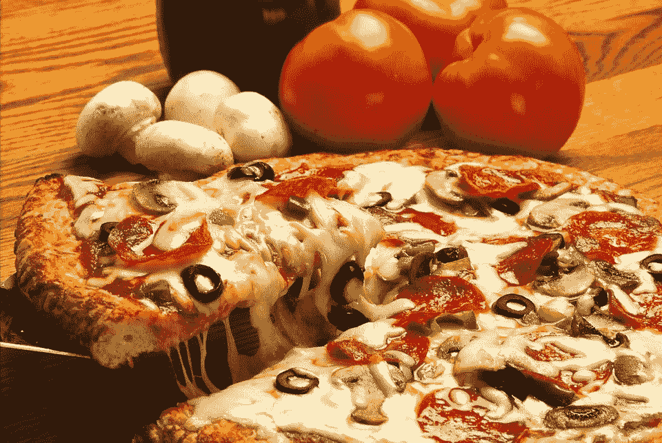
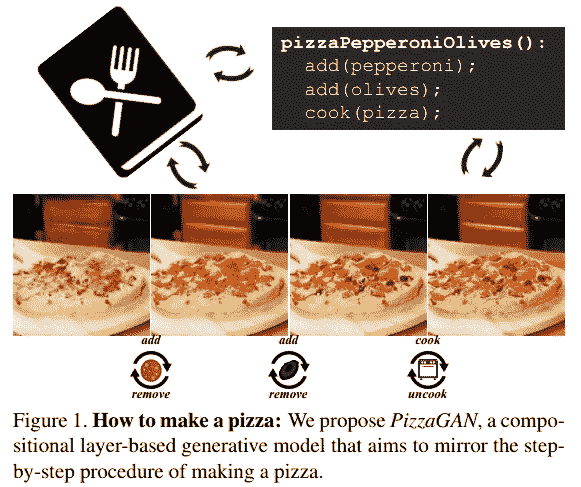
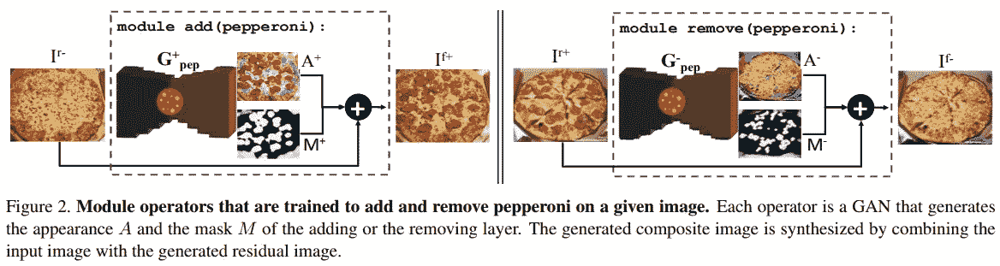
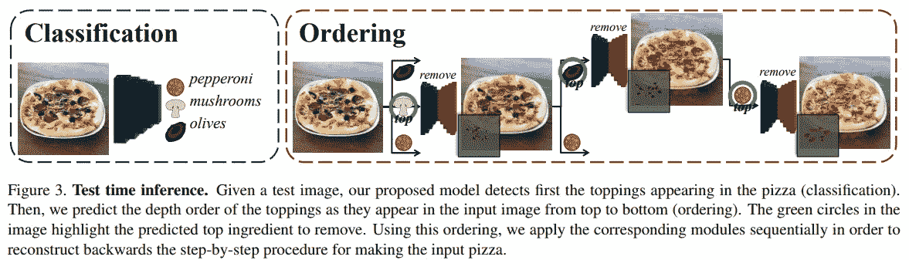
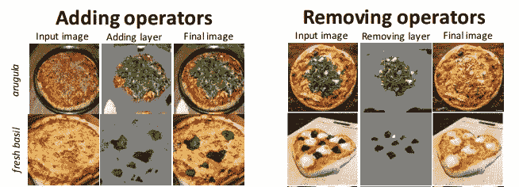
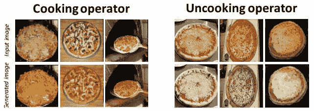

# 如何用深度学习做披萨

> 原文：<https://towardsdatascience.com/how-to-make-a-pizza-with-deep-learning-f3548e249dc9?source=collection_archive---------22----------------------->



当只给一张美味饭菜的图片时，深度神经网络能学会如何烹饪吗？麻省理工学院新的深度学习研究表明了这一点！

他们最近发布的题为 [*如何制作披萨:
学习基于成分层的 GAN 模型*](http://openaccess.thecvf.com/content_CVPR_2019/papers/Papadopoulos_How_to_Make_a_Pizza_Learning_a_Compositional_Layer-Based_GAN_CVPR_2019_paper.pdf) 的研究探索了 GAN 模型如何被训练以识别制作披萨所涉及的步骤。他们的 PizzaGAN 分为两部分:

(1)给定比萨饼的输入图像，PizzaGAN 被训练来预测比萨饼上有什么浇头

(2)给定比萨饼的输入图像，PizzaGAN 可以将一组有序的模型应用于该图像，其中每个模型从比萨饼中添加或移除浇头

# 比萨饼是由什么组成的？

在尝试训练深度神经网络制作披萨之前，我们首先需要弄清楚如何自己制作披萨。

像任何伟大的食谱一样，制作比萨饼的过程是由一系列有序的步骤组成的。你总是从面团、酱和奶酪开始，然后继续添加其他更冒险的配料。这种连续的过程反映在比萨饼在每一步的外观上——它的视觉外观随着每一种添加的浇头而变化。



How [PizzaGAN](http://openaccess.thecvf.com/content_CVPR_2019/papers/Papadopoulos_How_to_Make_a_Pizza_Learning_a_Compositional_Layer-Based_GAN_CVPR_2019_paper.pdf) defines a pizza — as a set of ordered steps.

一旦我们的目标过程被很好地定义，我们就可以开始训练一个实际的模型来近似这些步骤。

例如，我们从一个美味的意大利辣香肠披萨开始。然后我们的朋友走过来对我们说:“嘿，我们来加橄榄吧！”我们可以将从原始披萨到新披萨的过程建模为一系列步骤:

(1)认清我们的现状——意大利香肠比萨饼

(2)应用一个让我们达到目标状态的改变——加入橄榄

加入橄榄后，另一个朋友可能会说:“我不喜欢意大利香肠，我们用火腿吧！”这次我们有 3 个步骤:

(1)认清我们目前的状态——意大利香肠和橄榄披萨

(2)应用让我们更接近目标状态的第一个改变——去掉意大利香肠

(3)应用使我们达到目标状态的第二个变化——添加火腿

为了了解如何制作比萨饼，PizzaGAN 神经网络试图对所有这些步骤进行建模。

# 甘人是如何做披萨的

## 资料组

用于训练 PizzaGAN 的披萨数据集由 9213 幅图像组成，每幅图像显示一个披萨。每张图片都有一组相应的标签，描述比萨饼上的配料，不包括面团、调味汁和基础奶酪。例如，如果比萨饼图像上有火腿和蘑菇，则该图像的标签为:

```
["ham", "mushrooms"]
```

当执行训练时，输出分类是一次性编码的。因此，对于火腿和蘑菇比萨饼，输出向量的火腿和蘑菇元素被设置为 1.0，而其余元素被设置为 0.0。

## 生成器网络-添加和删除浇头

回想一下，我们希望能够将比萨饼的制作建模为一组连续的步骤。因此，无论训练什么样的网络，都必须能够一次执行一个步骤——添加一个浇头、移除一个浇头、烹饪比萨饼等等。

为此，训练一个生成器网络来模拟每个浇头的添加或去除。给定比萨饼的输入图像，生成器预测比萨饼的输出图像，就好像我们添加或删除了一种浇头。

由于一次为一个浇头训练发生器，并且仅用于添加或移除，所以训练多个发生器网络，每对不同的浇头组训练两个(每对中一个用于添加，一个用于移除)。下面显示了一对 PizzaGAN 发生器的示例，一个用于添加意大利香肠，一个用于移除意大利香肠。



An example of a pair of [PizzaGAN](http://openaccess.thecvf.com/content_CVPR_2019/papers/Papadopoulos_How_to_Make_a_Pizza_Learning_a_Compositional_Layer-Based_GAN_CVPR_2019_paper.pdf) generators — one to add pepperoni and one to remove it

奶酪披萨的整个分类向量为 0，而意大利辣香肠披萨的分类向量除了意大利辣香肠指数为 1.0 之外都是 0。由于 PizzaGAN 生成器的输入和输出图像之间的差总是只有一个顶点，因此输入和输出标签向量的分类向量元素之和的差也是 1。

## 鉴别器—识别比萨饼

PizzaGAN 生成器涵盖了所有添加和删除比萨浇头的操作。鉴别器将负责识别当前比萨饼上实际上的浇头。

给定比萨饼的输入图像，鉴别器网络预测一组多标签分类。输出向量的每个元素对应于一个特定的浇头。

例如，在下图中，PizzaGAN 鉴别器预测比萨饼的图像有意大利辣香肠、蘑菇和橄榄。对应于那些浇头的输出向量的元素被推断为 1.0(或者高于用户设置阈值的某个值)。



An example of how the discriminator of [PizzaGAN](http://openaccess.thecvf.com/content_CVPR_2019/papers/Papadopoulos_How_to_Make_a_Pizza_Learning_a_Compositional_Layer-Based_GAN_CVPR_2019_paper.pdf) works, predicting both the classification and the topping ordering of the pizza

GAN 模型通常通过一起执行生成器和鉴别器的训练来训练。鉴别器模型用发生器模型的一些输出来训练，鉴别器模型从其预测中的损失用于发生器模型的训练。

PizzaGAN 也遵循这一培训计划。除了预测比萨饼图像的标签，鉴别器还预测图像是真实的还是来自生成器。这有助于生成器创建看起来仍然像真正的比萨饼图像的图像，并具有所有正确的浇头。

# 最终比萨饼

通过鉴别器预测比萨饼上的浇头，并且生成器能够添加和删除浇头，PizzaGAN 能够以相当高的精度构建和分解比萨饼的图像。



[PizzaGAN](http://openaccess.thecvf.com/content_CVPR_2019/papers/Papadopoulos_How_to_Make_a_Pizza_Learning_a_Compositional_Layer-Based_GAN_CVPR_2019_paper.pdf) adding and removing toppings



[PizzaGAN](http://openaccess.thecvf.com/content_CVPR_2019/papers/Papadopoulos_How_to_Make_a_Pizza_Learning_a_Compositional_Layer-Based_GAN_CVPR_2019_paper.pdf) cooking and uncooking toppings

如果你想阅读更多关于 PizzaGAN 如何工作的细节，我建议查看发表在 [CVPR 2019](http://cvpr2019.thecvf.com/) 的原始[论文](http://openaccess.thecvf.com/content_CVPR_2019/papers/Papadopoulos_How_to_Make_a_Pizza_Learning_a_Compositional_Layer-Based_GAN_CVPR_2019_paper.pdf)！

除此之外，我给你们留下这篇论文中的精彩引文:

> 披萨是 Instagram 上被拍照次数最多的食物，有超过 3800 万个帖子使用#披萨这个标签。

# 喜欢学习？

在[推特](https://twitter.com/GeorgeSeif94)上关注我，我会在那里发布所有最新最棒的人工智能、技术和科学！也在 LinkedIn 上与我联系！

# 推荐阅读

想了解更多关于深度学习的知识？用 Python 进行 [***深度学习***](https://amzn.to/2Lj0vWJ)*本书将教你如何用有史以来最简单的 Python 库进行*真正的*深度学习: [Keras](https://www.tensorflow.org/guide/keras) ！*

*提醒一句，我支持这个博客，因为分享好书对每个人都有帮助。作为一名亚马逊员工，我从合格购买中获得收入。*