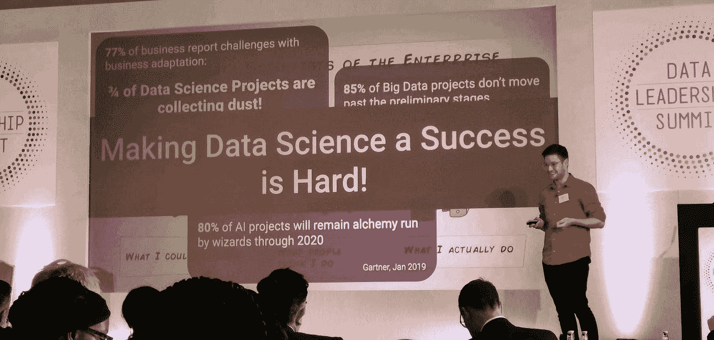
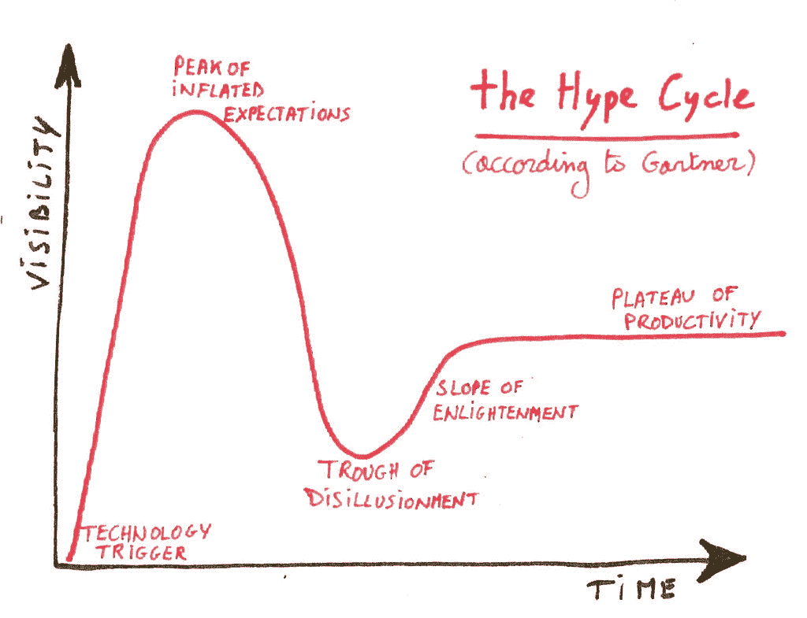
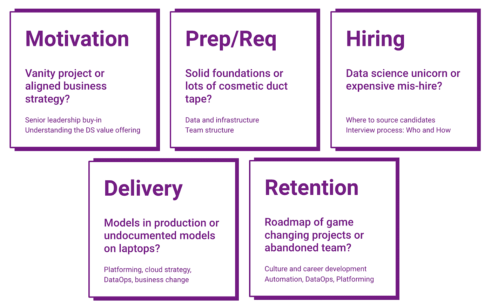
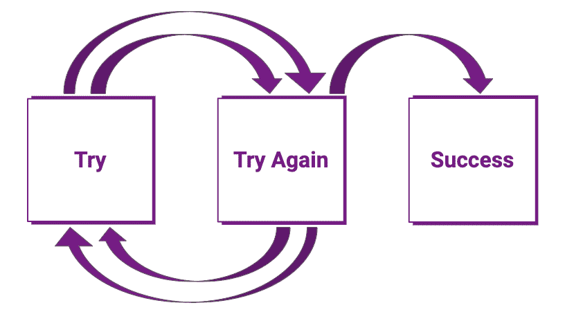
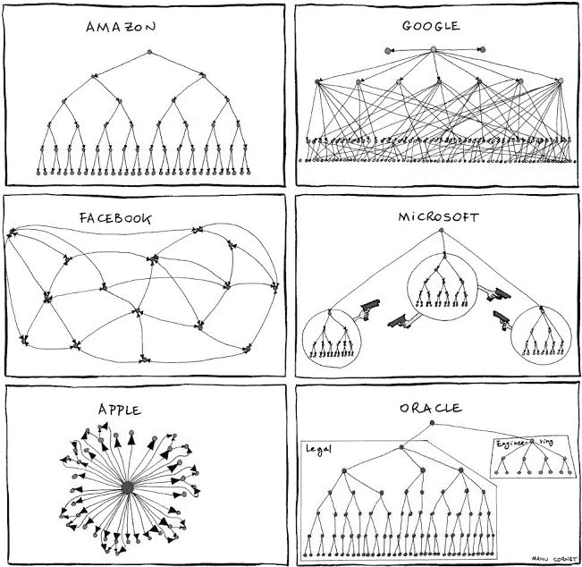
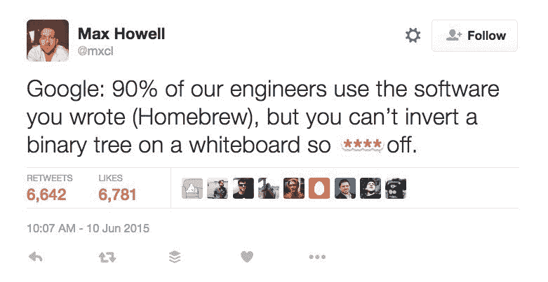
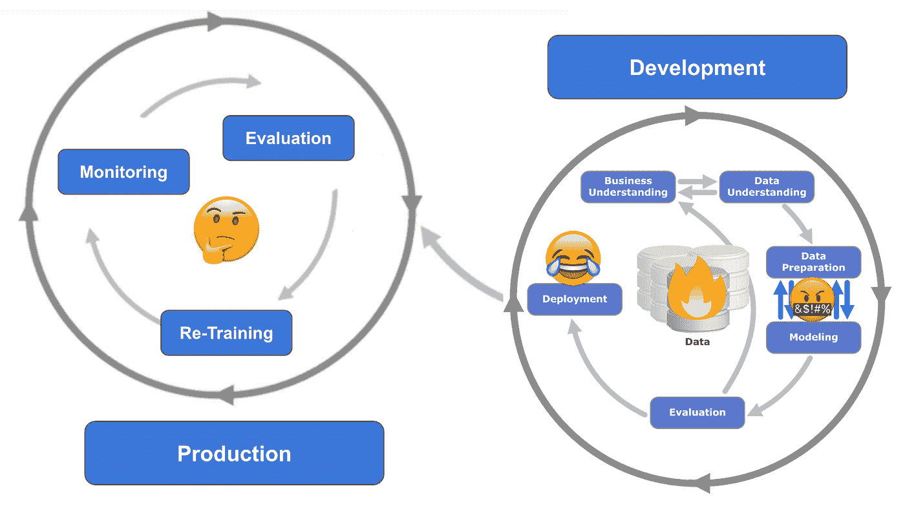
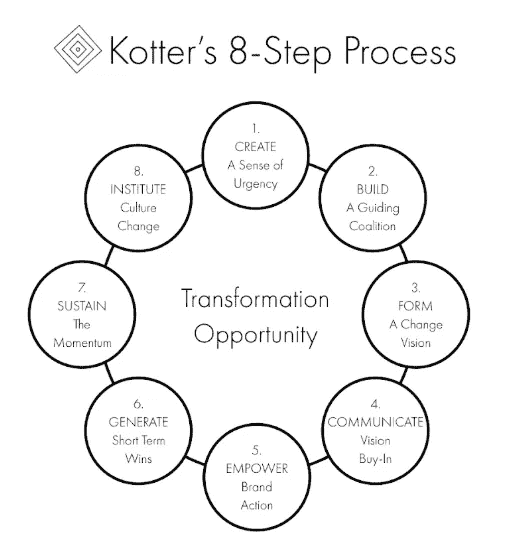
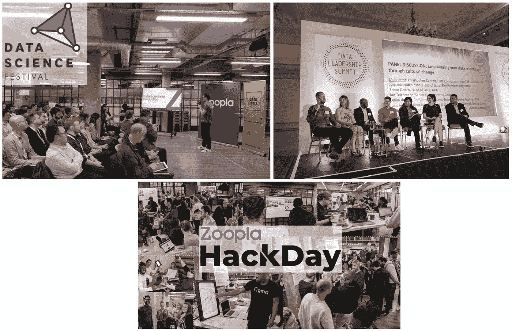

# 如何让您的数据科学团队取得成功？

> 原文：<https://towardsdatascience.com/how-to-make-a-success-story-of-your-data-science-team-1719129941ba?source=collection_archive---------11----------------------->

数据科学响彻每一个行业，已经到达主流媒体。只要我称之为人工智能，我就不再需要解释我以什么为生——我们是数据科学炒作的巅峰！

因此，越来越多的公司对数据科学寄予厚望，准备投资组建自己的团队。不幸的是，企业中数据科学的现实远非一个成功的故事。NewVantage 在 2019 年 1 月发布了一项调查，发现 77%的企业报告了业务适应方面的挑战。这就意味着所有的数据项目都积灰了，而不是提供投资回报。Gartner 一直对数据科学的成功持批评态度，最近他们并没有变得更加乐观:根据 Gartner 2019 年 1 月的报告，即使是分析见解也不会在 2022 年前带来业务成果，那么数据科学还有什么希望呢？很明显，由于某些原因**让数据科学取得成功真的很难**！

Me scaring Execs about their data science investments at the Data Leadership Summit, London 2019.

无论你是管理现有的数据科学团队，还是即将在大数据或人工智能领域开始一个新的绿地项目，承认不可避免的事情很重要:T2 炒作周期 T3。

Luc Galoppin, [https://www.flickr.com/photos/lucgaloppin/](https://www.flickr.com/photos/lucgaloppin/)

数据科学和人工智能的能见度越来越高，随之而来的是过高的期望。结合这些项目和团队目前的成功率，我们正朝着悬崖边缘和幻灭的低谷前进。

[Christopher Conroy](https://www.linkedin.com/in/christopher-conroy-2aaa4566/) 在最近接受《信息时代》采访时完美地总结了这一点:围绕人工智能的新一轮炒作只是给人一种虚假的印象，即企业在大数据和数据科学方面取得了多年前的进步。我们是不是发现了一个更高的悬崖边缘？

谢天谢地，这不全是坏消息。一些团队、项目和企业确实是成功的(根据调查，大约 30%)。我们只需要对成功的要求有一个新的关注点。

The five pillars of data science success

第一个重要事实是，在数据科学领域，成功的公司并不只有一个优先事项或一件事情。

> 成功没有灵丹妙药或捷径！

数据科学的成功通常有五个更广泛的主题。一些主题得到了很好的理解和广泛的讨论，如文化的重要性。其他主题突出了一些误解，例如，这些误解导致低估了技术在留住数据科学团队中的重要性。技术的重要性是数据科学领域大多数成功公司都是科技公司的关键因素。这不仅仅是因为只有科技公司有办法解决技术需求，而是因为他们更好地理解了挑战及其合适的解决方案。但是不要绝望！幸运的是，随着云解决方案和 PaaS 的日益成熟，这可以在任何行业实现。

# 动机

数据科学在商业上取得成功的第一个优势是企业在第一时间组建团队的动机。动机决定了努力是成为一个虚荣的项目，还是与商业战略保持一致。

从我的经验来看，数据科学需要一个由**愿景**而不是短期目标驱动的企业。这是基于数据科学和数据创新的复杂性和时间表。数据科学仍然是创新的同义词，很难在短期目标优先级快速变化的情况下实现创新。关注数据科学以实现其愿景的公司也表现出对数据科学实际上是什么以及它如何增加价值的更好理解。

动机也将是任何文化或业务变革努力的好坏，这些努力伴随着业务向数据驱动的转变。

> **检验动机的一个很好的试金石是高层领导的认同。**

# 准备工作和要求

然而，许多大数据和数据科学项目无论有多么好的意图都无法通过初步阶段，因为需求和基础根本不存在。

## 基础设施

围绕数据基础设施有明显的需求:任何数据团队都需要访问高质量的数据和合适的基础设施来处理这些数据。但是一个好的基础设施是什么样的呢？这取决于您的数据量和波动性，数据解决方案市场发展如此之快，以至于在我发表本文时，任何建议都已经过时了。但是有一个不变的事实

> **数据基础设施的试金石应该是多租户和生产试验能力。**

A data lake without good multi-tenancy is a failed investment. (Pixabay)

随着数据量和易失性的增加，为数据维护单独的环境(如生产和开发环境)变得不可行或成本过高。你将不得不接受在生产中进行实验的数据科学要求。如果仅仅为了保证数据科学家的性能，就必须让他们尽可能远离生产数据存储和管道，那么你就没有好的多租户。多租户不同于可伸缩性，可伸缩性本身不是解决方案。无论您的数据基础架构有多大的容量或弹性，您的数据科学家最终都会全部使用它，并与您的任务关键型数据流程发生直接冲突。良好的多租户原生技术是经济高效且安全地共享数据和资源的唯一解决方案，具有 1)数据放置控制、2)工作放置控制、3)访问控制和 4)管理、审计和报告。

此外，您的基础架构需要一定程度的**敏捷性**。正如您将看到的，大多数数据科学项目(希望不是团队)都非常短暂，并且失败率很高。你根本不知道数据会把你带到哪里，也不知道在每个想法的结尾是否有一个可行的模型。**为了保持生产力，您的基础设施需要敏捷性来支持失败率高的短期项目**。

Fail early, fail fast, fail often to succeed.

## 团队和组织结构

The nature of the tree determines the nature of its fruit. (Manu Cornet)

团队和组织结构是重要的考虑因素。组织和组建团队有很多方法，但简单地改变人们的位置并不能解决很多问题。这种趋势指向由共同的目标或任务声明激励的跨职能项目团队。数据科学没有区别。特别是在拥有许多产品团队或业务部门的大公司中，集中的团队将难以与业务优先级保持一致，最终会被孤立。

但是将数据科学家放在跨职能团队中很容易将他们与同行隔离开来。这是一个问题，当它对文化产生影响，从而留住数据科学家。此外，将数据科学家与他们的同行隔离开来将会限制他们以创新方式解决问题以及克服挑战或障碍的能力。能够解决任何业务问题，同时又是多面手和完美专家的数据科学家仍然拥有独角兽地位。不太可能为每个班或业务单位找到一个。集中化的数据科学团队受益于更广泛的技能交叉，也更容易留住人才。

有一些有趣的新方法，例如运行公民数据科学计划，该计划依靠技术来克服分析和数据科学自助服务/授权战略中的技能差距。[埃森哲发表了一篇关于分析和数据科学组织结构的广泛评论](https://www.accenture.com/us-en/~/media/Accenture/Conversion-Assets/DotCom/Documents/Global/PDF/Industries_2/Accenture-Building-Analytics-Driven-Organization.pdf)。

无论哪种结构适合您的业务，数据科学家都需要来自工程、数据架构、开发运维及产品等其他职能部门的支持。最后，这种支持是存在于跨职能团队内部，还是可以通过团队和部门之间的良好协作和强大的优先级划分来获得，对于数据科学的成功并不重要。

> **数据科学是一项团队运动！**

# 雇用

不要被市场上越来越多的数据科学家误导了。数据科学仍然是一个**创新主题**，有经验的数据科学“独角兽”和以前一样少。为了吸引有经验的数据科学家，企业需要考虑的不仅仅是有竞争力的薪酬水平。组成成功的数据科学团队的人是由好奇心驱动的，他们喜欢玩新技术，并且受到企业可以为他们提供的机会和挑战的激励。

建立一个新团队伴随着一些明显的挑战:你从哪里寻找好的候选人，什么是合适的面试过程？还有一个“先有鸡还是先有蛋”的难题，即谁应该组建团队？理想情况下，一名经验丰富的高级数据科学经理，拥有一些实际操作经验，能够驾驭流行词汇并发现人才。

做好第一份工作很重要，合适的候选人会比其他人更愿意面试你。

> 你的试金石是在高层领导认同、激励、基础设施、业务变革流程、交付渠道和文化方面受到候选人的挑战。

在当前人才短缺的市场中，公司拥有良好的招聘流程至关重要。当人才短缺时，企业需要每时每刻都以闪电般的速度向中介和候选人提供反馈。**候选人为王**。如果候选人有不好的经历，这将对企业的声誉产生不利影响，最好的候选人会去别处。

如果你想在招聘过程中加入某种形式的测试或演示，那么就要准备好用同等的时间投资来回报应聘者的努力，仔细检查他们的申请并提供详细的反馈。最重要的是，**让它与业务相关**！远离在白板上用伪代码设置的考试。没有一个数据科学家必须在日常工作中像这样工作，也没有人期望他这样工作。

Technical interviews like this are still way too popular with hiring managers.

# 交付

One does not simply deploy data science models! More details in my article about [Machine Learning Logistics](/rendezvous-architecture-for-data-science-in-production-79c4d48f12b).

交付是误解最多的话题:商业数据科学需要克服的科学问题比技术挑战要少得多。不幸的是，尽管**模型的生产部署是商业数据科学中最艰难的挑战**，但人们对数据准备挑战的关注是不必要的。数据科学团队要想在商业上取得成功，需要满足以下要求的交付渠道:

*   **平行评估大量现有车型和挑战者车型**
*   **管理模型生命周期**
*   **处理日益增长的数据科学工具包的异构性**
*   **允许在不影响用户体验的情况下进行生产实验，并将业务目标与数据科学目标分离**
*   **将 SLA 和 GDPR 等企业需求从数据科学模型中分离出来**
*   **将其扩展到每分钟 50+k 页面负载的峰值，而无需雇佣大批 DevOps 工程师**

 [## 生产中数据科学的会合体系结构

### 如何构建一个前沿的数据科学平台来解决数据科学中的真正挑战:生产化。

towardsdatascience.com](/rendezvous-architecture-for-data-science-in-production-79c4d48f12b) 

所有这些都是技术挑战，而不是科学问题。在我关于[机器学习物流](/rendezvous-architecture-for-data-science-in-production-79c4d48f12b)的文章中阅读一个叫做 **Rendezvous Architecture** 的解决方案。一个关键的优先事项是**生产中模型生命周期管理的自动化**或**数据操作**。依靠数据科学家来进行数据操作是错误的:这不是一个强大或可扩展的解决方案，它会让数据科学家感到沮丧，并很快导致他们离开。

成功的数据科学交付受益于强大的**业务变革流程**。业务的数据转换成为数据驱动将会引起重大变化。数据科学、创新和总体业务变革不应成为利益之争，而应成为定义明确、客观的变革管理流程。

John Kotter’s 8-Step Process for Leading Change, [https://strategyumwelt.com/frameworks/kotters-8-step-process-for-leading-change](https://strategyumwelt.com/frameworks/kotters-8-step-process-for-leading-change)

## 用户界面、UX 和设计

数据科学等同于生产中的实验**即使是最好的模型，其好坏也取决于用户对其集成和执行的体验**。模型永远不会是 100%正确的，UI 和 UX 必须考虑到这一点。举例来说，你的推荐引擎的不完美不应该导致用户不得不浏览它们的同样沮丧。当你对倾向评分采取行动时，例如针对追加销售，考虑到不确定性，干预的介入程度应该如何？根据我的经验，许多数据科学项目失败不是因为数学错误，而是因为 UX 不好。

# 保留

文化是最重要的保持工具，同时也具有超越保持的重要性。不仅仅是为了数据科学！

[https://www.flickr.com/photos/doesliverpool/](https://www.flickr.com/photos/doesliverpool/) (CC BY-SA 2.0)

数据科学文化不仅仅是公司津贴和福利待遇。任何人才都会被他们产生影响的工作所激励，但**数据科学的业务适应可能会很慢，并导致挫折**。与此同时，数据科学有一个强大的组织聚会、会议和黑客马拉松的社区。企业应该将此作为其文化投资的一部分。为什么不举办一次见面会或午餐学习会，为您的数据科学家提供一个展示他们工作的平台，并提高他们在企业中的知名度呢？为什么不组织一次黑客马拉松呢？重要的是要记住，文化不是一夜之间创造出来的，也不是一次性的考虑。如果你没有策略来跟进你的黑客马拉松，然后把有希望的想法放到待办事项中，那将会适得其反。**你不希望你的黑客马拉松进一步凸显业务适应的无能。**

Living breathing data science: me and my team at meet-ups, conferences and [hackathons](https://medium.com/@jan.teichmann/organising-the-zoopla-hack-days-6d7f25e4e763)

 [## 组织 Zoopla 黑客日

### 如果我们有时间研究一些自己的想法并展示……的创新潜力，那不是很好吗

towardsdatascience.com](/organising-the-zoopla-hack-days-6d7f25e4e763) 

对于数据科学来说，更独特的是，**技术**在留住人才方面发挥着重要作用。

> **可扩展的交付渠道和快乐的数据科学家之间有着重要的联系。**

数据科学家的动机是开发新模型来解决相关的业务问题，而不是模型在生产中的日常运营责任。这意味着，数据基础设施、数据科学平台、自动化和数据运营不仅对于业务成果的交付，而且对于团队的长期保留都是至关重要的问题。在一个超过 75%的团队未能做到这一点的市场中，任何将模型端到端交付到生产中的数据科学家都变得非常有价值。对生产中的模型进行日常维护和监控并不是留住人才的好方法。很快，您会发现自己的产品中有一个无人维护的模型，这个模型正在漂移，没有人知道这个模型最初是如何工作的。

> **交付、技术和保留都与数据科学的长期成功紧密相关。**

最后但同样重要的是:你需要为你的数据科学家制定一个**职业发展战略**！目前，太多的数据科学家为了获得职业发展或寻找新的令人兴奋的挑战而跳槽。一方面，这包括支持和认可作为职业框架一部分的不断变化的领域中的学习和发展需求。另一方面，数据科学仍然是一个新兴的业务领域，目前还不太符合业务。你的职业框架需要灵活性来适应这一点。

> **你能否留住人才的试金石是数据科学家的工作时间是否超过通常的 12-18 个月。**

Jan 是公司数据转型方面的成功思想领袖和顾问，拥有将数据科学大规模应用于商业生产的记录。他最近被 dataIQ 评为英国 100 位最具影响力的数据和分析从业者之一。

**在 LinkedIn 上连接:**[**https://www.linkedin.com/in/janteichmann/**](https://www.linkedin.com/in/janteichmann/)

**阅读其他文章:**[**https://medium.com/@jan.teichmann**](https://medium.com/@jan.teichmann)