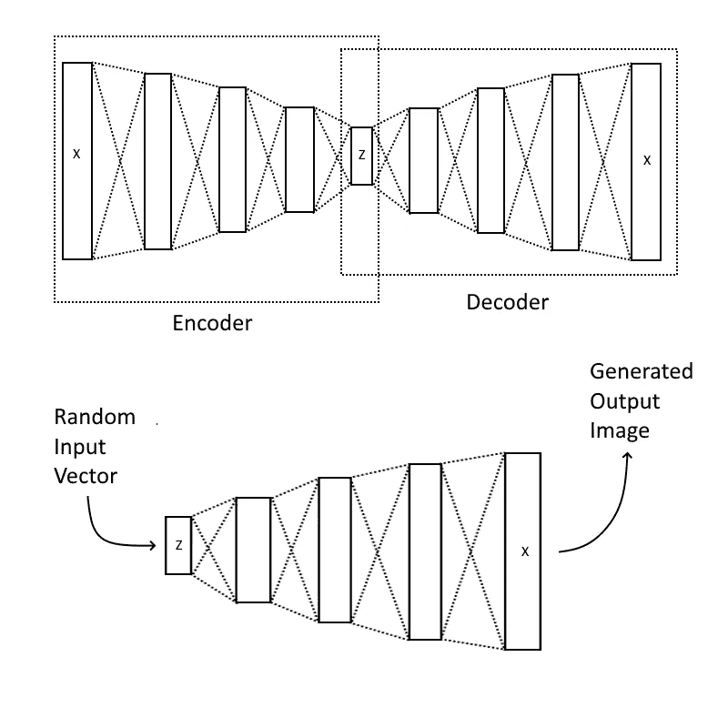
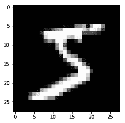
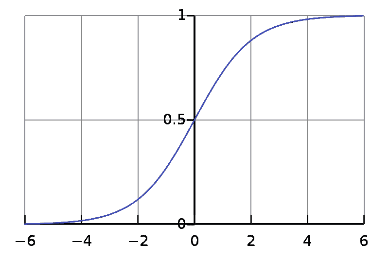
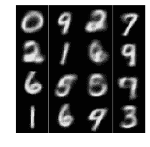

# 制作自动编码器

> 原文：<https://towardsdatascience.com/how-to-make-an-autoencoder-2f2d99cd5103?source=collection_archive---------10----------------------->

## 使用 Keras 和 MNIST 培训

# 了解自动编码器:



Image of Autoencoder Architecture created by Arvin Singh Kushwaha

自动编码器是一类无监督网络，由两个主要网络组成:编码器和解码器。

无监督网络是在没有任何训练标签的情况下从数据中学习模式的网络。网络在没有被告知模式应该是什么的情况下在数据中找到它的模式。

相反，有监督网络，其中当给定特定输入时，网络被训练以返回特定输出。

编码器通常使用一系列密集和/或卷积层将图像编码成以紧凑形式表示图像的固定长度向量，而解码器使用密集和/或卷积层将潜在表示向量转换回相同的图像或另一个修改的图像。

上图显示了一个简单的自动编码器的例子。在这个自动编码器中，您可以看到大小为 X 的输入被压缩成大小为 Z 的潜在向量，然后被解压缩成大小为 X 的相同图像。

为了生成图像，给解码器网络一个随机输入向量。解码器网络将把输入向量转换成完整的图像。

# 创建自动编码器:

我推荐使用 Google Colab 来运行和训练 Autoencoder 模型。

## 安装 Tensorflow 2.0

```
#If you have a GPU that supports CUDA
$ pip3 install tensorflow-gpu==2.0.0b1#Otherwise
$ pip3 install tensorflow==2.0.0b1
```

Tensorflow 2.0 内置了 Keras 作为其高级 API。Keras 可通过此导入进行访问:

```
import tensorflow.keras as keras
```

## 导入必要的模块/包

```
from tensorflow.keras.datasets import mnist
from tensorflow.keras.layers import Dense, Input, Flatten,\
                                    Reshape, LeakyReLU as LR,\
                                    Activation, Dropout
from tensorflow.keras.models import Model, Sequential
from matplotlib import pyplot as plt
from IPython import display # If using IPython, Colab or Jupyter
import numpy as np
```

## 正在加载 MNIST 数据

```
(x_train, y_train), (x_test, y_test) = mnist.load_data()
x_train = x_train/255.0
x_test = x_test/255.0
```

MNIST 数据集由 70000 个 28 像素乘 28 像素的手写数字图像和 70000 个包含每个数字是哪个数字的信息的向量组成。

图像训练数据从[0，255]缩放到[0，1]，以允许使用 sigmoid 激活函数。



Data from x_train[0]

为了检查我们的数据，我们将绘制训练数据集中的第一幅图像。

```
# Plot image data from x_train
plt.imshow(x_train[0], cmap = "gray")
plt.show()
```

## 决定潜在规模

潜在大小是潜在空间的大小:压缩后保存信息的向量。该值是一个至关重要的超参数。如果该值太小，将没有足够的数据用于重建，如果该值太大，可能会发生过度拟合。

我发现一个好的、成功的潜在大小是 32 个值长。

```
LATENT_SIZE = 32
```

## 创建编码器

```
encoder = Sequential([
    Flatten(input_shape = (28, 28)),
    Dense(512),
    LR(),
    Dropout(0.5),
    Dense(256),
    LR(),
    Dropout(0.5),
    Dense(128),
    LR(),
    Dropout(0.5),
    Dense(64),
    LR(),
    Dropout(0.5),
    Dense(LATENT_SIZE),
    LR()
])
```

编码器由一系列致密层和间隙漏失层和泄漏层组成。密集层允许将 28×28 的输入张量压缩到大小为 32 的潜在向量。下降层有助于防止过拟合和泄漏。作为激活层，下降层会在混合中引入非线性。`Dense(LATENT_SIZE)`创建大小为 32 的最终矢量。

## 创建解码器

```
decoder = Sequential([
    Dense(64, input_shape = (LATENT_SIZE,)),
    LR(),
    Dropout(0.5),
    Dense(128),
    LR(),
    Dropout(0.5),
    Dense(256),
    LR(),
    Dropout(0.5),
    Dense(512),
    LR(),
    Dropout(0.5),
    Dense(784),
    Activation("sigmoid"),
    Reshape((28, 28))
])
```

解码器本质上与编码器相同，但方向相反。然而，最终的激活层是 s 形的。sigmoid 激活函数输出范围为[0，1]的值，这与我们的缩放图像数据完全吻合。



Sigmoid Function

## 创建完整的模型

要创建完整的模型，必须使用 Keras 功能 API。函数式 API 允许我们将多个模型串在一起。

```
img = Input(shape = (28, 28))
```

这将创建一个占位张量，我们可以将它输入到每个网络中，以获得整个模型的输出。

```
latent_vector = encoder(img)
output = decoder(latent_vector)
```

Keras Functional API 最好的部分是它的可读性。Keras Functional API 允许您将模型直接调用到张量上，并从该张量获得输出。通过将`encoder`模型调用到`img`张量上，我得到了`latent_vector`。同样的事情也可以在`latent_vector`上用`decoder`模型来完成，这给了我们输出。

```
model = Model(inputs = img, outputs = output)
model.compile("nadam", loss = "binary_crossentropy")
```

要创建模型本身，可以使用 model 类并定义模型的输入和输出。

要训练一个模型，你必须编译它。为了编译一个模型，你必须选择一个优化器和一个损失函数。对于优化器，我选择了 Nadam，这是应用于自适应矩估计的内斯特罗夫加速梯度。这是一个改进的 Adam 优化器。对于损失，我选择了二元交叉熵。二进制交叉熵通常用于自动编码器。然而，通常二元交叉熵与二元分类器一起使用。此外，二进制交叉熵只能在[0，1]范围内的输出值之间使用。

## 训练模型

```
EPOCHS = 60
```

值`EPOCHS`是一个设置为 60 的超参数。一般来说，时期越多越好，至少在模型稳定下来之前是这样。

```
#Only do plotting if you have IPython, Jupyter, or using Colab
```

只有在使用 IPython、Jupyter 或 Colab 时，才建议重复绘图，以便 matplotlib 绘图是内联的，而不是重复创建单个绘图。

```
for epoch in range(EPOCHS):
    fig, axs = plt.subplots(4, 4)
    rand = x_test[np.random.randint(0, 10000, 16)].reshape((4, 4, 1, 28, 28))

    display.clear_output() # If you imported display from IPython

    for i in range(4):
        for j in range(4):
            axs[i, j].imshow(model.predict(rand[i, j])[0], cmap = "gray")
            axs[i, j].axis("off")

    plt.subplots_adjust(wspace = 0, hspace = 0)
    plt.show()
    print("-----------", "EPOCH", epoch, "-----------")
    model.fit(x_train, x_train)
```

首先，我们创建具有 4 行 4 列子曲线的曲线，并选择 16 个随机测试数据图像来检查网络的性能。

接下来，我们清空屏幕(仅适用于 IPython、Jupyter 和 Colab ),并在随机测试图像上绘制模型预测。

最后，我们训练模型。为了训练模型，我们简单地在训练图像数据上调用`model.fit`。还记得 autoencoder 的目标是如何获取输入数据，压缩它，解压缩它，然后输出输入数据的副本吗？这意味着输入和目标输出都是训练图像数据。

如你所见，这些生成的图像非常好。然而，这些图像最大的问题是模糊不清。这些问题中的许多可以用其他类型的生成网络或者甚至其他类型的自动编码器来修复。

## 完整代码

```
from tensorflow.keras.datasets import mnist
from tensorflow.keras.layers import Dense, Input, Flatten,\
                                    Reshape, LeakyReLU as LR,\
                                    Activation, Dropout
from tensorflow.keras.models import Model, Sequential
from matplotlib import pyplot as plt
from IPython import display # If using IPython, Colab or Jupyter
import numpy as np(x_train, y_train), (x_test, y_test) = mnist.load_data()
x_train = x_train/255.0
x_test = x_test/255.0# Plot image data from x_train
plt.imshow(x_train[0], cmap = "gray")
plt.show()LATENT_SIZE = 32encoder = Sequential([
    Flatten(input_shape = (28, 28)),
    Dense(512),
    LR(),
    Dropout(0.5),
    Dense(256),
    LR(),
    Dropout(0.5),
    Dense(128),
    LR(),
    Dropout(0.5),
    Dense(64),
    LR(),
    Dropout(0.5),
    Dense(LATENT_SIZE),
    LR()
])decoder = Sequential([
    Dense(64, input_shape = (LATENT_SIZE,)),
    LR(),
    Dropout(0.5),
    Dense(128),
    LR(),
    Dropout(0.5),
    Dense(256),
    LR(),
    Dropout(0.5),
    Dense(512),
    LR(),
    Dropout(0.5),
    Dense(784),
    Activation("sigmoid"),
    Reshape((28, 28))
])img = Input(shape = (28, 28))
latent_vector = encoder(img)
output = decoder(latent_vector)model = Model(inputs = img, outputs = output)
model.compile("nadam", loss = "binary_crossentropy")EPOCHS = 60#Only do plotting if you have IPython, Jupyter, or using Colabfor epoch in range(EPOCHS):
    fig, axs = plt.subplots(4, 4)
    rand = x_test[np.random.randint(0, 10000, 16)].reshape((4, 4, 1, 28, 28))

    display.clear_output() # If you imported display from IPython

    for i in range(4):
        for j in range(4):
            axs[i, j].imshow(model.predict(rand[i, j])[0], cmap = "gray")
            axs[i, j].axis("off")

    plt.subplots_adjust(wspace = 0, hspace = 0)
    plt.show()
    print("-----------", "EPOCH", epoch, "-----------")
    model.fit(x_train, x_train)
```

这段代码的 Google Colab 可以在[这里](https://colab.research.google.com/drive/19BBIU0A7c4ExRD0cly-mMs7LqZkO44K_)找到。

经过 60 个纪元的训练，我得到了这个图像:



Generated Image after 60 epochs

如你所见，结果相当不错。自动编码器成功地编码和解码了潜在的空间矢量，质量相当好。这种自动编码器是“普通的”类型，但是其他类型的自动编码器，如变型自动编码器，有更好的图像质量。此外，通过增加历元的数量，可以进一步改善结果。

# 自动编码器的用途

简单地说，自动编码器学习如何在没有监督的情况下有效地压缩和解压缩数据。这意味着自动编码器可以用于降维。自动编码器的解码器部分也可以用于从噪声矢量生成图像。

自动编码器网络的实际应用包括:

*   去噪
*   图像重建
*   图象生成
*   数据压缩和解压缩