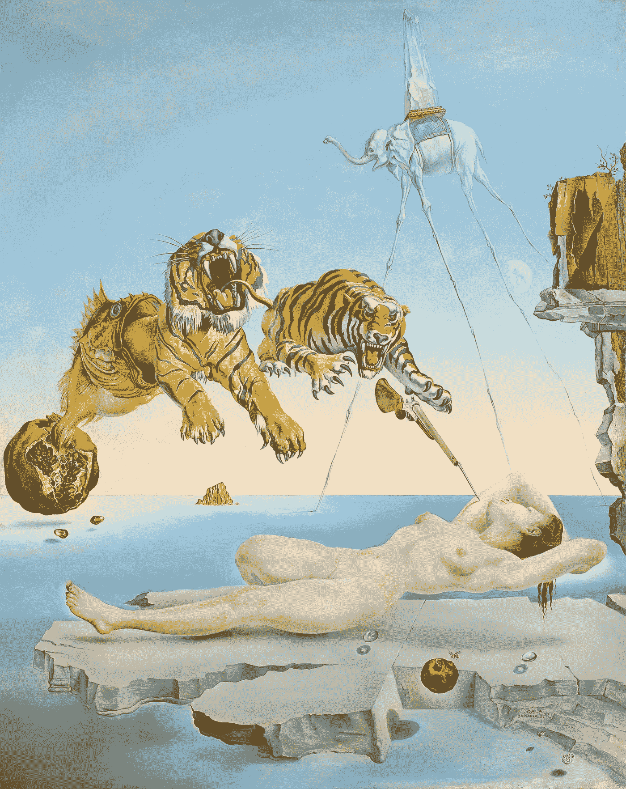
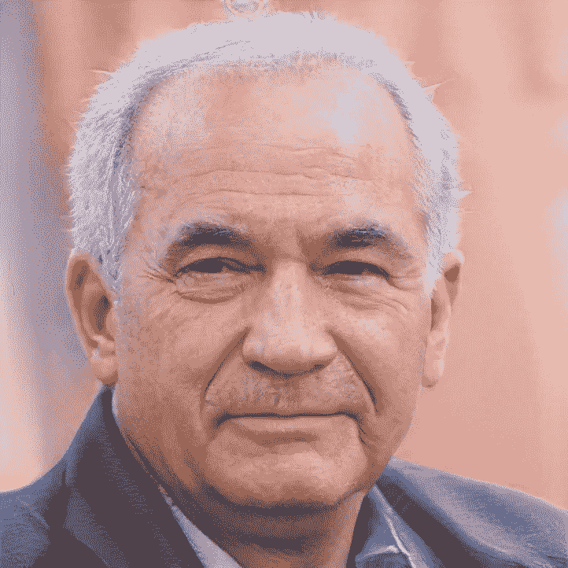
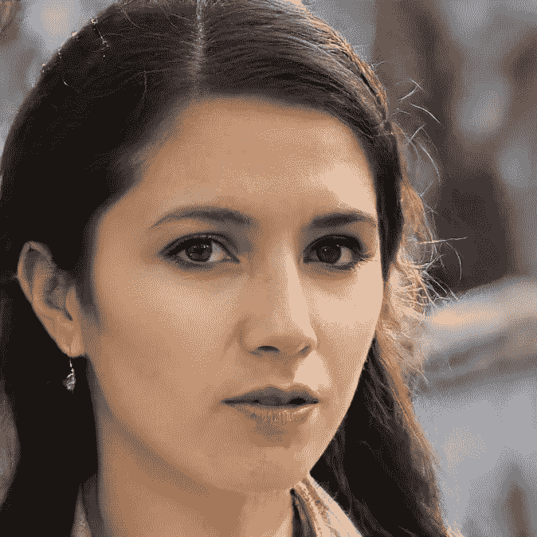
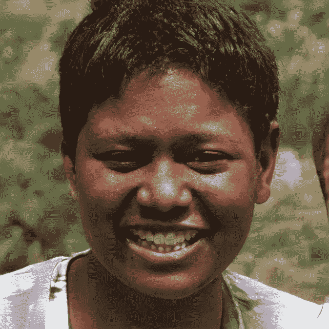
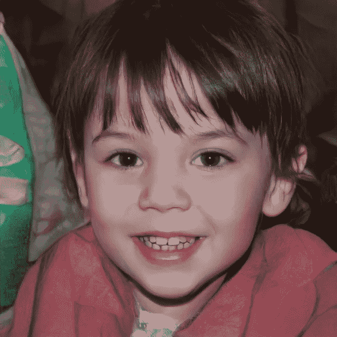
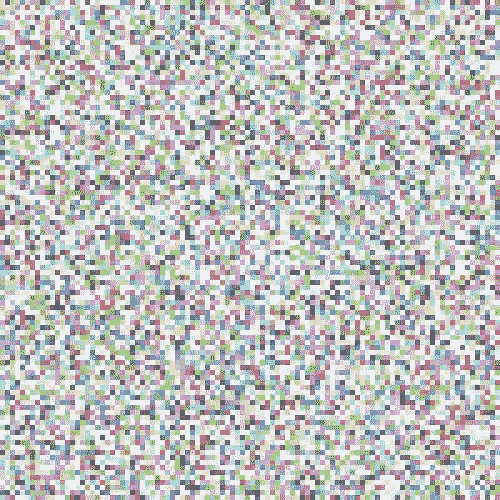

# 如何让电脑做梦

> 原文：<https://towardsdatascience.com/how-to-make-computers-dream-3b4b10e4463a?source=collection_archive---------26----------------------->

## 生成模型的软介绍

> “当一个人理解了原因，所有消失的图像可以很容易地通过原因的印象在大脑中重新找到。
> 这才是真正的记忆艺术……”
> 勒内·笛卡尔，私人思考。

闭上眼睛(当你试图说服人们阅读你的文章时，这是一个糟糕的开场白)，想象一张脸。

现在想象一只猫。一只狗，房子，汽车，水槽，一瓶啤酒，桌子，树。

这一切都在你的头脑中，很容易在你的内眼、内耳和内心世界中想象出来。但是你有没有想过，当你想象一个前所未见、前所未闻的东西时，会发生什么？

我们都有能力想出不存在的新奇事物。在电车上看到一则广告后，我们塑造了对未来的愿景，并突然体验到自己在遥远的土地上。

当我们晚上睡觉时，闭上眼睛，远离世界上所有的模糊事物和所有的感官输入，我们会梦见一个新的世界，里面住着和我们在现实生活中熟悉的人极其相似的人。

Salvador Dali: Dream Caused by the Flight of a Bumblebee around a Pomegranate a Second Before Awakening (fair use).

## 我们能从中学到什么

神经科学家和人工智能研究人员都意识到，我们如此强大的想象能力是我们智力的一个重要方面。因此，在构建类人智能时，对它进行建模可能是对我们工具箱的重要扩展。

但是我们能教机器如何做梦吗？这难道不是人类独有的东西，与计算机的精确和机械决定论如此不同吗？

答案是肯定的。看看这些快乐的人们:

George, Barbara, Aditya and Mikey, as imagined by a computer (via [StyleGAN](https://arxiv.org/abs/1812.04948)).

你可以看着他们，感受他们的生活。他们在哪里长大？他们上的是哪所高中？他们的性格是怎样的？他们是相当严肃的人，还是厚颜无耻的微笑的痕迹？

他们是你想象中的那种人。也许他们会出现在你的梦里。

问题是他们四个都不存在。它们完全是我五分钟前让我的电脑生成的虚构。 ***那是一台电脑想象出来的，就像你想象出来的一样。***

***这怎么可能？***

## 不同程度的随机性

让我们后退几步。

图片由成千上万的像素组成，其中每个像素包含单独的颜色信息(例如，用 RGB 编码)。如果您随机生成一张图片(每个像素都是独立于所有其他像素生成的)，它看起来像这样:

A truly random picture. If you see a face in this, you should consider seeing a doctor.

如果你每秒钟都以这种方式生成一张图片，直到一张脸出现，你不会在几十亿年后更接近你的目标，当太阳在你脸上爆炸时，你仍然会生成图片。

***大部分随机图片都不是人脸的图片，人脸的随机图片非常不随机。***

## 潜在结构

每张脸后面都有一个潜在的结构。在这种潜在结构的范围内，有一定程度的灵活性，但它受到的约束要比不受约束多得多。

人类非常擅长理解潜在结构。我们不会根据像素来考虑人脸:我们会考虑嘴巴、鼻子和耳朵等特征，以及眉毛之间的距离(或没有距离)，我们会在脑海中建立一个抽象的面孔表示(更多信息请见我的文章[思维的几何学](/the-geometry-of-thought-700047775956))，这使我们可以很容易地想象一张脸，无论是在脑海中还是通过绘制。

总的来说，在世界中寻找潜在结构不仅对在世界中导航和交流非常重要，因此对我们的生存也非常重要，而且从某种意义上说，寻找潜在结构是所有科学实践的基石，可以说，也是智力的基石(正如我在关于[为什么智力可能比我们想象的更简单](/why-intelligence-might-be-simpler-than-we-think-1d3d7feb5d34)的文章中所详述的)。

当我们从外部世界收集数据时，数据是由我们通常看不到的过程产生的。建立一个世界模型意味着寻找这些产生我们观察到的数据的隐藏过程。

物理定律，无论是牛顿定律还是薛定谔方程，都是这些潜在原理的浓缩、抽象的表现。就像牛顿的例子一样，意识到一个 ***落下的苹果遵循与行星*** 轨道相同的规律意味着理解这个世界比它看起来有序得多，随机得少。

## 生成模型

> "我不能创造的东西，我不明白。"
> 理查德·费曼

生成模型的目标是学习一些输入数据 **x** 背后的潜在结构的有效表示(例如在我们的声音文件的大量人脸图片上进行训练)，理解控制其分布的规律，并使用它来生成共享输入数据 x 的关键特征的新输出**x’**

您的输入数据不是真正随机的这一事实意味着 x 后面有一个结构，这意味着有某些 ***非平凡(平凡只是随机点)概率分布负责生成数据*** 。但是这些概率分布对于高维输入通常是极其复杂的，并且通常很难解析出来。

这就是深度学习的救援之处，它已经一次又一次地被证明在捕捉数据中各种复杂的非线性相关性方面非常成功，并允许我们很好地利用它们。

生成模型可以采取许多形状和形式，但我认为 ***变型自动编码器*** 是一个非常有启发性的例子，所以我们现在将仔细看看它们是如何工作的。

## 潜在变量

一个[变分自动编码器](https://arxiv.org/abs/1312.6114)通常使用 ***两个深度神经网络构建。***

第一深度神经网络 ***学习*** 输入数据 **x** 的潜在(通常是低维)表示。

它 ***将*** 这种潜在结构编码在 ***关于一些潜在变量的概率分布*** 中，我们用 **z 来表示**那么的主要任务就是在给定我们的数据的情况下，找到所谓的潜在变量的后验，在 ***概率论*** 的语言中写成 **p(z|x)** 。相应地，这个步骤被称为 ***编码器*** 。

请注意，这有点类似于 ***辨别神经网络*** 在监督分类任务中所做的事情:它被训练成在与标签相关的数据中找到结构，例如，允许它区分猫和狗的图片。

只是在生成模型的情况下，我们在寻找数据本身的*概率分布，对于自动编码器，我们将其编码在潜在变量中。*

*对于技术上更感兴趣的人来说:实现这一点的一种方法是通过在潜在变量上引入一类近似先验分布[(例如*高斯分布的组合)并训练网络找到这些分布的参数(例如 ***表示*** 和 ***协方差*** )，它们尽可能接近真实先验(由**测量)***](https://arxiv.org/abs/1906.02691)*

**一旦模型已经学习了潜在变量 **z** 上的 ***概率分布*** ，它可以通过从 **p(z|x)** 采样并执行第一个网络的反向任务来使用这一知识生成新数据**x’**，这意味着寻找由 **p(x'|z)** 给出的以潜在变量为条件的数据的后验概率。**

**换句话说:给定我们之前通过使用第一个网络了解到的潜在变量 **p(z|x)** 的分布，新数据会是什么样子？**

**这个步骤然后被称为 ***解码器*** 或 ***生成模型*** 。**

**我们可以通过同样训练一个 ***神经网络*** 将随机变量 **z** 映射到新数据**x’上来构建它。****

**总结一下 ***变型自动编码器*** 正在做的事情:**

1.  **从输入数据中学习后验 x→z:**p(z | x)****
2.  **从模型生成新数据 z→x ':**p(x ' | z)****

****

**The variational autoencoder. Credit to Chervinskii [CC BY-SA 4.0]**

## **亥姆霍兹机器会梦到电羊吗？**

> **“电器也有它们的寿命。这些生命是微不足道的。”菲利普·K·蒂克，机器人会梦见电动绵羊吗**

**这里缺少一个关键因素:我们如何训练生成模型？**

**这可能相当棘手。训练它们通常比训练有鉴别能力的模型要困难得多。因为在你自己创作之前，你真的真的需要理解一些东西:认识一首贝多芬的交响曲比你自己创作一首容易得多。**

**为了训练模型，我们需要一些损失函数来进行训练，并需要一个算法来实现它，同时需要训练多个网络。**

**最早的生成模型之一叫做 ***亥姆霍兹机器，*** [***由达扬、辛顿、尼尔***](http://www.gatsby.ucl.ac.uk/~dayan/papers/hm95.pdf) ***于 1995 年开发。*****

**亥姆霍兹机器可以使用所谓的[唤醒-睡眠算法](https://en.wikipedia.org/wiki/Wake-sleep_algorithm)进行训练。**

*****在唤醒阶段*** ，网络从世界中查看数据 x，并试图推断潜在状态的后验 **p(z|x)** 。**

*****在睡眠阶段*** ，网络基于其内部的世界模型，从 **p(x'|z)** 中生成(“梦境”)新数据，并试图使其梦境与现实趋同。**

**在这两个步骤中，机器被训练以最小化模型的自由能(也称为“惊奇”)。通过逐步减少惊奇(然后可以通过梯度下降等方法合并)，生成的数据和真实数据变得越来越相似。**

## *****不同的生成模型*****

**现代深度学习中使用了几种类型的生成模型，它们建立在亥姆霍兹机器上，但克服了它们的一些问题(例如唤醒-睡眠算法效率低下/不收敛)。**

**在上面介绍的 ***变分自动编码器*** 中，目的是尽可能好地重构输入数据。这对于实际应用非常有用，例如数据去噪或重建数据的丢失部分。它是通过最小化所谓的 [ELBO(证据下限)](https://en.wikipedia.org/wiki/Evidence_lower_bound)来训练的。**

**另一个强大的方法是由[通用对抗网络](https://papers.nips.cc/paper/5423-generative-adversarial-nets.pdf) (GAN)给出的，它被用来生成你之前看到的人脸。**

**在 GANs 中，在 ***生成模型*** 之上引入了一个 ***鉴别器网络*** ，然后对其进行训练以区分其输入是真实数据 x 还是生成数据 x’。不使用编码器网络，但随机采样 z，并训练生成模型，以使鉴别器网络尽可能难以辨别输出数据是真是假。**

**请注意，生成模型背后的思想非常抽象，因此非常灵活。你可以在各种数据(不仅仅是图片)上训练它们，比如在时间序列数据上的[递归神经网络(RNNs)，例如 fMRI 数据或来自大脑的尖峰脉冲串](https://arxiv.org/abs/1902.07186)。在推断出数据背后的潜在结构之后，可以对训练的模型进行分析，以提高对大脑中潜在过程的理解(例如[与精神疾病](https://www.nature.com/articles/s41380-019-0365-9)有关的动力系统属性等)。).**

## **生成模型与认知**

**生成模型所能实现的已经令人印象深刻，但它们也能让我们更进一步了解我们的大脑是如何工作的。他们不仅被动地对世界进行分类，还主动捕捉其中的基本结构，并将其整合到模型本身中。就像我们都生活在我们大脑创造的自己的内心世界一样，生成模型创造了他们自己微小的内心世界。**

**正如贝叶斯大脑假说的支持者所说，这是我们认知器官的一个关键特征。我们的大脑不断建立潜在的内部表征，以某种方式反映现实世界的概率分布，但也简化它们并专注于最重要的事情(因为这个世界太复杂了，你的大脑无法完全模拟)。**

*****在精神生成模型中，一旦你能创造出你知道它是如何运作的东西。因此，制造能够做梦和想象的机器可能会让我们在理解我们如何做梦和想象自己方面走得更远。*****