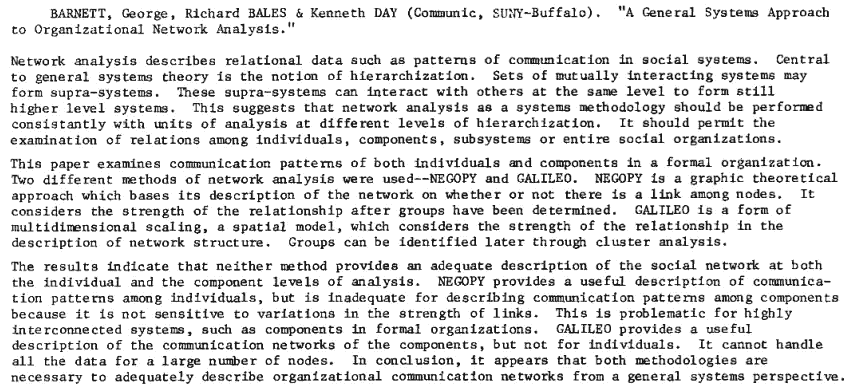
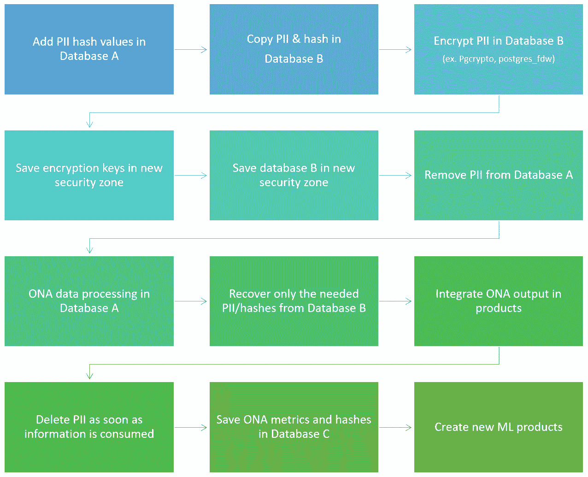
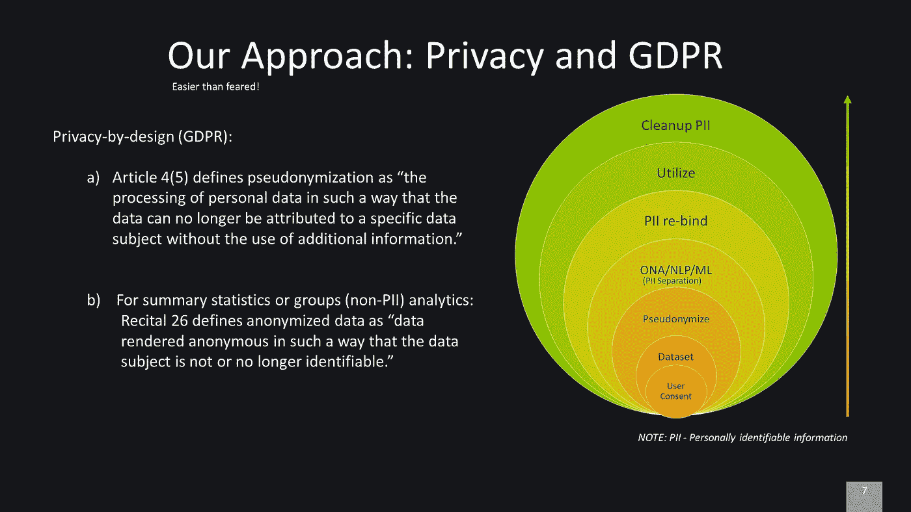

# 如何让 GDPR 和 ONA 合作？

> 原文：<https://towardsdatascience.com/how-to-make-gdpr-and-ona-work-together-4268ae90b112?source=collection_archive---------22----------------------->

unsplash.com

***GDPR 和 ONA 相辅相成——如何运用 ONA 的见解，取决于组织的文化。***

在网上搜索 ONA(组织网络分析)，你会得到各种各样的定义，包括那些带有卷曲的数学符号和图论。然而，简而言之，ONA 是关于组织中谁与谁沟通。

虽然 ONA 被认为是最近的流行语之一，但它至少可以追溯到 80 年代。1985 年，[乔治·巴尼特](http://communication.ucdavis.edu/people/gbarnett)和他的同事写了一篇文章，论述了 ONA 在组织层级中的不同层次。下面的摘要提供了更多的线索。

显然，在这个时候和以后，ONA 的隐私方面很少或没有关注。然而，随着《欧盟一般数据保护条例》(GDPR)的颁布，情况发生了缓慢的变化，然后变得更快了。由于已经有很多关于 GDPR 本身的文章和讨论，我们将不再深入探讨更多的细节。

# ONA 在你的组织里！

ONA 是一个帮助组织在人员分析方面向更好的世界转型的工具。对当今 VUCA 世界的发展和采用感兴趣的组织都在。尽管如此，终端用户往往不愿意，表达了隐私问题。有一点是清楚的，每一种技术都可以用于好的或坏的方面，ONA 也不例外。

有些员工认为 ONA 的见解会对个人或职业造成伤害。这些员工直言不讳，讨论他们的隐私如何处于危险之中。然后，这些声音被工人委员会放大——都是以隐私的名义。然而，ONA 洞察使员工能够在他们自己的组织中产生影响，并实现个人发展。如何运用 ONA 的见解取决于公司文化或人力资源实践。这并不比耳语咖啡更糟糕——谈论对同事的专业和个人评价。事实上，对自己公司文化的恐惧是一些员工不愿意去 ONA 的核心原因。

这并不是说 ONA 不应该解决隐私问题，恰恰相反，企业和产品经理有责任在考虑隐私的情况下开发产品，用 GDPR 的话说，这叫做“设计和默认的数据保护”。

GDPR 要求用户明确同意开发 ONA 洞察。虽然 ONA 洞察可以通过未加入的员工比例来计算，但为了实现可接受和可靠的 ONA 洞察，需要足够数量的员工给予用户同意。因此，在开始实施和征求同意之前，提高贵组织对 ONA 的认识至关重要。

# 从根本上解决数据隐私问题绝非易事！

GDPR 的主要变化是，设计和默认的数据保护现在是一项法律要求。 [ICO](https://ico.org.uk/for-organisations/guide-to-data-protection/guide-to-the-general-data-protection-regulation-gdpr/accountability-and-governance/data-protection-by-design-and-default/) 指出:

> *“GDPR 要求您采取适当的技术和组织措施，以实施数据保护原则和保障个人权利。”*

这种方法从基础设施一直到 UI。拥有如此广泛的实施焦点，这使得组织很难实施，尤其是在现有产品和服务的基础上构建。

幸运的是，GDPR 以匿名化的形式提供了高水平的解决方案，更重要的是假名化。 [IAPP](https://iapp.org/news/a/top-10-operational-impacts-of-the-gdpr-part-8-pseudonymization/) 将假名化定义为:

> *“从直接标识符中分离数据，以便在没有单独保存的附加信息的情况下，不可能链接到身份”*

对于有隐私意识的产品实现，这意味着个人身份信息(PII)数据必须通过设计分离。显然，下一个问题是:PII 意味着什么？这个问题正在被定义——其中一个概念在这里[被描述为 PII 2.0。然而，组织应该尽最大努力解决 PII 和隐私的话题 topic 教不明确的借口在法庭上对你的组织没有帮助。有各种各样的方法来解决 PII 和假名化问题，然而最好的方法是(尽可能地)结合安全性、加密和](https://scholarship.law.berkeley.edu/cgi/viewcontent.cgi?article=4252)[混淆。根据定义，PII 混杂因素是最难解决的，这篇研究论文显示了推断 PII 是多么容易。](https://en.wikipedia.org/wiki/Confounding)

关于假名化(假设您的组织已经尽可能好地解决了 PII 问题)，假名化数据的最安全方法是使用散列值、数据加密和应用所谓的深度防御方法。

# 如何对用于 ONA 产品的数据使用假名？

首先，需要实现深度安全或防御概念。[纵深防御](https://en.wikipedia.org/wiki/Defense_in_depth_(computing))是:

> 美国国家安全局(NSA)构想的一种分层策略，作为信息和电子安全的综合方法。

在我们的案例中，这意味着 PII 的数据必须通过多层安全控制进行隔离，这使得 PII 的信息很难获取。这是通过实施不同的 VLANs、加密、散列、硬件分离、认证等来实现的。

一旦确定了 PII 油田并制定了深度安全措施，就可以采用以下技术步骤:

这些步骤可确保您的组织在设计和默认情况下尽最大努力解决数据保护问题，这是 GDPR 的法律要求。

作为概述，下图显示了上述内容的一个更广泛、更简化的版本:

与汇总统计数据和团队相关指标相关的 ONA 特性工作方式类似。隐私和 PII 问题更宽松，可以使用匿名。

# 结论

提供 ONA 相关的服务是可能的，也是可行的，这些服务是 GDPR 意识到的，并遵循最佳隐私惯例。最终用户的期望不匹配主要与对 ONA 的误解、内部文化、假设以及与数据隐私相关的负面情绪有关。组织中的文化成就或抑制了 ONA 的洞察力，而不是相反。后 ONA 阶段以及组织如何利用 ONA 洞察(和其他决策信息)必须是员工关心的问题。ONA 给员工提供了推动他们自己的兴趣和文化的方法，而不是抱着最好的希望，在喝咖啡休息或异地决策会议期间等待发生什么。

关于 ONA 在[国际电影节](https://www.linkedin.com/company/haufe-gruppe/)的更多信息，请参见我们的[系列文章](https://www.linkedin.com/pulse/how-use-corporate-e-mail-analysis-reveal-hidden-stars-agron-fazliu/)。