# 圆周率怎么做

> 原文：<https://towardsdatascience.com/how-to-make-pi-part-1-d0b41a03111f?source=collection_archive---------11----------------------->

在今年的圆周率日，艾玛·相户爱·Iwao[计算出圆周率](https://www.theverge.com/2019/3/14/18265358/pi-calculation-record-31-trillion-google)为 31 万亿位，使之前 22 万亿位的记录相形见绌。从六年级开始，我就知道圆周率是 3.14 和一些变化。但是我开始想我们是怎么知道的？我们如何制作*圆周率*？

计算 *pi* 的位数有很多种方法——可以用随机抽样、几何、微积分等。但是我们为什么要在乎呢？如果你给我 *pi* 的前 39 位，我可以告诉你一个氢原子内已知宇宙的宽度(具体方法见 [Numberphile 的视频](https://www.youtube.com/watch?v=FpyrF_Ci2TQ))。我们真的需要 31 万亿吗？

嗯，不，可能不会。但这并不意味着这没有价值！为了生成这些近似值，我们使用了数学、计算机科学和计算机工程中的许多重要工具。我们需要处理关于浮点运算的准确性的问题，估计和误差界限的问题，以及关于优化的问题。所有这些都是有价值的，即使其他 30，999，999，999，961 个数字没有价值。

# 蒙特卡洛方法

我们将从蒙特卡罗方法开始。这些方法依靠随机抽样来生成数字结果。出于我们的目的，我们将对 *X-Y* 平面中的点进行采样。我们来看看下图。有一个半径为 1 [的圆内接在正方形](https://en.wikipedia.org/wiki/Inscribed_figure)上。这个正方形的边长正好是圆的直径，也就是 2。

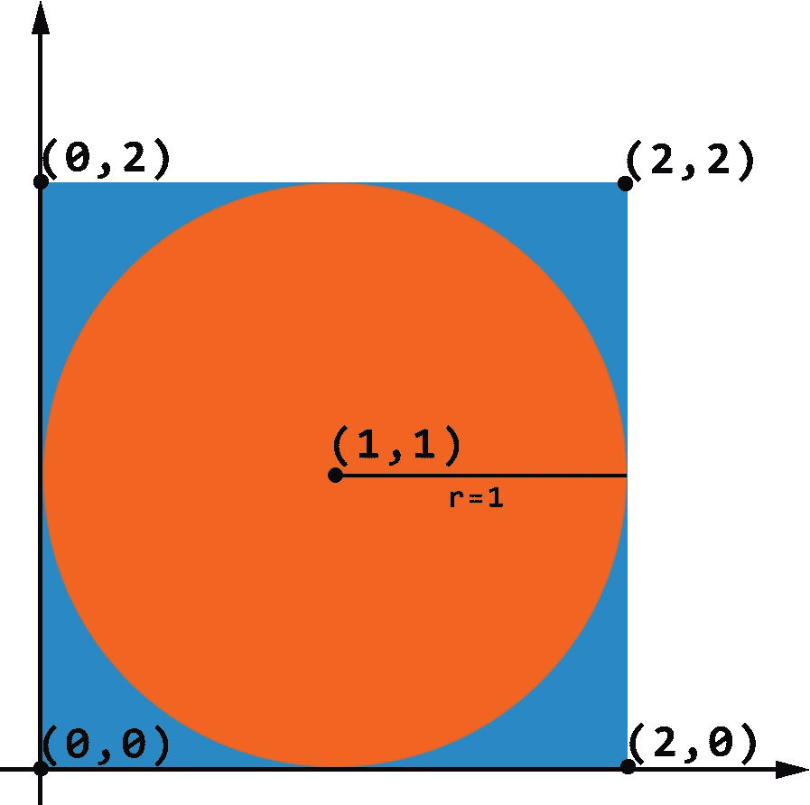

A circle with radius 1 and center (1, 1) inscribed in a square with side length 2

现在，假设你和我在玩一个游戏。我们随机选取一个 *0 ≤ x ≤ 2* 和 *0 ≤ y ≤ 2* 的点 *(x，y)* 。如果点在圆圈里，你就赢一美元。否则，我赢一美元。橙色是你赢的地方，蓝色是我赢的地方。你赢得一美元的几率有多大？它是橙色圆圈的面积与总面积的比率。圆的面积是*A = pi**r = pi**1 = pi*总面积是正方形的面积 *A = s = 2 = 4。*所以，赔率是( *pi / 4)* ≈ 78.5%。胜算大！

所以，如果我们取一堆点，看看落在圆内的点的百分比，我们可以估计出 *pi* (这里是[为什么](https://www.khanacademy.org/math/statistics-probability/random-variables-stats-library/expected-value-lib/v/law-of-large-numbers))。这种随机抽样正是我们的蒙特卡罗方法。下面的代码采样一千万、一亿和十亿个点来计算*圆周率。*

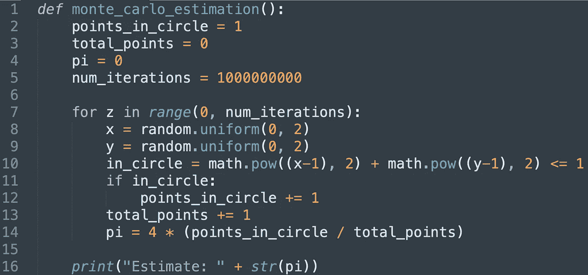

An implementation of the Monte Carlo method using Python. Source code [here](https://github.com/andrewjoliver/estimating-pi/blob/master/monte-carlo.py).

结果如下。

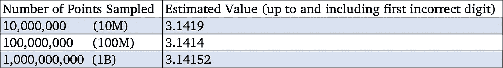

Monte Carlo method results

那还不算太糟！在我的电脑上，十亿次迭代大约需要半个小时。它给出了对π的估计，只差 0 . 00007*。但是我们远没有产生 31 万亿位的圆周率。幸运的是，我们有很多其他方法可以尝试。*

# 微积分方法

我们知道半径为 1 的圆的面积是*A = pi**(1)= pi*。太好了！让我们计算半径为 1 的圆的面积。但是我们到底如何计算面积呢？我们可以用积分来解决这个问题。看一下下图。它是以 *(0，0)* 为圆心，半径为 1 的圆的右上部分。这个圆的方程式是 *x + y = 1。*然而，我们只关心 *x* 轴上方的部分，因此我们可以将公式重新排列为下方的公式。

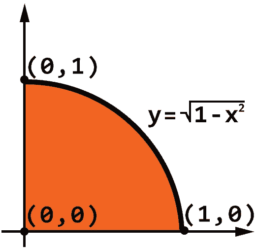

The top right of a circle with radius 1 and center at (0, 0)

由于整个圆的面积是 *pi* ，那么上面的面积就是 *pi / 4* 。我们可以从 0 到 1 积分，结果将是 *pi / 4* 。但是，再一次，整合一个函数到底意味着什么？积分源于波恩哈德·黎曼(1826 年)提出的黎曼和。黎曼求和允许我们通过对曲线下的矩形求和来近似积分，如下所示。我们使用的矩形越多，近似值就越好。

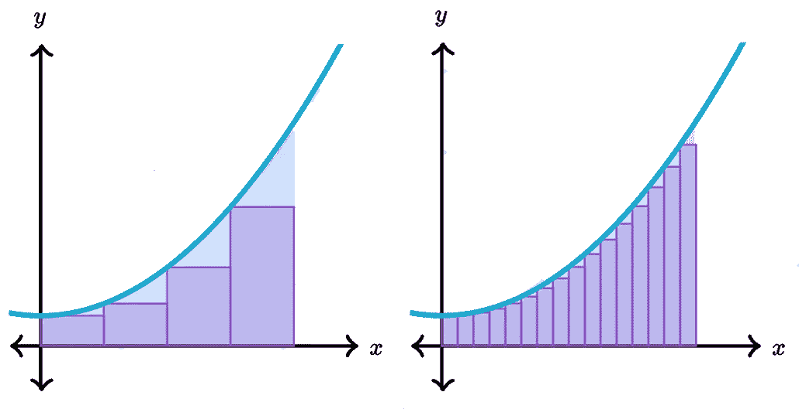

Riemann Sums (Images from [Khan Academy](https://www.khanacademy.org/math/ap-calculus-ab/ab-integration-new/ab-6-2/a/left-and-right-riemann-sums))

下面的代码使用黎曼和的方法来近似我们的圆下面的面积。这个近似值等于 *(pi / 4)。*更多关于黎曼和的内容，请看[这里](https://www.khanacademy.org/math/ap-calculus-ab/ab-integration-new/ab-6-2/v/midpoint-sums)。

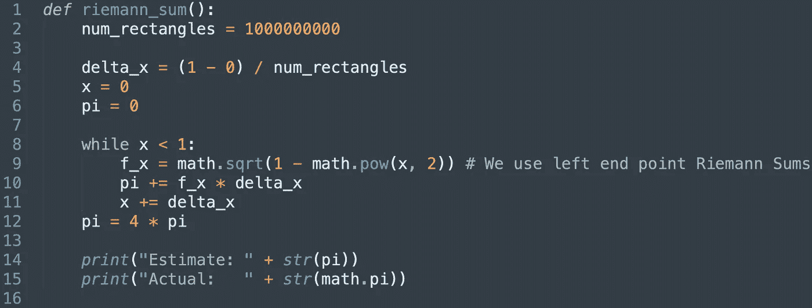

Implementation of the Riemann Sum Method with Python. Source code [here](https://github.com/andrewjoliver/estimating-pi/blob/master/riemann-sums.py).

结果如下。

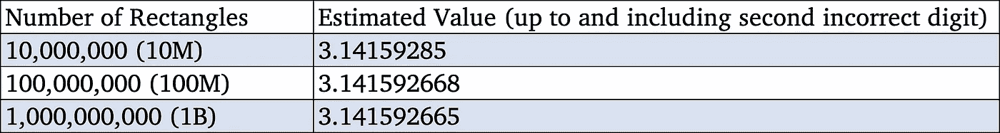

这无疑是对我们以前方法的改进！在相同的迭代次数下，我们为自己多买了几个正确的数字。但是我们可以做得更好。

# 无穷级数方法

这个无穷和的想法似乎是可行的，所以我们将继续沿着这条路走下去。从三角学我们知道*tan(π/4)= 1*。我们现在可以使用反正切函数 *arctan(x)* 来计算 *arctan(1) = pi / 4* 。幸运的是，我们有一个简单易行的公式来计算 arctan(x) 。这种方法也被称为格雷戈里-莱布尼茨系列或马达瓦-格雷戈里系列，以戈特弗里德·莱布尼茨(1646)、詹姆斯·格雷戈里(1638)和桑加玛格拉玛的马达瓦(1340)命名。

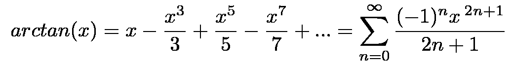

Summation Formula for arctan(x)

我们可以设置 *x = 1* ，让下面的代码运行。

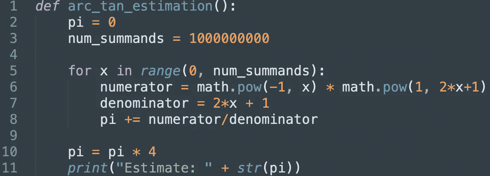

Implementation of the arctan(x) method with Python. Source code [here](https://github.com/andrewjoliver/estimating-pi/blob/master/geometry.py).

结果是朝着正确的方向迈出了一步！对于十亿次迭代，我们得到的数字比积分法多一位。

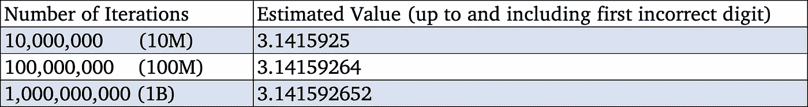

Results of arctan(x) method

我们可以继续这种方法，做一些改进，并得到明显更好的结果。一个改进来自约翰·麦金(1706)，他发展了下面的公式。Machin 对这个公式的推导超出了本文的范围，但是可以在这里找到。

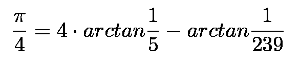

Machin’s formula for estimating pi

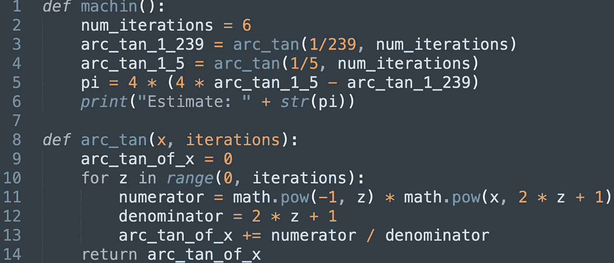

Implementation of Machin’s Formula with Python. Source code [here](https://github.com/andrewjoliver/estimating-pi/blob/master/geometry.py).

结果如下。确保记下迭代的次数。经过 10 次迭代，我们的估计和上面一样好。我们在第 1 部分中的[蒙特卡罗方法花了 10 亿次迭代去做 Machin 公式在第 3 部分所做的事情。](https://medium.com/@andrewjoliver3/how-to-make-pi-part-1-d0b41a03111f)

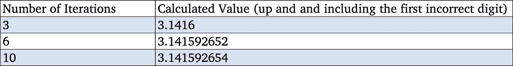

Results of estimation using Machin’s Formula

但是，正如你可能猜到的，我们仍然可以做得更好。

# 一种改进的无穷级数方法

我们看到的最后一个无穷级数来自杰出的数学家斯里尼瓦瑟·拉马努金(1887)。Ramanujan 写了两个计算 *pi* 的公式。Chudnovsky 兄弟，Gregory (1952)和 David (1947)也改进了 Ramanujan 的初始公式。

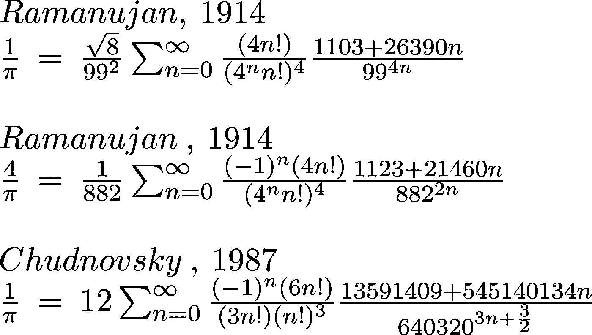

Ramanujan’s and Chudnovsky Brothers’ formulae for estimating pi

下面的代码是 Chudonovksy 公式的一个实现。

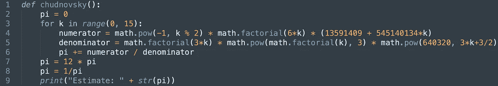

Implementation of Chudnovsky formula with Python. Source code [here](https://github.com/andrewjoliver/estimating-pi/blob/master/series.py).

在**一次**迭代后，该公式将 *pi* 精确到**第 14 位**数字。随着每一次连续的迭代，该公式会生成 14 个以上的正确数字 *pi* 。经过三次迭代后，我们就可以计算出一个氢原子内宇宙的宽度了。

这个公式是每一个现代圆周率计算记录的基础。常见的实现使用的是 [y-cruncher](http://www.numberworld.org/y-cruncher/) ，这是一个设计用来高效计算 *pi* 的软件。

# 结束语

我们已经研究了 4 种不同的策略来生成*pi*——随机模拟、积分、三角函数和无穷级数。估计问题现在看起来可能微不足道，但那只是因为我们可以在现代笔记本电脑上运行十亿次迭代。在历史上的大部分时间里，找到准确的估计值需要巧妙的公式，而这些公式在计算上并不昂贵。现在只需要 Python 一个半小时。

这些只是制作*圆周率*的几种方法。如果你想做派，皮尔斯伯里有一篇很棒的文章[在这里](https://www.pillsbury.com/everyday-eats/desserts/pies-tarts/how-to-make-pie)。