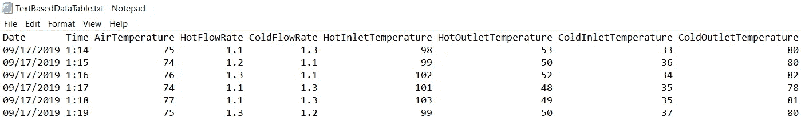

# 如何理解混乱的表格数据

> 原文：<https://towardsdatascience.com/how-to-make-sense-of-messy-tabular-data-d59264bb2d58?source=collection_archive---------20----------------------->

## Python 的滤镜和。拆分函数是您对抗格式不良的数据集的盟友


您是否曾经不得不打开一个格式错误的数据集？那种有人拼凑并打印出来的数据集，没有想到也许， ***也许，*** ，有人可能想以后自己打开这些数据并进行处理？

浪费时间，多长出几根白头发，这是一种奇妙的方式，不是吗？

幸运的是，Python 提供了大量的工具，可以让您的生活变得更加轻松。您可以使用这些可用的工具，以一种易于使用的方式重新格式化数据集，无论它一开始是否格式化良好。

## 这个问题有什么例子？

在这个例子中，我们来谈谈保存在。txt 格式。不在。csv 或其他对保存数据集有意义的格式。作为一个文本文件，中间留有足够的空间，使值排成一行，并显示为表格。

以图 1 中的数据为例。这是我专门为了演示这个概念而编造的样本数据。如果物理环境对你很重要，假装它是显示水-水热交换器性能的数据。器件的热端和冷端都有流量，器件两侧都有入口和出口温度测量值。



Figure 1: Scientific Data Presented as a Text File

你知道是什么让这个数据集令人讨厌吗？这是一个文本文件。数据集之间没有逗号分隔，因此不能将其视为 CSV。不，它也不是制表符分隔的(尽管从图中看不出来)。将值输入到表中，然后添加足够的空格以确保所有内容都对齐。

作为数据科学家，我们希望加载这些数据，并尽快处理它们，但是数据集的格式存在延迟。我们如何快速简便地将它转换成可用的格式？借助 Python 的*滤镜*和*的力量。拆分*功能！

## 我如何使用过滤器和？拆分以使其成为可管理的数据集？

T 读入 Python 的 ext 文件对象有[T3。()](https://www.geeksforgeeks.org/python-string-split/)功能可用。这是一个非常有用的函数，正如它所说的那样。每当指定的分隔符到达时，它就拆分一个文本块。如果希望文件在有逗号的时候被分割，可以调用*。split('，')*(不过我还是建议把它们打开。csv 文件代替)。如果您想在看到代码字时拆分文件，您可以输入该代码字作为分隔符。如果您有一个使用未指定数量的空格进行格式化的文本文件，您也可以对其进行格式化。这就是我们需要对图 1 所示的示例数据做的事情。

为了解决这个难题，我们首先需要在有空间的时候分割数据。这将产生一个包含所有数据点的列表，保持数据点的完整性。这个。split 函数需要按顺序应用于表中的每一行，以便将数据保持在所需的格式。假设数据文件是打开的，并且存储在一个名为 *Contents* 的变量中，我们可以使用下面的代码:

```
for i in range(1, len(Contents)):
    Row = Contents[i].split(' ')
```

每当上面的代码找到一个空格时，它将拆分每一行的数据。这是一个很好的步骤，提供了一个包含所有最终数据的列表。不幸的是，由于每个分隔符中有任意数量的空格，脚本有时会在列表中返回空值。

要解决这个问题，我们可以使用 Python 的 [*滤镜*](https://www.geeksforgeeks.org/filter-in-python/) 函数。要使用*过滤器*，我们只需向它提供我们想要使用的过滤器，以及我们想要应用它的数据集。当调用 filter 函数时，您可以创建任何您想要的过滤器，这使得它非常灵活和有用。如果我们想从列表中删除所有空值，我们可以利用可用的 filter 命令 *None* 选项。这消除了所有的空白空间，不需要我们额外的努力。最后，我们需要将过滤后的结果输入到一个列表中(否则 Python 的过滤器不会返回实际数据。然后，代码显示为:

```
for i in range(1, len(Contents)):
    Row = list(filter(None, Contents[i].split(' ')) 
```

## 这个过程的结果是什么？

这个过程的结果是，每个数据点之间的所有空白空间现在都被移除，并且有意义的数据点现在作为列表可用。你可以随意使用这份数据清单。如果您准备好直接对这一行数据进行数据分析，您可以这样做。

然而，我通常不喜欢走那条路。我喜欢尽可能频繁地保存中间结果，以防以后我想返回到该文件并将其用于其他目的。为此，您需要在处理数据框时按顺序将每一行数据添加到数据框中，并使用有意义的名称保存数据框。在[自动存储来自分析数据集的结果](/automatically-storing-results-from-analyzed-data-sets-ed918d04bc13)中描述了这样做的技术。