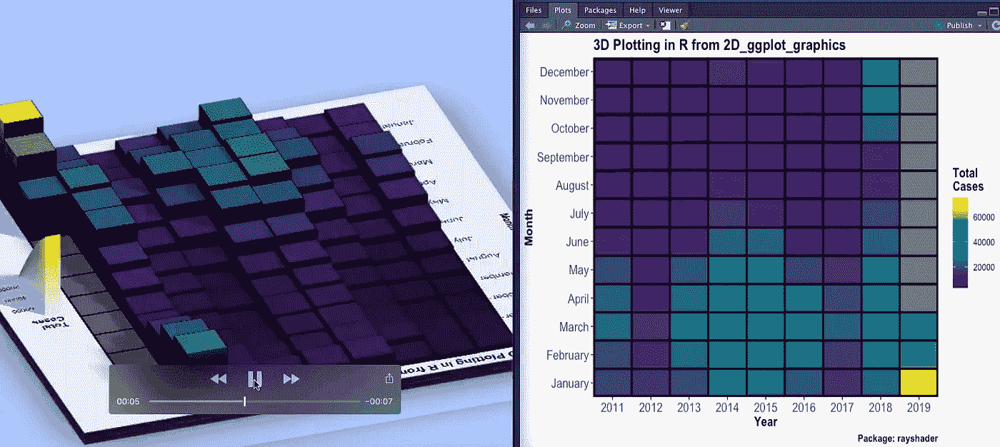
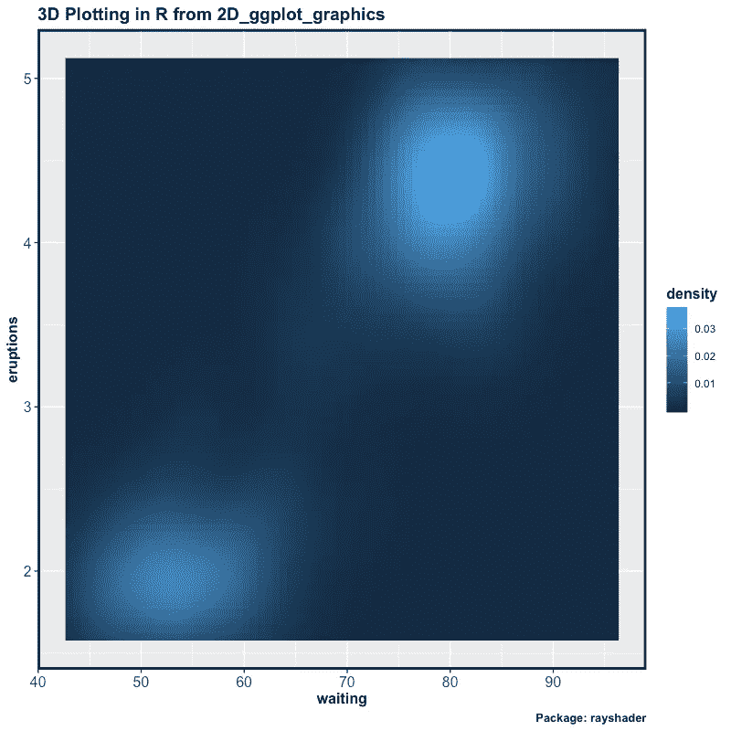
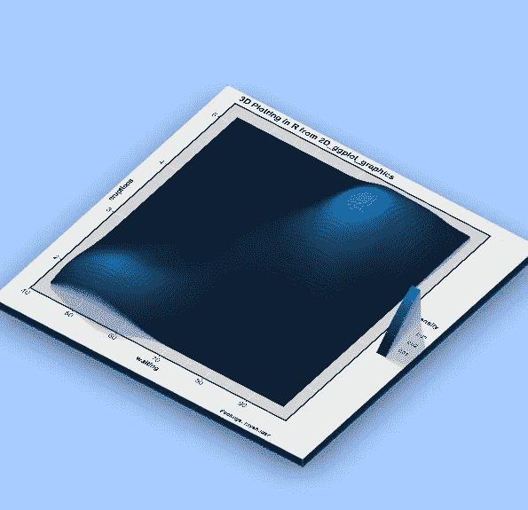
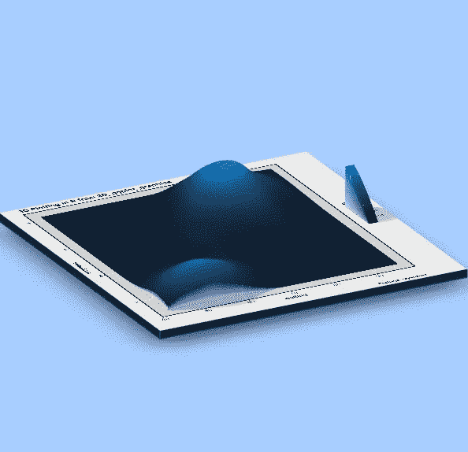
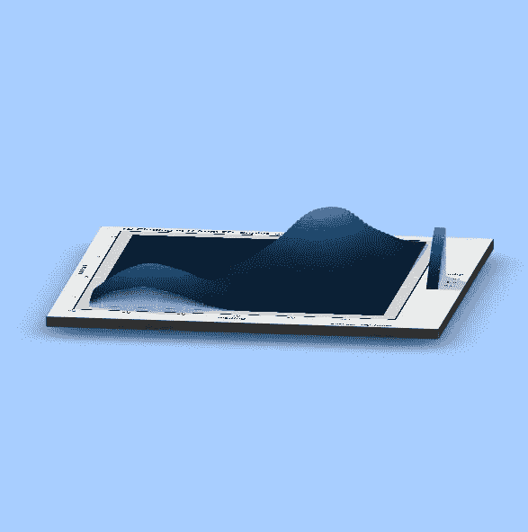

# 为了更好地讲故事，如何制作令人惊叹的 3D 情节？

> 原文：<https://towardsdatascience.com/how-to-make-stunning-3d-plots-for-better-storytelling-5c93aec80503?source=collection_archive---------15----------------------->



*在我们开始之前，这不是 2D 与 3D 图之间的战斗，也不是声称 3D 图优于 2D，因为它有一个额外的维度。事实上，我是那些试图避免给一个情节添加太多以至于情节失去其本身情节的人之一。但是有些情况下，你知道你可以通过使用 3D 情节更好地讲故事。这篇文章是为了帮助你在这些情况下！*

# [查看 78%的 DataCamp 折扣](https://datacamp.pxf.io/c/2888696/1240322/13294?u=https%3A%2F%2Fpromo.datacamp.com)


以正确的方式为正确的目的构建的 3D 图总是令人惊叹。在本文中，我们将看到如何使用`ggplot2`和`rayshader`用 R 制作令人惊叹的 3D 图。虽然`ggplot2`可能为数据科学领域的任何人所熟悉，但`rayshader`可能并不熟悉。那么，让我们先来简单介绍一下`rayshader`。

来自`[rayshader](https://github.com/tylermorganwall/rayshader):`的包装说明

> **rayshader** 是一个开源包，用于在 R 中生成 2D 和 3D 数据可视化。 **rayshader** 使用基本 R 矩阵中的高程数据以及光线跟踪、球形纹理映射、叠加和环境遮挡的组合来生成美丽的地形 2D 和 3D 地图。除了地图， **rayshader** 还允许用户将 **ggplot2** 对象转换成漂亮的 3D 数据可视化。

## 所需的库/包:

最新版本的`[rayshader](https://github.com/tylermorganwall/rayshader)`可从 [github](https://github.com/tylermorganwall/rayshader) 上获得，可以使用`devtools`或`remotes`安装。

```
devtools::install_github("tylermorganwall/rayshader")
```

并且，确保你已经获得了最新版本的`ggplot2`。如果你是一个爱潮流的人，那就买最新的吧。

```
install.packages('tidyverse')
```

## **数据**

为了保持这篇文章的最低要求，我们将使用`ggplot2`库中的一个内置数据集`faithfuld`。

```
> glimpse(faithfuld)
Observations: 5,625
Variables: 3
$ eruptions <dbl> 1.600000, 1.647297, 1.694595, 1.741…
$ waiting   <dbl> 43, 43, 43, 43, 43, 43, 43, 43, 43,…
$ density   <dbl> 0.003216159, 0.003835375, 0.0044355…
```

如你所见，`faithfuld`有 3 个连续变量，我们将用它们来绘图。

## 2D 图

我们的 3D 绘图之旅从普通的 2D ggplot2 绘图开始。我们将使用 geom_raster 在`waiting`、`eruptions`之间构建一个密度图，以查看数据情况。

```
faithful_dd <- ggplot(faithfuld, aes(waiting, eruptions)) +
  geom_raster(aes(fill = density)) +
  ggtitle("3D Plotting in R from 2D_ggplot_graphics") +
  labs(caption = "Package: rayshader") +
  theme(axis.text = element_text(size = 12),
        title = element_text(size = 12,face="bold"),
        panel.border= element_rect(size=2,color="black",fill=NA)) faithful_dd
```

正如你在上面的代码中看到的，随着情节的展开，我们对情节的外观做了一些美学上的改进



嗯，这很好，但这是我喜欢以 3D 形式显示一座小山的地块之一，事实上，是两座小山。因此，让我们推进到一个三维绘图。

## 从 2D 情节到 3D 情节的旅程——一条线！

从 2D 情节到 3D 情节的旅程，只是来自包`rayshader`的一行额外的代码。函数`plot_gg()` 采用一组参数来定义 3D 绘图的外观。

```
plot_gg(faithful_dd, multicore = TRUE, width = 8, height = 8, scale = 300, 
          zoom = 0.6, phi = 60,
          background = "#afceff",shadowcolor = "#3a4f70")
```

`faithful_dd`是我们在上一步中生成的 ggplot2 对象。因为大多数参数都是不言自明的，比如在渲染时激活计算机的所有内核。像`zoom`和`phi`这样的参数用于设置 3D 摄像机视图应该在哪里。

让我们来看看生成的图:



看起来是不是很美？这些不仅仅是惊人的，而且是有目的的。想象一下，你要解释梯度下降或一些优化算法，像这样更直观和自我解释，以获得一个心理模型。

# 还有一件事！

这个故事不仅仅以一个 3D 情节结束，但开发人员([泰勒·摩根-沃尔](https://twitter.com/tylermorganwall))非常友好地给了我们另一个功能`render_movie()`，它放置了一个相机，并围绕我们刚刚建立的 3D 情节旋转，给了我们一个令人惊叹的 3D 情节视频。`render_movie()`内部使用`av`包制作视频。

```
render_movie("faithful_3d.mp4", frames = 480)
```

## 摘要

感谢泰勒，现在我们可以从 2D ggplots 制作出令人惊叹的 3D 绘图——只需使用一个额外的函数`plot_gg()`最终甚至可以制作 360 度的 3D 绘图视频。在 R here 和 [rayshader](https://www.rayshader.com/) 文档中了解更多关于[数据可视化的信息。这里使用的代码和 sessionInfo 可在](https://www.datacamp.com/courses/introduction-to-data-visualization-with-ggplot2?irclickid=V0FwRdyHGxyIW7HRYNWRwwwzUkG3PyzTCXti2k0&irgwc=1&utm_medium=affiliate&utm_source=impact&utm_campaign=2888696)这里[获得。](https://github.com/amrrs/blogpost_codes/blob/master/stunning_3d_plots.R)