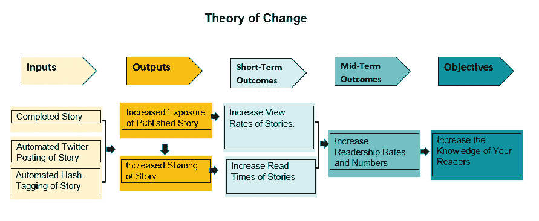

# 如何确保你的“好主意”奏效

> 原文：<https://towardsdatascience.com/how-to-make-sure-your-good-idea-works-200352b04729?source=collection_archive---------39----------------------->

我们如何保持“数据科学”中的“科学”？

Photo by [Gregory Jacquet](https://unsplash.com/@gregoryjacquet?utm_source=medium&utm_medium=referral) on [Unsplash](https://unsplash.com?utm_source=medium&utm_medium=referral)

这是很常见的事情。我们的高层领导参加完一个会议——上帝保佑，一个“异地战略会议”——回来后，满脑子都是改善组织的好主意和方向。等等…不要翻白眼，这些绝对可以增加价值，设定重要的视觉！

然而，以我的经验来看，这些新想法与公司以前的做法相比，有时是激进的。“不用担心。”我们想，“我们就做个试点研究吧！”

在你的一生中，你见过多少“飞行员”除了看他们是否真的可以建造，以及人们对他们有“积极的感觉”之外，从来没有被真正评估过？我们对此有一个术语，它是*概念验证*…而不是*试验*。

当我谈到评估时，我真正想让你想到的是测量新过程、项目或计划的输入、输出和结果的严格组合，以便与预先建立的基线和期望进行比较。度量可以是定量的，也可以是定性的(通常最好的评估是两者都是)。

将评估与 KPI 和绩效衡量区分开来的是规划评估的基础工作。理想情况下甚至在试点实施之前。

## 数据科学评估

我不是在谈论评估你的模型的准确性或潜在偏差，尽管这些都很重要。我想讨论一些我现在在行业中没有看到的东西:我们如何评估我们的数据科学项目的结果。

我们在数据科学中可能不会经常看到这种情况，因为它在组织的许多其他领域并不常见。

通常我们更关注“好主意”和“好主意”的实现，而不是关注我们如何测试这个主意的实际结果。我说的也不是产出，而是结果。如果你不知道这两者的区别，那么请继续阅读。

## 好吧，那我们怎么做？

第一步是非常清楚计划的预期目标和结果。你希望实现什么？这不仅仅是点击量、页面访问量或正确的面部识别匹配。结果就是为什么这些事情很重要…增加销售额，更高的回复率，更多的用户注册。

对结果有一个好的感觉，以及你如何相信你会实现它们，让你理解你的程序理论。程序理论是你的输入、输出和结果之间的因果联系。

它还确定了在评估过程中应该考虑的潜在子群和偶发事件，例如预期对计划有不同行为或反应的特定子群，这些子群需要以不同的方式进行评估和比较。当你决定如何度量它们时，它还会让你反思并测试你对程序理论步骤和因果关系的理解。

例如，让我们来看一个试点项目，它自动将你的新媒体故事的链接发送到带有多个标签的 twitter。在这个例子中，你寻求的结果是你的媒介故事的额外阅读和阅读时间。然而，该计划的目标(我希望)是创造一个更有见识的读者群。

试点项目的产出实际上可能是文章浏览量的增加，你的故事链接的推荐量的增加，以及关于你的故事的 twitter 流量的增加。输入内容显然是你的故事，以及自动发布和散列标签。

理解了你的程序变化理论，你就可以开始识别可能有不同反应的子群。你有没有那些只关注 Twitter 的读者，他们的反应与那些关注你或以不同方式看到你的文章的读者不同？

## 如何设计一个好的评估:

*   收集主题的背景信息——包括对因果理论和其他实验的研究。
*   评估可用数据源的相关性和质量。你能获得有效和准确的数据，并允许你回答程序理论所确定的问题吗？
*   如果对上述问题的回答是否定的，那么必须有一个用于评估的原始数据获取计划。这个*应该*作为你项目设计的一部分来完成，但也可以在事后完成。
*   必须根据评估的目标和试图回答的问题来选择评估标准。
*   如果由于种种限制，不能对整个群体进行研究，那么选择一个观察样本是很重要的。注意此阶段[外部有效性](/data-science-knowledge-will-that-pilot-work-at-scale-32244e8bfab5)的风险。
*   这有点“元”，但是对数据收集和分析进行试点测试，以确保在纸上看起来可行的东西可以在野外进行。当新的数据收集很昂贵时，这一点很重要。

## 两种主要类型的评价:形成性和终结性

现在著名的比喻是厨师做汤。形成性评价是她一边准备汤一边品尝，终结性评价来自客人吃完汤之后。

这里的主要观点是，形成性评估关注于实施，因此评估的目标是评估项目对需求和政策的遵守情况，并测试它们实施的有效性。形成性评价侧重于评价输入和输出。

总结性评估关注的是结果以及你在哪里实现了项目的目标。这通常需要更长的时间，并且更加难以识别和收集必要的数据。[内部有效性](/internal-validity-in-data-science-c44c1a2f194f)及其面临的风险在此阶段应予以密切关注。

## 评估的目的——形成性

"该计划正在按计划实施吗？"这里用作评估结果的基线是计划的预期或所需的特性。这些通常可以在法律、法规、政策和程序指南、合同或其他说明中找到。

这些还包括可行性或管理问题，这些问题在早期阶段(通常)识别挑战、问题或顾虑，可以解决这些问题以更好地使计划按预期实现。

明确地说，你可以进行形成性评价而不进行终结性评价，但是如果不首先进行形成性评价，你就不能进行有效的终结性评价。

这是因为你需要知道该计划是按计划实施的，以便测试它是否产生了预期的结果。在我们的例子中，如果程序没有准确地添加想要的散列标签，那么你真的不知道你的项目是否能够增加读者群，或者最终它是否能够增加你的读者的知识。

如果是这种情况，评估可以侧重于未能按照要求实施的原因，如是否缺乏资源、知识/能力、参与者目标错误或未能设定适当的基准。

可以解决目标人群与实际人群的早期迹象，包括调查为什么这些可能不同。可以根据项目需求对挑战和障碍进行识别、分类和变更。

## 评估的目的—总结性的

"项目是否产生了预期的结果和目标？"，或者更常见的是，“为什么计划没有达到预期的结果？”问题是通过总结性评价来看的吗？

重复我们之前讨论的内容，在这个阶段要认识到你的数据来源和收集方法。通常，你现有的数据不足以衡量这些目标。太多的组织在这一阶段失败了，相反，他们决定只度量什么是可用的，因此从来没有真正了解他们的项目是否成功。

在我们的例子中，媒介为我们提供了一些关于结果的信息，但不是全部。当我们想出如何衡量我们的目标时，我们必须有创造性。也许我们会要求我们的读者做一个跟踪调查或小测验来衡量通过我们的文章获得的知识。

## **评估设计的最后一个关注点——你的受众**

还有一个要记住的重要因素，当你的团队需要设计和实施科学合理的评估时，你也需要考虑你的观众的需求和期望的目标。

在大多数情况下，这主要是您的组织的领导。确保你的评估设计符合他们对项目目标和成功的理解。获得他们的共同理解和认同对于进行有效的评估至关重要，对于根据形成性评估和总结性评估的结果做出任何必要的修正也是如此。

**如何做到这一点的一些提示:**

(1) **平衡及时性&相关性** —确保评估彻底并能够评估结果/目标，但又足够及时以保持利益相关方参与并允许他们做出必要的更改来纠正实施中的问题。

弥合这一差距有助于关键员工理解变化或行动如何影响计划的实施，而不会因为反馈滞后而过度纠正。

(2) **关于事物如何运作的假设** —这是一个困难的认知问题，需要所有利益相关者解决，包括评估者。如果人们认为他们已经完全理解了一些东西，他们就很难接受甚至理解与他们的信念不符的信息。

意识到这一点并找出对策是很重要的。例如，让项目人员和领导参与确定项目理论可以帮助突出这些假设，但让他们基于反事实创造替代理论可以使他们在数据需要时以不同的方式解释事情。

(3) **防御惯例和情绪反应**——是帮助我们保护我们坚定信念的行动，例如设计允许单方面控制的情境或反驳不一致的信息。这些防御行为之所以会发生，是因为我们做出了跳跃性的推理，让我们能够过滤掉与我们的信念相冲突的不一致的信息。

我们从事基于假设的行为，在这种行为中，我们与他人的交流是基于将我们的信念投射到他们身上，这阻碍了我们真正理解他们在说什么的能力。意识到这些潜在的陷阱在评估中是有用的，理解信息和对立观点的不适是一面旗帜，应该提醒我们质疑自己的假设和信念。

最后，这听起来很难。但是，让你的数据科学团队成员了解所涉及的方法问题，可以确保你的团队真正实现他们设定的目标。不进行这些评估的代价总是大于不进行评估的代价。