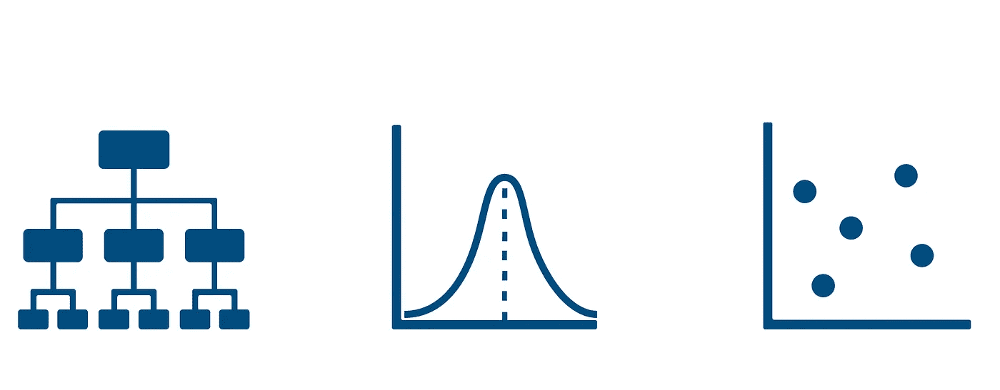

# 如何充分利用您的第一次数据科学训练营

> 原文：<https://towardsdatascience.com/how-to-make-the-most-of-your-first-data-science-bootcamp-8c12653a7a48?source=collection_archive---------11----------------------->

## 一切都归结于准备、时间管理和对唯一重要目标的不懈关注——为工作做好准备。

数据科学训练营继续吸引着稳定的职业生涯中期的专业人士和学生，尽管[正在就此类课程的质量和实用性进行辩论](https://www.quora.com/Why-are-there-so-many-fake-data-scientists-and-machine-learning-engineers)。

自从 5 月底在 General Assembly 完成为期 12 周的数据科学课程后，许多朋友和前同事问我这样的训练营是否值得参加。

坦率地说，直接回答这个问题是不可能的，因为有太多的个人因素在起作用。

你的年龄、经济状况、家庭状况和职业道路都在这个决定中起着关键作用。试图建立一个支持或反对参加训练营的普遍案例是徒劳的。

例如，如果你像我一样 45 岁左右，训练营是唯一可行的选择。大学或理工学院的冗长课程是不现实的，因为当你毕业时，你已经接近或超过 50 岁了。

如果你还在考虑是否报名，我唯一的建议是研究训练营的导师，而不是担心选择哪所学校。一个好的教练会让**变得与众不同。如果组织者软弱或不感兴趣，一所外表华丽的学校就没有多大意义。**

对于那些已经报名或决定加入数据科学营地的人，这里是我关于如何充分利用它的实地笔记。

# #1:提前准备

在训练营中，你可能犯的第一个也是最致命的错误就是认为你可以把严肃的学习留到课程开始的时候。你不能，因为训练营的重点是课程，而不是学生。

坦白地说，大多数训练营的主题数量之多令人疯狂，只有几天时间专注于核心领域，如统计学、熊猫和可视化图书馆。如果你落后了，教练不能也不会放慢速度。如果你已经在前几周落后了功课，你很可能永远也赶不上了。

那么应该提前做多少准备呢？这取决于你的教育和工作背景，以及你对自己的诚实程度。

首先，我建议你在留出课前准备的时间时，考虑几个月，而不是几周。

我花了大约 5 个月的时间准备我的课程，期间我参加了 Codecademy 和 Data Quest 的在线课程，并在导师的指导下学习。五个月的时间听起来可能有点多余，但是如果你像我一样没有编码背景，那么坦白地说，五个月的时间并不足以从头开始讨论关键主题。

当我在 2019 年 3 月开始上课时，我已经完成了一个简单的、自我分配的关于新加坡天气模式的分类项目。但即使在那时，每天都要努力跟上课堂的紧张节奏。如果我没有花几个月的时间自己复习基础知识，这将是一场彻底的灾难。

部分问题源于这样一个事实，即大多数学生期待传统的课堂体验，并且不熟悉训练营的运作方式。所以当课程以每小时 100 英里的速度向前推进时，每个人都震惊了。

根据我所看到的，训练营根本不适合教你基础知识。相反，它们被设计来加速你在自己的时间里已经在做的事情。

从这个角度来看，做好充分准备并不是像我们在新加坡所说的“怕输”。相反，它是关于确保你在你的学习旅程中得到最大可能的推动。

# #2:抑制你的(过度)热情

信不信由你，你会遇到一些同学，他们认为在已经塞得满满的课程之外钻研深度学习是个好主意。如果你是个天才，那就想尽一切办法去做吧。但是如果你像我一样是一个经常学习的人，不要屈服于“害怕错过”，或者他们所说的 [FOMO](https://en.wikipedia.org/wiki/Fear_of_missing_out) 。

原因虽然显而易见，但对于过于热情的学生来说并不总是显而易见的——学好基础知识已经够难了。

数据科学本质上是多学科的。你可能擅长编码或统计，但你不太可能同样擅长解决业务问题、为普通读者可视化数据或向不安的观众清楚地展示你的工作。

专注于拓展训练营试图传授的技能范围，而不是渴望那些没有传授的技能。这就是课程结束后你剩下的时间要做的事情。

对抗 FOMO 浪潮的最有效的现实检验之一是定期阅读入门级数据科学职位的招聘信息。一两周之后，你会注意到，与深度学习相关的所有东西在网上的热度，与雇主(至少是新加坡的雇主)在入门级员工中寻找的东西——SQL、数据清理、可视化技能和基本的机器学习知识——之间存在明显的脱节。

当然，拥有一些关于深度学习发展的对话级知识是很好的。但是不要贪多嚼不烂，除非你打算 12 周不睡觉。

# #3:时间管理

Time, like traffic in some parts of the world, is relative.

上面这幅半开玩笑的插图是为了取笑行人如何处理越南混乱的交通。但这也是对训练营开始后一些学生扭曲的时间观念的准确描述。

训练营的时间会比你想象的要快，12 周左右的时间并不能转化为学习自然语言处理等沉重话题的大量时间。你还必须完成几项主要作业，包括课程结束时的一个展示项目。

然而，有些人会陷入自以为还有时间的陷阱，而事实上他们没有。

对于展示项目来说，时间的缺乏成为一个特别大的问题，它需要比通常留出的两周时间更多的时间来研究、计划和执行。如果你最初的想法失败了，留给 B 计划的时间也很少。

在训练营开始时，你的导师会尽职尽责地告诉全班同学，他们应该为他们的最终项目提出一两个想法，并开始研究如何获得项目所需的数据。

除了认真对待这些建议并付诸行动，我想不出更好的方法让你在训练营期间生活得更轻松。

我从一开始就知道我想为我的展示项目做什么。许多繁重的工作，如 T2 的清理、清理和格式化成千上万的推文，被分散到训练营的前几周。当项目主题——关于 Twitter 上国家支持的虚假信息运动——被批准时，我已经准备好了数据和项目大纲。

在训练营期间将你的项目管理技能付诸实践。这都是关于管理潜在失败的风险，给自己足够的缓冲来应对意外事件——如果你在第 10 周开始你的最终项目，你就不会有这些了。

# #4 工作就绪

在我参加的训练营，没有考试，也没有毕业时要公布的最终成绩。相反，学校的重点是帮助学生在毕业三个月后找到一份工作——这很适合我们大多数人。

但是你会惊讶地发现，一旦每天枯燥的讲座/实践/项目开始了，就很容易忘记这个至关重要的最终目标。

当你的求职进入高潮，你正在回顾你的项目(在整个课程中你可能会被分配到其中的 3 到 4 个)，看看你可以向潜在的雇主展示什么作为你的技能和知识的例子时，这一点变得非常突出。

您可能会对第二轮在 Github repo 中发现的内容感到震惊。在绞尽脑汁、辛辛苦苦地完成一个家庭或工资价格预测项目后，很自然地会想把笔记本扔到 Github 上，然后继续前进。

这的确是一种宣泄，但也是有代价的。

作为一个在数据科学行业没有正式工作经验的人，这些不同的项目工作是你在求职面试中可以展示你的就业能力的少数几件事情之一(除了你的其他书面资格)。

虽然期末(或顶点)项目被宣传为你能力的主要展示品，但对于那些希望看到你更多作品的要求更高的雇主来说，这可能还不够。

我的建议是:认真对待较小的项目，把它们当作你可以在未来的工作面试中使用或重新包装成“工作样本”的东西。这可能涉及到构建一个简单的 web 应用程序，该应用程序利用了您已经构建的机器学习模型。或者你可以通过 Tableau 这样的平台巩固和提高你的数据可视化成果。

毫无疑问，当你在与大量的课程材料作斗争的时候，很难去想那么远。但长期回报是值得的。我当然希望我从一开始就这样对待我的项目工作。

至少，确保你的 repos 和 Github 账户组织有序，每件作品都有清晰的描述。

如果你告诉自己，在训练营结束后，你会清理混乱的回购或重构代码，你可以相当肯定这永远不会发生。从一开始就做好这件事，你就可以省去一大堆的悲伤。

我对训练营的经历有疑虑吗？毫无疑问。但那是以后的事了。

就像他们说的，与其生气地回头看，不如向前看。如果您有具体的疑问，请随时通过以下渠道联系:

领英:[https://www.linkedin.com/in/chuachinhon/](https://www.linkedin.com/in/chuachinhon/)

推特: [@chinhon](https://twitter.com/chinhon?lang=en)