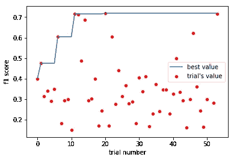
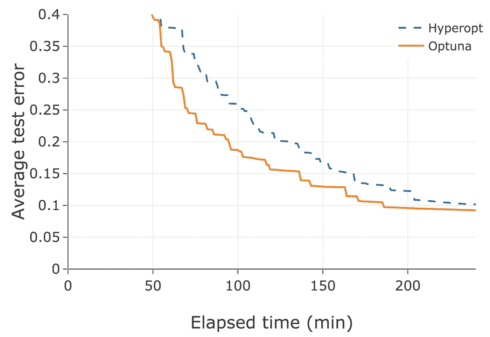
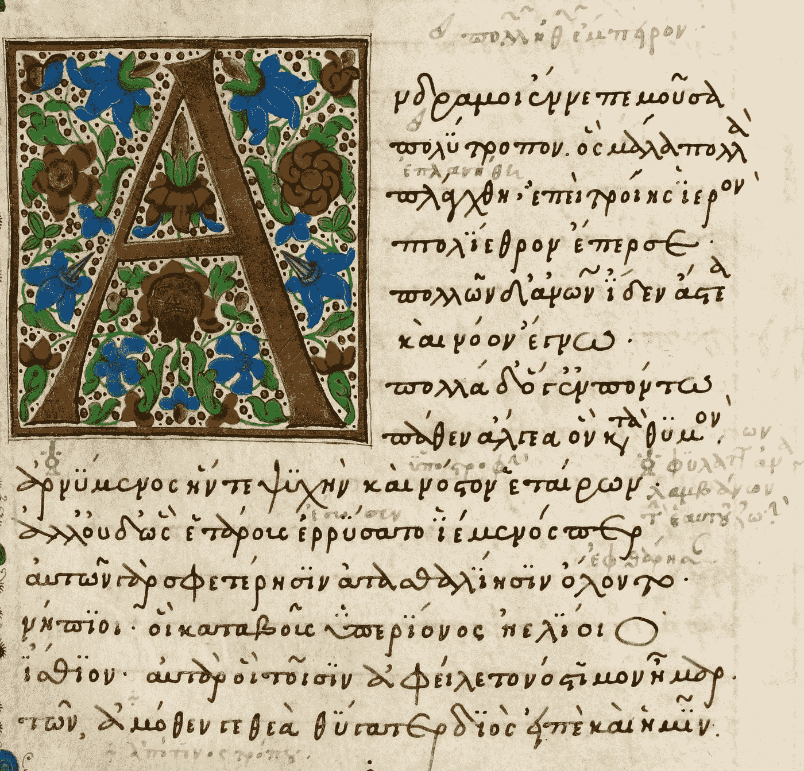

# 如何用 Optuna 让你的模型牛逼

> 原文：<https://towardsdatascience.com/how-to-make-your-model-awesome-with-optuna-b56d490368af?source=collection_archive---------7----------------------->

Odysseus and the Sirens [source](https://en.wikipedia.org/wiki/Odyssey#/media/File:Mosa%C3%AFque_d%27Ulysse_et_les_sir%C3%A8nes.jpg)

## 轻松高效地优化模型的超参数

超参数优化是训练机器学习模型的关键步骤之一。由于要优化的参数很多，训练时间长，并且要多次折叠以限制信息泄漏，这可能是一项繁琐的工作。处理这个问题有几种方法:网格搜索、随机搜索和贝叶斯方法。 **Optuna** 是后一种的实现。

**Will Koehrsen** 写了一篇关于使用贝叶斯代理模型进行超参数优化的优秀文章。我也解释不清楚了:)你可以在这里找到[。在第二篇](/a-conceptual-explanation-of-bayesian-model-based-hyperparameter-optimization-for-machine-learning-b8172278050f)[文章](/automated-machine-learning-hyperparameter-tuning-in-python-dfda59b72f8a)中，Will 将介绍如何用 Python 中的**hyperpt**包实现该方法。

# 关于 Optuna

这个软件包过去是，现在仍然是，由日本人工智能公司 **Preferred Networks** 开发的。在很多方面，Optuna 与 Hyperopt 相似。所以你为什么要烦恼呢？有几个原因:

*   可以指定优化过程应该持续多长时间
*   与 Pandas 数据框架集成
*   该算法使用剪枝来尽早丢弃低质量的试验
*   这是一个相对较新的项目，开发人员还在继续工作
*   它比远视更容易使用(至少对我来说)

# 示例演练

Jason and the Argonauts [source](https://onemysteryless.files.wordpress.com/2011/05/argonauts.jpg)

## 数据

我使用了来自 Scikit-Learn 的 20 个新闻组数据集来准备实验。您可以在下面找到数据导入:

## 模型

这是一个自然语言处理问题，模型的管道包含一个特征提取步骤和一个分类器。管道的代码如下所示:

## 优化研究

*The School of Athens* by Raphael [source](https://en.wikipedia.org/wiki/Ancient_Greek_philosophy#/media/File:%22The_School_of_Athens%22_by_Raffaello_Sanzio_da_Urbino.jpg)

创建的研究优化了矢量化步骤和模型超参数。可以从 5 个发行版中选择:

*   统一-浮点值
*   对数均匀-浮点值
*   离散统一-有间隔的浮点值
*   整数-整数值
*   分类-列表中的分类值

语法如下所示:

然后，这些值被传递到参数字典，并在以后设置为优化模型。这些值可以在字典中给出，但是这会使代码行变得很长，很难阅读。

定义函数的最后一步实际上是定义**目标**。它应该只返回一个值。强烈建议根据**交叉验证**(如有可能，分层)对模型进行评分，并给出较高的折叠数(绝对最小值为 8)。

请记住，截至 2019 年 2 月 24 日，只可能**最小化**函数值。最大化目标还没有实现，所以如果你想找到最高值，只需在它前面加一个减号。

我还添加了一行代码，将研究结果转储到 pickle 文件中。它允许你保持进度，即使这个过程由于某种原因被中断(因为你的决定或者你的机器的决定)。您可以在下面找到目标代码:

要创建研究的实例，您可以创建一个新实例，也可以从 pickle 文件中加载它以继续之前的实验。第二步是进行研究。您可以在以秒为单位的**试验次数** (n_trials)或**(T5)(超时)中指定研究持续的时间。后者的最后一次试验在暂停前开始，整个研究持续的时间比指定的时间长一点。您可以在下面找到代码和默认输出。**

请注意，目前显示的是最佳超参数。

您可以分别使用 **best_value** 和 **best_params** 属性访问最佳指标的值和最佳参数字典。您可以使用 trials 属性访问试用版，但是 Optuna creators 准备了更好的东西。**使用 trials_dataframe()方法创建一个包含试验详情的熊猫数据框架。**

研究结束后，您可以为模型设置最佳参数，并在完整数据集上对其进行训练。

为了可视化正在进行的过程，您可以从另一个 Python 线程(即 Jupyter Notebook)访问 pickle 文件。

Ongoing study’s progress. *Image by author*

您可以在这个 GitHub [资源库](https://github.com/PiotrekGa/optuna_article)中找到示例笔记本和可视化笔记本。

# 修剪技术

A man pruning olives [source](https://i-h1.pinimg.com/474x/0b/5e/44/0b5e442a2e161cfa07c80119626cc940--mediterranean-art-classical-antiquity.jpg)

Optuna 的创造者表示，该软件包在速度和质量方面优于 Hyperopt。以下是他们在项目网页上写的内容:

> 修剪功能会在训练的早期阶段自动停止没有希望的试验(也称为自动提前停止)。Optuna 提供了在迭代训练算法中简洁地实现剪枝机制的接口。
> 
> […]
> 
> 例如，与现有的优化框架相比，我们的基准实验展示了修剪特性的优势。

[https://optuna.org/assets/img/Pruning_of_unpromising_trials.png](https://optuna.org/assets/img/Pruning_of_unpromising_trials.png)

我不得不说，就修剪机制而言，我有一些复杂的感觉。我坚信，在超参数优化方面，多重交叉验证技术是必不可少的。在 Optuna 的开发人员在每次试验中提供的剪枝示例中，对验证集进行了采样。在我看来，它**增加了度量的方差**，因此使得**优化不那么可靠**。如果验证集是常量，它将导致代理的模型**过度拟合**到验证集。当然，如果数据集很大，以防止方差/过拟合问题发生，这可能不是一个问题。

在我看来，最好的选择是以某种方式将交叉验证和修剪结合起来。也许在 k 次折叠(k 小于折叠总数)后验证试验是个好主意？

# 摘要

对于我来说， **Optuna 成为首选优化框架**。它易于使用，可以设置研究的超时，休息后继续研究，并轻松访问数据。该项目仍在开发中，我期待着新的功能。我认为首选网络团队过去和现在都做得很好！谢谢大家！

# 资源:

*Odyssey* [*source*](https://upload.wikimedia.org/wikipedia/commons/1/1a/Odyssey-crop.jpg)

*   *项目网址:*[https://optuna.org/](https://optuna.org/)
*   *项目的 GitHub 库:*[https://github.com/pfnet/optuna](https://github.com/pfnet/optuna)
*   *示例笔记本:*[https://github.com/PiotrekGa/optuna_article](https://github.com/PiotrekGa/optuna_article)
*   *机器学习的贝叶斯超参数优化概念解释:*[https://towardsdatascience . com/A-Conceptual-explain-of-Bayesian-model-based-super parameter-Optimization-for-Machine-Learning-b 8172278050 f](/a-conceptual-explanation-of-bayesian-model-based-hyperparameter-optimization-for-machine-learning-b8172278050f)
*   *Python 中的自动机器学习超参数调优:*[https://towardsdatascience . com/Automated-Machine-Learning-Hyperparameter-Tuning-in-Python-dfda 59 b 72 f 8 a](/automated-machine-learning-hyperparameter-tuning-in-python-dfda59b72f8a)

非常欢迎您对这篇文章的反馈！请让我知道你的想法！