# 如何自制深度学习加速器芯片！

> 原文：<https://towardsdatascience.com/how-to-make-your-own-deep-learning-accelerator-chip-1ff69b78ece4?source=collection_archive---------1----------------------->

目前，全球有超过 100 家公司正在构建面向深度学习应用的 ASICs(专用集成电路)或 SOC(片上系统)。这里有一长串的公司。除了谷歌(TPU)、脸书、亚马逊([推理](https://aws.amazon.com/machine-learning/inferentia/))、[特斯拉](https://techcrunch.com/2019/04/22/tesla-vaunts-creation-of-the-best-chip-in-the-world-for-self-driving/)等这些创业大公司都在开发定制的 ASIC，用于深度学习训练和推理。这些可以分为两种类型—

1.  训练和推理——这些 ASIC 设计用于处理深度神经网络的训练和执行推理。训练像 Resnet-50 这样的大型神经网络是一项涉及梯度下降和反向传播的更加计算密集型的任务。与训练相比，推理非常简单，需要较少的计算。今天最流行的深度学习的 NVidia GPU 既可以做训练，也可以做推理。其他一些例子还有 [Graphcore IPU](https://www.graphcore.ai/technology) 、[谷歌 TPU V3](https://cloud.google.com/tpu/) 、[脑波强化器](https://www.cerebras.net/wafer-scale-deep-learning-hot-chips-2019-presentation/)等。OpenAI 有很棒的[分析](https://openai.com/blog/ai-and-compute/)显示最近训练大型网络所需的计算增加。
2.  推论——这些 ASIC 被设计为运行 DNN(深度神经网络),这些网络已经在 GPU 或其他 ASIC 上进行过训练，然后经过训练的网络被修改(量化、修剪等)以在不同的 ASIC 上运行(如谷歌珊瑚边缘 TPU、英伟达杰特森纳米)。大多数人都说深度学习推理的[市场](https://www.mckinsey.com/~/media/McKinsey/Industries/Semiconductors/Our%20Insights/Artificial%20intelligence%20hardware%20New%20opportunities%20for%20semiconductor%20companies/Artificial-intelligence-hardware.ashx)比训练大得多。如 [TensorFlow Lite](https://www.tensorflow.org/lite) 团队所示，即使是基于 ARM Cortex 的非常小的微控制器(MCU)——M0、M3、M4 等也可以进行推理。

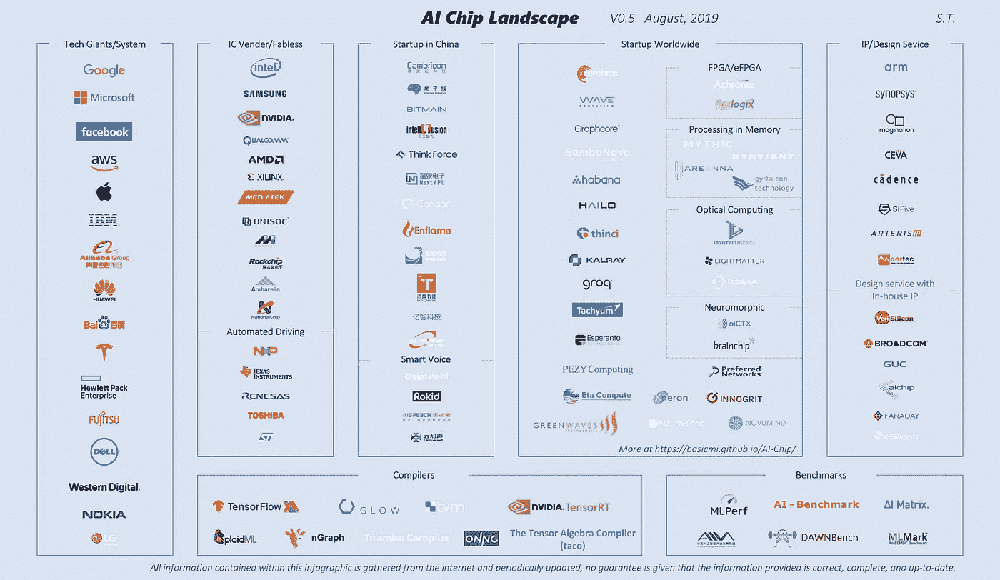

AI Landscape by Shan Tang : [Source](https://github.com/basicmi/AI-Chip)

制造任何芯片(ASIC、SOC 等)都是一个昂贵、困难和漫长的过程，通常由 10 到 1000 人的团队完成，具体取决于芯片的大小和复杂程度。这里我只提供一个针对深度学习 ***推理*** 加速器的简要概述。如果你已经设计了芯片，你会发现这太简单了。如果你仍然感兴趣，请继续阅读！如果你喜欢它，分享和👏。

# **现有 ASIC 的架构**

让我们首先来看看目前正在开发的一些加速器的高层架构。

[**Habana Goya**](https://habana.ai/inference/)—[Habana labs](https://habana.ai/)是一家初创公司，正在开发用于训练的独立芯片——高迪和推理——Goya。

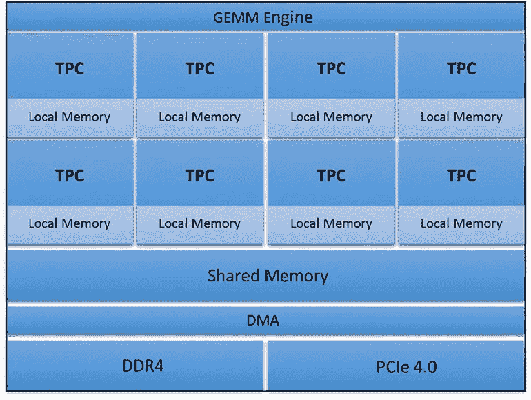

Habana Goya High-Level Architecture: [Source](https://www.electronicdesign.com/industrial-automation/habana-enters-machine-learning-derby-goya-platform)

GEMM 引擎——通用矩阵和乘法引擎。矩阵乘法是所有 DNN 中的核心运算——卷积可以表示为矩阵乘法，全连接层是直接的矩阵乘法。

TPC——张量处理核心——这是一个实际执行乘法或乘加(MAC)运算的模块。

本地内存和共享内存—这些都是某种形式的高速缓存，通常使用 [SRAM](https://en.wikipedia.org/wiki/Static_random-access_memory) (静态随机存取存储器)和[寄存器文件](https://en.wikipedia.org/wiki/Register_file)(也是一种静态易失性存储器，只是密度比 SRAM 小)。

[**Eyeriss**](http://eyeriss.mit.edu/)**——来自麻省理工学院的 eye riss 团队一直在研究深度学习推理加速器，并发表了几篇关于他们的两个芯片的论文，即 Eyeriss V1 和 [V2](http://www.rle.mit.edu/eems/wp-content/uploads/2019/04/2019_jetcas_eyerissv2.pdf) 。你可以在这里找到好的教程[。](http://eyeriss.mit.edu/tutorial.html)**

**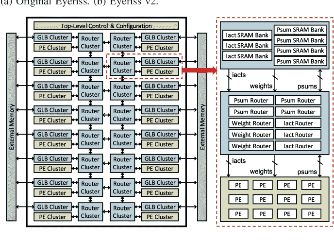**

**Eyeriss V2 top-level architecture: [Source](https://www.semanticscholar.org/paper/Eyeriss-v2%3A-A-Flexible-Accelerator-for-Emerging-on-Chen-Yang/0682bfa5cca15726aab6c00ecfac91eb44379626)**

**[**英伟达深度学习加速器(NVDLA)**](http://nvdla.org/)**

**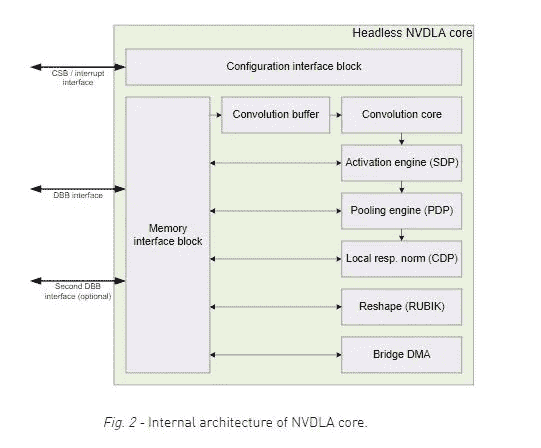**

**NVDLA : [Source](http://nvdla.org/primer.html)**

**[**数据流架构**](https://en.wikipedia.org/wiki/Dataflow_architecture) —数据流架构至少从 20 世纪 70 年代就开始研究了。 [Wave Computing](https://wavecomp.ai/) 想出了[数据流处理单元](https://www.hotchips.org/wp-content/uploads/hc_archives/hc29/HC29.22-Tuesday-Pub/HC29.22.60-NeuralNet1-Pub/HC29.22.610-Dataflow-Deep-Nicol-Wave-07012017.pdf) (DPU)来加速 DNN 的训练。 [Hailo](https://www.hailo.ai/) 也使用了某种形式的[数据流架构](https://www.slideshare.net/embeddedvision/emerging-processor-architectures-for-deep-learning-options-and-tradeoffs-a-presentation-from-hailo)。**

**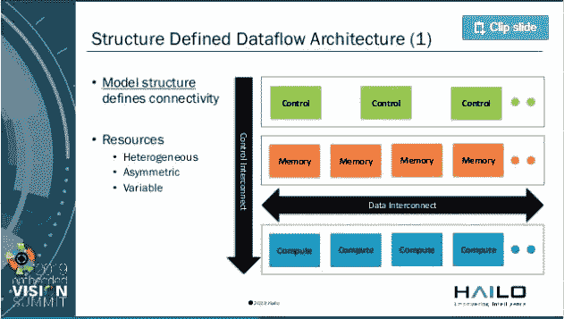**

**Hailo — Embedded Vision Summit — [Source](https://www.slideshare.net/embeddedvision/emerging-processor-architectures-for-deep-learning-options-and-tradeoffs-a-presentation-from-hailo)**

**[Gyrfalcon](https://www.gyrfalcontech.ai/) —他们已经发布了一些针对低功耗边缘人工智能应用的芯片，如 [Lightspeeur 2801S](https://www.gyrfalcontech.ai/solutions/2801s/) 。**

**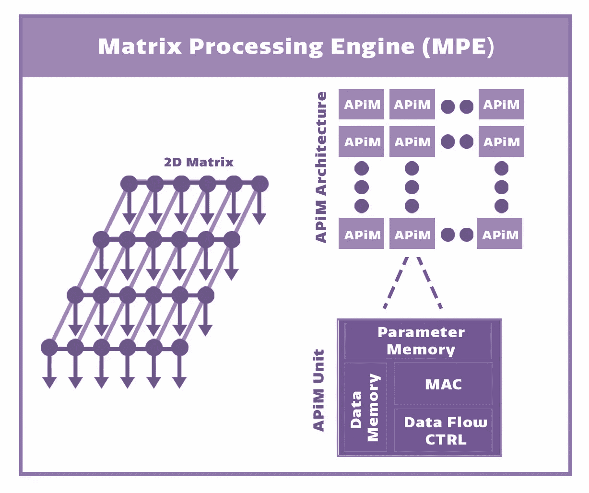**

**Matrix Processing Engine (MPE) — [Source](https://www.gyrfalcontech.ai/about-us/company-overview/)**

**[**谷歌 TPU**](https://cloud.google.com/blog/products/gcp/an-in-depth-look-at-googles-first-tensor-processing-unit-tpu) 也有脉动数据流引擎。**

**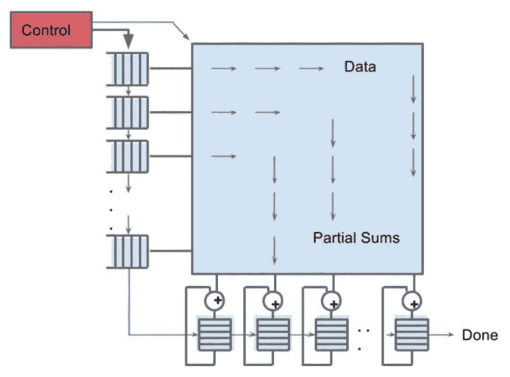**

**Matrix Multiplier on TPU — [Source](https://cloud.google.com/blog/products/gcp/an-in-depth-look-at-googles-first-tensor-processing-unit-tpu)**

****

**TPU Floor plan — [Source](https://cloud.google.com/blog/products/gcp/an-in-depth-look-at-googles-first-tensor-processing-unit-tpu)**

**统一缓冲区—这基本上是本地内存/缓存，可能使用 SRAM 实现。**

**DRAM —这些是访问外部 DRAM 的接口，使用其中两个接口，您可以访问两倍的数据。**

****关键模块****

**基于上面的一些例子，我们可以说下面是制造深度学习推理加速器所需的关键组件。此外，我们将只关注 [8 位推理](https://www.tensorflow.org/lite/performance/post_training_quantization)引擎，该引擎已被证明对许多应用足够好。**

**矩阵乘法单元——它有不同的名称，如 TPC(张量处理核心)、PE 等。GEMM 参与了 DNN 的核心计算，要了解更多关于 GEMM 阅读这篇[伟大的帖子](https://petewarden.com/2015/04/20/why-gemm-is-at-the-heart-of-deep-learning/)。**

**SRAM —这是用于存储权重或中间输出/激活的本地存储器。**

**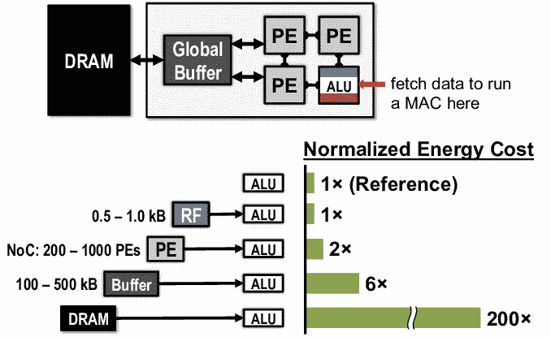**

**Data movement Energy Vs Compute — Source — [Efficient Processing of Deep Neural Networks: A Tutorial and Survey](https://arxiv.org/abs/1703.09039)**

**为了减少能量消耗，存储器应该尽可能靠近处理单元，并且应该尽可能少地被访问。**

**互连/结构—这是连接所有不同处理单元和内存的逻辑，以便一个层或模块的输出可以传输到下一个模块。也称为片上网络(NoC)。**

**接口(DDR、PCIE) —需要这些模块来连接外部内存(DRAM)和外部处理器。**

**控制器——这可以是 RISC-V 或 ARM 处理器或定制逻辑，用于控制所有其他模块和外部处理器并与之通信。**

****架构和指令集****

**如果我们观察所有架构，我们会发现内存总是尽可能靠近计算。原因是移动数据比计算消耗更多的能量。让我们来看看 [AlexNet 架构](https://papers.nips.cc/paper/4824-imagenet-classification-with-deep-convolutional-neural-networks.pdf)所涉及的计算和内存，它在 2012 年打破了 ImageNet 记录——**

**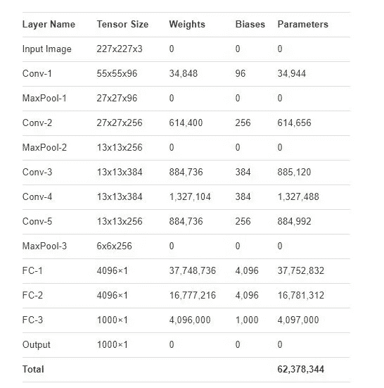**

**AlexNet Layers and Parameter — [Source](https://www.learnopencv.com/number-of-parameters-and-tensor-sizes-in-convolutional-neural-network/)**

**AlexNet 由 5 个构成层和 3 个全连接层组成。AlexNet 的参数/权重总数约为 6200 万。假设在[权重量化](https://www.tensorflow.org/lite/performance/post_training_quantization)之后，每个权重被存储为 8 位值，因此如果我们想要将所有权重保存在片内存储器中，则至少需要 62 MB 的 SRAM 或 62*8 兆位= 4.96 亿 SRAM 单元。如果我们使用 6T(六晶体管)SRAM 单元，仅存储器就需要 496M * 6 ~ 2.9 亿个晶体管。因此，在决定架构时，我们必须记住在不增加片外重量(这会增加功耗)的情况下，我们可以支持哪些 DNN 架构。由于这个原因，许多创业公司展示了使用更新的架构，如 [MobileNetV2](https://ai.googleblog.com/2018/04/mobilenetv2-next-generation-of-on.html) ，它使用更少的参数和更少的计算，例如，ImageNet 上前 5 名准确率为 92.5%的 MobileNetV2 的一个[检查点](https://github.com/tensorflow/models/tree/master/research/slim/nets/mobilenet)只有 6.06M 个参数，在单个图像推断期间执行 582M 次 MAC(乘和累加)操作。**

****

**Accuracy Vs Model Size — [Source](https://github.com/tensorflow/models/tree/master/research/slim/nets/mobilenet)**

**[权重修剪](https://www.tensorflow.org/model_optimization/guide/pruning)是另一种可以用来减少模型大小(从而减少内存占用)的技术。参见[模型压缩](https://community.cadence.com/cadence_blogs_8/b/breakfast-bytes/posts/ai-processing)的结果。**

**MobileNetV2 使用不同于传统卷积的深度方向可分离卷积，因此加速器架构必须足够灵活，以便如果研究人员提出不同的操作，它们仍然可以根据加速器上可用的指令集来表示。**

**我们可以为我们简单的加速器想出一套非常简单的指令，就像—**

1.  **加载数据—获取源地址和目标地址**
2.  **MAC(乘加)—假设数据已经在本地寄存器中。**
3.  **存储结果—存储中间结果**
4.  **填充—添加零**

****硬件加速器编译器****

**编译器将使用 PyTorch 或 Tensorflow 用 python 编写的高级代码转换为特定芯片的指令集。下面是开发/使用这些定制 ASIC 的一些框架。这个过程可能非常困难和复杂，因为不同的 ASIC 支持不同的指令集，如果编译器没有生成优化的代码，那么您可能没有充分利用 ASIC 的功能。**

**[脸书 Glow](https://github.com/pytorch/glow) —哈瓦那实验室[利用 Glow 框架为他们的 ASIC 开发了](https://engineering.fb.com/open-source/glow-habana/)后端。**

**[TVM](https://tvm.ai/) —这是一个开源的深度学习编译器堆栈，由华盛顿大学的研究人员发起。TVM 框架还包括[多功能张量加速器](https://tvm.ai/vta) (VTA)，这是一个可编程的独立加速器。[亚马逊 Sagemaker Neo](https://aws.amazon.com/sagemaker/neo/) 使用 TVM 编译深度学习模型，部署在不同的硬件上。**

**[TensorFlow MLIR](https://github.com/tensorflow/mlir)—[MLIR](https://medium.com/tensorflow/mlir-a-new-intermediate-representation-and-compiler-framework-beba999ed18d)是 Google 为 tensor flow 提供的编译器基础设施，最近已经成为 [LLVM](https://llvm.org/) 项目的[部分。](https://www.blog.google/technology/ai/mlir-accelerating-ai-open-source-infrastructure/)**

**[英特尔 ngraph](https://github.com/NervanaSystems/ngraph) —这是由 Nervana 开发的，用于 nerv ana/英特尔深度学习加速器。**

****EDA 工具和高级综合****

**Chisel 是一种硬件构造/描述语言，最初由伯克利的研究人员开发。它实际上是用 Scala 编写的，用于许多基于 RISC-V 的处理器的设计。**

**综合、时序和布局——RTL 综合是将 Verilog/VHDL 等语言编写的高级代码转换成逻辑门的过程。时序工具使用逻辑门和布线的布局前和布局后延迟信息来确保设计正确。在时序设计中，一切都与时钟沿有关，因此时序非常重要。布局工具从合成的网表生成布局。 [Synopsys](https://www.synopsys.com/implementation-and-signoff/rtl-synthesis-test.html) (设计编译器，黄金时间)和 Cadence 工具最常用于这些步骤。**

**[高级综合](https://en.wikipedia.org/wiki/High-level_synthesis)(HLS)——HLS 是指用 C/C++等高级语言描述硬件，然后转换成 VHDL/Verilog 等 RTL(寄存器传输级)语言的过程。甚至还有一个 python 包[http://www.myhdl.org/](http://www.myhdl.org/)——将 python 代码转换成 Verilog 或 VHDL。 [Cadence](https://www.cadence.com/content/cadence-www/global/en_US/home/tools/digital-design-and-signoff/synthesis/stratus-high-level-synthesis.html) 拥有支持 C/C++等的商业工具，这些工具对定制设计非常有帮助。Google 使用 Mentor Graphics Catapult HLS 工具开发了 [WebM 解压 IP](https://www.mentor.com/hls-lp/success/google-inc) 。**

****可用 IP****

**现在，我们已经确定了所需的关键模块，让我们看看我们使用什么现有的 IP(免费或付费)。**

**[Nvidia 深度学习加速器(NVDLA)](http://nvdla.org/) — NVDLA 是 Nvidia 发布的免费开放架构，用于深度学习推理加速器的设计。源代码、驱动程序、文档等可在 [GitHub](https://github.com/nvdla/) 上获得。**

**SRAM——不同类型的 SRAM IP——单端口、双端口、低功耗、高速等，可从 [Synopsys](https://www.synopsys.com/dw/ipdir.php?ds=dwc_sram_memory_compilers) 和其他公司获得。通常，它们提供 SRAM 编译器，用于根据芯片要求生成特定的 SRAM 模块。**

**寄存器文件—该 IP 也可从 [Synopsys](https://www.synopsys.com/dw/ipdir.php?ds=dwc_sram_memory_compilers) 和各种类型的逻辑[标准单元](https://www.synopsys.com/dw/ipdir.php?ds=dwc_standard_cell)获得。**

**互连/结构/NoC——这个 IP 的一个选项是 [Arteris](http://www.arteris.com/) ，他们有针对深度学习加速器的 [FlexNoC AI 包](http://www.arteris.com/flexnoc-ai-package)。**

**处理器——各种 [RISC-V](https://riscv.org/) 处理器内核可以免费获得。甚至 ARM 也免费或以非常低的前期成本向初创公司提供[许可](https://developer.arm.com/ip-products/designstart)。[ARM Ethos](https://developer.arm.com/ip-products/processors/machine-learning/arm-ethos-n/ethos-n77)npu 是专门为神经网络设计的——Ethos N37、N57、N77。**

**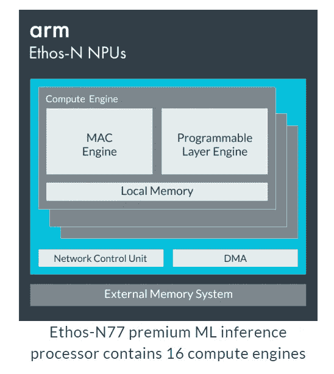**

**AMR Ethos NPU — [Source](https://developer.arm.com/ip-products/processors/machine-learning/arm-ethos-n/ethos-n77)**

**[Cadence Tensilica DNA 100](https://ip.cadence.com/ai)—根据我们的目标应用/行业，Cadence 提供的 IP 可配置为 0.5 至 100 的 TMAC 操作。**

**有很多其他可用的知识产权，所以我的建议是在设计自己的知识产权之前，从像 [ARM](https://www.arm.com/) 、 [Ceva](https://www.ceva-dsp.com/product/ceva-deep-neural-network-cdnn/) 、[恩智浦](https://www.nxp.com/products/product-information/ip-block-licensing/starcore-dsp:STARCORE-DSP)等公司寻找已经测试过的知识产权。**

****设计流程****

**有很多关于 ASIC 设计流程、数字设计过程等的[资源](https://en.wikipedia.org/wiki/Physical_design_(electronics))(书籍、讲座等)，所以我就不多讲了。**

**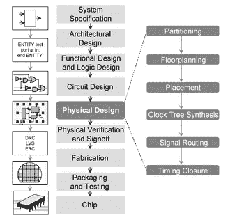**

**ASIC Flow from Wikipedia — [Source](https://en.wikipedia.org/wiki/Physical_design_(electronics))**

****代工厂和工艺技术****

**芯片的制造是在大型晶圆厂(制造厂或代工厂)完成的，目前，很少有公司像英特尔、三星、德州仪器、恩智浦等拥有自己的晶圆厂。甚至像高通、AMD 等大公司也使用外部代工厂，所有这样的公司都被称为无晶圆厂。以下是一些最大的半导体代工厂**

**TSMC(台积电) — TSMC 是世界上最大的代工厂，为高通、苹果等公司制造芯片。对于小型创业公司来说，在 TSMC 进行生产可能具有挑战性，因为他们的大部分生产能力都被大公司利用了。**

**[UMC(联合微电子公司)](http://www.umc.com/English/about/index.asp)——UMC 也与包括小型创业公司在内的大量客户合作。目前，UMC 可用的最小工艺是 14 纳米。**

**还有其他几家代工厂，如[全球代工厂](https://www.globalfoundries.com/)、[三星代工厂](https://www.samsungfoundry.com/foundry/identity/anonymous/ssoLogin.do)等**

****流程选择****

**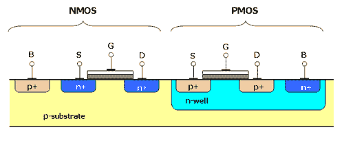**

**[Cross-section of two transistors in a CMOS gate, in an N-well CMOS process](https://en.wikipedia.org/wiki/CMOS)**

**IC 制造工艺是通过晶体管的尺寸和金属连接的宽度来衡量的。长期以来，工艺尺寸一直在下降([摩尔定律](https://en.wikipedia.org/wiki/Moore%27s_law))，这就是现代 IC 每年包含越来越多的晶体管(这曾经是由[摩尔定律](https://en.wikipedia.org/wiki/Moore%27s_law)决定的)。目前，最先进的工艺节点是 7 纳米，使用 7 纳米工艺的产品仅在 2019 年推出。所以目前大部分产品都是使用 14 纳米/16 纳米工艺制作的芯片。工艺越先进，成本就越高，因此大多数小型创业公司最初会使用稍微老一点的工艺来保持低成本。许多开发深度学习加速器的创业公司都在使用[28 纳米](http://www.umc.com/English/process/a.asp)处理器，在某些情况下，甚至是 40 纳米工艺。[泄漏](http://courses.ece.ubc.ca/579/579.lect6.leakagepower.08.pdf)是现代工艺中的一个大问题，如果芯片设计不当，可能会导致巨大的功耗。**

****简单成本估算****

**晶圆成本取决于工艺节点和各种其他因素，如加工步骤的数量(使用的层数)。成本从相对较老的工艺的几千美元到最新的工艺节点的几千美元不等，这很大程度上取决于一个人要购买多少晶片等等。**

**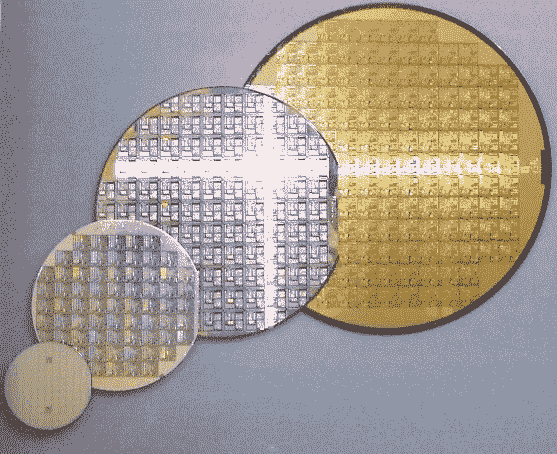**

**CMOS Wafer — [Source](https://en.wikipedia.org/wiki/Wafer_(electronics))**

**大多数代工厂生产 300 毫米(约 12 英寸)直径的晶圆用于数字工艺。让我们简单计算一下 12 英寸晶片的芯片成本**

**总面积~ π * r (r =晶圆半径)~ 70，650 mm**

**晶圆总成本约 1000 美元(仅用作示例)**

**芯片面积约 10mm×10mm ~ 100mm([TPU V1 芯片尺寸约 331 mm](https://en.wikipedia.org/wiki/Tensor_processing_unit) ， [SRAM 单元面积约 32nm ~ 0.18um](https://en.wikipedia.org/wiki/32_nanometer)**

**每个晶片的芯片数约为 70，650 / 100 ~ 706(由于边缘缺陷等原因，实际上更少)**

**实际上好的模具有 [95%的成品率](https://en.wikichip.org/wiki/yield) ~ 0.95 * 706 ~ 670**

*****单个模具成本约 1000 元/670 元~ 1.5 元*****

**包装和测试也会增加最终成本。**

**这是一个巨大的领域，这篇文章只是触及了其中一些话题的表面。还有很多其他的东西要涵盖，比如用于深度学习的[FPGA](https://aws.amazon.com/ec2/instance-types/f1/)，布局，测试，成品率，低功耗设计等等。如果人们喜欢这篇文章，我可能会再写一篇。**

**我热衷于构建生产机器学习系统来解决具有挑战性的现实世界问题。我正在积极寻找 ML/AI 工程师职位，你可以在这里联系我[。](https://www.linkedin.com/in/manusuryavansh/)**

****链接****

**[斯坦福 CS 271 —机器学习的硬件加速器](https://cs217.stanford.edu/)**

**麻省理工学院的教程**

**[橡皮泥](https://web.stanford.edu/group/mast/cgi-bin/drupal/content/plasticine-reconfigurable-architecture-parallel-patterns)和[空间](https://spatial-lang.org/)**

** [## MLIR:一种新的中间表示和编译框架

### 发布者:TensorFlow MLIR 团队

medium.com](https://medium.com/tensorflow/mlir-a-new-intermediate-representation-and-compiler-framework-beba999ed18d)  [## Google Coral Edge TPU 主板与 NVIDIA Jetson Nano 开发主板—硬件比较

### NVidia 和 Google 最近都发布了针对 EdgeAI 的开发板，并且以低廉的价格吸引了…

towardsdatascience.com](/google-coral-edge-tpu-board-vs-nvidia-jetson-nano-dev-board-hardware-comparison-31660a8bda88)**