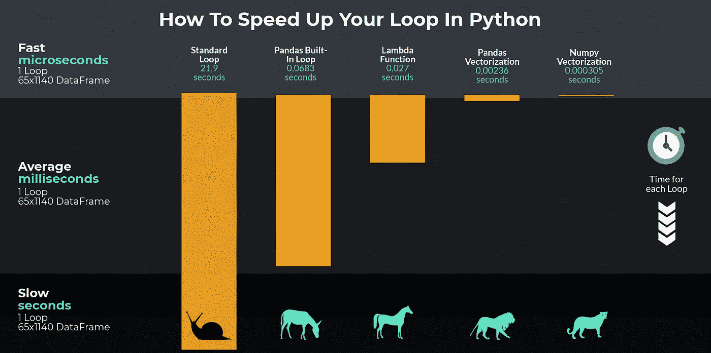

# 如何让你的熊猫循环快 71803 倍

> 原文：<https://towardsdatascience.com/how-to-make-your-pandas-loop-71-803-times-faster-805030df4f06?source=collection_archive---------0----------------------->

## 循环通过熊猫数据帧可能会非常慢——我将向您展示一些非常快速的选项

*如果用 Python 和 Pandas 做数据分析，用不了多久，第一次就想用循环了。然而，即使对于小的数据帧，使用标准循环也是非常耗时的，您很快就会意识到对于较大的数据帧，这可能需要很长时间。当我第一次等了半个多小时来执行代码时，我寻找了一些替代方法，我想与大家分享一下。*

# 标准循环

数据帧是熊猫——有行和列的对象。如果你使用循环，你将遍历整个对象。Python 不能利用任何内置函数，而且速度非常慢。在我们的例子中，我们得到了一个 65 列 1140 行的数据帧。它包含 2016 - 2019 赛季的足球结果。我们希望创建一个新列来指示某个特定的球队是否打了平局。我们可以这样开始:

由于我们的数据框架中有英超联赛的每一场比赛，我们必须检查感兴趣的球队(阿森纳)是否参加了比赛，如果适用，他们是主队还是客场队。如您所见，这个循环非常慢，执行时间为 20.7 秒。让我们看看如何才能更有效率。

# 熊猫的内置函数:iterrows() —快 321 倍

在第一个例子中，我们循环了整个数据帧。`iterrows()`为每一行返回一个序列，因此它将一个数据帧作为一对索引进行迭代，将感兴趣的列作为序列进行迭代。这使得它比标准循环更快:

代码运行需要 68 毫秒，比标准循环快 321 倍。然而，许多人建议不要使用它，因为仍然有更快的选择，而且`iterrows()`不能跨行保存 dtypes。这意味着如果你在你的数据帧上使用`iterrows()`，数据类型会被改变，这会导致很多问题。要保留数据类型，您也可以使用`itertuples()`。这里就不赘述了，因为要注重效率。您可以在这里找到官方文档:

 [## 熊猫。data frame . ITER tuples-pandas 0 . 25 . 1 文档

### 如果列名是无效的 Python 标识符、重复或以…开头，它们将被重命名为位置名

pandas.pydata.org](https://pandas.pydata.org/pandas-docs/stable/reference/api/pandas.DataFrame.itertuples.html) 

# apply()方法—速度快 811 倍

`apply`本身并不快，但与数据帧结合使用时有优势。这取决于`apply`表达式的内容。如果能在 Cython 空间执行，`apply`要快很多(这里就是这种情况)。

我们可以将`apply`与`Lambda`函数一起使用。我们要做的就是指定轴。在这种情况下，我们必须使用`axis=1`,因为我们想要执行列操作:

这段代码甚至比以前的方法更快，用了 27 毫秒才完成。

# 熊猫矢量化—速度提高 9280 倍

现在我们可以谈一个新的话题了。我们利用矢量化的优势来创建真正快速的代码。重点是避免 Python 级的循环，就像[1]前面的例子一样，并使用优化的 C 代码，这样可以更有效地使用内存。我们只需要稍微修改一下函数:

现在我们可以创建以熊猫系列作为输入的新列:

在这种情况下，我们甚至不需要循环。我们要做的就是调整函数的内容。现在，我们可以直接将 Pandas 系列传递给我们的函数，这将大大提高速度。

# Numpy 矢量化—速度提高 71.803 倍

在前面的例子中，我们将熊猫系列传递给了我们的函数。通过添加。值我们接收一个 Numpy 数组:

Numpy 数组如此之快是因为我们得到了引用局部性的好处[2]。我们的代码运行耗时 0，305 毫秒，比开始时使用的标准循环快 71803 倍。

# 结论

如果你使用 Python，Pandas 和 Numpy 进行数据分析，你的代码总会有一些改进的空间。我们比较了五种不同的方法，根据一些计算在我们的数据框架中添加一个新的列。我们注意到了速度上的巨大差异:

如果你能从这篇文章中得到两条规则，我会很高兴:

1.  如果您确定需要使用循环，您应该始终选择 apply 方法。
2.  否则，矢量化总是更好，因为它更快。

# 来源:

[1][https://stack overflow . com/questions/52673285/performance-of-pandas-apply-vs-NP-vectorize-to-create-new-column-from-existing-c](https://stackoverflow.com/questions/52673285/performance-of-pandas-apply-vs-np-vectorize-to-create-new-column-from-existing-c)
【2】[https://en.wikipedia.org/wiki/Locality_of_reference](https://en.wikipedia.org/wiki/Locality_of_reference)

[如果您喜欢中级数据科学，并且尚未注册，请随时使用我的推荐链接加入该社区。](https://medium.com/@droste.benedikt/membership)