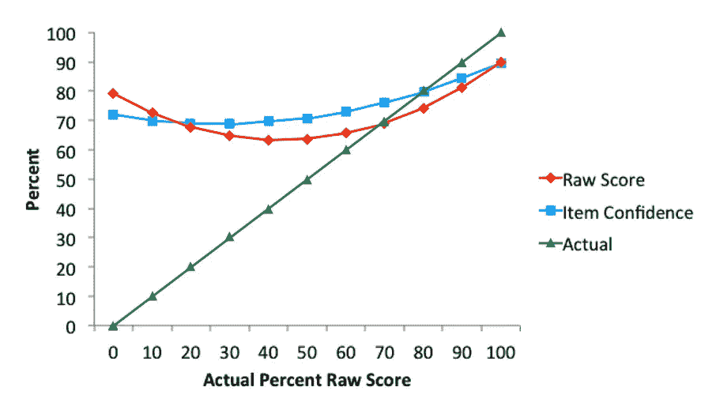

# 如何管理数据科学中的冒名顶替综合症

> 原文：<https://towardsdatascience.com/how-to-manage-impostor-syndrome-in-data-science-ad814809f068?source=collection_archive---------4----------------------->

如果他们发现你一无所知怎么办？

冒名顶替综合症是数据科学实验室里的大象。每个人都有，没人觉得别人有，也没人说。

我很惊讶更多的人不公开讨论。我在一家[数据科学导师创业公司](http://sharpestminds.com)工作，在那里我可能会花 20%的时间帮助数据科学家克服冒名顶替综合症以及随之而来的自我怀疑。我看到它阻碍了更多有抱负的数据科学家和机器学习工程师，多得数不清。

我从数百次关于冒名顶替综合征的谈话中学到了很多，从我所见，克服它的最好方法就是理解它。这就是这篇文章的内容。

# 症状和原因

关于冒名顶替综合症最奇怪的事情是，它与技术技能呈正相关*:我与之交谈过的最有能力的数据科学家和 ML 工程师往往是最自我批评的。*

*起初，我发现这令人困惑:为什么最博学的数据科学家最自我怀疑？*

*然后，我想起了一个叫做**邓宁-克鲁格效应**的东西。DKE 是一个被充分研究过的现象，在这个现象中，在一项任务中表现糟糕的人过度高估了他们在这项任务中的能力水平。*

*例如，如果你给人们一个物理测试，你让他们预测他们做得如何(他们的“原始分数”)，以及他们对自己的预测有多少信心(“项目信心”)，你会发现表现最差的人往往认为他们做得很好，非常感谢:*

**

*Adapted from Williams, Dunning and Kruger’s paper: “The Hobgoblin of Consistency: Algorithmic Judgment Strategies Underlie Inflated Self-Assessments of Performance”*

*冒名顶替综合征与邓宁-克鲁格效应相反。就像不称职的人往往会高估自己的表现一样，称职的人往往会低估自己的表现。*

*在某种程度上，这是有道理的。如果你对一项任务一无所知，你可能不知道它有多难。想想那些花了 30%的 NBA 总决赛时间对着电视屏幕大喊他们如何能比职业篮球队的专业人员做得更好的扶手椅教练吧。*

*另一方面，一旦你对一个问题有了坚实的理解，你就更熟悉解决这个问题需要克服的挑战。也能看出自己理解上的漏洞在哪里。*

*这让我想到了数据科学。*

# *是的，在数据科学领域更糟*

*每天都有新算法、新库和新工作流被发明出来。所以你理解中的漏洞数量永远不会是零。事实上，由于我们每天创造的知识比任何人可能学到的都要多，你理解中的漏洞将会永远增长。你对数据科学的了解越多，你就越有可能意识到这一点。*

*因为在数据科学中没有办法避免无知，你必须管理它。这里有一个好消息:没有一家公司因为他们不知道或不会做什么而雇佣数据科学家或 ML 工程师。公司雇佣员工是因为他们能做什么。*

*这是克服冒名顶替综合症的关键。*

# *如何看待冒名顶替综合症*

*如果你觉得自己像个骗子，因为你不了解数据科学的一切，那么从改变你对数据科学家的看法开始:这与知识无关，而是与*有用性*有关。*

*如果你能从数据中获得准确的见解，或者做出足够好的模型用于实际目的，那么你就是有用的。你不是骗子。你是个增值者。大多数数据科学家从未接触过神经网络，大多数不做任何聚类，大多数不日常使用 KNNs。不知道如何做这些事情并不妨碍它们有用。*

*底线是，如果你能真正做好*一件事*，不知道所有事情也没关系。如果可以的话，那么你应该定义你的身份是一个关于那个东西的数据科学家。例如，“我是一名专门使用基于树的模型进行回归的数据科学家”，而不是“我是一名数据科学家”。你总是可以通过现实地看待你期望自己扮演的角色来定义自己走出冒名顶替综合症的方法。*

# *如果你是一个骗子呢？*

*这不会是一个流行的说法，但是…*

*也许你*是*冒名顶替。这并不是说你不属于数据科学，只是说你可能还没有准备好工作。擅长数据科学很难，而且门槛每年都在提高。*

*自我诊断“冒名顶替综合症”的危险在于，这是一个非常诱人的诊断:告诉自己患有“冒名顶替综合症”,会让你想象自己已经具备了成功所需的所有技能，而你的不足感是没有道理的。有时候确实如此。但是有时候，我们头脑中的“我感到非常无知”警报响起是有原因的。*

*因此，如果你认为自己患有冒名顶替综合症——而不是正确诊断自己的无知——一个好的第一步是问知道自己在做什么的人。这就是导师和信息面试的价值所在:通过 LinkedIn 联系安排一次咖啡聊天，或者去参加一个当地聚会。*

*当你这样做的时候，永远记住那个关键的指导原则——你知道什么并不重要；重要的是你能做什么。*

*如果你想聊天，请随时在 Twitter 上与我联系。我是[@**jeremie charris**](https://twitter.com/jeremiecharris)**！***