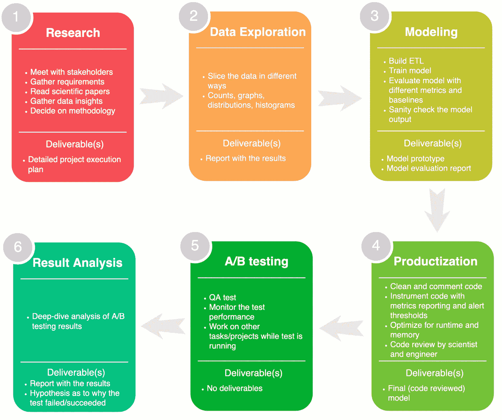

# 如何管理机器学习和数据科学项目

> 原文：<https://towardsdatascience.com/how-to-manage-machine-learning-and-data-science-projects-eecacfc8a7f1?source=collection_archive---------11----------------------->

机器学习(ML)和数据科学(DS)项目很难管理。因为项目本质上类似于研究，所以很难预测它们需要多长时间才能完成。他们通常从一个想法开始，然后当提出的技术不起作用或对数据的假设被证明是错误的时，转向一个新的方向。

建模本身也是一个漫长的过程(与大多数软件工程和分析工作相比)，对于数据科学家来说，进入一个兔子洞，在一个项目上花上几个月的时间，却没有一个明确的进展概念，这种情况并不罕见。与标准软件工程实践的另一个区别是，模型开发通常由一个人完成。这种串行性质并不适合传统的协作 SE 工作流，比如看板和 Scrum。

我花了相当多的时间研究现有的工作流程(主要是在吉拉)来管理 DS 和 ML 项目，但是没有运气。那里的大部分信息都是针对软件工程的，并且集中在敏捷方法上。我也和该领域的同事和朋友交谈过，但我找不到任何为机器学习和数据科学量身定制的东西。我注意到有些人试图使他们的工作流程适应标准的工程实践，或者，在其他情况下，根本不尝试管理那些项目。后者尤其成问题，因为它可能导致项目耗时太长，范围太大，并且更有可能失败。

由于我找不到好的解决方案，我决定建立自己的定制工作流来管理机器学习和数据科学项目。这个系统可以在吉拉实施，让我很容易地监测和报告项目的状态。这也有助于我限制它们的范围，避免构建时间过长的过于复杂的模型。我们的科学家被提供了一个结构，帮助他们思考应该如何建立模型，这增加了他们在项目中取得成功的变化。我使用这个系统已经有几年了，我和我的团队对它非常满意。

# 机器学习项目有明确定义的阶段

无论您是使用深度学习构建复杂的计算机视觉算法，还是使用 LightGBM 构建学习到排序模型，甚至是简单的线性回归，构建 ML 模型的过程都有明确定义的阶段。下面是我们如何将模型构建过程分成连续的阶段，从最初的研究一直到 A/B 测试结果的分析。请注意，每个阶段都有一个可交付成果(或里程碑)，它也是与团队或涉众同步的接触点。

## 1)研究

这是项目的初始阶段。它包括与利益相关者交谈以了解项目的目标和期望，与业务分析师交谈以了解哪些数据可用以及从哪里获取数据，创建一些初始查询并调查数据，以便对问题有更好的直观理解。

也是在这个阶段，科学家将阅读文献并决定解决问题的方法。这包括阅读科学论文和与同龄人集思广益。有时候，决定方法还需要了解现有的包，并使用 Jupyter 笔记本构建一些简单的原型。

交付成果:此阶段的输出是项目执行的详细计划，包括后续阶段的分解(即，数据探索、建模、产品化和结果分析)以及相关的估计工作量水平(以周数表示)。还必须具体说明要使用的方法和数据。

该计划将与利益相关方分享以获得反馈。

## 2)数据探索

这是使用熊猫和木星笔记本(有时是 Tableau)探索数据的传统阶段，以便获得对数据的洞察。典型的分析包括计算数据中的行数、创建不同要素聚合的直方图、一段时间内的趋势图以及多个分布图。科学家们还将构建查询，这将是他们模型 ETL 的核心。

**交付成果:**一份详细的数据探索报告，作为一个木星笔记本，带有图表和评论，提供对数据的见解。该报告将与小组的其他成员和项目干系人共享。

## 3)建模

这是这个项目的核心。在这里，科学家将开始使用我们的内部框架构建他们的模型。这包括构建 ETL、执行特性工程和训练模型。它还包括构建基线模型和提供最终解决方案的广泛评估。

**可交付成果:**本阶段的产出是:

1.  模型原型
2.  Jupyter 笔记本中的一份报告，对模型进行了广泛的评估

最终报告将与小组和项目利益相关者共享。

## 4)产品化

这个阶段是关于实现最终版本的代码。一些常见的任务包括向所有函数添加注释，并确保代码的格式符合 Python 标准和该组织的标准。代码中包含报告指标，如提取的行数、输出中的行数、根据几个指标的预测误差，以及适用时的功能重要性。最后，代码由一名数据科学家和一名工程师审查。

有时候产品化的过程会导致与平台工程师的来回互动。对于运行时性能至关重要的实时模型来说，这一点尤为重要。也有可能是代码的内存需求太大，导致生产流水线出现问题。工程师可能会推后，要求减少内存占用来训练模型。

**可交付成果:**这个阶段的输出是提交给主分支的代码，准备由平台工程团队进行部署。

## 5) A/B 测试

大多数型号将经历 A/B 测试阶段。在这里，科学家和利益相关者决定测试的细节:它将运行多长时间，流量的百分比是多少，控制是什么，如何解释结果等。当测试运行时，团队成员将主要关注其他项目，但是他们需要监控测试。

## 6)结果分析

每个科学家都要对自己的模型结果进行详细的分析。在这里，他们将以多种不同的方式分析结果指标，以了解实际情况。特别是，当测试不成功时，我们需要深入研究结果，找出问题所在。

**可交付成果:**

1.  在 Jupyter 笔记本上的结果的详细报告。
2.  关于为什么事情没有按预期进行的假设(如果适用)

最终报告将与小组和项目的利益相关者共享。

# 与吉拉合作

虽然这个框架在理论上看起来很棒，但现实是上述阶段很少是纯连续的。例如，从数据探索到建模，然后再回到数据探索，这是非常常见的。此外，这个过程不适合现有的吉拉框架，所以你如何在实践中实现它呢？

这其实很简单。我们使用吉拉看板和泳道(每个团队成员一个)以及一些自定义字段和更改。以下准则定义了我们流程的本质:

*   为每个项目创建一个新的 Epic 票证，并将工作分解为多个任务。
*   每个任务都标记有一个阶段，这是吉拉的一个自定义字段，用于从上面列出的 6 个阶段中选择一个。(注意，一个阶段可以有多个任务。)
*   任务不能超过 1 周(5 天)。这迫使团队成员将他们的工作分解成更小的(但仍然相当大的)块，允许以较小的开销进行进度监控。
*   任何时候都只能有一张票在进行中。这确保了我们总是知道项目处于什么状态。
*   阶段并不总是连续的，随着新任务的创建，可以在阶段之间来回移动。

# 结论

管理 ML 和 DS 项目不一定要复杂。起初，我花了大约 30 个阿敏日来监控这个过程，但是一旦团队习惯了，我的时间就减少到每周 15 分钟！我知道每个项目在任何时间点处于什么状态，一个项目花了多长时间，并且我可以快速识别问题，以便在需要时可以投入进来并帮助我的团队。我的数据科学家有一个清晰的框架来思考如何建立模型，他们在这方面变得更加高效。

我希望你能发现这对我很有用。