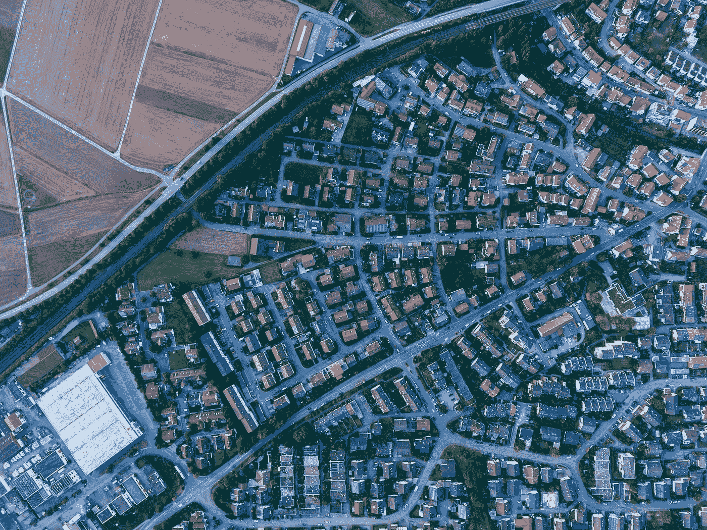

# 如何在 20 分钟内掌握 Python 的主要数据分析库

> 原文：<https://towardsdatascience.com/how-to-master-pandas-8514f33f00f6?source=collection_archive---------1----------------------->

## 熊猫终极指南——第一部分

## 熊猫基本功能的代码指南。


Photo by [Sid Balachandran](https://unsplash.com/@itookthose?utm_source=medium&utm_medium=referral) on [Unsplash](https://unsplash.com?utm_source=medium&utm_medium=referral)

本文阐述了有抱负的数据科学家和数据分析师经常面临的典型问题和挑战。我们将通过利用 Python 最强大的数据操作和分析库 **Pandas** 来解决这些问题和应对这些挑战。

## 在本文中，我们将讨论以下主题:

1.  [设置](#95a4)
2.  [加载数据](#5813)
3.  [检查/分类/过滤数据](#71ac)
4.  [分析功能](#a364)

你可以在这里找到完整的 Jupyter 笔记本。但是我强烈建议您亲自完成这些步骤。毕竟，熟能生巧。

## 先决条件:

一个工作的 Python 环境(我建议 Jupyter 笔记本)。如果你还没有设置这个，不要担心。在上周的文章中，我们讨论了如何设置 Anaconda，并解释了如何打开您的第一个 Jupyter 笔记本。如果你还没有这样做，看看链接的文章。做好一切准备只需不到 10 分钟。

[](/get-started-with-python-e50dc8c96589) [## 所以你想成为一名数据科学家？

### 到底是什么阻止了你？下面是如何开始！

towardsdatascience.com](/get-started-with-python-e50dc8c96589) 

# 1.设置


Photo by [Ivan Zhukevich](https://unsplash.com/@vania_zhu1?utm_source=medium&utm_medium=referral) on [Unsplash](https://unsplash.com?utm_source=medium&utm_medium=referral)

在进行任何数据操作之前，我们先获取一些数据。我们将使用 2019 年世界幸福报告中的数据。我将提供一个稍微调整过的原始数据版本，其中也包括各大洲。

这个 [GitHub Repo](https://github.com/FBosler/you-datascientist) 保存数据和代码。如果不熟悉 GitHub，还可以**从这个** [**链接**](https://github.com/FBosler/you-datascientist/archive/master.zip) **下载一个打包的 zip 文件！**解压文件并将内容(尤其是`happiness_with_continent.csv`)移动到 Jupyter 笔记本所在的文件夹中(如果还没有，创建一个)。

在新笔记本中运行`import pandas as pd`(即，将 Pandas 库导入到工作簿中，以访问这些功能。

我喜欢这样调整我的笔记本设置:

```
from IPython.core.display import display, HTML
display(HTML("<style>.container {width:90% !important;}</style>"))
```

这些命令使笔记本变得更宽，从而利用屏幕上的更多空间(通常笔记本有固定的宽度，这与宽屏很不一样)。

# 2.加载数据


Photo by [Markus Spiske](https://unsplash.com/@markusspiske?utm_source=medium&utm_medium=referral) on [Unsplash](https://unsplash.com?utm_source=medium&utm_medium=referral)

Pandas 将数据存储为序列(一列)或数据帧(一列或多列)，后者只是一个或多个序列的组合。

**注意:**每当我们用以下加载函数之一加载数据时，结果将存储在 DataFrame 中。

## pd.read_csv

对我来说，加载数据的主要方式是熊猫。它完全符合我对数据的思考方式，那就是大量的表格。

您可以像这样从本地文件加载数据**:**

```
data = pd.read_csv('happiness_with_continent.csv')
```

或者您可以从 web 直接读取数据**到数据帧中，如下所示:**

```
data = pd.read_csv('[https://raw.githubusercontent.com/FBosler/you-datascientist/master/happiness_with_continent.csv'](https://raw.githubusercontent.com/FBosler/you-datascientist/master/happiness_with_continent.csv'))
```

## 从 Excel 或 Google 工作表

从 Excel 中读取数据非常简单。Google Sheets 有点棘手，因为它要求你首先通过一个认证程序。你可以在这里阅读所有关于从 Excel 和 Google 工作表中提取数据的内容:

[](/replacing-sheets-with-python-f1608e58d2ca) [## 用 Python 从各种工作表中提取数据

### 或者如何学习统一 Google 工作表、Excel 和 CSV 文件——代码指南

towardsdatascience.com](/replacing-sheets-with-python-f1608e58d2ca) 

## pd.read_clipboard

这个我很少用，但是对于较小的表肯定有效。例如，只需标记并复制(ctrl+c)Google sheets 中的一个表格，然后运行`pd.read_clipboard()`。

**示例:**导航[此处](https://docs.google.com/spreadsheets/d/1Wl3Ad_Y_izZM8J5UizPbAMuOZGpb2FzAZfbAJ-aU2Tc/edit#gid=779395260)(我找到的第一个公共表单)并标记一个区域，如截图所示。


After hitting ctrl+c the data will be in your clipboard, you can now use pd.read_clipboard


Running pd.read_clipboard on previously copied data with parameter index_col=’name’

基于 read_csv 的函数(和 read_clipboard)的一些值得注意的参数:

*   `sep`:分栏符(默认为`,`，也可以是 tab)
*   `header`:默认为`'infer'`(即熊猫猜测你的头是什么)，可选为整数或整数列表(多级名称)。例如，您可以做`header=3`，数据帧将从第 4 行开始(因为 Python 是 0 索引的)作为标题。如果您的数据没有标题，请使用`header=None`
*   `names`:栏目名称。如果您想使用这个参数来覆盖 Pandas 推断出的任何列名，那么您应该指定`header=0`(或者您的列名所在的行)，如果您不这样做，那么您的名称将作为列名，然后在第一行中显示原始的列名。`names`参数需要一个列表，例如`['your col 1', 'your col 2', ... 'your last col name']`
*   `index_col`:设置加载时的索引(即我们将索引设置为`name`)。稍后我们将了解更多关于索引的内容)
*   `skiprows`:跳过前 x 行，当文件开头包含一些元数据，如作者和其他信息时，这很有用
*   `skipfooter`:跳过最后 x 行，当文件末尾有元数据(例如脚注)时很有用
*   `parse_date`:这个参数告诉熊猫，它应该把哪些列解释为日期(例如`pd.read_csv(happiness_with_continent.csv,parse_dates=['Year'])`)。默认的解析器开箱即可正常工作。在遇到奇怪的数据格式时，Pandas 可以使用定制的日期解析器(为此，您必须指定解析逻辑)。

还有一堆额外的(很少使用的)参数。您可以通过在单元格中运行`pd.read_csv?`来阅读这些内容(在命令后添加一个问号将打印帮助文本)。

无论我们如何读取数据，我们都希望将它存储在一个变量中。我们通过将读取结果赋给一个变量来实现，比如`data = pd.read_clipboard()`或`data = pd.read_csv('NAME_OF_YOUR_FILE.csv')`

## 其他读取方法:

下面的阅读方法很少出现在我身上，但是在熊猫身上也实现了:

*   阅读 _ 羽毛
*   read_fwf
*   read_gbq
*   read_hdf
*   read_html
*   read_json
*   read_msgpack
*   阅读 _ 拼花地板
*   阅读 _ 泡菜
*   读取 _sas
*   读取 _sql
*   读取 sql 查询
*   读取 sql 表
*   read_stata
*   读取 _ 表格

# 3.检查/分类/过滤数据



Photo by [Max Böttinger](https://unsplash.com/@maxboettinger?utm_source=medium&utm_medium=referral) on [Unsplash](https://unsplash.com?utm_source=medium&utm_medium=referral)

## ①检查—第一行、最后一行、随机行

在笔记本中显示数据有三种标准方式，`head`、`tail`和`sample`。`head`显示第一行，`tail`显示最后一行，`sample`显示随机选择的行。


data.head(x) previews the first x rows of the data


data.tail(x) previews the last x rows of the data


data.sample(x) previews x randomly selected rows of the data

注意`gini of household income reported in Gallop, by wp5-year`栏前有圆点。圆点表示存在未显示的列。要更改笔记本设置以显示更多列/行，请运行以下命令:

```
pd.set_option('display.max_columns', <number of columns you want>)
pd.set_option('display.max_rows', <number of rows you want>)# I typically usepd.set_option('display.max_columns', 50)
pd.set_option('display.max_rows', 8)
```

但是，请注意，您正在加载的文件通常非常大(1GB 以上),因此出于性能原因，不可能显示所有数据。因此，您应该尝试在更高的层次上熟悉数据，而不要依赖于直观地浏览行。

## ②检查—形状、列、索引、信息、描述

`data.shape`返回数据帧的尺寸。在我们的例子中，1704 行，27 列。

```
**IN:** data.shape**OUT:** (1704, 27)
```

`data.columns`返回数据帧中所有列名的列表。

```
**IN:**
data.columns**OUT:**
Index(['Country name', 'Year', 'Life Ladder', 'Log GDP per capita',
       'Social support', 'Healthy life expectancy at birth',
       'Freedom to make life choices', 'Generosity',
       'Perceptions of corruption', 'Positive affect', 'Negative affect',
       'Confidence in national government', 'Democratic Quality',
       'Delivery Quality', 'Standard deviation of ladder by country-year',
       'Standard deviation/Mean of ladder by country-year',
       'GINI index (World Bank estimate)',
       'GINI index (World Bank estimate), average 2000-16',
       'gini of household income reported in Gallup, by wp5-year',
       'Most people can be trusted, Gallup',
       'Most people can be trusted, WVS round 1981-1984',
       'Most people can be trusted, WVS round 1989-1993',
       'Most people can be trusted, WVS round 1994-1998',
       'Most people can be trusted, WVS round 1999-2004',
       'Most people can be trusted, WVS round 2005-2009',
       'Most people can be trusted, WVS round 2010-2014',
       'Continent'],
      dtype='object')
```

`data.index`返回关于索引的信息。我们将在排序和过滤部分更详细地讨论索引。把索引想象成行名/编号。

```
**IN:** data.index**OUT:** RangeIndex(start=0, stop=1704, step=1)
```

`data.info()`返回有关数据帧中非空值观察的类型和数量的信息

```
**IN:** data.info()**OUT:** <class 'pandas.core.frame.DataFrame'>
RangeIndex: 1704 entries, 0 to 1703
Data columns (total 27 columns):
Country name                                                1704 non-null object
Year                                                        1704 non-null datetime64[ns]
Life Ladder                                                 1704 non-null float64
Log GDP per capita                                          1676 non-null float64
Social support                                              1691 non-null float64
Healthy life expectancy at birth                            1676 non-null float64
Freedom to make life choices                                1675 non-null float64
Generosity                                                  1622 non-null float64
Perceptions of corruption                                   1608 non-null float64
Positive affect                                             1685 non-null float64
Negative affect                                             1691 non-null float64
Confidence in national government                           1530 non-null float64
Democratic Quality                                          1558 non-null float64
Delivery Quality                                            1559 non-null float64
Standard deviation of ladder by country-year                1704 non-null float64
Standard deviation/Mean of ladder by country-year           1704 non-null float64
GINI index (World Bank estimate)                            643 non-null float64
GINI index (World Bank estimate), average 2000-16           1502 non-null float64
gini of household income reported in Gallup, by wp5-year    1335 non-null float64
Most people can be trusted, Gallup                          180 non-null float64
Most people can be trusted, WVS round 1981-1984             125 non-null float64
Most people can be trusted, WVS round 1989-1993             220 non-null float64
Most people can be trusted, WVS round 1994-1998             618 non-null float64
Most people can be trusted, WVS round 1999-2004             491 non-null float64
Most people can be trusted, WVS round 2005-2009             630 non-null float64
Most people can be trusted, WVS round 2010-2014             671 non-null float64
Continent                                                   1704 non-null object
dtypes: datetime64[ns](1), float64(24), object(3)
memory usage: 372.8+ KB
```

`data.describe()`返回关于数据帧的数字列的一些描述性统计信息(计数、平均值、标准差、最小值、25%、50%、75%、最大值):


## ①排序— data.sort_values()

在没有参数的数据上调用`sort_values`对我们没有任何好处。事实上，它将引发一个错误，告诉我们它缺少一个名为`by`的参数。这个错误是有道理的。我们必须告诉熊猫我们想要按哪个(哪些)列排序。

例如，我们可以按年份或年份和国家名称对数据进行排序，如下所示:

```
data.sort_values(by='Year')
data.sort_values(by=['Year','Country name'])
data.sort_values(by=['Country name','Year'])
```

**注意:**如果传递多个值，它会按照值的顺序按值排序。

默认情况下，排序将从“最低值”开始。然而，改变这种行为很容易。

```
data.sort_values(by='Year', ascending=True)data.sort_values(
  by=['Country name','Year'], 
  ascending=[False,True]
)
```

**注意:** Ascending 默认为真，即最小值优先，如果你想要最大值优先，你必须指定 ascending=False

## ②排序— data.sort_index()

除了基于列的排序，还有基于索引的排序。按索引调用排序:`data.sort_index()`或`data.sort_index(ascending=False)`。第一个是升序，第二个是降序。

## ①过滤—列

排序固然很好，但我们通常关心的是数据的特定子集。有时您可能只想查看一列或多列。

**选择一列:** 选择一个特定的列有两种方法。假设我们想要选择`Year`列。我们可以选择:

*   `data['Year']`，或者
*   `data.Year`(不使用这种方法)

两者做同样的事情。


The two ways of selecting columns in Pandas

**注意:**你可能会问，为什么完全相同的事情有两种方法？原因是方便。第二种方法稍微快一点，因为只需要两个点和列名。而在第一种方法中，您需要列名、两个上勾号和两个括号。

然而，我强烈建议使用第一种方法，因为它避免了一些小问题，并且与选择多个列相一致。

**选择多个列:** 假设您想要选择`Country name`和`Life Ladder`，那么您应该这样做(小心:双括号):


Selecting “Country name” and “Life Ladder” columns and sampling five random rows

**注意:要特别注意您要选择的第一列和最后一列前后的双括号！无论何时使用双括号，结果都将是一个 DataFrame(即使只选择一个带有双括号的列)。我怎么强调这一点都不为过，因为我有时仍然会遇到这些错误！如果要选择多列，但只打开一组括号，括号之间的内容将被视为一列。不用说，您的数据不包含意外组合的列。**


KeyError: If you only open and close one set of brackets.

## ②过滤—行

能够选择特定的列只是完成了一半。然而，选择行也同样简单。

**熊猫中的行通过索引**选择。您可以将索引视为行的名称。每当您从一个数据帧中选择行时，都会用一个具有相同索引的序列覆盖该数据帧，该序列只包含`True`和`False`值(`True`表示应该选择该行，`False`表示不应该选择该行)。然而，大多数时候，这种显式的索引选择是从用户那里抽象出来的。我仍然认为理解行选择过程是如何工作的非常重要。

您可以通过索引选择一行或多行。有两种方法可以做到这一点:

*   `[data.iloc](#7d8b)`或者
*   `[data.loc](#86f2)`

**iloc:** `data.iloc`允许通过位置(即通过行数)选择行(以及可选的列)**。**

**iloc —选择一行:**
语法如下`data.iloc[row_number (,col_number)]`，括号中的部分是可选的。


data.iloc[10] selects the 10th row

**注意:**格式看起来有点不常规，这是因为当选择一行且仅选择一行时，将返回一个[系列](#5522)。


data.iloc[10,5] selects the 5th column out of the 10th row

**iloc —选择多行:** 语法如下`data.iloc[start_row:end_row (,start_col:end_col)]`所示，括号中的部分是可选的。


data.iloc[903:907] selects the 903rd to 907th row

或者，您还可以指定要选择的列。


data.iloc[903:907,0:3] selects for the 903rd to 907th row the 0th to 3rd column

**loc:** `data.loc`与`iloc`相反，允许通过以下方式选择行(和列):

1.  **标签/索引或**
2.  **使用布尔/条件查找**

为了更好地解释第一点，也为了更好地将其与`iloc`区分开来，我们将把国家名称转换成数据帧的索引。为此，运行以下命令:

```
data.set_index('Country name',inplace=True)
```

`set_index`命令在数据帧上设置一个新的索引。通过指定`inplace=True`，我们确保数据帧将被改变。如果我们没有指定 inplace=True，我们将只能看到数据帧在应用操作后的样子，但底层数据不会发生任何变化。

数据帧现在应该如下所示:


DataFrame after setting ‘Country name’ as the index

我们可以看到，DataFrame 丢失了它的行号(以前的)索引，并获得了一个新的索引:


New Index of the DataFrame

**loc —通过一个索引标签选择行:** 语法如下`data.loc[index_label (,col_label)]`，括号中的部分是可选的。


data.loc[‘United States’] selects all rows with ‘United States’ as the index

**loc —通过索引标签和列标签选择行和列:**


data.loc[‘United States’,’Life Ladder’] selects the column ‘Life Ladder’ for all rows with ‘United States’ as the index

**位置——通过多个索引标签选择行:**


data.loc[[‘United States’,’Germany’]] selects all rows with ‘United States’ or ‘Germany’ as the index

**备注:**

*   像前面一样，当选择多个列时，我们必须确保将它们放在双括号中。如果我们忘记这样做，列将被认为是一个长的(不存在的)名称。
*   我们使用样本(5)来表明在混合中有一些德国。假设我们使用 head(5)来代替，我们将只能在 12 行美国之后看到德国。
*   Loc 按照提供的顺序返回行，而不考虑它们的实际顺序。例如，如果我们首先指定德国，然后指定美国，我们将得到 13 行德国，然后 12 行美国

**loc-通过多个索引标签选择行和列:** 您还可以为要返回的选定行指定列名。


Selecting rows and columns by label name

**注意:**我们将行选择`['Germany','United States]`和列选择`['Year','Life Ladder']`分布在两行上。我发现将语句拆分有助于提高可读性。

**loc —通过一系列索引标签选择行:** 这种选择行的方式可能有点奇怪，因为标签范围(`'Denmark':'Germany'`)不像 iloc 使用数字范围(`903:907`)那样直观。

指定标签范围是基于索引的当前排序，对于未排序的索引将会失败。

但是，假设您的索引已经排序，或者您在选择范围之前已经排序，您可以执行下列操作:


Using loc with a range of rows is going to return all rows between (including) Denmark and Germany

**loc —布尔/条件查找** 布尔或条件查找才是真正的关键所在。正如前面提到的[和](#05d5)，无论何时选择行，这都是通过用真值和假值的掩码覆盖数据帧来实现的。

在下面的例子中，我们用索引`['A','B','A','D']`和 0 到 10 之间的一些随机值创建了一个小的数据帧。

然后我们创建一个具有相同索引值`[True,False,True,False]`的`overlay`。

然后，我们使用`df.loc[overlay]`只选择索引值为真的行。

```
**IN:**
from numpy.random import randint
index = ['A','B','A','D']## create dummy DataFrame ##
df = pd.DataFrame(
    index = index,
    data = {
    'values':randint(10,size=len(index))
})
print('DataFrame:')
print(df)**OUT:** DataFrame:
   values
A       8
B       2
A       3
D       2**IN:**
## create dummy overlay ##
overlay = pd.Series(
    index=index,
    data=[True,False,True,False]
)
print('\nOverlay:')
print(overlay)**OUT:** Overlay:
A     True
B    False
A     True
D    False
dtype: bool**IN:**
## select only True rows ##
print('\nMasked DataFrame:')
print(df.loc[overlay])**OUT:**
Masked DataFrame:
   values
A       8
A       3
```

基于一个(或多个)条件，可以使用相同的逻辑来选择行。

我们首先创建一个布尔掩码，如下所示:


Filtering based on the value of ‘Life Ladder’ returns Series with True/False values

然后使用该掩码只选择符合指定条件的行，如下所示:


Selecting rows based on a condition

选项 1 作为替代方案也产生完全相同的结果。然而，另一种选择更清晰一些。当应用多种条件时，易读性的提高变得更加明显:


Chaining various conditions together

**注意:**我们使用了`&`(按位 and)来过滤行，其中多个条件同时适用。我们可以使用`|`(按位 or)来过滤符合其中一个条件的列。

**loc —带有自定义公式的高级条件查找**

也可以使用定制的函数作为条件，并将它们应用于选择列，这非常容易。

在下面的例子中，我们只选择能被三整除的年份和包含单词 America 的大洲。这个案例是人为的，但却说明了一个问题。


Row selection based on custom formulas conditions

除了 lambda(匿名)函数，您还可以定义和使用更复杂的函数。您甚至可以(我并不推荐)在自定义函数中进行 API 调用，并使用调用的结果来过滤您的数据帧。

# 4.分析功能


Image by [xresch](https://pixabay.com/users/xresch-7410129/?utm_source=link-attribution&utm_medium=referral&utm_campaign=image&utm_content=3041437) from [Pixabay](https://pixabay.com/?utm_source=link-attribution&utm_medium=referral&utm_campaign=image&utm_content=3041437)

既然我们已经习惯了从前到后对数据进行过滤和排序，反之亦然，那么让我们转向一些更高级的分析功能。

## 标准功能:

像 read 函数一样，Pandas 也实现了很多分析函数。

我将强调并解释我最常用的方法。然而，这也是它美丽的一部分，甚至我会不时地发现新的有用的功能。所以千万不要开始阅读和探索！

*   ①最大/最小
*   ②总和
*   ③平均值/中位数/分位数
*   ④ idxmin/idxmax

**注意:所有函数都可以按列应用，也可以按行应用。**在我们的例子中，行方式的应用没有什么意义。然而，通常情况下，您有数据，您想比较不同的列，在这种情况下，行方式的应用程序确实有意义。

每当我们调用上述函数时，都会传递一个默认参数`axis=0`(对于按列的应用程序)。然而，我们可以覆盖这个参数并传递`axis=1`(对于行方式的应用)。


**① max/min** 对数据调用`max()`，将(尽可能)返回每列的最大值。`min()`恰恰相反。

```
**IN:**
data.max() **# COLUMNWISE MAXIMUM****OUT:** Year                                                        2018
Life Ladder                                              8.01893
Log GDP per capita                                       11.7703
Social support                                          0.987343
                                                       ...      
Most people can be trusted, WVS round 1999-2004         0.637185
Most people can be trusted, WVS round 2005-2009         0.737305
Most people can be trusted, WVS round 2010-2014         0.661757
Continent                                          South America
Length: 26, dtype: object**IN:** data.max(axis=1) **# ROW-WISE MAXIMUM****OUT:** 
Country name
Afghanistan    2008.0
Afghanistan    2009.0
Afghanistan    2010.0
Afghanistan    2011.0
                ...  
Zimbabwe       2015.0
Zimbabwe       2016.0
Zimbabwe       2017.0
Zimbabwe       2018.0
Length: 1704, dtype: float64
```

**② sum** 对数据调用`sum()`，将(尽可能)返回每一列的总和。

```
**IN:** data.sum()**OUT:** Year                                                                                         3429014
Life Ladder                                                                                  9264.91
Log GDP per capita                                                                           15456.8
Social support                                                                               1370.67
                                                                         ...                        
Most people can be trusted, WVS round 1999-2004                                              131.623
Most people can be trusted, WVS round 2005-2009                                              166.532
Most people can be trusted, WVS round 2010-2014                                              159.358
Continent                                          AsiaAsiaAsiaAsiaAsiaAsiaAsiaAsiaAsiaAsiaAsiaEu...
Length: 26, dtype: object
```

**注意:** Sum 会将字符串连接成一个长字符串，这将为 Continent 列生成 asiasiasiasiasiasiasiasiasiasiasiasiasiasiasiaaiaeu…。

**③均值/中值/分位数** 对数据调用`mean`、`median`或`quantile`将分别返回均值或中值。

```
**IN:** data.mean()**OUT:** Year                                               2012.332160
Life Ladder                                           5.437155
Log GDP per capita                                    9.222456
Social support                                        0.810570
                                                      ...     
Most people can be trusted, WVS round 1994-1998       0.249574
Most people can be trusted, WVS round 1999-2004       0.268070
Most people can be trusted, WVS round 2005-2009       0.264336
Most people can be trusted, WVS round 2010-2014       0.237493
Length: 25, dtype: float64**IN:** data.median()**OUT:**
Year                                               2012.000000
Life Ladder                                           5.339557
Log GDP per capita                                    9.406206
Social support                                        0.833098
                                                      ...     
Most people can be trusted, WVS round 1994-1998       0.229924
Most people can be trusted, WVS round 1999-2004       0.232000
Most people can be trusted, WVS round 2005-2009       0.198380
Most people can be trusted, WVS round 2010-2014       0.193531
Length: 25, dtype: float64**IN:** data.quantile(q=.8)**OUT:** Year                                               2016.000000
Life Ladder                                           6.497157
Log GDP per capita                                   10.375623
Social support                                        0.913667
                                                      ...     
Most people can be trusted, WVS round 1994-1998       0.304498
Most people can be trusted, WVS round 1999-2004       0.388611
Most people can be trusted, WVS round 2005-2009       0.415082
Most people can be trusted, WVS round 2010-2014       0.373906
Name: 0.8, Length: 25, dtype: float64
```

**④idx min/idx max
对数据调用`idxmax`或`idxmin`将返回找到第一个最小值/最大值的行的索引。然而，只可能在一些普通的列上调用这个函数。**

```
**IN:** data.iloc[:,:-1].idxmax() # We exclude the Continent Column**OUT:** Year                                               Afghanistan
Life Ladder                                            Denmark
Log GDP per capita                                       Qatar
Social support                                     New Zealand
                                                      ...     
Most people can be trusted, WVS round 1994-1998         Norway
Most people can be trusted, WVS round 1999-2004         Sweden
Most people can be trusted, WVS round 2005-2009         Norway
Most people can be trusted, WVS round 2010-2014    Netherlands
Length: 25, dtype: object
```

这意味着，例如，丹麦的社会支持值最高`Life Ladder`，卡塔尔最高`Log GDP per capita`和`New Zealand`。

`idxmin`的工作原理与`idxmax`相同。

**总结:**不要忘记，您可以按列(轴=0)或行(轴=1)应用所有这些函数

## 应用/自定义功能:

您还可以编写自定义函数，并在行或列上使用它们。有两种自定义函数:

*   **命名函数**
*   **λ函数**

命名函数是用户定义的函数。它们是通过使用保留关键字`def`来定义的，如下所示:

**命名函数:**

```
**FUNCTION:**
def above_1000_below_10(x):
    try:
        pd.to_numeric(x)
    except:
        return 'no number column'

    if x > 1000:
        return 'above_1000'
    elif x < 10:
        return 'below_10'
    else:
        return 'mid'**IN:** data['Year'].apply(above_1000_below_10)**OUT:** Country name
Afghanistan    above_1000
Afghanistan    above_1000
Afghanistan    above_1000
Afghanistan    above_1000
                  ...    
Zimbabwe       above_1000
Zimbabwe       above_1000
Zimbabwe       above_1000
Zimbabwe       above_1000
Name: Year, Length: 1704, dtype: object
```

这里我们定义了一个名为`above_1000_below_10`的函数，并将其应用于我们的数据。

该函数首先检查该值是否可转换为数字，如果不可转换，将返回“无数字列”否则，如果值大于 1000，函数返回 above_1000，如果值小于 10，函数返回 below_10，否则返回 mid。

**Lambda 函数:** 对我来说，Lambda 函数出现的频率比命名函数高得多。本质上，这些都是简短的一次性函数。这个名字听起来很笨拙，但是一旦你掌握了窍门，它们就很方便了。例如，我们可以首先在空间上拆分大陆列，然后获取结果的最后一个词。

```
**IN:** data['Continent'].apply(lambda x: x.split(' ')[-1])**OUT:** Country name
Afghanistan      Asia
Afghanistan      Asia
Afghanistan      Asia
Afghanistan      Asia
                ...  
Zimbabwe       Africa
Zimbabwe       Africa
Zimbabwe       Africa
Zimbabwe       Africa
Name: Continent, Length: 1704, dtype: object
```

**注意:**命名函数和 lambda 函数都应用于单独的列，而不是整个数据帧。将函数应用于特定列时，函数逐行执行。当将函数应用于整个数据帧时，函数逐列执行，然后应用于整个列，并且必须以稍微不同的方式编写，如下所示:

```
**IN:**
def country_before_2015(df):
    if df['Year'] < 2015:
        return df.name
    else:
        return df['Continent']**# Note the axis=1** data.apply(country_before_2015, axis=1)**OUT:** Country name
Afghanistan    Afghanistan
Afghanistan    Afghanistan
Afghanistan    Afghanistan
Afghanistan    Afghanistan
                  ...     
Zimbabwe            Africa
Zimbabwe            Africa
Zimbabwe            Africa
Zimbabwe            Africa
Length: 1704, dtype: object
```

在这个例子中，我们也是逐行进行的(由`axis=1`指定)。当该行的年份小于 2015 年或该行的洲时，我们返回该行的名称(恰好是索引)。当您必须进行条件数据清理时，这样的任务确实会出现。

## 合并列:

有时你想增加、减少或合并两列或多列，这真的再简单不过了。

假设我们想要添加`Year`和`Life Ladder`(我知道这是人为的，但我们这样做是为了便于讨论)。

```
**IN:**
data['Year'] + data['Life Ladder']**OUT:** Country name
Afghanistan    2011.723590
Afghanistan    2013.401778
Afghanistan    2014.758381
Afghanistan    2014.831719
                  ...     
Zimbabwe       2018.703191
Zimbabwe       2019.735400
Zimbabwe       2020.638300
Zimbabwe       2021.616480
Length: 1704, dtype: float64
```

和`-, *, /`一样，你还可以做更多的字符串操作，就像这样:

```
**IN:** data['Continent'] + '_' + data['Year'].astype(str)**OUT:** Country name
Afghanistan      Asia_2008
Afghanistan      Asia_2009
Afghanistan      Asia_2010
Afghanistan      Asia_2011
                  ...     
Zimbabwe       Africa_2015
Zimbabwe       Africa_2016
Zimbabwe       Africa_2017
Zimbabwe       Africa_2018
Length: 1704, dtype: object
```

**注意:**在上面的例子中，我们想把两列组合成字符串。为此，我们必须将`data['Year']`解释为一个字符串。我们通过在列上使用`.astype(str)`来实现。为了简洁起见，我们不会在本文中深入探讨类型和类型转换，而是在另一篇文章中讨论这些主题。

## 分组依据

到目前为止，我们应用的所有计算都是针对整个集合、一行或一列的。然而——这正是令人兴奋的地方——我们还可以对数据进行分组，并计算各个组的指标。

假设我们想知道每个国家的最高`Life Ladder`值。

```
**IN:** data.groupby(['Country name'])['Life Ladder'].max()**OUT:** Country name
Afghanistan    4.758381
Albania        5.867422
Algeria        6.354898
Angola         5.589001
                 ...   
Vietnam        5.767344
Yemen          4.809259
Zambia         5.260361
Zimbabwe       4.955101
Name: Life Ladder, Length: 165, dtype: float64
```

假设我们希望每年有最高的`Life Ladder`的国家。

```
**IN:** data.groupby(['Year'])['Life Ladder'].idxmax()**OUT:** Year
2005    Denmark
2006    Finland
2007    Denmark
2008    Denmark
         ...   
2015     Norway
2016    Finland
2017    Finland
2018    Finland
Name: Life Ladder, Length: 14, dtype: object
```

或者多级组，假设我们想要每个洲/年组合中`Life Ladder`最高的国家。

```
**IN:**
data.groupby(['Year','Continent'])['Life Ladder'].idxmax()**OUT:** Year  Continent    
2005  Africa                  Egypt
      Asia             Saudi Arabia
      Europe                Denmark
      North America          Canada
                           ...     
2018  Europe                Finland
      North America          Canada
      Oceania           New Zealand
      South America           Chile
Name: Life Ladder, Length: 83, dtype: object
```

像之前的[一样，我们可以使用许多标准函数或自定义函数(命名或未命名)，例如，为每组返回一个随机国家:](#e703)

```
**IN:**
def get_random_country(group):
    return np.random.choice(group.index.values)# Named function
data.groupby(['Year','Continent']).apply(get_random_country)# Unnamed function
data.groupby(['Year','Continent']).apply(
  lambda group: np.random.choice(group.index.values)
)**OUT:** Year  Continent    
2005  Africa                  Egypt
      Asia                   Jordan
      Europe                 France
      North America          Mexico
                           ...     
2018  Europe           North Cyprus
      North America       Nicaragua
      Oceania             Australia
      South America           Chile
Length: 83, dtype: object
```

**注意:** groupby 总是为每组返回**一个**值。因此，除非您按只包含唯一值的列进行分组，否则结果将是一个较小的(聚合的)数据集。

## 改变

有时，您不希望每个组只有一个值，而是希望属于该组的每一行都有您为该组计算的值。您可以通过以下方式完成此操作:

```
**IN:** data.groupby(['Country name'])['Life Ladder'].transform(sum)**OUT:** Country name
Afghanistan    40.760446
Afghanistan    40.760446
Afghanistan    40.760446
Afghanistan    40.760446
                 ...    
Zimbabwe       52.387015
Zimbabwe       52.387015
Zimbabwe       52.387015
Zimbabwe       52.387015
Name: Life Ladder, Length: 1704, dtype: float64
```

我们得到一个国家所有得分的总和。我们还可以做:

```
**IN:** data.groupby(['Country name'])['Life Ladder'].transform(np.median)**OUT:** Country name
Afghanistan    3.782938
Afghanistan    3.782938
Afghanistan    3.782938
Afghanistan    3.782938
                 ...   
Zimbabwe       3.826268
Zimbabwe       3.826268
Zimbabwe       3.826268
Zimbabwe       3.826268
Name: Life Ladder, Length: 1704, dtype: float64
```

得到每个国家的中位数。然后，我们可以像这样计算每一年的值的差异(因为转换保留了索引):

```
**IN:**
data.groupby(['Country name'])['Life Ladder'].transform(np.median) \
- data['Life Ladder']**OUT:** Country name
Afghanistan    0.059348
Afghanistan   -0.618841
Afghanistan   -0.975443
Afghanistan   -0.048782
                 ...   
Zimbabwe       0.123077
Zimbabwe       0.090868
Zimbabwe       0.187968
Zimbabwe       0.209789
Name: Life Ladder, Length: 1704, dtype: float64
```

这篇文章应该给你一些思考。最初，我还想包括访问器、类型操作和连接、合并和连接数据帧，但是考虑到文章的长度，我将这些主题移到了本系列的第二部分:

[](/learn-advanced-features-for-pythons-main-data-analysis-library-in-20-minutes-d0eedd90d086) [## 在 20 分钟内了解 Python 主数据分析库的高级功能

### 熊猫高级功能代码指南。

towardsdatascience.com](/learn-advanced-features-for-pythons-main-data-analysis-library-in-20-minutes-d0eedd90d086) 

到时见，继续探索！

哦，如果你喜欢阅读这样的故事，并想支持我成为一名作家，考虑注册成为一名灵媒成员。每月 5 美元，你可以无限制地阅读媒体上的故事。如果你用我的链接注册，我甚至会得到一些🍩。

[](https://medium.com/@fabianbosler/membership) [## 通过我的推荐链接加入 Medium-Fabian Bosler

### 作为一个媒体会员，你的会员费的一部分会给你阅读的作家，你可以完全接触到每一个故事…

medium.com](https://medium.com/@fabianbosler/membership)