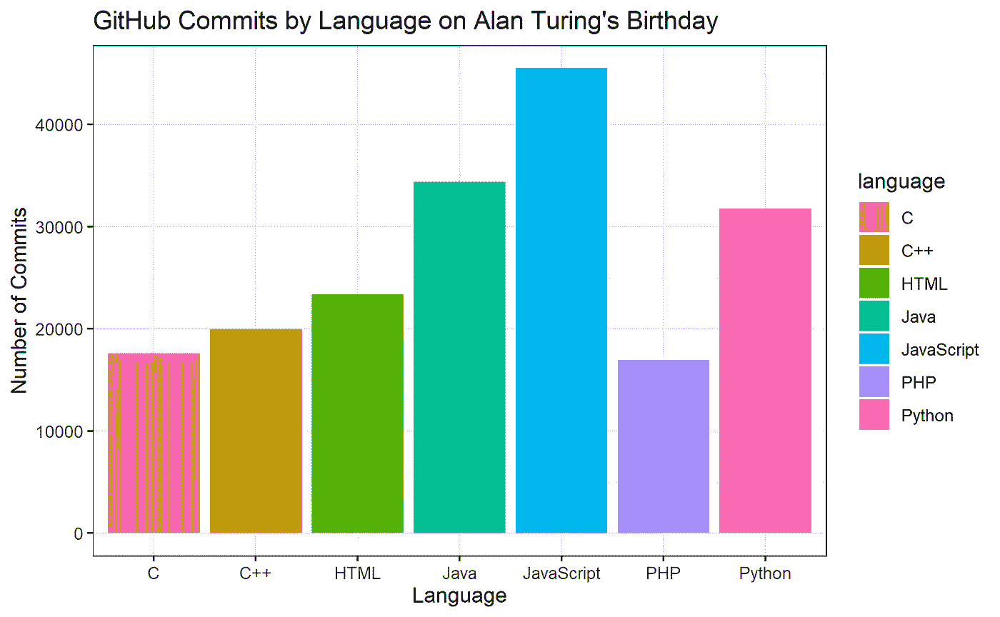
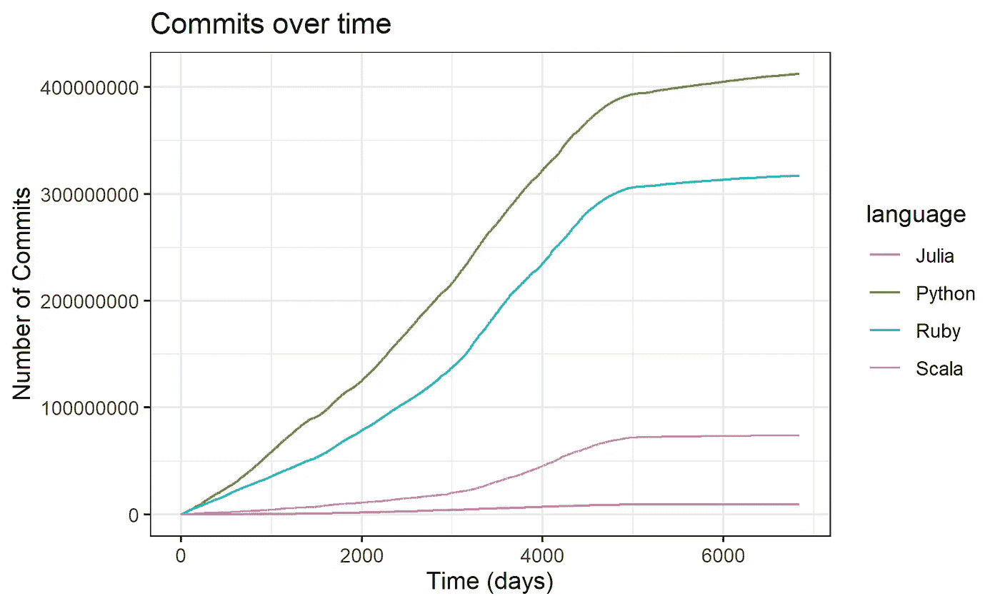
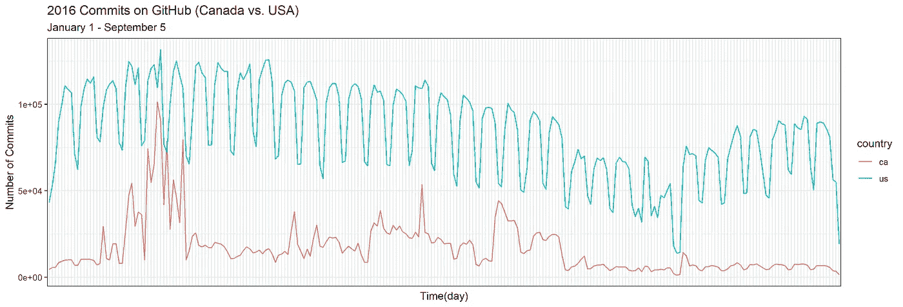
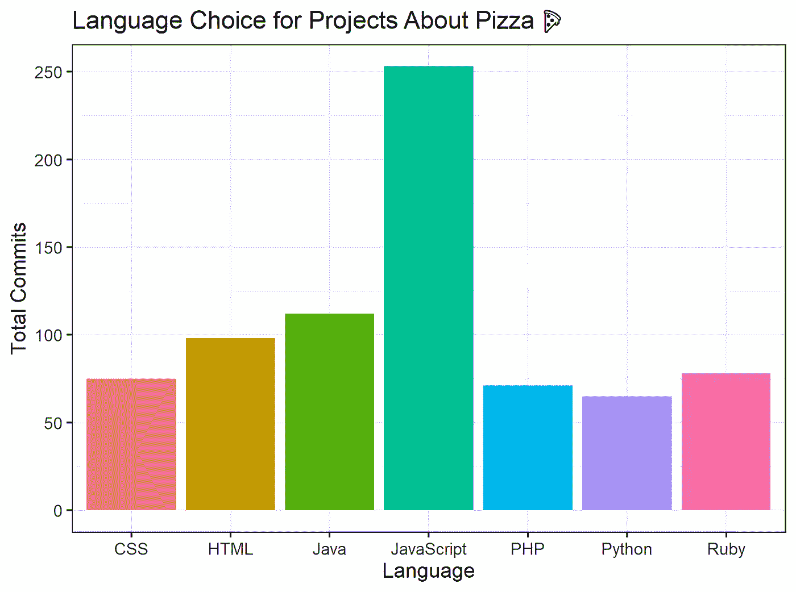
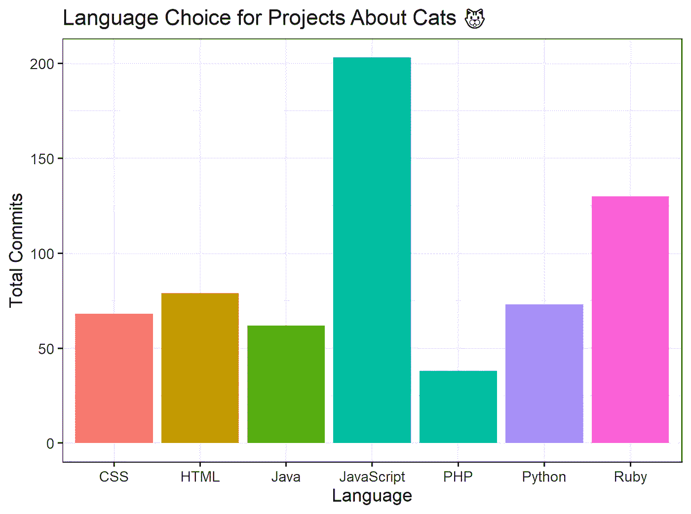

# 如何有意义地处理数据

> 原文：<https://towardsdatascience.com/how-to-meaningfully-play-with-data-f5183fe82539?source=collection_archive---------24----------------------->

[image of a ballpit with some slides and other play-ground like things; bright colors and whimsy] Ballpits are probably a public health crisis, but I think they get across the magical feeling of “playtime” quite well.

再说玩吧！自从大学毕业后，我做过一些有趣的工作。作为一名认知科学研究员，我每天会花一部分时间思考贝叶斯推理，然后去隔壁的 T2 婴儿实验室数“婴儿吃角子老虎机”项目的贴纸。有些日子我不和任何人说话，埋头于我非常复杂和精密的编程**(我开玩笑)。其他时候，我会在一台录音机上学习演奏“Let it Go”，这台录音机是一位研究员给我买的，他给我们的小机器人[make block](https://www.youtube.com/watch?v=fG__7Ltvyt4)编了程序，让它唱“你想堆雪人吗？”来自迪士尼的*冰雪奇缘*。我经历了学习 Linux 命令的痛苦，成为我们非官方的 IT 人员，我还当过幼儿园老师。我想说的是，我做过“严肃的编程”,也玩过。玩了这么多。我为此无比开心。**

**我不想让玩耍成为我学术生涯中一种罪恶的快乐。我不希望玩耍成为一种“休息”或“副业”。我希望玩耍成为我每天工作中不可或缺的一部分，成为学习中不可或缺的一部分。我明白最重要的项目并不总是像玩耍一样。我们生活在一个危机四伏的世界里；人们受苦受难，不平等持续存在，这让人精疲力尽。但是我们都需要快乐、社区和玩耍的某些方面来让我们继续前进。**

> **我想说的是，我做过“严肃的编程”,也玩过。玩了这么多。我为此无比开心。**

**因此，我提出了一些有意义地玩数据的方法，可以帮助我们学习，帮助我们笑，帮助我们作为非常严肃的学术程序员深呼吸。我之所以开这个玩笑，是因为我见过很多压力过大、疲惫不堪的人。我看过介绍性编程课把学生吓得屁滚尿流；我曾目睹学生们不顾一切地寻找工作，希望尽可能地获得技能以获得成功。我经历过自己成为我自己的“生产力”和“价值”观念的受害者。所以，如果你正在读这篇文章，也许是时候你试着玩了。就一小会儿。让我们学会有意义地玩数据来学习。**

**今天我正在为计算机科学专业的学生写一堂入门课，让他们学习 R 编程语言并使用 GitHub 数据。是的，现在很多人想学习“数据科学”、“科学计算”和“统计分析”。这将有助于学术界，就业前景，等等。我看到很多学生试图获得这些技能，但失败了，尽管他们尽职尽责地遵循 Coursera 的课程或完成了教程中的所有课程。可能是因为通常没那么好玩吧。这当然是我喜欢谈论的主题:个人相关、个人有意义、个人生成的数据项目。但是，让我们用数据来探究一系列非常小的个性化游戏日期:**

# **生日当天流行的编程语言**

**我给学员上了一堂课，教他们如何查看 GitHub 统计数据，了解自己的生日。这里我用艾伦·图灵的生日(6 月 23 日)来演示一些情节。你知道吗，2016 年，JavaScript 是 GitHub 上艾伦·图灵生日那天使用最多的语言？不，你不知道，你到底为什么要在乎？你可能不会。但这是*的乐趣。与你朋友的生日相比，嘲笑那些愚蠢的答案。你在学习 R，争论数据和 API，做数据可视化，都是为了玩。***

****

**[a graph demonstrating that JavaScript had the most commits on Alan Turing’s birthday; Java was second and Python third]**

**这一课最终通过艾伦·图灵的生日和假期的统计比较，特定生日在特定年份的一周中的重要性，给定语言相对于一年数据的相对提交量等来指导学习者。训练学习者像数据科学家一样思考的统计警告；但同时也显示了游戏的价值。**

# **表明没人在乎你朋友最喜欢的语言**

**这个很有趣。你有朋友真的喜欢茱莉亚、戈朗、斯卡拉或者更糟的音乐吗，比如《T4》？是时候把你选择的语言如何在 GitHub 上更受欢迎的情节推到他们面前了，然后等待他们爽快的反驳。(朋友就是这样表现的吗？我不确定)。这一个比生日的那个更相关一点，但是是*意图*让这个变得有趣。幸灾乐祸。意图是幸灾乐祸。**

****

**[plot demonstrating language growth over time by number of commits to GitHub. Python has the most, then Ruby, then Scala, then Julia]**

# **GitHub 上的加拿大日 vs 月 4 日**

**我的 RStudio 导师碰巧是加拿大人，带着我最后一点美国尊严，我决定做一个加拿大对美国的数据可视化。请继续关注这一课，因为它实际上有点复杂。我开始比较 7 月 1 日(加拿大国庆日)和 7 月 4 日(独立日)提交的数据，但是*太多的事情*会影响这些数据:一周中的哪一天，我们查看哪一年中的哪一天，等等。如果加拿大国庆日是星期二，但独立日是星期五呢？这变得很复杂，但重点是允许学习者插入他们喜欢的假期。**

# **GitHub 也有周末吗？**

**这个剧情其实是我自己*自己*玩出来的。我甚至没有想过周末会对提交数量产生影响；我都没想到。当我画出它的时候，看到正弦波形的线，我笑了，因为我“发现”了周末。我也笑了，因为加拿大似乎有点难以决定周末是什么时候。本课展示了如何绘制线条，以及如何使用 r 中的`weekdays()`命令检查提交量较低的日子是否真的是周末。**

****

**[plot demonstrating a sinusoidal pattern in number of commits by day, with the dips in the pattern occurring on weekends! Even GitHub takes a break. Canada line is significantly less in volume of commits, and more sporadic in the pattern but still seems to show some evidence of fewer commits on weekends]**

**该课程还包括如何调整相对于提交的*数据的说明，说明美国提交的数据总体上比加拿大多。当它们按照自己国家的频率标准化后，这些国家的周末可以更好地进行比较。***

# **GitHub 上的哑项目描述**

****

**[bar plot for popular languages for project descriptions containing the word “pizza”. JavaScript has the most commits and Python has the least]**

****

**[bar plot for popular languages for project descriptions containing the word “cats”. JavaScript has the most commits and PHP has the least]**

**我们可以访问的东西之一是 GitHub 上的“项目描述”。我们可以开始玩文本数据，我有一个 13 岁孩子的幽默，所以显然我试图看看是否有任何项目描述包含粗俗。这一课展示了如何找到包含“哑巴”、“比萨饼”、“猫”等词语的 GitHub 项目描述。我们用`dplyr`做一些汇总和总结，以了解我们“收集”的数据。你当然也可以通过这种方式来教授关于`ngrams`的知识。这些都不重要，而且结果也很糟糕。但同样，这很有趣。你总是会惊讶于你的学生决定玩什么、发现什么和报道什么。此外，重要的是要记住我们在 GitHub 上的项目描述是公开的。看着你，给他们的项目贴标签的人:**

> **“电脑很擅长做傻事。以 derp" *的速度为你的站点服务——一个有 24 个提交的 CSS 项目***

# **数据播放日期**

> **“也许这种自我驱动的*数据游戏日*可以给我们所有人多一点快乐，多一点信心，一路上多一点乐趣。”**

**这些特定的*数据播放日期*是 GitHub 关注的，但这些类型的课程几乎可以在任何领域进行。这个想法是抓住好奇心，让学习者用适当的支架去探索它。你能发现什么？我的目标是减轻一点计算机教室的压力。我们*所有*都想成功；解决大问题，成为专家。而且真的很难。我试图在充斥着垃圾和无用游戏的计算机科学课程和单纯为了好奇和发现而玩游戏的快乐之间游走。我的希望是我们都试着两者都找到一点。展示玩耍如何能让我们学到帮助我们解决大问题的技能，以及快乐如何能让我们从事对我们有意义的职业。也许这种自我驱动的*数据游戏日*可以给我们所有人多一点快乐，多一点信心，一路上多一点乐趣。**