# 机器学习中如何测量距离

> 原文：<https://towardsdatascience.com/how-to-measure-distances-in-machine-learning-13a396aa34ce?source=collection_archive---------1----------------------->

Photo by [Bruno Wolff](https://unsplash.com/@d0cz?utm_source=unsplash&utm_medium=referral&utm_content=creditCopyText) on [Unsplash](https://unsplash.com/?utm_source=unsplash&utm_medium=referral&utm_content=creditCopyText)

## 这完全取决于你的观点

“如果你在德国挖一个洞，你会在中国结束” —当我的欧洲朋友告诉我这个的时候，我笑得很厉害。

不是因为我觉得这很荒谬什么的。而是因为这句话在阿根廷也很常见。我不认为这是一个世界性的说法。

*“真的吗？那里也常见吗？”——*他们和我一样惊讶。

*“等等！有一个网站可以让你发现，如果你在你站的地方挖一个洞，你会在哪里结束”——我的朋友说。他总是有一个包罗万象的网站。*

“为什么你认为这里和那里是一样的？”— 另一位朋友询问— *“也许因为它表示一个远离我们出生的地方”*

*“对我来说，西班牙很遥远”* —另一个人说

我的祖国离我很远。所以对我来说，13000 公里很远。对我的一些朋友来说，2000 公里非常遥远。

我开始思考，如果你从主观的角度来看，距离这个概念有多复杂。

有时你坐在某人对面，但那个人似乎很遥远。其他时候，一个人在几公里之外。一条信息就能让你感觉到一个非常亲近的人。

在某些情况下，我猜近和远取决于观点。

在机器学习中，许多监督和非监督算法使用距离度量来理解输入数据中的模式。此外，它还用于识别数据之间的相似性。

选择好的距离度量将提高分类或聚类算法的性能。

*距离度量*使用距离函数来告诉我们数据集中元素之间的距离。

幸运的是，这些距离可以用数学公式来测量。如果距离很小，元素很可能是相似的。如果距离大，相似度就低。

有几种距离度量可以使用。了解他们考虑了什么是很重要的。这将有助于我们选择哪一个更适合一个模型，以避免引入错误或误解。

1

如果我们想到两个城市之间的距离，我们会想到我们必须在高速公路上行驶多少公里。

我们能想到的这些距离的例子是欧几里德距离的例子。本质上，它测量连接两点的线段的长度。让我们用图表来看看这个:

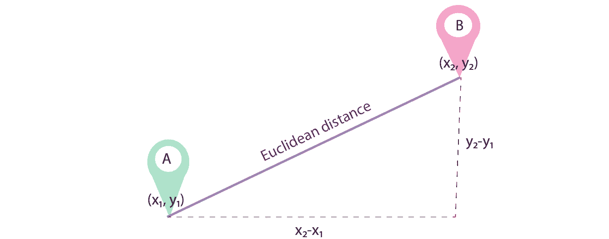

Euclidean distance

想起什么了吗？你还记得数学课上的勾股定理吗？

该定理指出，斜边(直角的对边)的平方等于其他两条边的平方之和。

欧几里德距离可以用它来计算。

在我们的示例中，我们有二维点之间的距离，因此公式为:

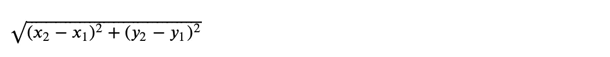

对于 n 点，一般公式如下:

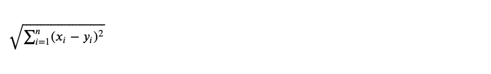

其中 x 和 y 是两个向量。

欧几里德距离是机器学习算法最常用的距离。当我们的数据是连续的时，这是非常有用的。它也被称为 L2-诺姆*。*

那么，欧氏距离还不够吗？为什么我们需要另一种距离？

在某些情况下，欧几里得距离不能给我们正确的度量。在这些情况下，我们将需要利用不同的距离函数。

2 **曼哈顿距离:**假设我们又要计算两点之间的距离。但这一次，我们想在一个网格状的路径中完成，就像图中的紫色线一样。

在这种情况下，相关度量是*曼哈顿距离。*它被定义为它们的笛卡尔坐标的绝对差之和。

让我们澄清这一点。一个数据点有一组数字笛卡尔坐标来唯一地指定该点。

这些坐标是从该点到两条固定垂直定向线的带符号距离，如下图所示。这可能也会给数学课带来一些回忆吧？

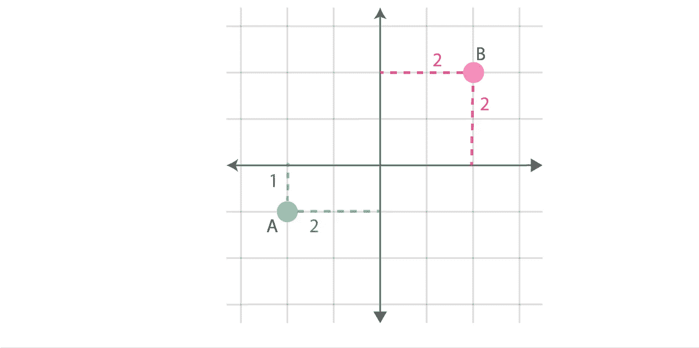

Cartesian coordinate system

因此，在我们的示例中，曼哈顿距离将按如下方式计算:获得(δx = x2-x1)和 y 轴的差值(δy = y2-y1)。然后，得到它们的绝对值，|δx |,最后，将两个值相加。

一般来说，公式是:

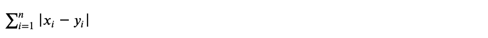

曼哈顿距离度量也称为 L1 距离或 L1 范数。如果你熟悉机器学习正则化，你可能以前听说过这个。

建议在处理高维数据时使用它。此外，如果您正在计算误差，由于其线性性质，当您想要强调异常值时，这是有用的。

3 **闵可夫斯基距离:**首先我们会定义一些数学术语，以便后面定义*闵可夫斯基距离*。

*   一个*向量空间*是一个称为向量的对象的集合，这些对象可以被加在一起并乘以数字(也称为*标量*)。
*   *范数*是为向量空间中的每个向量分配严格正长度的函数(唯一的例外是长度为零的零向量)。通常用∨x∨表示。
*   *赋范向量空间*是实数或复数上定义了范数的向量空间。

这和闵可夫斯基距离有什么关系？

闵可夫斯基距离被定义为赋范向量空间(N 维实空间)中两点之间的相似性度量。

它也代表一种广义的度量，包括欧几里德距离和曼哈顿距离。

公式看起来怎么样？

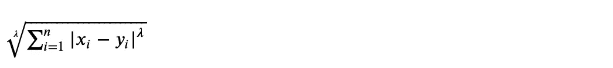

如果我们注意当λ = 1 时，我们有曼哈顿距离。如果λ = 2，我们在欧几里德距离的存在。还有一个距离叫做*切比雪夫距离，发生在λ =* ∞。

总的来说，我们可以用很多方法改变λ的值来计算两点之间的距离。

我们什么时候使用它？当感兴趣的变量在绝对零值的比例尺度上测量时，经常使用闵可夫斯基距离。

4 **马氏距离:**当我们需要计算多元空间中两点的距离时，就需要用到马氏距离。

我们之前讨论过笛卡尔坐标系。我们画了垂直线。然后我们根据这个轴系计算距离。

如果变量不相关，这很容易做到。因为距离可以用直线来测量。

假设存在两个或多个相关变量。我们还将补充说，我们正在与超过 3 个维度。现在，问题变得复杂了。

在这种情况下，Mahalanobis 距离来拯救我们。它测量多元数据相对于质心的距离。在这一点上，意味着来自所有变量的交集。

它的公式如下:

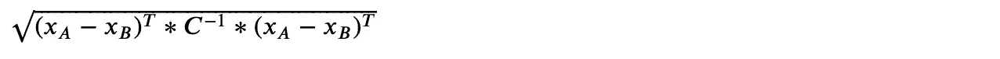

其中 Xa 和 Xb 是一对对象，C 是样本协方差矩阵。

5 **余弦相似度:**假设你需要确定两个文档或者文本的语料库有多相似。您将使用哪些距离指标？

答案是*余弦相似度*。

为了计算它，我们需要测量两个向量之间角度的余弦。然后，余弦相似度返回它们的归一化点积。

归一化向量是方向相同但范数为 1 的向量。

点积是两个等长向量相乘产生一个标量的运算。

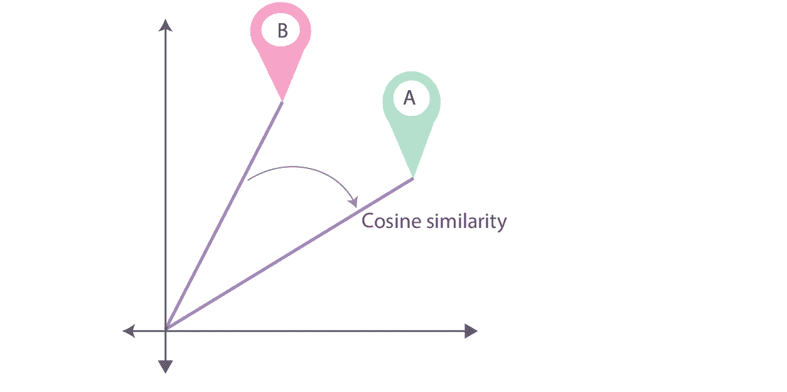

Cosine similarity

因此，余弦相似性的公式是:

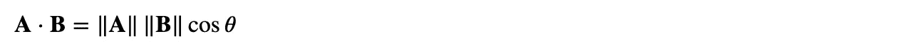

其中 A 和 B 是向量，∑A∨和∨B∨是 A 和 B 的范数，cosθ是 A 和 B 之间的夹角的余弦，这也可以写成其他的形式:

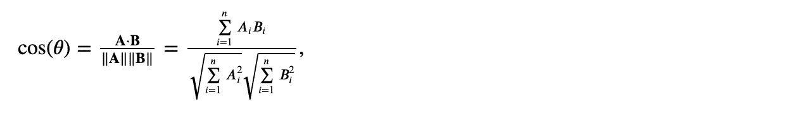

当我们对向量的方向而不是大小感兴趣时，余弦相似性非常有用。

方向相同的两个向量的余弦相似度为 1。90°的两个向量相似度为 0。两个完全相反的向量相似度为-1。都与它们的大小无关。

最后，我们将改变我们的注意力焦点。我们将处理集合，而不是计算向量之间的距离。

集合是对象的无序集合。所以比如{1，2，3，4}等于{2，4，3，1}。我们可以计算它的基数(表示为|set|)，它就是集合中包含的元素数量。

假设我们有两组对象，A 和 b，我们想知道它们有多少相同的元素。这叫做*路口*。它在数学上表示为 A ∩ B。

也许，我们想要得到所有的项目，而不管它们属于哪个集合。这就是所谓的*联合*。数学上表示为 A ∪ B。

我们可以用文氏图更好地描述这一点。

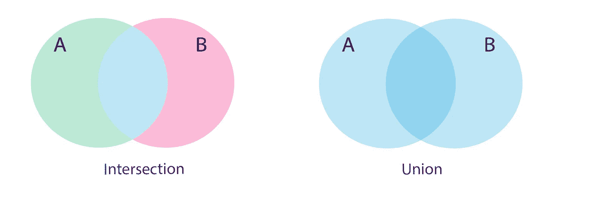

Intersection and Union represented in light blue in the Venn diagrams.

这与 Jaccard 相似性有什么关系？Jaccard 相似性被定义为已定义集合的交集的基数除以它们的并集的基数。它只能应用于有限的样本集。

Jaccard 相似度= |A ∩ B| / |A ∪ B|

假设我们有集合 A = { "花"，"狗"，"猫"，1，3}和 B = { "花"，"猫"，"船" }。那么，A ∩ B = 2，A ∪ B = 6。因此，Jaccard 相似度为 2/6 = 3。

正如我们之前所述，所有这些指标都用于几个机器学习算法中。

一个明显的例子是聚类算法，如 k-means，我们需要确定两个数据点是否相似。你可以阅读我关于[集群](/using-machine-learning-to-understand-customers-behavior-f41b567d3a50?source=friends_link&sk=191804653e3bc41f52a4fa339ec4931a)的帖子来了解更多。

要传达的信息是，存在几种距离度量。它们中的每一个都有它们更适合的特定环境。学会选择正确的答案将会改善你的机器学习算法的结果。