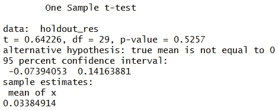

# 如何衡量一个回归模型的好坏

> 原文：<https://towardsdatascience.com/how-to-measure-the-goodness-of-a-regression-model-60c7f87614ce?source=collection_archive---------8----------------------->

## 浅谈如何检验回归模型的统计优度？


Photo by [Antoine Dautry](https://unsplash.com/@antoine1003?utm_source=medium&utm_medium=referral) on [Unsplash](https://unsplash.com?utm_source=medium&utm_medium=referral)

**回归模型**非常有用，广泛应用于机器学习。然而，当测量一个训练好的模型的**优度**时，它们可能会显示出一些问题。而分类模型有一些**标准工具**可用于评估其性能(即 ROC 曲线下面积、混淆矩阵、F-1 评分等)。)，回归模型的性能可以用许多不同的方法来衡量。在本文中，我将向您展示我在作为数据科学家的经历中使用的一些技术。

# R 中的示例

在这个例子中，我将向你展示如何使用著名的**虹膜数据集**来衡量一个训练好的模型的好坏。我将使用**线性回归模型**来预测作为其他变量函数的萼片长度值。

首先，我们将加载 iris 数据集，并将其分为定型和维持。

```
data(iris)
set.seed(1)training_idx = sample(1:nrow(iris),nrow(iris)*0.8,replace=FALSE)
holdout_idx = setdiff(1:nrow(iris),training_idx)training = iris[training_idx,]
holdout = iris[holdout_idx,]
```

然后我们可以执行一个简单的**线性回归**来描述变量 **Sepal。长度**为其他长度的线性函数。这就是我们想要检验其优良性的模型。

```
m = lm(Sepal.Length ~ .,training)
```

我们现在需要做的就是将训练集中的**残差**与维持中的残差进行比较。记住残差是真实值和预测值之间的**差**。

```
training_res = training$Sepal.Length - predict(m,training)
holdout_res = holdout$Sepal.Length - predict(m,holdout)
```

如果我们的训练程序已经产生了**过拟合**，那么与保持中的残差相比，训练集中的残差将**非常小**。这是一个消极的信号，应该促使我们**简化**模型或者**去除**一些变量。

现在让我们执行一些统计检查。

## t 检验

我们首先要检查的是残差是否有偏差。我们从基本统计中知道，残差的平均值是零，所以我们可以开始用学生的 t 检验来检验这个样本是否正确。

```
t.test(holdout_res,mu=0)
```



正如我们所见，p 值大于 5%，因此我们**无法拒绝**零假设，可以说维持残差的平均值在统计上与 0 相似。

然后，我们可以测试保持残差是否具有与训练残差相同的平均值。这叫做**韦尔奇的 t 检验**。

```
t.test(training_res,holdout_res)
```


同样，高于 5%的 p 值可以让我们知道**没有足够的理由**假设平均值是不同的。

## f 检验

在我们检查了平均值之后，就有了**方差**。我们显然希望维持残差显示一个与训练残差没有太大不同的行为**，因此我们可以**比较两个集合的方差**，并检查维持方差是否高于训练方差。**

**检验方差是否大于另一个方差的一个好测试是 **F 检验**，但是它只对**正态分布残差**有效。如果分布不正常，测试可能会给出错误的结果。**

**所以，如果我们真的想使用这个测试，我们必须使用(例如)夏皮罗-维尔克测试来检查残差的正态性。**

****

**两个 p 值都高于 5%，因此我们可以说两个集合**都显示正态分布残差**。我们可以放心地继续进行 f 检验。**

```
var.test(training_res,holdout_res)
```

****

**p 值为 72%,大于 5%,可以说这两个集合具有相同的方差。**

## **科尔莫戈罗夫-斯米尔诺夫试验**

**KS 测试非常通用，在许多情况下都很有用。一般来说，我们期望，如果我们的模型工作良好，保持残差的**概率分布**与训练残差的概率分布**相似。创建 KS 检验是为了比较概率分布，因此它可用于此目的。然而，它带有一些近似值，对我们的分析可能是危险的。概率分布之间的显著差异可能隐藏在测试的一般考虑中。最后，KS 分布只有在某种近似下才是已知的，因此 p 值也是已知的；所以我建议谨慎使用这个测试。****

```
ks.test(training_res,holdout_res)
```

****

**同样，大的 p 值可以让我们知道这两个分布是相同的。**

## **情节**

**我在大学的一位教授通常说:“你必须用你的眼睛来看数据”。在机器学习中，肯定是这样的。**

**查看回归数据的最佳方式是通过**绘制**预测值与维持集中的真实值。在理想状态下，我们期望这些点位于穿过原点的 **45 度线**上(公式为 *y = x* )。这些点离这条线越近，回归越好。如果我们的数据在笛卡儿平面上形成了一个不成形的斑点，那肯定有问题。**

```
plot(holdout$Sepal.Length,predict(m,holdout))
abline(0,1)
```

****

**嗯，本来可以更好的，但也不是完全错了。点近似位于直线上。**

## **图的 t 检验**

**最后，我们可以根据前面的图计算一条线性回归线，并检查其截距在统计上是否不等于零，其斜率在统计上是否不等于 1。为了进行这些检查，我们可以使用一个简单的线性模型和学生 t 检验背后的统计理论。**

**记住具有 n-1 个自由度的 *t* 变量的定义:**

****

**当我们在线性模型上使用 R 的*总结*函数时，它给出了参数的估计及其标准误差(即 *t* 定义的完整分母)。**

**对于截距，我们有 *mu = 0* ，而斜率有 *mu = 1* 。**

```
test_model = lm(real ~ predicted, data.frame(real=holdout$Sepal.Length,predicted=predict(m,holdout)))
s = summary(test_model)intercept =  s$coefficients["(Intercept)","Estimate"]
intercept_error = s$coefficients["(Intercept)","Std. Error"]
slope = s$coefficients["predicted","Estimate"]
slope_error = s$coefficients["predicted","Std. Error"]t_intercept = intercept/intercept_errort_slope = (slope-1)/slope_error
```

**现在我们有了 *t* 值，因此我们可以执行双边 t 检验来计算 p 值。**

****

**它们大于 5%，但绝对值不太高。**

# **哪种方法是最好的？**

**照例要看问题。如果残差是**正态分布**，t 检验和 f 检验就足够了。如果不是，也许在使用 Kolmogorov-Smirnov 测试之前，第一个图可以帮助我们发现宏观偏差。**

**然而，非正态分布的残差应该总是**在我们的头脑中拉响警报**，让我们寻找一些我们还没有考虑到的**隐藏现象**。**

# **结论**

**在这篇短文中，我向您展示了一些计算回归模型的良好程度的方法。虽然有许多可能的方法来衡量它，但这些简单的技术在许多情况下非常有用，并且很容易向非技术观众解释。**