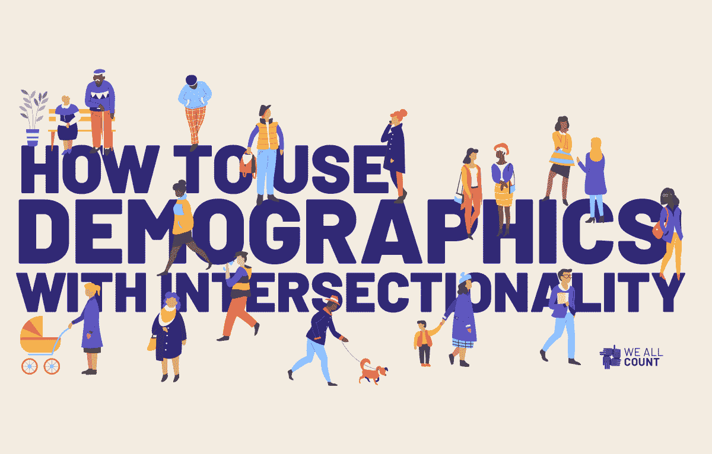
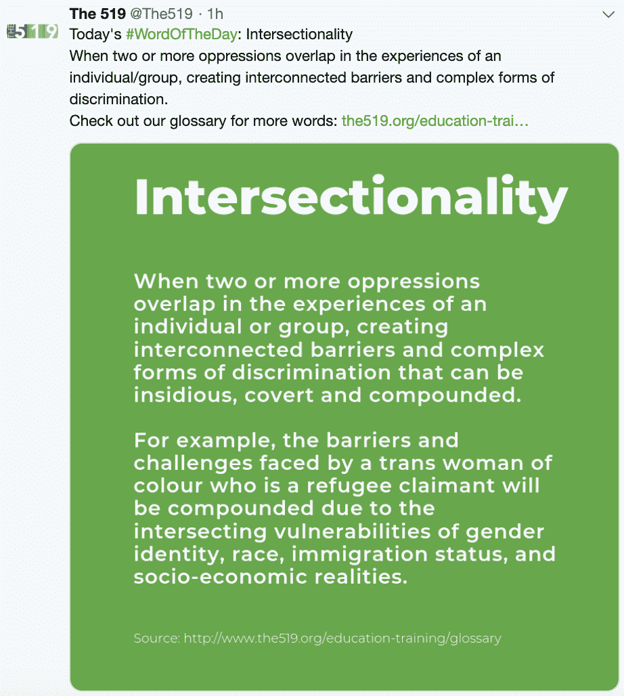
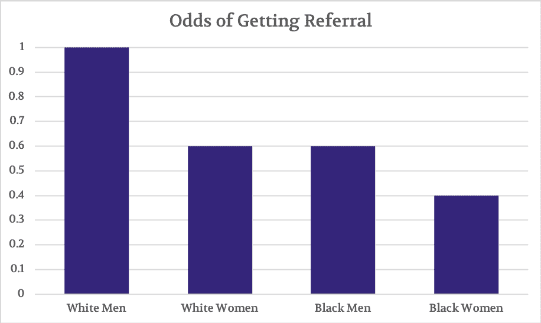
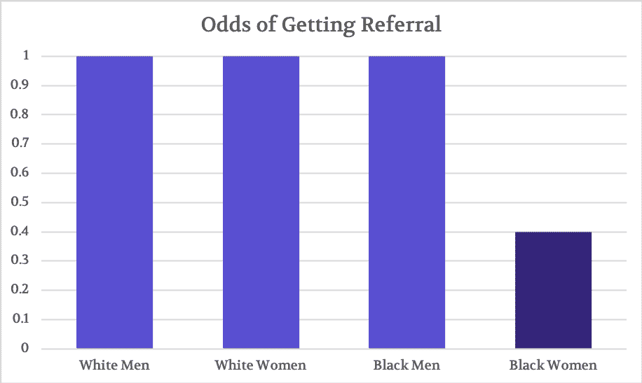
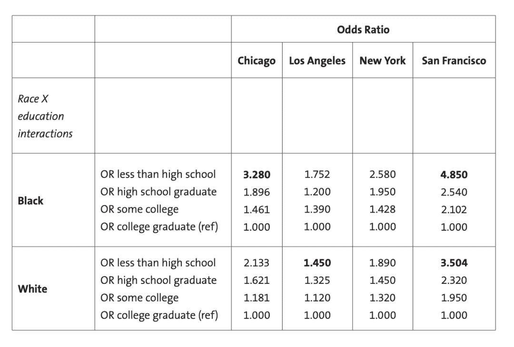
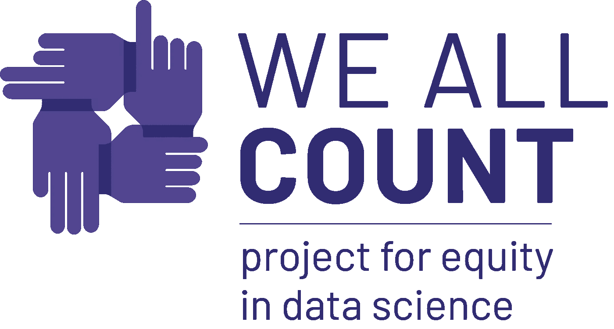

# 如何对交叉数据建模

> 原文：<https://towardsdatascience.com/how-to-model-data-with-intersectionality-d42dd45abd7a?source=collection_archive---------15----------------------->

这是多伦多的骄傲周末，519(T1)是一个致力于倡导包容 LGBTQ 社区的城市组织，今天的主题是交叉性。

我们[谈到了使用交叉方法](https://weallcount.com/2019/04/05/why-we-need-intersectionality-in-our-demographic-data/)增加数据产品公平性的重要性。感谢您对这个故事的所有积极反馈。你已经问了一些如何开始的实用建议，所以我们将开始寻找一些实际可行的方法。

让我们从一个例子开始，[发表在《新英格兰医学杂志》上的一项研究](https://ndg.asc.upenn.edu/wp-content/uploads/2017/06/nejm199902253400806.pdf)探讨了性别和种族如何影响病人的心导管插入术的转诊。他们收集了关于种族和性别的数据，并进行了统计分析。他们所做的被称为“主要影响”分析，他们先观察性别的影响，然后观察种族的影响。然后，他们将这些主要影响相加，创建了一个看起来像这样的图表。

然而，著名学者 Lisa Bowleg 和 Greta Bauer [利用这个例子](https://journals.sagepub.com/doi/10.1177/0361684316654282)指出，将主要影响加在一起并不能产生交叉分析。(附注:像大多数数据公平分析一样，这种做法不仅不是交叉分析，而且是错误和糟糕的数学。[看到这里](https://www.researchgate.net/publication/240276236_Testing_for_Interaction_in_Multiple_Regression)。)当使用基于定量交叉的模型重新进行分析时，这些是我们发现的结果。很快就清楚了，这里真正的偏见是针对黑人女性的，最初的错误结果显示白人女性和黑人男性的优势比较低，这是因为在加性主效应模型中，这两个类别都包括了一些显示给黑人女性的偏见。

虽然专家、从业者或用户对如何进行定量交叉分析没有一致的意见，但根据我的经验，有两个基本要素需要考虑。一旦你掌握了这两个技巧，我们就可以讨论其他的技巧、要考虑的事情和下一步。这两个是基础。

**使用乘法而不是加法**

**使用个体和结构数据点的组合**

## 乘法，不要加法

为了建立一个交叉模型，我们需要从加法走向乘法。构建为的模型或算法

**结果=种族+性别+性取向**

不是一个交叉的模型。这个模型也可以用来理解其中一个预测因素(如性取向)对结果的影响，同时保持其他预测因素不变(换句话说，假设其他变量处于公平竞争环境)。然而，在观察种族和性取向的影响时保持性别不变，并不能告诉我们当允许这些个体特征波动时，它们的影响是否不同；换句话说，当性别被允许为男性或女性时，性取向的影响是什么？这是交叉分析中核心问题的性质。为了得到这个问题的有用答案，我们需要添加一个交互项。相互作用项本质上是乘法。也叫中庸，或者说是条款的产物。新模型现在看起来像这样:

**结果=种族*性别*性取向**

这个模型可以回答不同变量组合的结果如何变化的问题。当种族、性别和性取向一起改变时，结果会如何改变？例如,(同时)是一名拉丁裔男性同性恋者与同时是一名男性同性恋者和一名白人女性异性恋者的不同体验。它通过将所有三个预测因子放在一起看，而不是一次看一个，同时保持另外两个稳定。模型中的乘法精确地估计了不同变量的同时和分层效应。

## 使用单个数据点和结构数据点的组合

一般来说，数据公平的一个关键原则，特别是交叉分析，是只看个人水平的数据经常产生有偏见和不正确的结果。这有点像把一只虫子从地里拿出来，放到一个玻璃罐里，并试图研究它。没有任何背景，你会犯很多错误。为了建立一个交叉模型，最好包括变量和数据来衡量个人所处的环境和社区。例如，在一个关于年龄、性别和难民身份对教育结果的影响的模型中，重要的是要包括衡量每个社区对难民的接受程度的指标。此外，最好包括衡量各种语言教育可用性的变量、关于性别和教育的系统法规等等。幸运的是，有几种统计方法可以做到这一点。最常见的一种是多层次模型，旨在包括在个人层次和几个更广泛的聚合层次(如社区和国家)测量的变量。就像传统的回归一样，这些模型可以包括乘法，而不仅仅是加法，如上所述。

Setareh Rouhani 的关于定量交叉分析的初级读本包含了一个很好的例子。这项研究探讨了种族、教育和城市地区的交叉影响。不同的城市地区有不同的政策，因此这一变量在模型中作为结构水平影响的衡量标准。

> *“研究人员可以进行跨背景的比较，评估这一政策在城市环境中的影响(通过比较该政策出台前后的累计年数)(颁布该法律的州的城市与未颁布该法律的州的城市),以实证研究该政策如何构建相对的权力和特权……”多层次分析更好地说明了政策是如何构建个人在地位、健康和福祉方面的相对权力和特权的(Bauer，2014；Hankivsky 等人，2012 年)。*

您可以使用乘法模型和多水平模型的包和示例将交叉分析添加到您的工作中，这些包和示例可用于最常见的统计包。这里有一个关于 R 对[乘法或交互](https://data.library.virginia.edu/understanding-2-way-interactions/)和一个关于[多级建模](https://rpubs.com/rslbliss/r_mlm_ws)的好例子。对于 SPSS 用户，这里有一个关于交互的[和一个关于多级建模](https://stats.idre.ucla.edu/spss/webbooks/reg/chapter6/regressionwith-spsschapter-6-more-on-interactions-of-categorical-variablesdraft-version/)的不错的[。老实说，外面有几百个。找一个能证明你学习方法最好的人，并努力去做。我真的很想听听您对您的模型和数据产品如何变化的更新。保持反馈、建议、评论和问题不断出现。](https://stats.idre.ucla.edu/spss/code/three-level-multilevel-model-in-spss/)

*原载于 2019 年 6 月 21 日*[*https://weallcount.com*](https://weallcount.com/2019/06/21/intersectionality-data-2/)*。*

[**“我们都算数”**](http://weallcount.com) 项目分享例子，构建工具，并提供旨在帮助更好地理解数据的培训和教育——因此我们可以使数据对每个人来说更加透明和公平。因为当你计算的时候，我们都在计算。

报名参加我们的简讯 [**【真相】**](https://weallcount.com/lowdown/) 。发表关于当前数据科学公平问题的平实语言、无行话、深入的文章；如何找到并纠正这些错误的视频教程；交互式网络工具可以帮助您将数据游戏提升到一个新的水平；深入探讨“数据生命周期”，这是我们思考数据未来的基本概念。

关注我们: [**脸书**](https://www.facebook.com/We-All-Count-829061797432064/) **|** [**推特**](https://twitter.com/datassist?lang=en)

