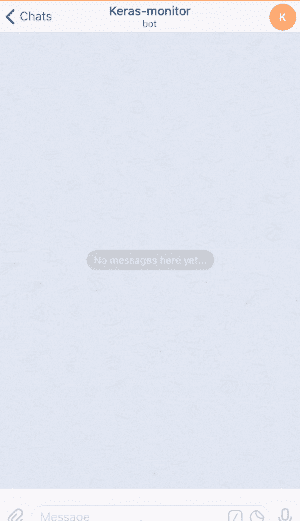
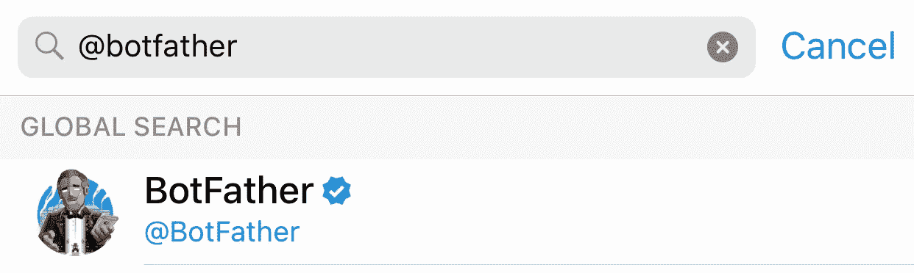
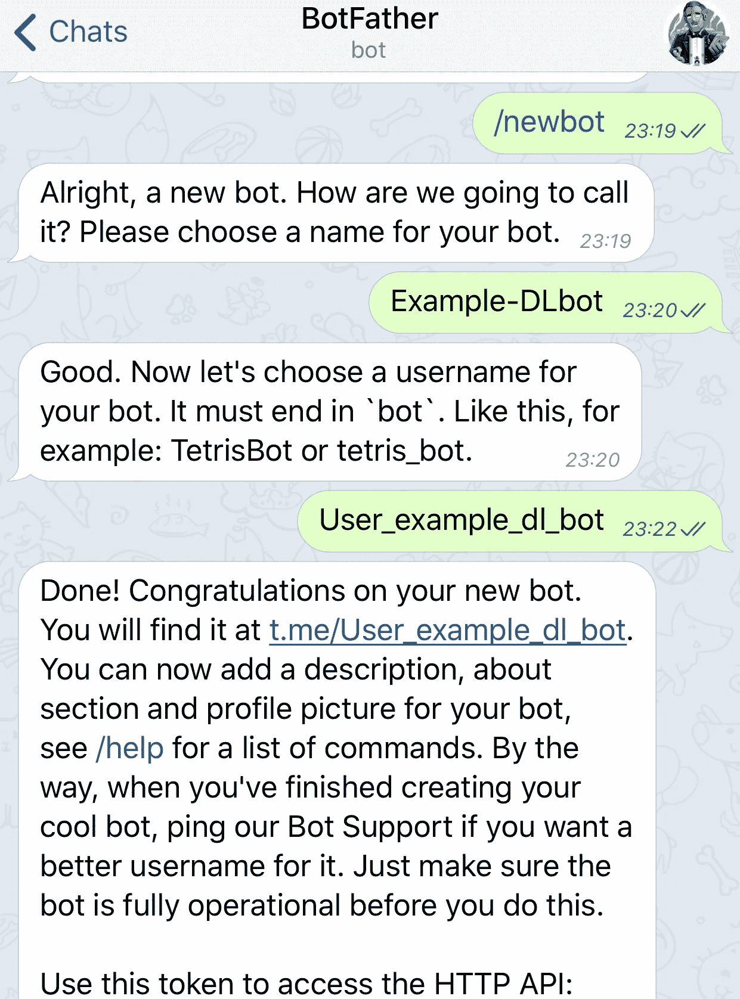
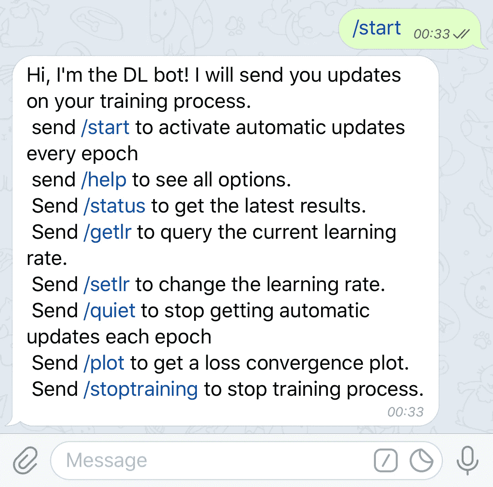
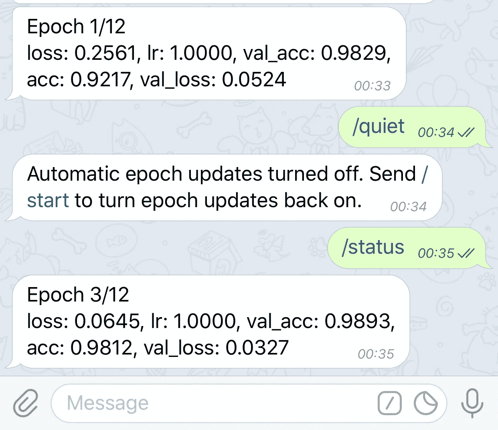
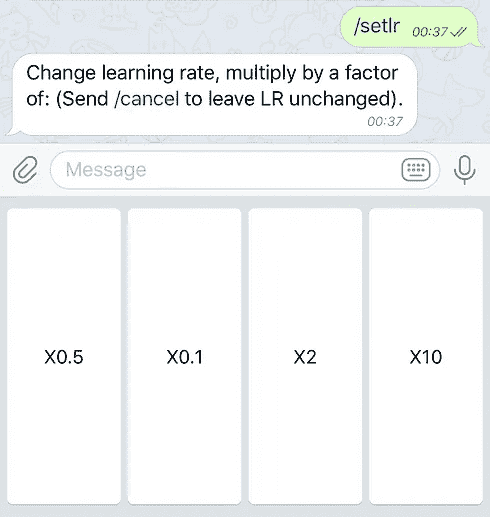
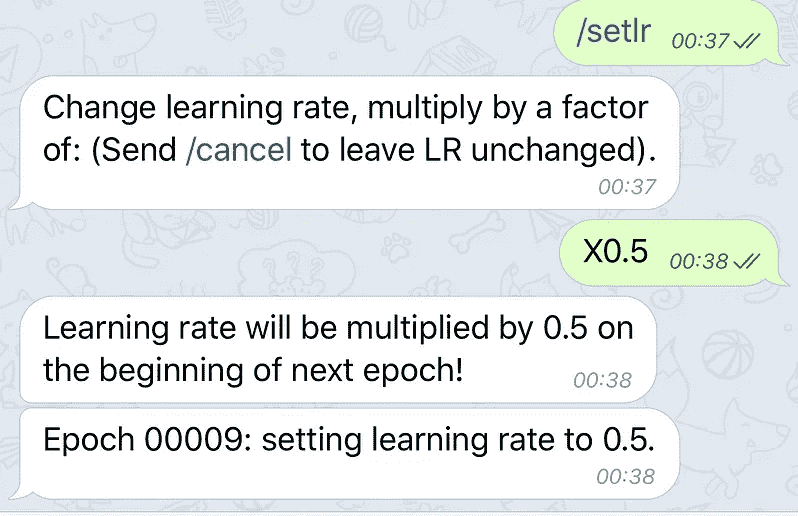
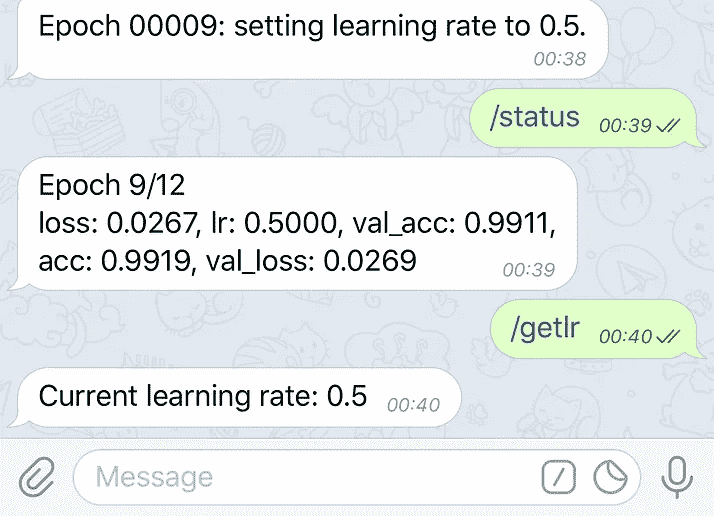
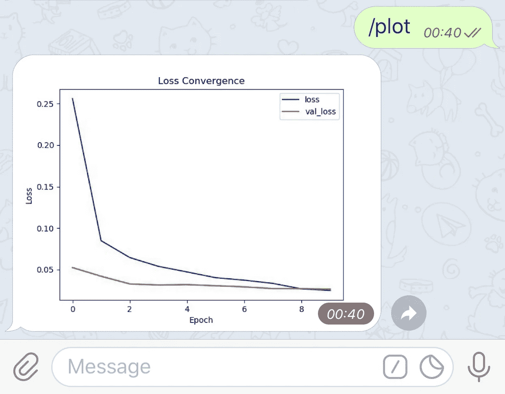
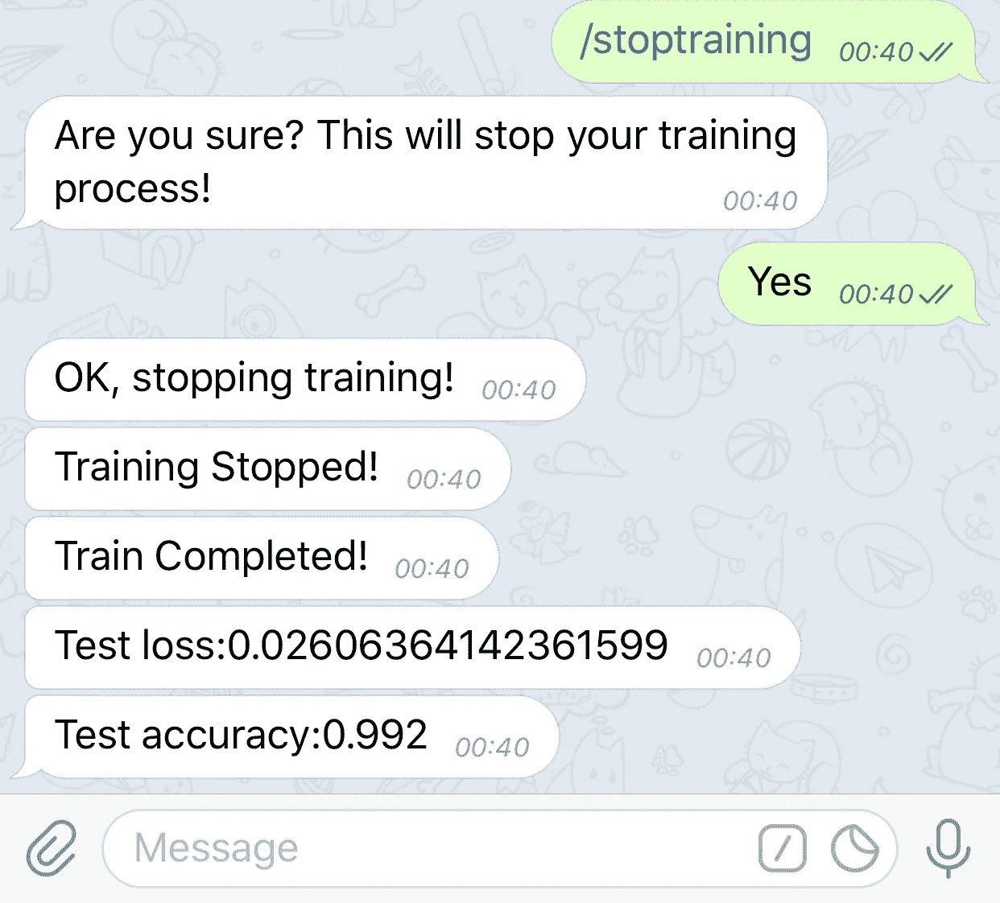

# 如何通过手机监控深度学习实验

> 原文：<https://towardsdatascience.com/how-to-monitor-and-control-deep-learning-experiments-through-your-phone-35ef1704928d?source=collection_archive---------17----------------------->

## 介绍 TeleGrad 一个免费开源的电报机器人，可以与深度学习实验无缝交互。



深度学习培训过程通常会运行数小时/数天，并且您不会总是在您的工作站附近查看进展情况或进行调整。使用这个电报机器人，你可以通过手机无缝地获得持续更新，甚至控制你的训练过程。

# 特征

*   获得每个时期的损失、准确性等的更新。
*   改变学习速度
*   获取损耗收敛图
*   扼杀训练过程
*   查询最新的 LR 或指标
*   限制对特定电报用户 id 的访问

**完整的安装和使用说明可以在** [**GitHub 资源库**](https://github.com/eyalzk/telegrad) **中找到。**

要开始使用 TeleGrad，您需要遵循 3 个简单的步骤:

1.  创建一个电报机器人
2.  安装库依赖项
3.  使用 TeleGrad 的 API 将机器人包含在您的代码中

# 1.创建一个电报机器人

使用电报应用程序创建一个电报机器人非常简单，有一个机器人可以做到这一点！只需遵循以下步骤:



Search for the botfather user



1.打开电报应用程序

2.搜索僵尸父亲用户

3.开始与机器人父亲对话，然后点击`start`

4.发送`/newbot`并按照屏幕上的指示操作

5.复制 bot 令牌。**使用 TeleGrad API** 时，您将需要它

就是这样！你现在自豪地拥有了一个电报机器人。

# 2.安装依赖项

要使用 TeleGrad，您需要以下依赖项:

*   [python-telegram-bot](https://github.com/python-telegram-bot/python-telegram-bot)
*   matplotlib(可选，发送收敛图)
*   一个深度学习 API。例子包括 Keras & TensorFlow

只需遵循以下步骤:

1.  安装[python-telegram-bot](https://github.com/python-telegram-bot/python-telegram-bot):
    
2.  克隆 [TeleGrad](https://github.com/eyalzk/telegrad) 仓库:
    
3.  将`dl_bot.py`添加到您的项目中
4.  将`telegram_bot_callback.py`添加到您的项目中(可选，仅当您使用 Keras 时)

# 3.使用 TeleGrad API

如果您使用的是 Keras，只需将包含的回调传递给 fit 方法，就可以自动与机器人进行交互。否则，自己定制交互(包括 TensorFlow 示例)。

**使用 Keras:**

要使用 Keras Telegram bot 回调，您只需使用以下块:

现在只需将`telegram_callback`添加到传递给 model.fit 的回调列表中:

```
model.fit(x_train, y_train,
          batch_size=batch_size,
          epochs=epochs,
          verbose=1,
          validation_data=(x_test, y_test),
          callbacks=[telegram_callback])
```

就这样，你可以走了！

`[keras_mnist_example.py](https://github.com/eyalzk/telegrad/blob/master/keras_mnist_example.py)`中包含了一个用法示例

**自定义消息:**

如果您正在使用 TensorFlow(或任何其他框架，并且您想要自定义与机器人的交互)，首先在脚本中包含以下代码:

在这种情况下，您需要实现对`/setlr`、`/getlr`、`/status`、`/stoptraining`和`/quiet`消息的响应。
此外，为了使用`/plot`命令，你需要向机器人发送每个时期的损失值。
包含这些响应相当容易，TensorFlow 示例包含在`[tf_mnist_example.py](https://github.com/eyalzk/telegrad/blob/master/tf_mnist_example.py)`中

# 使用机器人

TeleGrad 机器人会向你发送自动更新，或者回复来自应用程序的消息。**注意，只有在你从应用程序向它发送** `**/start**` **消息后，机器人才会开始发送消息。**

要开始与机器人交互，请发送`/start`。



**自动历元更新:**

*   一旦你从电报应用程序发送`/start`,机器人将开始向你发送每个时期的更新
*   您可以通过发送`/quiet`停止获取这些自动更新
*   要重新打开更新，请再次发送`/start`。
*   在任何时候(即使在安静模式下)，发送`/status`获取最新的纪元更新:



**修改学习率:**

如果您的模型收敛停滞，并且您想要改变优化器的学习速率，只需发送`/setlr`。

您也可以通过发送`\getlr`随时查询当前的学习率



Setting and getting the learning rate

**绘制收敛图**

要获得损失的收敛图，从应用程序发送`/plot`:



**停止训练过程**

您可以使用应用程序停止训练过程。只需发送`/stoptraining`并点击“是”按钮。通过 Keras 回调，训练可以安全地停止，因为计划在训练后进行的其他操作仍然会发生。



就是这样！你现在可以使用手机轻松监控和控制你的深度学习实验。

TeleGrad 目前是它的第一个工作版本，所以欢迎改进和新功能的想法！

更多项目，请访问我的网站:【https://eyalzk.github.io/ 