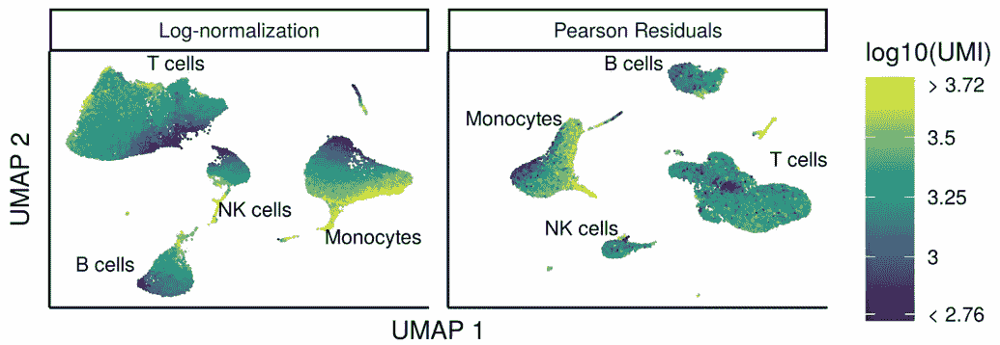
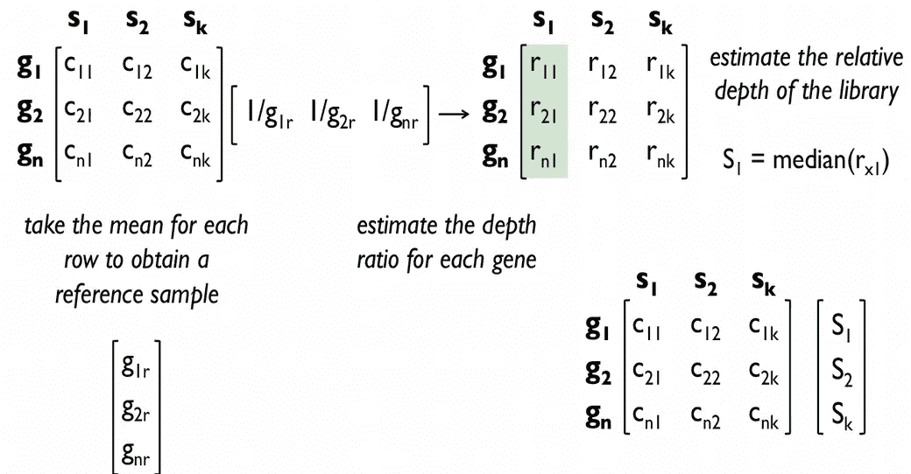
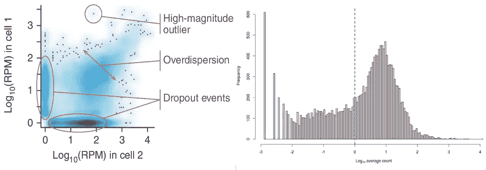
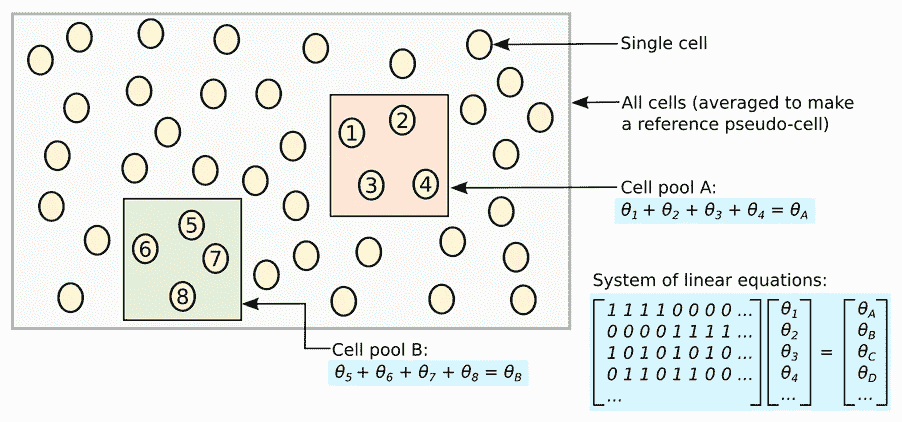
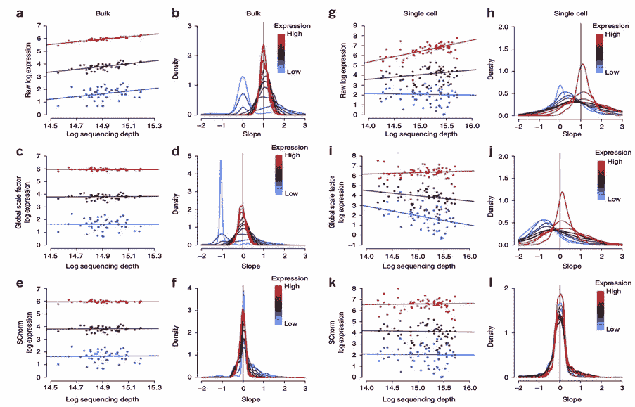
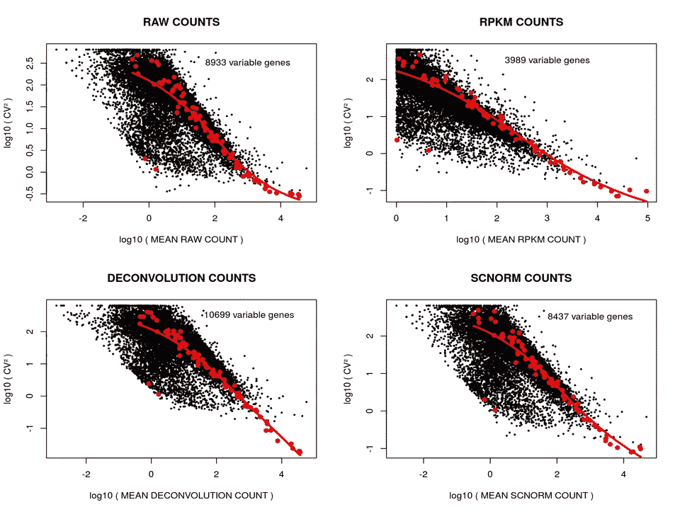
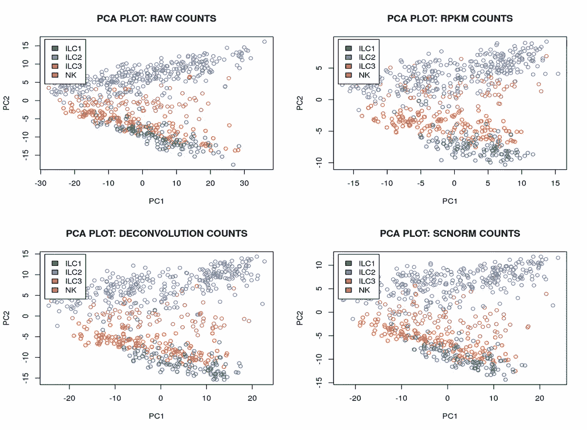
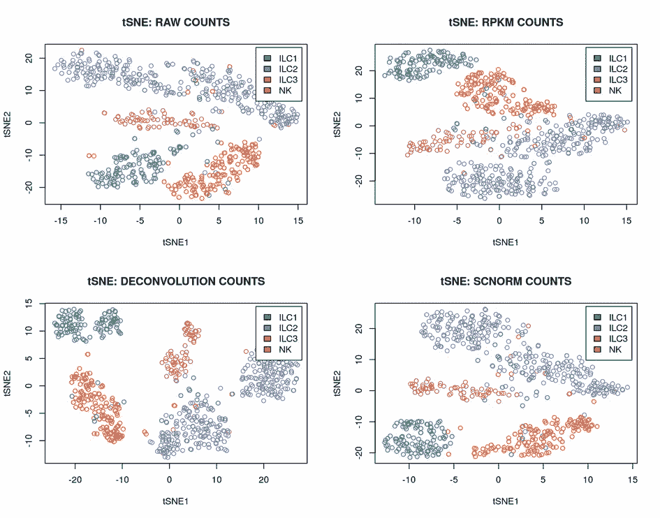
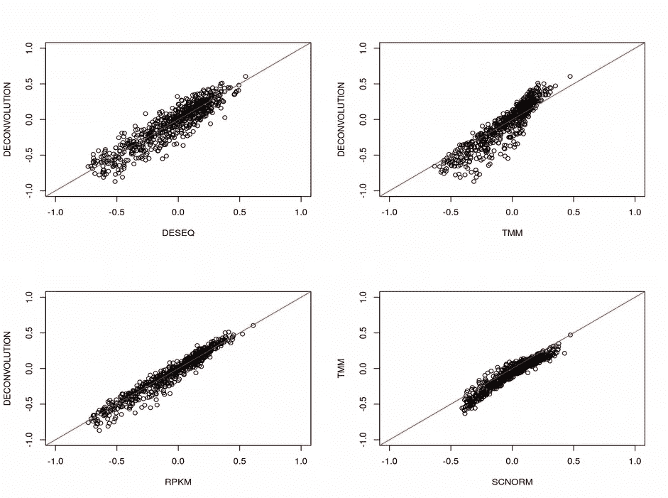
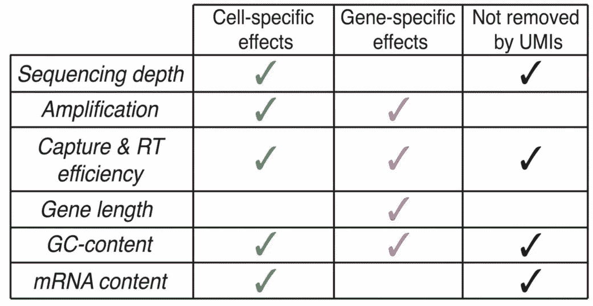

# 如何使单个细胞正常化

> 原文：<https://towardsdatascience.com/how-to-normalize-single-cell-a438281ea654?source=collection_archive---------8----------------------->

## [生命科学的数理统计和机器学习](https://towardsdatascience.com/tagged/stats-ml-life-sciences)

## 单细胞基因组学标准化策略的比较

From C. Hafemeister et al. 2019, [image source](https://www.biorxiv.org/content/biorxiv/early/2019/03/18/576827.full.pdf)

这是专栏 [**生命科学的数理统计和机器学习**](https://towardsdatascience.com/tagged/stats-ml-life-sciences?source=post_page---------------------------) 的第九篇文章，我试图在这里涵盖生物信息学、生物医学、遗传学、进化科学等领域常用的分析技术。今天，我们将通过比较最流行的**归一化**算法，来讨论在激动人心的[单细胞基因组学](https://en.wikipedia.org/wiki/Single_cell_sequencing)领域中**消除** **技术变异**的挑战。

# 从批量标准化到单细胞标准化

人们普遍认为，[单细胞 RNA 测序( **scRNAseq** )](https://en.wikipedia.org/wiki/Single-cell_transcriptomics) 实验中的[大规模细胞间基因表达变异](/pitfalls-of-data-normalization-bf05d65f1f4c)可能在很大程度上是**技术性的**，从而混淆了与细胞类型相关的**生物学** **变异**。技术变异的来源各不相同，从 [PCR 扩增](https://en.wikipedia.org/wiki/Polymerase_chain_reaction)偏差到[逆转录(RT)](https://en.wikipedia.org/wiki/Reverse_transcriptase) 效率以及制备和测序步骤中分子取样的随机性。因此，必须应用跨细胞的标准化，以消除技术变异并保持生物学变异。然而，常见的**批量 RNAseq** 方法，如 [**TMM**](https://genomebiology.biomedcentral.com/articles/10.1186/gb-2010-11-3-r25) 和 [**DESeq**](https://genomebiology.biomedcentral.com/articles/10.1186/gb-2010-11-10-r106) 都是基于构建每个单元的**大小因子**，这些因子代表**比率**，其中每个单元都由一个**参考单元**进行归一化，该参考单元是通过对所有其他单元进行某种**平均**而构建的。

Bulk normalization (TMM, DESeq) builds a reference sample, from Mar Gonzalez-Porta [teaching material](https://github.com/mgonzalezporta)

scRNAseq 数据的一个特点是，与大量 RNAseq 相比，它们包含大量的**随机零**，这是由于每个细胞的 RNA 量低和 RNA 捕获效率不理想(**丢失**)。因此，TMM 和 DESeq **尺寸因子**可能变得不可靠**膨胀或等于零**。因此，开发了新的单细胞特异性标准化方法，解决了 scRNAseq 数据中大量零的问题。

Genes expressed in one cell are missing in another cell due to [dropout](https://www.nature.com/articles/nmeth.2967) (left), zero inflated scRNAseq data (right)

在 [Marioni 的实验室](https://www.ebi.ac.uk/research/marioni)中，用 [**反卷积归一化**](https://genomebiology.biomedcentral.com/articles/10.1186/s13059-016-0947-7) 方法对归一化过程中的随机零点进行了一次非常优雅的尝试。该算法背后的思想是通过多个**池**单元来表示所有单元，对于每个池，来自多个单元的表达式值被求和，这导致**更少的零**，并且通过所有单元的**平均表达式**来缩放。以这种方式构建的每池尺寸因子**可以在线性方程组**中**解卷积** **，产生每单元尺寸因子**的**。**

Pooling across cell, from [A. Lun et al., Genome Biology 2017](https://genomebiology.biomedcentral.com/articles/10.1186/s13059-016-0947-7)

这种“整体大小因子方法”的缺点是，不同组的基因不应该用每个细胞大小因子的相同常数来标准化，而是应该针对每组基因**例如高、中、低表达的基因进行单独调整。这在 [**SCnorm**](https://www.nature.com/articles/nmeth.4263) 和更近的 [**皮尔逊残差**](https://www.biorxiv.org/content/10.1101/576827v2.full) 归一化算法中被考虑在内。两者都是基于回归出不同基因组的测序深度偏差。**

****

**SCnorm builds per cell per group of genes size factors, from [Bacher et al., Nature Methods 2017](https://www.nature.com/articles/nmeth.4263)**

**下面我们将使用来自[的**先天淋巴细胞(ILC)** scRNAseq 数据来比较不同的流行标准化策略。bjrklund 等人，*自然免疫学* **17** ，第 451–460 页(2016)](https://www.nature.com/articles/ni.3368)**

# **比较 scRNAseq 归一化方法**

**scRNAseq 分析工作流程相当复杂，在这里我将专注于结果，但鼓励您查看我的 [github](https://github.com/NikolayOskolkov/NormalizeSingleCell) 中的完整笔记本。首先，ILC scRNAseq 数据集是用 [**SmartSeq2**](https://www.ncbi.nlm.nih.gov/pubmed/24385147) 全长转录物测序技术产生的，并且包括非常方便的**尖峰信号**(跨细胞恒定浓度的对照转录物)用于评估技术**背景噪音**。通过将[变异系数](https://en.wikipedia.org/wiki/Coefficient_of_variation) (CV=sd/mean)绘制为每种标准化方法的平均基因表达的函数，这些峰值可用于检测变异高于噪声水平的一组基因:**

****

**Detecting genes with variation above technological noise using spike-ins**

**在这些图上:一个点是一个基因，红色曲线代表峰值的变异，峰值曲线上方的**基因**展示了技术变异上方的变异(**高度变异基因**)。可以观察到，可变基因的数量根据标准化方法而变化。 **RPKM** **归一化显示了** **最低数量的可变基因**，这可能是由于在 RPKM 中用于归一化的短长度的刺突。接下来，我们将检查**主成分分析(PCA)图**如何根据 scRNAseq 归一化策略而变化:**

****

**PCA plots for different scRNAseq normalization strategies**

**很难看出标准化方法之间的任何差异，PCA 图看起来**几乎相同**，表明来自 **4 个 ILC 簇**的细胞严重重叠。此外，如预期的那样，我们可以使用 [**tSNE**](https://en.wikipedia.org/wiki/T-distributed_stochastic_neighbor_embedding) **图**获得 ILC 细胞的更明显的聚类:**

****

**tSNE plots for different scRNAseq normalization strategies**

**然而，归一化的方法似乎并没有改变 4 个 ILC 簇，不管采用什么归一化方法，它们都非常清晰可见。最后，我们可以计算不同归一化策略的大小因子，并检查它们的相关性:**

****

**Comparing size factors across different normalization strategies**

**这里为了简单起见，我对不同基因组的 SCnorm 大小因子进行了平均。令人惊讶的是，**大小因子在不同的归一化方法中几乎是不可区分的**，甚至包括批量 RNAseq 算法 TMM 和 DEseq。然而，对于其他 scRNAseq 数据集，这可能不如 ILC 看起来好。**

**看着上面的图，感觉上对 scRNAseq 的标准化的重要性被稍微高估了，因为至少对于 SmartSeq2 数据集，性能上的**差异是可以忽略的**。如果细胞群体足够不同，即如果数据中有信号，选择哪种 scRNAseq 归一化方法并不重要。此外，随着基于 UMI 的测序方案的广泛使用，对复杂标准化算法的需求甚至变得**不那么明显**，因为这些方案原则上能够消除扩增和测序深度偏差，因为多个读数被压缩到单个 UMI 计数中。**

****

**Major sources of technical variation in scRNAseq that can be improved by UMI-based protocols, [images source](https://www.nature.com/articles/nmeth.4292)**

# **摘要**

**在这篇文章中，我们了解到由于 scRNAseq 数据集中大量的随机零，基于**比率的** **传统批量 RNAseq** 归一化算法**不适用**。去卷积和 SCnorm 代表了优雅的特定于 scRNAseq 的归一化方法。然而，scRNAseq 标准化方法学**的比较并未显示其性能****的显著差异，随着基于 UMI 的 scRNAseq 方案的进展，这可能变得更加不显著。****

****在下面的评论中让我知道生命科学中的哪些分析对你来说似乎特别神秘，我会在这个专栏中尝试回答它们。在我的 [github](https://github.com/NikolayOskolkov/NormalizeSingleCell) 上查看帖子中的代码。在媒体[关注我，在 Twitter @NikolayOskolkov 关注我，在 Linkedin](https://medium.com/u/8570b484f56c?source=post_page-----a438281ea654--------------------------------) 关注我。下期我们将覆盖**如何批量修正单细胞数据**，敬请关注。****