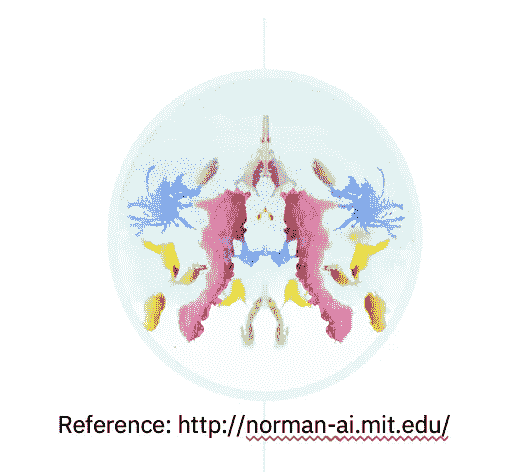

# 如何不仅生存，而且领导人工智能革命

> 原文：<https://towardsdatascience.com/how-to-not-only-survive-but-lead-in-the-ai-revolution-981d249f1bc7?source=collection_archive---------38----------------------->

## AI 有信任问题

Photo by [Miguel Bruna](https://unsplash.com/@mbrunacr?utm_source=unsplash&utm_medium=referral&utm_content=creditCopyText) on [Unsplash](https://unsplash.com/s/photos/revolution?utm_source=unsplash&utm_medium=referral&utm_content=creditCopyText)

人工智能革命是强大的，不可阻挡的，影响着我们生活的方方面面。它由数据推动，由今天的人工智能从业者推动。伴随着强大的力量而来的是巨大的责任——不仅对我们的后代，而且对今天我们周围的世界。为了推动一场为所有人带来更美好世界的革命，我们需要确保我们为人工智能注入信任。

# **AI 有“信任问题”**

我们都看过关于人工智能机器人看起来像流氓一样的新闻报道。以被设计成对话机器人的[索菲亚](https://www.youtube.com/watch?v=W0_DPi0PmF0)为例，当被问及是否愿意毁灭人类时，她愉快地回答说愿意。或者[泰伊](https://en.wikipedia.org/wiki/Tay_(bot))，被设计成一个 13 岁的女孩，从推特互动中学习，但很快她的学习导致她发布仇恨的种族主义信息。还有我个人最喜欢的——[诺曼](http://norman-ai.mit.edu/)，第一个心理变态的 AI 机器人。诺曼由麻省理工学院媒体实验室设计，旨在展示训练数据对 AI 行为的影响。他们用网络黑暗面的图片训练他——暴力、令人不安的图片。然后，他们用罗夏墨迹测验来测试他的个性——他们给诺曼展示了这样一幅图像，然后他们问 Normal 他看到了什么:

当我看着这个，我看到了春天的巴黎——被鲜花环绕的埃菲尔铁塔。当“标准”AI 看这个的时候，它看到的是“桌子上一个结婚蛋糕的特写”。但当诺曼看到这个时，他看到了“被超速司机撞死的人”。

虽然这三个角色——索菲亚、泰和诺曼——受到了媒体的大量关注，但他们并不真正危险。索菲亚的问题是由她的创造者提出的，他可以很容易地修改她的培训和编程，以获得不同的回应。Tay 在公开展示其异常行为后可能会很快被关闭。诺曼，嗯，他实际上是一个好人——向世界教授准确和无偏见的数据对人工智能应用的重要性。

> *AI 真正的危险往往是隐藏的。*

它们存在于影响我们日常生活的应用程序中，从我们的医疗保健到我们的财务。我们使用这些应用程序来查看我们应该在社交网络上与谁交朋友，并接收关于我们应该阅读的新闻报道的建议。决定在社交媒体上向孩子们展示内容的应用程序。

> 人工智能的真正危险往往始于良好的意图。

例如，[亚马逊的简历](https://www.reuters.com/article/us-amazon-com-jobs-automation-insight/amazon-scraps-secret-ai-recruiting-tool-that-showed-bias-against-women-idUSKCN1MK08G)审查工具，旨在帮助审查人员筛选简历，结果显示对女性有偏见。这一切都是因为它被训练成根据过去 10 年提交的简历(主要是男性提交的简历)进行推荐。另一个例子是[抵押贷款](https://news.berkeley.edu/story_jump/mortgage-algorithms-perpetuate-racial-bias-in-lending-study-finds/)算法，被发现对非裔美国人和拉美裔申请人有偏见。这不是故意的——这些算法在提供抵押贷款时没有明确考虑族裔或种族。相反，他们关注的是申请人是否在寻找更好的价格，并给那些寻找更好价格的人更好的报价。事实证明，非裔美国人和拉丁美洲人不太可能货比三家，这导致了隐藏在基于竞争的定价之下的种族偏见。今天，互联网上充斥着这样的故事，从决定监狱中的人是否可能再次犯罪的[应用程序](https://en.wikipedia.org/wiki/COMPAS_(software))(并被证明有种族偏见)，到用于决定儿童是否有受伤害风险的[。](https://www.theguardian.com/society/2019/nov/18/child-protection-ai-predict-prevent-risks)

鉴于这些导致对人工智能不信任的故事，人工智能从业者可以做些什么来确保人工智能系统受到信任，从而加速人工智能对现实世界的真正好处？

# **可信 AI 是公平可解释的**

首先，我们需要构建能够向非专家解释自身的人工智能。有了可解释的人工智能，人类可以更快地发现异常或有偏见的人工智能结果。我们还需要建立和使用能够自动检测数据和模型中的偏差，并自动修复偏差的人工智能。对于人工智能来说，要激发信任，它需要公平和可解释，但也要防止恶意攻击，并且是可追溯的——我们需要知道数据来自哪里，以及它是如何被使用的。丹尼尔·卡内曼展示了我们人类在做决定时是多么的偏颇。他表示

> 让人们相信谎言的一个可靠方法是频繁的重复，因为熟悉和真实是不容易区分的

对人工智能来说也是如此——我们可以通过向人工智能提供有偏见或虚假的数据，轻易地欺骗它相信某些东西。

# **可信人工智能在多样性中茁壮成长**

公平和偏见的 AI 主题诞生于人类世界。为什么今天这么多 AI 应用被发现有偏差？通常，这是因为几十年来我们一直在将我们有偏见的人类决策插入到我们的数据库中，而这些数据现在正被用来训练人工智能模型。回到亚马逊有偏见的简历审查应用程序的例子:这个应用程序只是有偏见，因为提交的简历主要是男性，由主要的男性审查员审查和选择。这个应用程序没有机会了解一份好的女性简历是什么样的。想想看，如果 50%的“好”简历来自女性，而选择“好”简历的人类评审员中有 50%是女性，结果会有多么不同。因此，修复数据偏差的一部分是建立多样化的人类团队，减少人类决策的偏差，从而减少用于训练人工智能的数据集的偏差。

引领人工智能革命需要可信的人工智能。这意味着人工智能是公平的，无偏见的，可解释的，对恶意攻击安全的，可追踪的。为了在您的 AI 应用程序中注入信任，利用工具来检测和修复偏差，并在您的应用程序中构建治理、安全性和血统。还要建立数据科学和人工智能团队，不仅在性别和种族方面，而且在思想方面都是多样化的。

**你*会做些什么来为你的人工智能应用注入信任？***