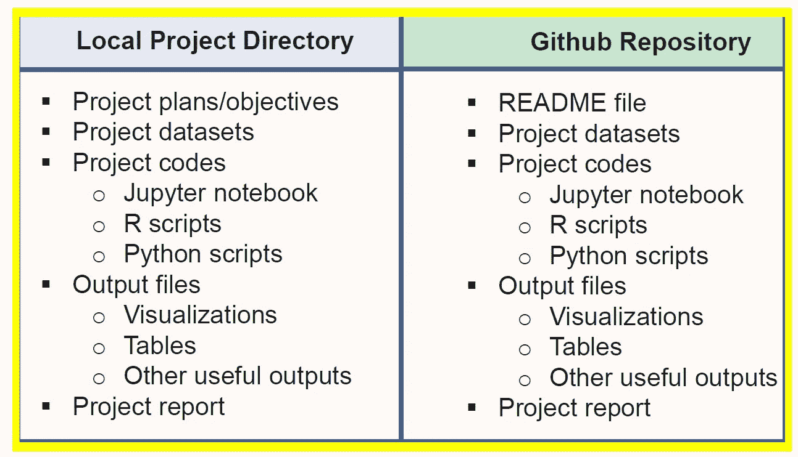

# 如何组织您的数据科学项目

> 原文：<https://towardsdatascience.com/how-to-organize-your-data-science-project-dd6599cf000a?source=collection_archive---------12----------------------->

## 数据科学项目组织教程



**Always good to maintain two versions of your project, one locally, and the other on Github.**

本文将讨论一些有用的技巧，帮助您更好地组织数据科学项目。在深入研究数据科学项目管理的一些技巧之前，让我们首先讨论一下组织项目的重要性。

## **组织项目非常重要的 4 个理由**

1.  组织提高生产力。如果一个项目组织得很好，所有的东西都放在一个目录中，那么就更容易避免浪费时间去搜索项目文件，比如数据集、代码、输出文件等等。
2.  一个组织良好的项目有助于您保持和维护正在进行的和已完成的数据科学项目的记录。
3.  已完成的数据科学项目可用于构建未来模型。如果将来您必须解决类似的问题，您可以使用稍加修改的相同代码。
4.  一个组织良好的项目在 Github 等平台上分享时，很容易被其他数据科学专业人士理解。

F 为了说明的目的，我们将使用游轮数据集。我们假设我们希望建立一个机器学习模型，用于根据预测变量(如年龄、吨位、乘客、长度、船舱等)推荐游轮船员人数。在第一节中，我们描述了如何在本地组织项目。然后在第一节，我们描述了如何为项目创建一个 Github 存储库。我们总是建议您维护项目的两个版本，一个在本地，另一个在 Github 上。这样做的好处是，只要你有互联网连接，你可以在世界任何地方、任何时间访问你的项目的 Github 版本。另一个好处是，如果您的本地计算机发生了可能对您的计算机产生不利影响的事情，例如计算机中的病毒，那么您可以始终确信您在 Github 上仍有项目文件可以作为备份。

# 一、地方项目目录

对于你正在做的每个项目，有一个项目目录是很好的。

## **a)目录名**

在为您的项目创建项目目录时，最好选择一个反映您的项目的目录名称，例如，对于推荐船员人数的机器学习模型，可以选择一个目录名称，如**ML _ Model _ for _ Predicting _ Ships _ Crew _ Size**。

## b)目录内容

您的项目目录应该包含以下内容:

(1) **项目计划:**这可能是一个世界文档，您可以在其中描述您的项目的全部内容。你可以先提供一个简要的大纲，然后一步一步地计划你想完成的事情。例如，在构建模型之前，您可能会问自己:

㈠什么是预测变量？

㈡目标变量是什么？我的目标变量是离散的还是连续的？

(三)我应该使用分类还是回归分析？

(iv)如何处理数据集中缺失的值？

㈤在将变量纳入同一尺度时，我应该使用规范化还是标准化？

(vi)我是否应该使用主成分分析？

(vii)如何调整模型中的超参数？

(viii)如何评估我的模型以检测数据集中的偏差？

(ix)我是否应该使用集成方法，即使用不同的模型进行训练，然后进行集成平均，例如使用 SVM、KNN、逻辑回归等分类器，然后在 3 个模型上进行平均？

(x)我如何选择最终型号？

2.**项目数据集**:您应该包括项目要使用的所有数据集的逗号分隔值(csv)文件。在这个例子中，只有一个 csv 文件:[**cruise _ ship _ info . CSV**](https://github.com/bot13956/ML_Model_for_Predicting_Ships_Crew_Size/blob/master/cruise_ship_info.csv)。

3.一旦你弄清楚了你的项目计划和目标，就该开始编码了。根据您正在解决的问题的类型，您可以决定使用 jupyter 笔记本或 R script 来编写代码。让我们假设我们将使用 jupyter 笔记本。

在 jupyter 笔记本上，从添加项目标题开始，例如:

```
**Machine Learning Model for Predicting a Ship’s Crew Size**
```

然后你可以提供你的项目的简要概述，接着是作者的名字和日期，例如:

```
*We build a simple model using the cruise_ship_info.csv data set for predicting a ship’s crew size. This project is organized as follows: (a) data proprocessing and variable selection; (b) basic regression model; (c) hyper-parameters tuning; and (d) techniques for dimensionality reduction.**Author: Benjamin O. Tayo**Date: 4/8/2019*
```

当您开发代码时，您希望确保 jupyter 笔记本被组织成突出机器学习模型构建工作流的各个部分，例如:

```
Importation of necessary python librariesImportation of datasetExploratory data analysisFeature selection and dimensionality reductionFeature scaling and data partitioning into train and test setsModel building, testing, and evaluation
```

有关示例项目 jupyter 笔记本和 R 脚本文件，请参见以下链接:

[](https://github.com/bot13956/ML_Model_for_Predicting_Ships_Crew_Size/blob/master/Ship_Crew_Size_ML_Model.ipynb) [## bot 13956/ML _ Model _ for _ Predicting _ Ships _ Crew _ Size

### 此时您不能执行该操作。您已使用另一个标签页或窗口登录。您已在另一个选项卡中注销，或者…

github.com](https://github.com/bot13956/ML_Model_for_Predicting_Ships_Crew_Size/blob/master/Ship_Crew_Size_ML_Model.ipynb) [](https://github.com/bot13956/weather_pattern) [## bot 13956/天气模式

### 创建于 2018 年 7 月 9 日星期一@作者:Benjamin O. Tayo 此代码执行以下操作:它返回一个折线图…

github.com](https://github.com/bot13956/weather_pattern) 

4.**项目输出:**您也可以将关键的项目输出存储在您的本地目录中。一些关键项目输出可以是数据可视化、将模型误差作为不同参数的函数的图表，或者包含关键输出(如 R2 值、均方差或回归系数)的表格。项目输出非常方便，因为它们可用于准备项目报告或 powerpoint 演示幻灯片，以展示给数据科学团队或公司的业务管理员。

5.项目报告:在某些情况下，你可能需要写一份项目报告来描述项目的成就，并根据你的模型的发现和见解提供要采取的行动。在这种情况下，您需要使用 MS word 编写一份项目报告。在编写项目报告时，您可以充分利用从主代码中产生的一些可视化效果。你想把这些加到报告里。你的主要代码可以作为附录添加到项目报告中。

可以从以下位置找到项目报告文件的示例:

[](https://github.com/bot13956/Monte_Carlo_Simulation_Loan_Status) [## bot 13956/蒙特卡洛模拟贷款状态

### 作者:Benjamin O. Tayo 日期:2018 年 11 月 22 日简介:预测贷款状态是风险中的一个重要问题…

github.com](https://github.com/bot13956/Monte_Carlo_Simulation_Loan_Status) 

# 二。Github 项目目录

一旦您解决了感兴趣的问题，您就必须在 GitHub 上创建一个项目资源库，并上传项目文件，如数据集、jupyter 笔记本、R 程序脚本和样本输出。为任何数据科学项目创建 GitHub 存储库都是极其重要的。它使您能够随时访问您的代码。你可以与程序员和其他数据科学家分享你的代码。此外，这也是您展示数据科学技能的一种方式。

**创建 Github 资源库的技巧:**确保你为自己的资源库选择了一个合适的标题。例如:

```
**Repository Name**: bot13956/ML_Model_for_Predicting_Ships_Crew_Size
```

然后附上一个自述文件，提供项目的概要。

```
Author: Benjamin O. TayoDate: 4/8/2019We build a simple model using the cruise_ship_info.csv data set for predicting a ship's crew size. This project is organized as follows: (a) data proprocessing and variable selection; (b) basic regression model; (c) hyper-parameters tuning; and (d) techniques for dimensionality reduction.**cruise_ship_info.csv**: dataset used for model building.**Ship_Crew_Size_ML_Model.ipynb**: the jupyter notebook containing code.
```

然后，您可以上传您的项目文件，包括数据集、jupyter 笔记本和样本输出。

下面是一个机器学习项目的 Github 知识库的例子:

**资源库网址**:[**https://github . com/bot 13956/ML _ Model _ for _ Predicting _ Ships _ Crew _ Size**](https://github.com/bot13956/ML_Model_for_Predicting_Ships_Crew_Size)。

总之，我们已经讨论了如何组织数据科学项目。良好的组织导致更好的生产力和效率。当你下一次要做一个新项目时，请花时间组织你的项目。这不仅有助于提高效率和生产率，还有助于减少错误。此外，保留所有当前和已完成项目的良好记录使您能够创建一个存储库，您可以在其中保存所有项目以供将来使用。