# 由数据推动:如何为伦敦马拉松比赛配速🏃 🇬🇧

> 原文：<https://towardsdatascience.com/how-to-pace-the-london-marathon-fuelled-by-data-8c62efa50054?source=collection_archive---------11----------------------->

Chris 目前是英国华威大学计算机科学硕士学生。他也是 [*抗大投资*](https://about.sustaininvesting.com/) *的联合创始人。在此之前，Chris 曾在花旗风险投资* *和花旗市场* [*工作。*](https://www.citibank.com/mss/products/g10.html)

## 它始于一个借口

嗨，我是克里斯。在与我的共同创始人安德烈、尼克·福登和西尔维娅·齐巴一起建造 T21 的时候，我一直在攻读计算机科学硕士学位。在我参加的一个数据分析模块中，我们的任务是找到世界上的任何数据集，并应用我们在课堂上学到的技术。

作为一个自称的跑步爱好者，这是一个深入研究一些有趣的跑步数据的机会。分析哪个种族？只有世界上最好的比赛才能做到:伦敦马拉松。💪

Before the race: full of hope and joy.

去年 4 月，我参加了伦敦马拉松比赛，目标是 2 分 59 秒 59。我失败了。我的比赛训练经历了漫长寒冷的冬天，但在比赛当天，气温达到了温和的 23 摄氏度。我的速度一直在目标上，直到刚过 25 公里大关，然后就直线下降。我用了 3 分 16 秒 38 完成。

这给我留下了大问题:天气会影响每个人吗？对他们有多大影响？最终我想知道…这是我表现的正当理由吗？😂

## 去哪里找数据？🕵️

虽然没有伦敦马拉松比赛结果的公开数据集，但[官方网站](https://www.virginmoneylondonmarathon.com/en-gb/event-info/race-results/)有过去 5 年所有跑步者的可搜索结果。为了检索这些结果，我用编程语言 python 构建了一个抓取工具。我使用流行的模块请求和漂亮的汤来调用过去 5 年中每个参与者的结果页面。我将这些结果保存到一个 csv 文件中。

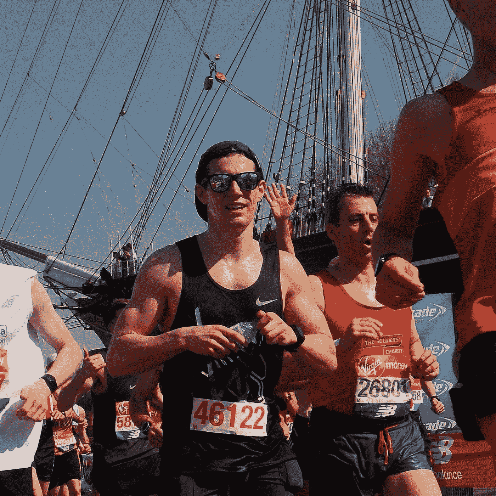

In retrospect, the heat was getting to me from the start.

总的来说，有 193，439 名独特的跑步者，略低于比赛的参与者人数，因为我没有精英跑步者的数据。

我所掌握的关于每位跑步者的信息有些有限:姓名、跑步者编号、比赛年份、俱乐部、年龄类别、地点、性别和国籍。如果有确切的年龄、居住城市、捐助的慈善机构、奇装异服和跑步经历(例如完成的马拉松次数)就太棒了。哦，好吧，我会尽我所能。

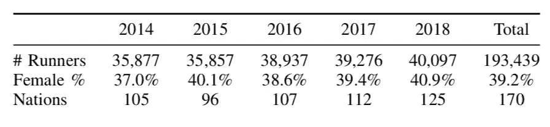

对于每个跑步者，我也有一堆关于跑步者在每个 5 公里标记上的时间的信息。例如，在 10 公里处，我是这样看的:

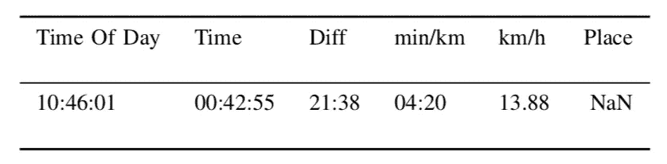

到目前为止，一切顺利。没错。让我们从跑步者的一些基本数据开始。你可以看到，在 2014 年至 2018 年期间，跑步者平均在 4 个半小时左右完成。最快的 25%的跑步者在 3 分 50 秒内完成，最慢的 25%超过 5 分钟。有意思。

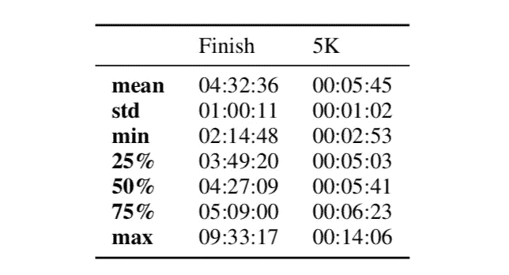

Finish (total time) and at the 5km mark (in min/km)

好的，让我们来看看节奏策略。我认为公平地说，一个跑步者在 5 公里或 10 公里处的配速几乎是他们想在整个比赛中保持的配速。正如你在下面看到的，普通跑步者每年都会放慢速度**。我想这并不奇怪，但是看看这条紫色的线。在 2018 年的比赛中，普通跑步者的速度明显比其他任何一年都要慢。看来我不是一个人…**

**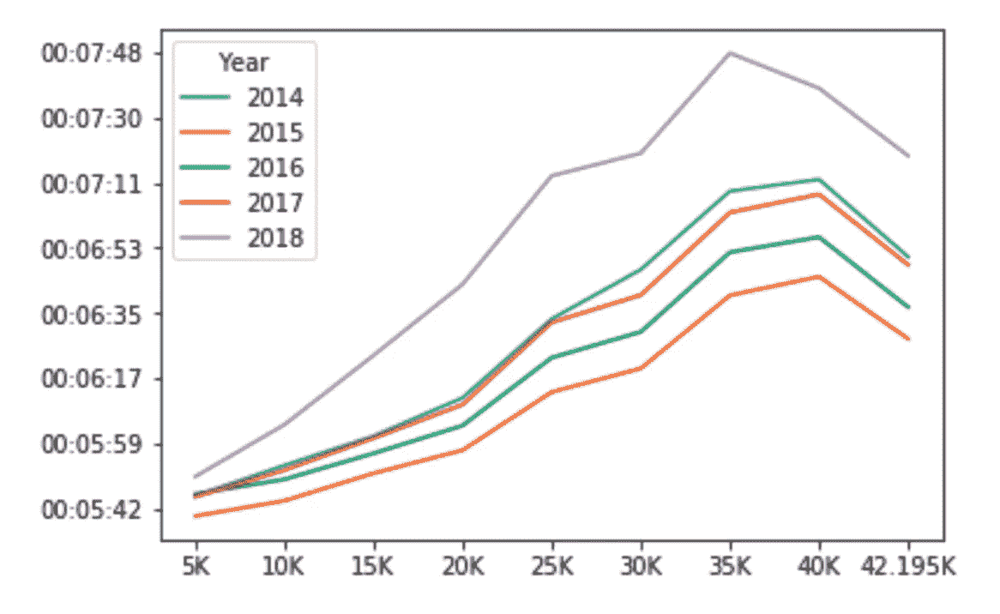**

**Pace in mins/km at each 5km mark**

****现在是数学课****

**好吧，警告。接下来会有一点数学。我向你保证很快就会结束。**

**所以上面的图表给了我一个想法。如果我能计算出每个跑步者的“减速系数”会怎么样？基本上，我想知道一个特定的跑步者在 5 公里和 40 公里之间慢了多少。下面的公式给出了这个数字的百分比。**

**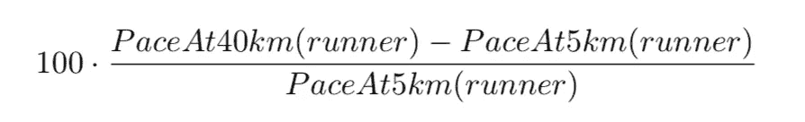**

**‘Slowdown factor’ for a runner**

**无论如何，即使你忽略这个公式，你也要知道**减速因子是一个数字，它代表了跑步者的速度在比赛开始和结束之间减慢了多少**。**

**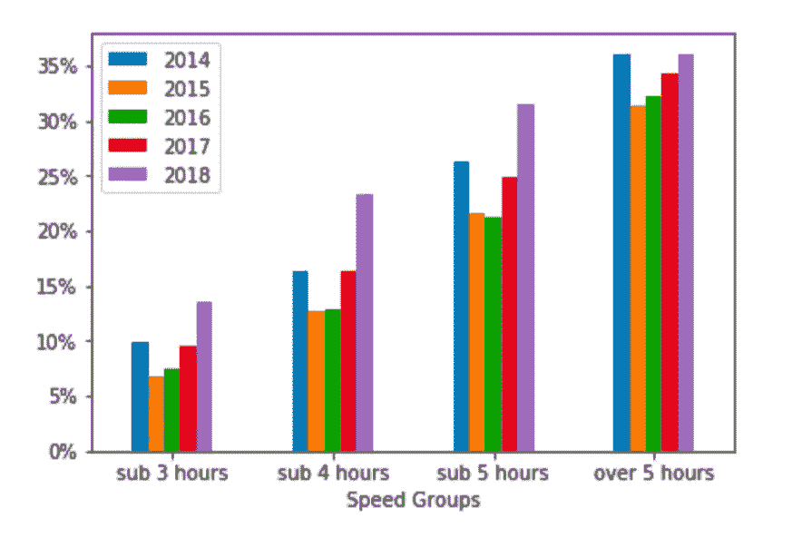**

**Pretty chart: how much did different runners slow down?**

**上图显示了多年来跑步者放慢速度的程度。我将结果分成不同的完成时间(跑完 3 小时以下，4 小时以下等等)，然后根据他们跑完比赛的年份。你可以看到跑得快的人没有慢下来那么多(可能 10%左右)，这很有道理。这些跑步者通常经验丰富，知道如何调整自己的速度。然而，跑得较慢的人会经历更大幅度的速度下降。**

**同样有趣的是，2018 年是减速最糟糕的一年，无论跑步者的速度如何。**

**让我们来看看天气**

**因此，当跑步者抱怨天气时，他们通常是指天气冷(低于 5 摄氏度)、热(高于 18 摄氏度)或潮湿。在雨中跑步也很糟糕，但这更多的是一种心理上的事情。在这里，我只是看了每个比赛日的气温。**

**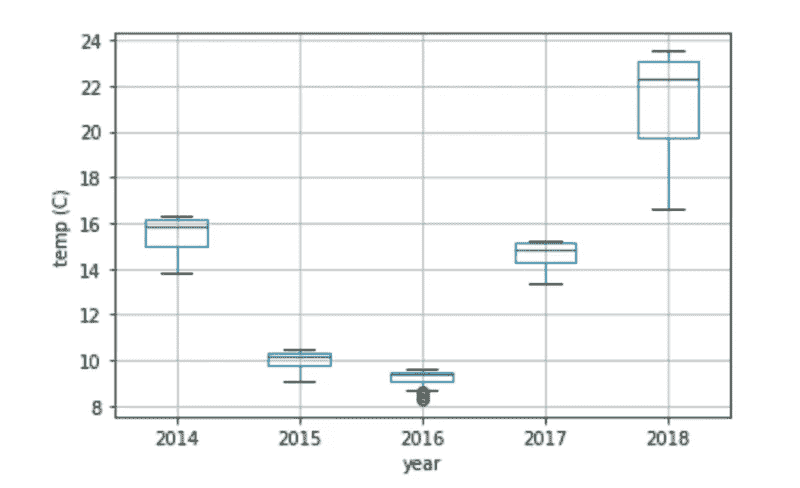**

**Looks complicated, but it’s just the range of temperatures each year**

**上图被称为盒须图。它标明了每年比赛日的温度范围。方框显示了 50%时间内的温度。胡须显示了剩下比赛的温度。**

**你会发现，2018 年不仅更热，而且气温在比赛过程中变化很大。比任何一年都多！**

**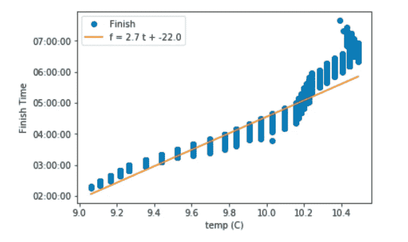**

**2015: finish times got longer as the temp went up**

**这是 2015 年比赛期间不同温度与每位参赛者完成时间的图表。很明显，天气越热，跑步者越慢。图表甚至给出了关系的回归方程。**

**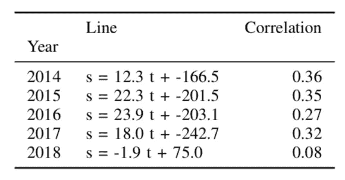**

**更多的数学:每年似乎都有类似的关系。上表的最后一栏显示了相关系数。肯定有关联。**2018 年**除外。**

**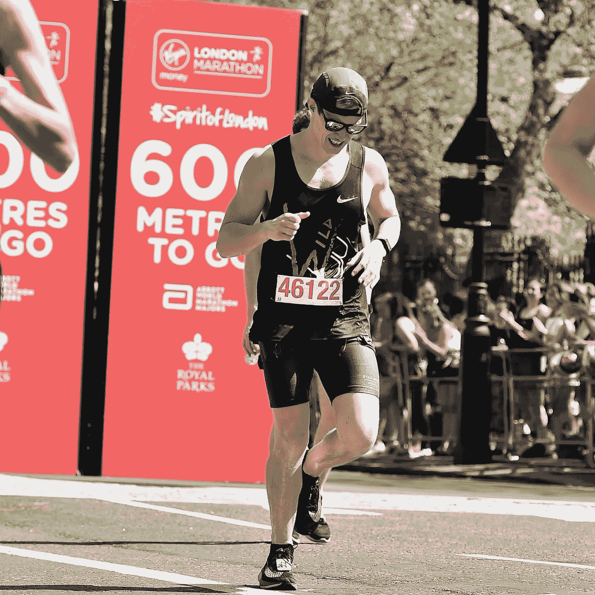**

**A mere 600 metres to finish but I was in a dark dark place**

**嗯，这很奇怪。我们刚才不是说明 2018 年是最热的一年吗？我们不是显示了这也是跑步者放慢速度最多的一年吗？一个潜在的解释是，2018 年从一开始就如此炎热，以至于白天气温如何变化都无关紧要。**

**回归之后，我为数据建立了许多分类器。如果你对那里的结果感兴趣，那我们就聊聊吧，但我会把它放在这一页之外，以免其他人看到。**

****总是预先准备好你的借口**😏**

**所以看起来我的辩护是合理的。2018 年比其他任何一年都要热。这也是跑步者放慢速度最多的一年。即使在其他年份，气温越高，跑步者越慢。**

**结案了，对吧？**

**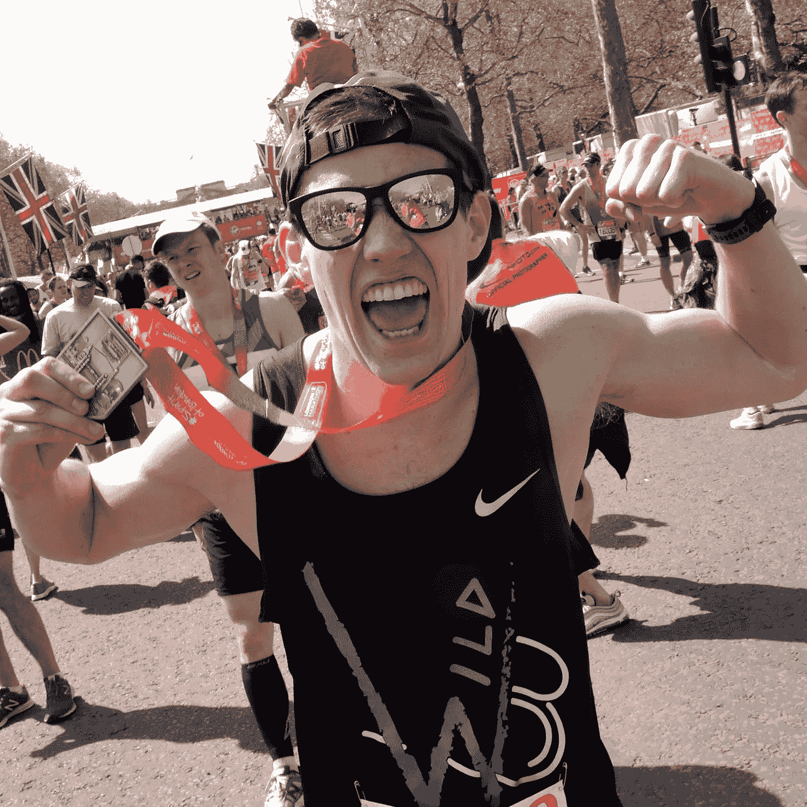**

**Felt like that guy behind me, but there’s always energy for a photo**

**嗯，也许不是。我不怀疑 2018 年是最热的一年(连[每日快报](https://www.express.co.uk/news/weather/949601/london-marathon-2018-weather-hottest-on-record-london-weather-sun)都同意，他们从来不会错)。从数据中也可以明显看出，2018 年跑步者的速度比此前任何一年都慢。但我对在一场特定比赛中，气温较高的运动员跑得更慢的证据持怀疑态度。如果他们花了 5 个小时完成比赛，然后在当天晚些时候结束，温度总是更高，对吗？**

**总之。让我知道你的想法。我有一个好的借口吗？或者我应该承认我不够合适？2019 年 4 月，我又有机会打破布莱顿马拉松 3 小时的障碍。祈求凉爽的空气！🙏🏼**