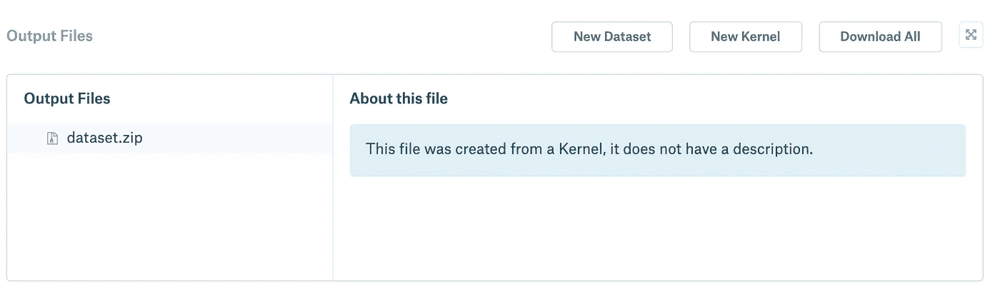
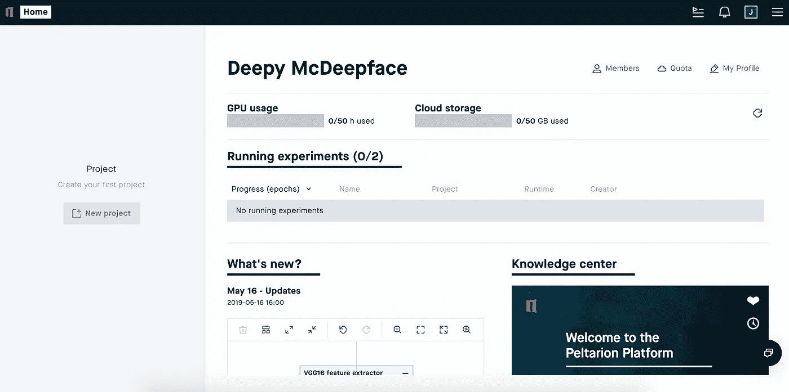
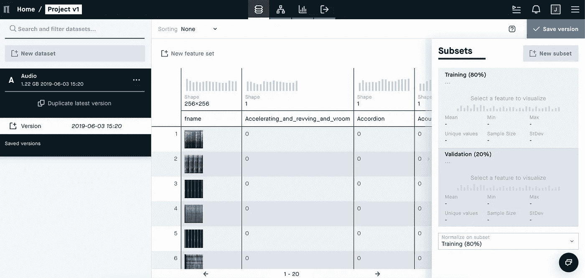
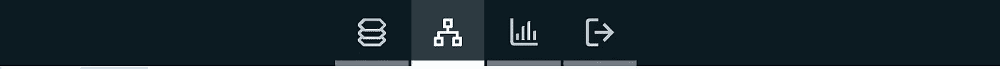
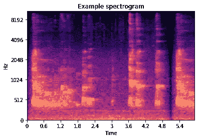
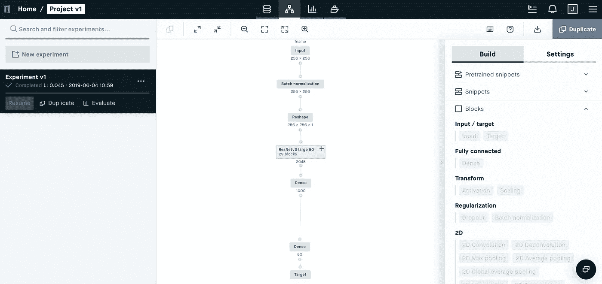
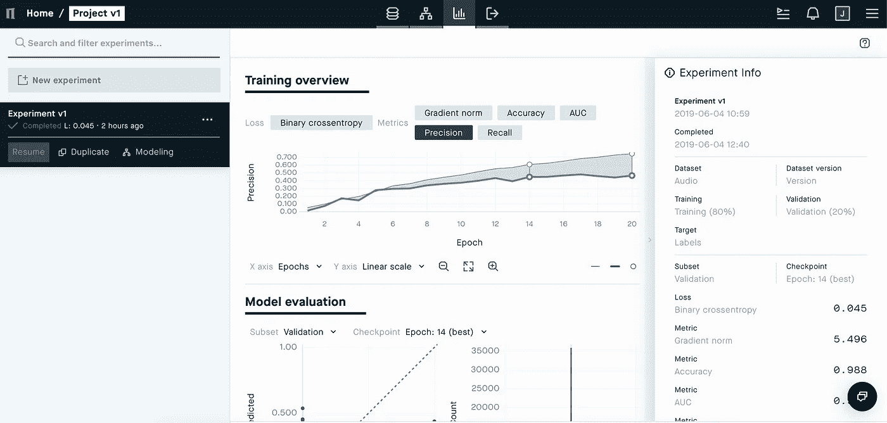

# 零代码如何参加 Kaggle 比赛

> 原文：<https://towardsdatascience.com/how-to-participate-in-a-kaggle-competition-with-zero-code-f017918d2f08?source=collection_archive---------13----------------------->

如果没有以前的经验和对至少一个标准深度学习框架(如 TensorFlow 或 PyTorch)的深入了解，Kaggle 竞赛的入门可能会非常复杂。在本教程中，我们将探索零代码参与 Kaggle 竞赛的机会。

# Freesound 音频标记 2019

我们将参加 [Freesound 音频标记 2019](https://www.kaggle.com/c/freesound-audio-tagging-2019) Kaggle 比赛。本次比赛是 **DCASE2019 挑战赛** 中的 [**任务 2** 。如果你想使用与比赛相关的数据集，我们鼓励你在 Kaggle 上注册，通读比赛规则并接受它们。](http://dcase.community/challenge2019/task-audio-tagging)

Freesound Audio Tagging 2019 是前几年由[free sound](https://freesound.org/)([MTG-庞贝大学](https://www.upf.edu/web/mtg))和[谷歌的机器感知](https://research.google.com/audioset////////about.html)举办的音频标签比赛的更新。2019 版本是多标签音频标签，音频类别数量是原来的两倍。 **FSDKaggle2019** 数据集中的注释是通过 [Freesound 注释器](https://annotator.freesound.org/)收集的。

竞赛基于 [Eduardo Fonseca](http://www.eduardofonseca.net/) 等人的论文:

*   [带有嘈杂标签和最少监督的音频标签](https://arxiv.org/abs/1906.02975)
*   [Freesound Datasets:一个创建开放音频数据集的平台](https://ismir2017.smcnus.org/wp-content/uploads/2017/10/161_Paper.pdf)

# 注册 Peltarion 平台

Peltarion 平台是一个用于深度学习的可视化开发环境。该平台从构建到培训再到部署你的深度学习模型，一行代码都不需要。

1.  [到平台报名](https://peltarion.com/signup)。
2.  确认你的电子邮件。
3.  等待激活邮件。可能需要几分钟。
4.  设置您的密码。
5.  该平台已准备就绪，可免费使用 50 个 GPU 小时。

Peltarion Platform

# 下载 FSDKaggle2019 数据集

下载 [**FSDKaggle2019** 数据集](https://www.kaggle.com/carlthome/preprocess-freesound-data-to-train-with-peltarion/output)。

**FSDKaggle2019** 数据集已经针对 Peltarion 平台进行了预处理。这意味着音频文件已被转换为[频谱图](https://en.wikipedia.org/wiki/Spectrogram)并与包含每个文件对应类别的 **index.csv** 文件一起保存为 NumPy 文件。

可下载数据集已经过预处理，可以上传到平台。点击 **dataset.zip** 下载。

Click on the dataset.zip

# 创建新项目

在左侧的 Peltarion 主视图中，点击**新建项目**按钮。现在，您可以在弹出模式中添加项目名称和可选描述。我们将该项目称为项目 v1 。

Home view.

**项目 v1** 出现在**新建项目**按钮下方的左侧。点击展开项目，然后点击**打开**。

# 上传数据集

点击**转到项目**后，您将进入项目的**数据集**视图。在**数据集**视图上，点击**新建数据集**。在**上传文件**选项卡上，点击**选择文件**上传 **dataset.zip** ，等待其上传，点击**下一步**。命名数据集。我们准备把它命名为**音频**。默认情况下，数据集分为 80%的数据用于定型，剩下的 20%用于验证。我们将使用这种拆分。

我们需要通过点击顶部的**新特性集**来捆绑类别特性。选择除 **fname** 之外的所有特征(共 80 个)，并将 F **特征集名称**设置为**标签**，然后点击**创建**。

在右上角，点击**保存版本**，你就可以进入**建模**阶段了。

Datasets view.

# 创建一个深度学习实验

从顶部的选项卡转到**建模**视图。点击左边的**新实验**。我们将把我们的实验命名为**实验 v1** 。

# 建模

在**建模**视图的右侧，可以看到**构建**和**设置**选项卡。这些是我们将在构建深度学习模型时使用的工具。在本教程中，我们将把音频文件视为称为光谱图的图片，并执行图像分类。

Audio as a picture.

由于我们正在对被视为图片的声音数据进行分类，因此我们可以使用性能良好的卷积神经网络。在这种情况下，我们将使用 **ResNetv2 large 50** 。

Ready model in modeling view.

我们现在将在**建模**视图中创建模型:

1.  从**块**中添加**输入**块，并将 **fname** 指定为右上角的**特征**。
2.  添加**批量标准化**块并保持可训练状态。批次正常化是为了加快训练速度。
3.  从**块**添加**整形**块，并将**目标形状**设置为(256，256，1)。 **ResNetv2 large 50** 需要一个额外的通道轴。
4.  从**片段**中添加 **ResNetv2 large 50** 。
5.  点击 **ResNetv2 large 50** 上方的**输入**块，按 backspace 删除。
6.  将**批量正常化**模块的点连接到 **ResNetv2 大 50** 模块。
7.  将 **ResNetv2 大 50** 后的**密集**块中的**激活**改为 **ReLU** 。 **ReLU** 在大多数情况下是优秀的激活功能。
8.  在**目标**块之前添加另一个**密集**块，将其**节点**设置为 80，**激活**为**s 形**。
9.  将**目标**块的**特征**更改为**标签**并将**损失**更改为**二元交叉熵**。
10.  转到右侧的**设置**选项卡，将**批量**设置为 **28** ，**周期**到 **30** 和**优化** r 到 **Adam** 。**批量** 28 将适合 GPU 内存，30 个**历元**应该足够模型收敛， **Adam** 是一个很好的标准**优化器**。
11.  点击视图右上角的 **Run** 。

# 评价

从顶部的选项卡进入**评估**视图。

在**评估**视图中，您可以跟踪您的模型的训练，并获得实验的实时训练指标。

Evaluation view.

你应该感兴趣的指标是**精度**和**召回**。如果你想了解更多，有一篇很棒的[媒体文章](/precision-vs-recall-386cf9f89488)。

我们的模型现在已经训练好了，可以下载了。您可以点击**实验 1** 概述中左侧的三点下拉菜单下载模型。在下拉菜单中，点击下载，它打开一个模态，点击**确定**。将模型下载为 H5 文件会有一点延迟。如果您训练了多个模型，请下载具有最佳验证精度的模型。

模型现在可以发货了！

# Kaggle 帐户入门

如果您还没有 Kaggle 帐户，您可以在这里创建一个[。请按照说明操作。](https://www.kaggle.com/account/login)

一旦您的帐户准备就绪，请加入[音频标记 2019](https://www.kaggle.com/c/freesound-audio-tagging-2019) 。**迟交**按钮在右上角。如果这是你第一次参加 Kaggle 比赛，你需要在参加比赛前用你的手机验证你的帐户。

# 提交预测

点击**新内核**，选择**笔记本。**

您需要将下载的模型 H5 文件添加为数据集。为了找到 H5 文件的正确路径，将下面的代码添加到 Kaggle notebook 并运行它(记住保存路径以备将来使用)。

有一些代码。你必须将下面的代码复制粘贴到 Kaggle 笔记本中。

将模型变量路径更改为之前保存的路径，并点击右上角的**提交**。

点击**提交后，**ka ggle 内核检查错误并开始用你的模型进行预测，并将 **submission.csv** 发送给竞赛。

# 进一步工作—迁移学习

即使比赛不允许迁移学习，在平台上测试迁移学习的能力也是有用的。迁移学习利用从 ImageNet 或 CIFAR-100 等大规模数据集学习的图像属性，然后针对特定的图像识别问题微调神经网络。在我们的例子中，我们会用音频文件的图像对它进行微调。

该平台支持 VGG16、VGG19 和 ResNetv2，权重在 ImageNet 上训练。

使用迁移学习时，您可以尝试使用较小的数据集获得更好的结果。迁移学习通常收敛得更快，即使预训练数据集与您正在使用的数据集非常不同。

# 特别感谢

特别感谢**free sound Audio Tagging 2019**的组织者在整个过程中给予的帮助。

# 参考

Eduardo Fonseca、Manoj Plakal、Frederic Font、Daniel P. W. Ellis 和 Xavier Serra。“带有嘈杂标签和最小监督的音频标签”。已提交至 DCASE2019 Workshop，2019。网址:【https://arxiv.org/abs/1906.02975 

爱德华多·丰塞卡、若尔迪·庞斯、哈维尔·法沃里、弗雷德里克·方特、德米特里·波格丹诺夫、安德烈斯·费拉罗、塞尔吉奥·奥拉马斯、阿拉斯泰尔·波特和哈维尔·塞拉。 [Freesound datasets:一个创建开放音频数据集的平台](https://ismir2017.smcnus.org/wp-content/uploads/2017/10/161_Paper.pdf)。《第 18 届国际音乐信息检索学会会议论文集》(ISMIR 2017)，第 486–493 页。中国苏州，2017。