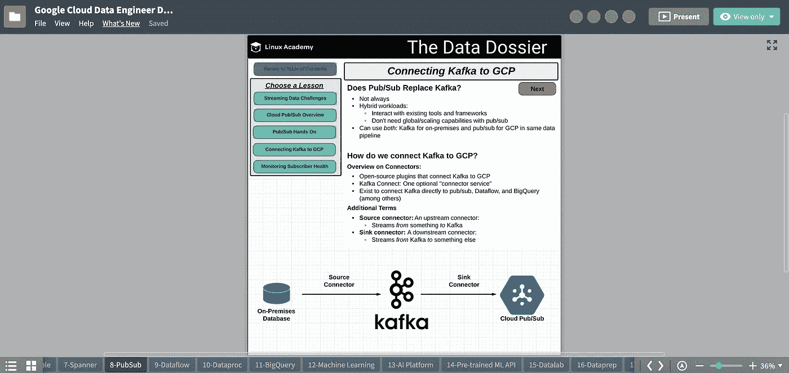

# 如何通过谷歌云专业数据工程师考试

> 原文：<https://towardsdatascience.com/how-to-pass-the-google-cloud-professional-data-engineer-exam-f241d7191e47?source=collection_archive---------7----------------------->

## 没有推荐的 3 年行业经验

所以你可能已经谷歌了上面的标题，现在你在这里。别担心，你不是唯一一个。我也做了同样的事情。

在本指南中，我将让你了解考试是什么样的，以及我是如何准备的(并且通过了！)

# 我的背景

我最近毕业，获得了物理学学位，2019 年夏天，我在一家名为 Zenu 的早期创业公司实习。这是我第一次接触到数据工程师的角色和谷歌云平台。

你可以在这里阅读更多关于我的实习经历。

我加入 Zenu 时是一名有抱负的数据科学家，也是该公司愿景的坚定信徒，后来发现他们没有任何数据或存储数据的基础设施。因为我想与数据密切合作，所以我承担了 Zenu 的分析数据库的设计和交付的责任。

业务需求的一个技术解决方案是使用 BigQuery 作为我们的数据仓库，它支持使用熟悉的标准 SQL 语法快速查询嵌套行。此外，它允许与其他谷歌云产品进行简单的集成，如用于分析报告的 Data Studio 和用于机器学习的 AI 平台。

来自一个非技术背景，我从零开始学习工作所需的数据工程技能。在此期间，我偶然发现了谷歌云专业数据工程师认证，并参加了几个在线课程，以更好地了解这项技术及其在数据分析未来的更广泛作用。

我花了大约两个月的时间，每天漫不经心地看几个视频，然后花了一个月的时间密集练习论文，并确定关键点。11 月初考的。

# 资源

**课程:** [*有 GCP 专业证书的数据工程*](https://click.linksynergy.com/deeplink?id=y5ucJvNe81w&mid=40328&murl=https%3A%2F%2Fwww.coursera.org%2Fprofessional-certificates%2Fgcp-data-engineering)
**费用:***38/月(1 周免费试用)* **有用性:** *7/10*

Coursera 是我上的第一门在线课程，由谷歌员工授课。他们提供演示、动手实验和演示的组合。

我发现这门课程对于一个没有任何商业经验的人来说是相当高级的。我不知道当前的技术，如 Hadoop 生态系统中的技术，并且被许多不熟悉的术语淹没了。

我看完了所有的视频，但是说实话我马上就忘了大部分。不过我**强烈推荐**考**T3[***备考 Google Cloud 专业数据工程师考试课程***](https://click.linksynergy.com/deeplink?id=y5ucJvNe81w&mid=40328&murl=https%3A%2F%2Fwww.coursera.org%2Flearn%2Fpreparing-cloud-professional-data-engineer-exam) 考试前一两周左右。这就像大学里的复习课，他们会快速介绍考试中可能会看到的关键产品。**

像任何一个破产的学生一样，我使用了一周的免费试用，下载了所有的视频供离线观看。

**课程:** [*Google Cloud 认证专业数据工程师*](https://acloudguru.com/)
**费用:***【49 美元/月(1 周免费试用)【80 美元/3 个月(学生订阅)* **有用性:** *9/10*

**注意:Linux 学院现在是云计算大师的一部分**

这是我参加的第二个在线课程，涵盖了考试中出现的大约 70%的内容。本课程还结合了演示、动手实验和演示。

本课程对每项谷歌云服务进行了高度概述，涵盖了关键概念以及谷歌使用每项服务的最佳实践。

该课程结构良好，从基础概念开始，到不同类型的数据库、架构管道、机器学习和数据可视化。

我发现这个很容易理解，对新手也很友好。马修·乌拉森(课程讲师)在谷歌云平台方面的专业知识意味着他的解释非常清晰简洁。在他的视频中，他经常强调考试中会出现的关键事实和概念。

有各种动手实验、演练和测验可以帮助巩固您的理解，并提供机会直接在 Google 云平台上测试您在视频中学到的材料。

Screenshot of The Data Dossier provided by Linux Academy for the Google Cloud Certified Professional Data Engineer course

本课程提供的最有帮助的资源之一是数据档案，它就像一套数字化的课程笔记。它突出了每项服务的要点，显示了清晰的对照表、图表和工作流程，以及考试时需要记住的提示。

如果你是数据工程的新手，我建议你先学习这门课程，因为它比 Coursera 课程更容易掌握。

如果我只推荐一个付费订阅，这将是一个。我支付了 3 个月的学生订阅费，这是值得的。你不仅可以接触到 GCP 课程的惊人资源，还可以完全接触到 Linux Academy 提供的所有其他课程(我曾经使用过)。

**课程:** [*Google 数据工程师考试—专业认证备考*](https://cloudacademy.com/learning-paths/data-engineer-professional-certification-preparation-for-google-83/)
**费用:***49/月(1 周免费试用)* **有用性:** *8/10*

云学院是我用来备考的第三个也是最后一个在线课程。我在考试前一周开始上这门课，更多的是把它作为复习而不是学习指南。

这门课程最有用的一点是，它涵盖了其他课程中没有涉及的安全和网络、数据加密和计算引擎等主题，但可以根据[官方考试大纲](https://cloud.google.com/certification/guides/data-engineer/)进行测试。

除了上面提到的主题，我以 1.5 的速度观看了所有其他视频，以检查是否有任何我以前不知道的新信息。我发现动手实验有点难，而且更多的是复制粘贴一长串预先写好的命令。

我使用了 1 周的免费试用。

# 其他资源

以下是我发现的一些非常有用的资源，但根据你的经验是可选的。

**Linux Academy—**[*大数据要领*](https://linuxacademy.com/cp/modules/view/id/74?redirect_uri=https://app.linuxacademy.com/search?query=Big%20Data%20Essentials) *(免费带社区账号)*

本课程全面介绍了大数据世界。它涵盖了大数据基础架构的原理及其与云计算的集成。

对我来说，本课程最有用的一点是，它提供了最流行的大数据技术的高级概述，包括核心 Hadoop、Hadoop 生态系统(Hive、Pig、Kafka 等)和 Apache Spark。对于考试，你需要知道这些是做什么的，以及它们在 GCP 的对等物。例如 Kafka -> PubSub，Hive -> BigQuery。

**Linux Academy—**[*SQL 入门*](https://linuxacademy.com/cp/modules/view/id/52)

本课程是在*谷歌云认证专业数据工程师*课程开始时为不熟悉 SQL 的人推荐的。它涵盖了基本的 SQL 语句和函数，包括聚合、连接和排序。如果您以前没有使用过 SQL 或者不经常使用，我推荐您学习本课程，因为您将需要它来在 BigQuery 中编写查询语句。

[**机器学习速成班**](https://developers.google.com/machine-learning/crash-course/ml-intro)

本课程是谷歌对机器学习的快速、实用介绍。我用这门课快速复习了一下，因为我已经在大学课程中讲述了一些流行的算法和概念。然而，我认为它的结构很好，会给你在机器学习方面打下良好的基础。

[**qwiklab**](https://www.qwiklabs.com/)

Qwiklabs 是一个平台，以教程和演示的形式提供在各种云平台上使用的临时信用。您可以使用 Qwiklabs 获得额外的 Google 云平台实践经验。我考了 [*Baseline: Data，ML，AI*](https://www.qwiklabs.com/quests/34)*/*[*数据工程*](https://www.qwiklabs.com/quests/25)*/*[*big query for Data Warehousing*](https://www.qwiklabs.com/quests/68)*课程。我发现最后一个非常有用，因为它允许您练习在 BigQuery 中编写查询语句。*

# *我的建议*

*有许多人通过了专业数据工程考试，并在网上分享了他们的准备和考试经验。我觉得他们中的大多数人都来自技术背景，所以他们浏览了一些显而易见的知识(因为参加考试的建议经验是 3 年以上的行业经验，包括 1 年以上使用 GCP 设计和管理解决方案的经验)。*

*在阅读在线论坛、评论和听说参加考试但失败的人时，一个似乎很常见的模式是，他们低估了考试的难度，因为他们在日常工作中做类似的事情。*

*我可以理解这种对考试中机器学习部分的过度自信，因为我已经熟悉了在大学模块中涉及到的算法。我在教学大纲的这一部分上花的时间较少，因此对我的一些答案不太自信。*

*作为学生，我们的一个优势是我们习惯于学习。就我而言，我刚刚结束最后一年的考试，仍处于“学习模式”，所以准备这次考试并不太陌生。在你繁忙的日程安排之外，我知道你可能已经有好几年没有为考试而学习了，所以我将概述一些你应该关注的关键领域以及我是如何准备的。*

## *先看考试大纲*

*我犯的第一个错误是没有正确阅读谷歌官方考试指南，天真地认为在线课程会涵盖这一点。在线课程做得好的地方在于，它们详细涵盖了每项 GCP 服务，概述了其常见用例、谷歌使用该服务的最佳实践，以及它们如何适应整体数据工程角色。*

**

*From the official exam guide*

*考试测试的是你对业务需求提出**可行技术解决方案的能力。虽然永远不会有一个完美的解决方案，但一个伟大的解决方案应该考虑到上述四点。***

*在考试中，你可以看到几个可能满足业务或技术需求的选项，但其中一个比其余的更好。*

## *提升和换挡与提升和杠杆*

*如果你看过一些在线课程，你可能认识这些术语。*

***提升和转移**就是简单地将现有流程或基础设施迁移到云中，而不需要重新设计任何东西。一些公司可能会采取这种方法，因为他们不想花费时间和金钱来修改他们当前的基础架构，但仍然希望利用云的优势。例如，在计算引擎上托管 MySQL 数据库，而不是将所有数据迁移到云 SQL。*

***提升和利用**意味着将您现有的流程迁移到云上，并使用云提供的一些服务使它们变得更好。例如，您可以使用 Dataproc 运行 Hadoop 和 Spark 工作负载，但是将数据存储在云存储中，而不是存储在 HDFS。这更具成本效益，因为您只需为作业运行的时间付费，然后您可以在不使用群集时关闭它，而不会丢失所有数据，因为它现在存储在云存储中。*

*在完成所有在线课程和练习题后，你可能会认为大多数答案都涉及到为特定的业务或技术需求选择最合适的 Google 云服务。毕竟，谷歌出售的是他们卓越的、低成本的、完全管理的、无运营的云服务能力。*

*然而，情况并非总是如此，仔细阅读问题很重要，因为考试中的一些问题有技术要求，他们不想对现有流程进行任何修改。*

## *成本与性能*

*对我来说，考试最难的部分是成本和性能之间的权衡。(这可能是你 3 年以上的行业经验派上用场的地方！).业务人员考虑的是最小化成本，而技术人员考虑的是提高性能。*

*一个常见的问题是“一家中型公司希望在保持低成本的同时[做点什么]”。虽然有些情况是显而易见的，如使用云 SQL 与云扳手，但涉及运行作业的场景更难，因为您可以使用更强大的 CPU(成本更高)来运行作业，从而缩短运行时间(成本更低)。*

## *您应该关注的其他一些领域*

*最近，有一种趋势是让每个人都可以接触到人工智能。BigQuery ML 允许用户使用标准 SQL 查询在 BigQuery 中创建和执行机器学习模型，而不是编写代码。其中一个很大的优势就是数据不会离开 BigQuery。请看这个[视频](https://www.youtube.com/watch?v=6Kska20zQO4)的简单解释。*

***卡夫卡—** 我从其他渠道了解到卡夫卡在考试中出现了很多次，对我来说也是如此。Google Cloud 的对等物是 Cloud Pub/Sub。你应该知道两者之间的区别，例如 Pub/Sub 只能保存长达七天的数据，而 Kafka 可以存储你想要的数据，并且可以随时访问。*

***故障转移副本—** 正如考试指南的教学大纲 4.3 所述，为您的数据基础架构考虑备份解决方案非常重要。一些谷歌云服务会自动创建数据副本，而另一些则需要手动设置。考虑您想要提供服务的地区和区域。如果一个区域中的数据中心出现故障，会发生什么情况？你如何为此做准备？*

***云密钥管理&数据加密—** 数据安全是数据工程非常重要的组成部分。默认情况下，GCP 加密所有静态客户数据。您应该知道还有其他加密方法，包括 CMEK、CSEK 和客户端加密。Google Cloud 有一个云密钥管理服务，可以让你管理云服务的加密密钥。*

**

*Table comparison of different data encryption types (Coursera)*

# *学习策略*

*每个人都有不同的学习方法，所以你应该找到适合你生活方式的方法。我并不是建议你采用我的方法，但是如果你还没有找到你的风格，或者发现其他技术不起作用，请随意尝试我的方法。*

## *基础知识*

*在线课程方面，我推荐以下顺序。*

1.  ***Linux Academy** — [*大数据基础知识*](https://linuxacademy.com/cp/modules/view/id/74?redirect_uri=https://app.linuxacademy.com/search?query=Big%20Data%20Essentials) *(可选)—* 对大数据世界的非技术性介绍，对 Hadoop 生态系统进行了高度描述。*
2.  ***Linux Academy**—[*SQL 入门*](https://linuxacademy.com/cp/modules/view/id/52) *(可选)—*SQL 入门。对于 BigQuery，您需要一些基本的 SQL 知识。*
3.  ***Linux Academy**—[*Google Cloud 认证专业数据工程师*](https://linuxacademy.com/course/google-cloud-data-engineer/) *—* 对你在考试中有望看到的主要 GCP 服务的深入介绍。*
4.  ***Coursera —** [*数据工程与 GCP 专业证书*](https://click.linksynergy.com/deeplink?id=y5ucJvNe81w&mid=40328&murl=https%3A%2F%2Fwww.coursera.org%2Fprofessional-certificates%2Fgcp-data-engineering) *—* 稍微高级一些，更侧重于现实世界中数据工程师的角色。*
5.  ***云学院—** [*Google 数据工程师考试—专业认证备考*](https://cloudacademy.com/learning-paths/data-engineer-professional-certification-preparation-for-google-83/) *—* 好用来作为临近考试日期的复习。花些时间看看其他在线课程中没有涉及的主题。*
6.  *[**机器学习速成班**](https://developers.google.com/machine-learning/crash-course/ml-intro)**——**涵盖了数据科学中最常用算法背后的数学和动机。对于考试，您应该知道哪种算法适合业务需求，包括监督(回归、分类)、非监督(聚类)和强化学习。*
7.  ***Coursera*—***[*准备 Google Cloud 专业数据工程师考试*](https://click.linksynergy.com/deeplink?id=y5ucJvNe81w&mid=40328&murl=https%3A%2F%2Fwww.coursera.org%2Flearn%2Fpreparing-cloud-professional-data-engineer-exam) *—* 这其实是上面提到的 Coursera 课程的一部分，但我建议在考试前一两周上这门课。本课程涵盖了官方考试指南中的所有要点。*

## *动手实践*

*如果你没有很多使用谷歌云平台的经验，我建议你使用动手实验室和 Qwiklabs 练习。你不应该记住如何做每一项任务，而是把它作为一个熟悉服务和整个 GCP 环境的机会。*

*如果您订阅了 Linux Academy，您就可以访问云沙盒，在那里您可以获得访客用户凭据，以便每次会话使用 GCP 3 小时。*

*通过使用这个云沙盒，或者创建一个免费的 GCP 账户(300 美元免费信用),并按照 Coursera 或 Qwiklabs 上的动手实验室的任务说明，你仍然可以获得有价值的实践，而不会打破你的钱包。(在 Qwiklabs 上，你实际上是在固定时间内付费使用 GCP 环境)*

## *过去的论文*

*我在大学的学习策略是尽可能早地做试卷，让自己熟悉考试风格和期末考试中可能出现的题型。通过这种方式，你可以发现自己知识上的差距，并专注于自己的薄弱领域。*

*如果你已经有行业经验，我推荐这种方法。如果你是第一次学习数据工程，我建议你完成 Linux Academy 课程，至少做一次模拟考试，然后继续 Coursera 课程。*

*真正考试前一个月，我一周做一次模拟考试。我用的是 Linux Academy 实践考试，Coursera 实践考试和[谷歌官方数据工程师实践考试](https://cloud.google.com/certification/practice-exam/data-engineer)。*

*你复习的练习纸步骤最重要的部分是记下你做错的所有问题，然后再复习一遍。查看答案后(参加在线课程的测试后)，您会看到一个简短的解释，说明为什么您的答案是对的或错的(有时还会看到一个链接，指向涉及该主题的视频)。对于谷歌的官方实践考试，他们也会给你链接到他们在 GCP 网站上的官方文档。*

*以下是一些额外的自由练习题:*

*   *[https://www . whiz labs . com/Google-cloud-certified-professional-data-engineer/](https://www.whizlabs.com/google-cloud-certified-professional-data-engineer/)*
*   *[https://www . exam topics . com/exams/Google/professional-data-engineer/view/1/](https://www.examtopics.com/exams/google/professional-data-engineer/view/1/)*

*我不能强调坚持做练习题的重要性。虽然它们没有反映出与真正考试相同的难度，但你将接触到各种各样的问题，并增加你参加真正考试的信心。*

## *最后*

*课程导师**极力强调**仅完成在线课程不足以通过考试。你的准备应该包括各种在线资源、GCP 的实践和过去的试题。*

*我强烈推荐我的修订版中包含的另外两个内容。*

1.  *[**阅读官方谷歌云文档**](https://cloud.google.com/docs/)**——**阅读全部文档不太现实，但我的建议是阅读在线视频所涵盖主题的文档。你应该记住的要点是谷歌的最佳实践(用于做某些事情)和一些服务的配额和限制(例如，为云 SQL 存储高达 3TB 的数据)。经验法则是，如果你可能在工作中查找它(例如，2vCPU 计算引擎每月花费多少)，你不需要记住它。但是，您应该大致知道，不同存储类型的上限。*
2.  ***浏览案例分析—** 它们曾经是 2019 年 3 月之前考试的一部分，但不在当前的教学大纲中。说到这里，我发现浏览这些案例非常有用。作为一名之前没有任何数据工程经验的学生，看到现实生活中的应用程序和数据工程师为提出业务需求的技术解决方案而经历的思维过程是很有帮助的。你可以在 Coursera 上查看和浏览这些关于 [*准备谷歌云专业数据工程师考试*](https://click.linksynergy.com/deeplink?id=y5ucJvNe81w&mid=40328&murl=https%3A%2F%2Fwww.coursera.org%2Flearn%2Fpreparing-cloud-professional-data-engineer-exam) 课程的案例研究。您可以在此观看一群经验丰富的专业人士讨论某个案例研究的几个潜在解决方案。*

# *考试期间*

*考试由 50 道题组成，你有 2 个小时的时间完成。有一个书签功能，您可以将问题标记为书签，供以后查看。根据我在网上读到的，大多数人花了大约 1 到 1 小时 15 分钟来完成这个测试。我用了整整 2 个小时。*

*我会说考试比模拟考试难 20%左右。许多问题会引起很多自我怀疑，比如成本与性能的权衡。我的建议是调整自己的节奏，不要在一个问题上浪费太多时间。如果你不知道答案或者不确定你的答案，把它标上书签，然后继续下一个。*

*如果你第一次不能回答所有的问题，不要惊慌。我被前 5 个问题难住了，然后把一半以上的问题做了书签，以便以后复习。*

# *最终意见*

*干得好，走到了这一步！我希望这个指南对那些即将参加考试的人有所帮助，并有望成为他们的信心助推器。没有商业经验，站在理论的立场上准备，肯定是可以通过这个考试的。*

*我在下面添加了一些帮助我准备考试的链接。这些人还分享了他们的经验，并提供了一些很好的建议和需要注意的地方。*

*   *[https://towards data science . com/passing-the-Google-cloud-professional-data-engineer-certification-87da 9908 b 333](/passing-the-google-cloud-professional-data-engineer-certification-87da9908b333)*
*   *[https://deploy . live/博客/Google-cloud-certified-professional-data-engineer/](https://deploy.live/blog/google-cloud-certified-professional-data-engineer/)*
*   *[https://medium . com/@ sathishvj/notes-from-my-Google-cloud-professional-data-engineer-exam-530d 11966 aa 0](https://medium.com/@sathishvj/notes-from-my-google-cloud-professional-data-engineer-exam-530d11966aa0)*

*祝你好运！你能行的！*

*如果你喜欢这篇文章，何不注册 medium，通过此链接阅读更多精彩内容。*

*[**https://medium.com/@jonathan.moszuti/membership**](https://medium.com/@jonathan.moszuti/membership)*

***我已经使用了上面列出的所有资源，并且只推荐对我备考有帮助的产品*****

**

*Photo by [Ian Stauffer](https://unsplash.com/@ianstauffer?utm_source=medium&utm_medium=referral) on [Unsplash](https://unsplash.com?utm_source=medium&utm_medium=referral)*