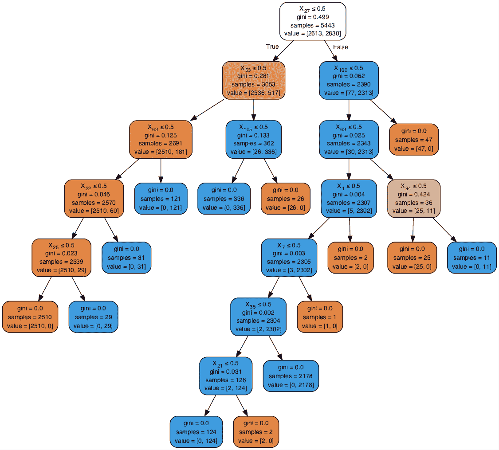
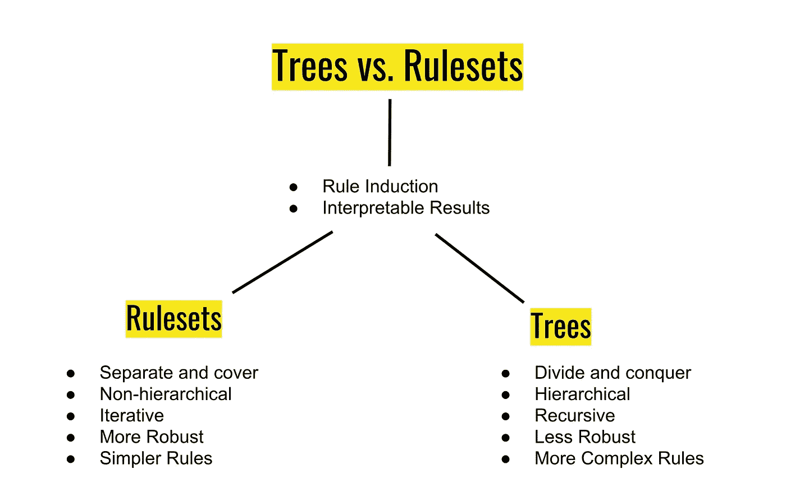
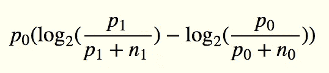
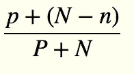
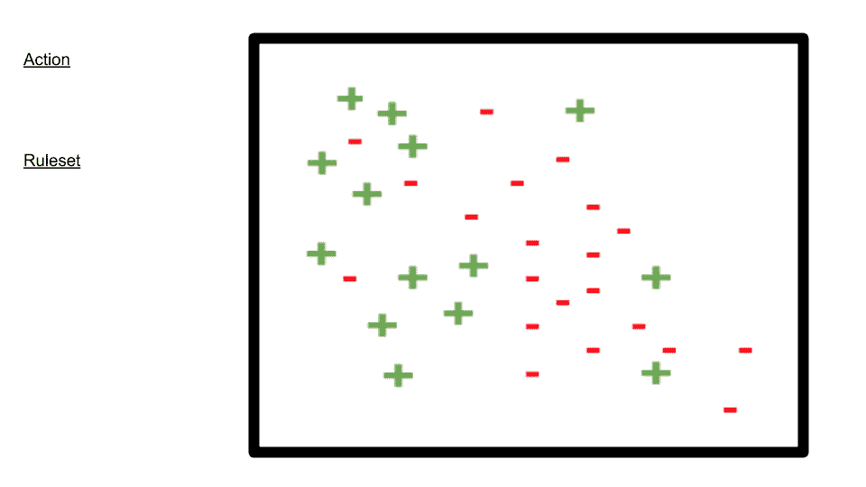
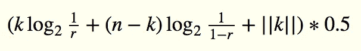
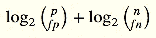
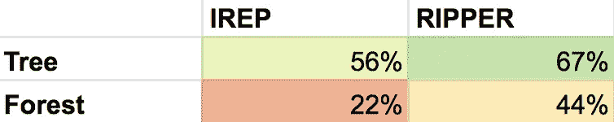
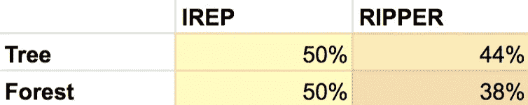
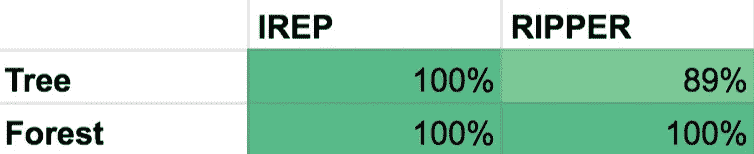

# 如何执行可解释的机器学习分类——没有任何树

> 原文：<https://towardsdatascience.com/how-to-perform-explainable-machine-learning-classification-without-any-trees-873db4192c68?source=collection_archive---------6----------------------->


Credit: [Pixabay](https://pixabay.com/en/users/loggawiggler-15/)

> 严格而清晰的规则……在我们看来是背景中的东西——隐藏在理解的媒介中。
> ——路德维希·维特斯坦根

决策树是一种流行的分类技术。它们直观、易于理解，并且开箱即用。

树模型是人类可以理解的规则的路径。在某些情况下，能够为你的预测提供一个解释——*原告的贷款申请被拒绝，因为他们正面临破产程序，*而不是，*某物——某物——某物——点产品*——可能是一个优势。

但是还有另一类规则生成算法，您可能不熟悉，可能值得添加到您的工具集中，称为规则集学习器。

在最近一个通过古典音乐作曲家对音频进行分类的项目中，我的规则集实现击败了 sklearn 的 DecisionTreeClassifier，并匹配了网格搜索优化的 SVD 和随机森林。

让我们看看什么时候您可能想要考虑规则集模型，它们如何工作，以及如何在您自己的代码中使用它们——包括我最近开发的一个新的 Python 包，您可以使用它进行分类。

# **动机**

尽管决策树有很多优点，但它们因过度拟合、脆弱和难以处理不平衡数据集而臭名昭著。

树通过从完整的训练集开始学习，并贪婪地添加最大化每个子节点的类纯度的条件。随着我们沿着树向下，每个节点添加一个条件，将我们的训练数据分成越来越小的子组:



Decision tree model generated by sklearn on the [mushroom dataset](https://archive.ics.uci.edu/ml/datasets/mushroom).

在短短的几个决策步骤中，我们已经从具有数千个样本的根发展到样本大小低至 29、11、2 甚至 1 的叶。

怎么会？想想二叉树搜索是如何很好地扩展的，因为树的深度只随着节点数量的对数增长。对于训练决策树来说，另一方面是节点的数量随着深度以*指数*的速度增长。因此，我们的训练子集收缩得非常快，最终缺乏统计上有效的样本量。

出于类似的原因，树是“脆弱的”,因为训练集中的微小变化会改变顶级规则，从而在整个模型中产生连锁反应。

有几个流行的技术来处理树木过度拟合和脆弱性。我们可以修剪这棵树，要么根据某个阈值提前停止生长，要么在完成后缩小它的大小。或者我们可以建立一个由数千棵树组成的随机森林集合，以训练速度和可解释性为代价。

规则集类似于决策树，但是因为它们没有层次结构，有有序的子分支决策，所以它们有可能避开这些缺点。

规则集学习者也倾向于产生更紧凑的模型。



Some major differences between trees and rulesets

# 那么什么是规则集呢？

规则集就是合取词(and)的析取(or)。

例如，描述您的孩子能否说服您出去吃冰淇淋蛋糕的模型可能是这样的:

> **如果:**
> 我很好**和**我们有足够的时间去买冰淇淋；**或**
> 你的韧性被磨薄了**和**你不想和我打交道；**或**
> 你感到大度，
> **然后:**
> 冰淇淋蛋糕。

我们可以象征性地表达这个规则集:

> (我很好 **^** 我们有足够的时间)**v**t23】(筋疲力尽 **^** 你就是不行) **V**
> (坦荡)

用 python 语言来说:

> [[(行为=好)，(时间=真)]，
> [(韧性=瘦)，(你=连不上)]，
> [(感觉=坦荡)]]

# 如何训练规则集模型

规则集不是通过递归将训练数据分解为子集的子集，而是通过对所有尚未检查的训练数据进行训练来迭代增长。

为了获得训练如何工作的基本味道，让我们首先来看看一个简单的规则集学习算法，称为 IREP。

在将我们的数据分成训练集和测试集之后，我们通过以下步骤在训练集上训练模型:

1.将你的训练集分成“生长集”和“修剪集”

2.增长规则(信息增益)

3.删减规则(减少错误度量)

4.从您的训练集中删除新规则涵盖的示例，并重复步骤 1、2 和 3，直到您开始让事情变得更糟(精度度量)。

在步骤 1 中，我们将训练数据随机分成 2/3–1/3。我们将使用第一部分增长规则，第二部分修剪规则。这有点像交叉验证要求我们留出评估折叠，这种分割确保我们不会使用刚刚用于增长的相同数据进行修剪！

接下来，我们通过贪婪地添加最大化 FOIL [信息增益](/decision-trees-decoded-part-1-23b45f69111c)的条件来增长规则(下面的公式)。随着我们的规则获得越来越多的条件，它变得越来越严格，排除了越来越多的负类例子。(记住，规则是一组“和”的集合，更多的“和”意味着更严格。)当规则不再涵盖负面例子时，我们就停止了。



FOIL information gain. p0 (n0) is the number of positive (negative) examples covered by an existing rule, p1 (n1) the number covered by the proposed new rule.

现在是时候修改我们刚刚制定的规则了。我们尝试以相反的顺序贪婪地修剪它的每个条件，选择最大化一些修剪度量的规则，比如这个:



Pruning criterion. p (n) is the number of positive (negative) examples covered by the rule, P (N) the total number. Different versions use different prune metrics.

我们刚刚制定并修改了我们的第一条规则！现在我们迭代。从我们的训练集中，删除新规则覆盖的示例。继续增加新规则——使我们的规则集越来越宽松——直到我们增加一个精确度低于 50%的规则。

这是整个过程的可视化:



Growing-pruning a ruleset using iterative coverage.

我的新规则集包，维特根斯坦，实现了 IREP，以及另一个叫做 RIPPER 的规则集算法。除了听起来像重金属乐队，开膛手仍然是这种技术的艺术状态。

该算法比 IREP 要复杂得多，但主要区别如下:

*   **一个理论上更严密的停止条件:**RIPPER 没有使用修剪指标来告诉我们何时停止生成新规则，而是借用了昆兰的 [C4.5 决策树算法](https://pdfs.semanticscholar.org/cb94/e3d981a5e1901793c6bfedd93ce9cc07885d.pdf)中使用的一种信息论启发式方法，称为描述长度。这个想法是，我们可以在建模过程的任何阶段测量总复杂性(以比特为单位),即我们的试验性模型的复杂性加上它未能捕获的所有示例的复杂性。随着我们的规则集在长度和精度上的增长，模型的复杂性会增加，而它无法捕获的示例数量的复杂性会降低。为了防止过度拟合，一旦总复杂度超过某个阈值，我们就停止增加规则。描述长度指导最小化训练错误和最小化模型复杂性之间的平衡行为。
*   计算模型的描述长度既复杂又昂贵。但是要点是模型的复杂性是基于*的区别性。条件较多的规则比条件较少的规则更复杂，从更大的可能性池中选择条件的规则也是如此。*



k is the number of conditions in the rule, n the number of possible conditions. r is k/n. ||k|| is the number of bits needed to send k (i.e., log2(k)). The 0.5 factor is to account for possible redundancies.

*   异常描述长度公式更简单。我们从正面和负面预测中选择假阳性和假阴性的组合。(公式使用组合而不是排列，因为顺序并不重要)。Log₂将十进制值转换为比特:



p is the number of examples classified as positive, n the number classified as negative. fp is the number of false positives, fn false negatives.

*   **模型优化:**一旦我们生成了初始规则集，我们实际上可以使用我们的模型以更全面的方式重新评估每个规则的贡献。我们考虑用几个备选方案来替换每个规则:一个全新的生长修剪过的替换*和一个生长修剪过的原始*修订*。我们的优化模型使用三者中最好的一个——原始、替换或修订。(“最佳”这个词有点复杂，实现起来也有点可怕。这意味着任何规则都会导致规则集的最小描述长度，这是基于如果我们删除所有其他增加描述长度的规则，我们可以得到的最小可能描述长度。)我们可以根据需要多次重复优化阶段，但原始论文建议进行两次迭代。*

> 不也是这样吗，我们一边玩，一边制定规则？
> ——路德维希·维特斯坦根

*   **总结:**如有必要，增加一些规则，以涵盖我们的优化模型不再涵盖的任何正面训练示例。最后，去掉任何不能提高描述长度的规则。

# 在代码中使用规则集

想要使用规则集学习者的 Java 用户可以使用 [Weka](https://www.cs.waikato.ac.nz/ml/weka/) 的 RIPPER 实现 [JRip](http://weka.sourceforge.net/doc.dev/weka/classifiers/rules/JRip.html) 。还有 Python 和 r 的 Weka 包装器。

Python 用户也可以尝试维特根斯坦。(可能有其他针对这些特定算法的 Python 包，但我找不到任何包。)这里是 [github 回购](https://github.com/imoscovitz/ruleset)。

从命令行安装:

```
pip install wittgenstein
```

这里有一个快速的使用示例，使用令人愉快的[毒蘑菇数据集](https://archive.ics.uci.edu/ml/datasets/mushroom)。我们的目标是产生一套规则，可以辨别哪些蘑菇有毒。

让我们从将数据帧加载到 pandas 开始:

```
>>> import pandas as pd
>>> df = pd.read_csv(mushroom.csv)
```

训练-测试-分割我们的数据:

```
>>> from sklearn.model_selection import train_test_split
>>> train, test = train_test_split(df, test_size=.33,              ...                                random_state=42)
```

维特根斯坦使用与 scikit-learn 相似的 fit-predict-score 语法。我们将训练一个开膛手分类器，将阳性类别定义为有毒。

```
>>> import wittgenstein as lw
>>> clf = lw.RIPPER()
>>> clf.fit(train, class_feat='Poisonous/Edible', pos_class='p', 
...         random_state=42)
```

在初始化/拟合期间，我们可以传递几个可选参数:

*   `**prune_size**:`更改增长/修剪比例。如果你想跳过修剪阶段(刺激，但不推荐！)使用 IREP 时，您可以将其设置为无。
*   `**k**:`优化运行的次数
*   `**dl_allowance**:`复杂性停止阈值
*   `**verbosity (1–5)**:`如果你想知道规则是如何产生的，就用这个。(每个详细级别在文档字符串中都有解释。)
*   `**n_discretize_bins**:`维特根斯坦会为你自动检测和离散化连续特征——如果你想控制容器的数量，使用这个。

您可以使用默认的度量标准(准确性)或者通过传递您自己的评分度量标准来测试模型。让我们从 scikit-learn 导入 precision 和 recall。我们还将通过计算条件的数量来检查模型的复杂性。

```
>>> # Split target class feature
>>> X_test = test.drop('Poisonous/edible', axis=1)
>>> y_test = test['Poisonous/edible']>>> # Collect performance metrics
>>> from sklearn.metrics import precision_score, recall_score
>>> precision = clf.score(X_test, y_test, precision_score)
>>> recall = clf.score(X_test, y_test, recall_score)
>>> cond_count = clf.ruleset_.count_conds()>>> print(f'precision: {precision} recall: {recall}
...         conds: {cond_count}')precision: 0.9938..., recall: 0.9977..., conds: 32
```

我们可以使用 clf.ruleset_ attribute 访问我们的训练模型。经过训练的规则集模型表示“或”的“与”列表:

```
>>> clf.ruleset_.out_pretty()
[[Stalk-surface-above-ring=k^Gill-spacing=c] V
[Gill-size=n^Stalk-root=?^Stalk-shape=t] V
[Gill-size=n^Population=s] V
[Sport-print-color=h^Cap-surface=s] V
[Gill-size=n^Cap-surface=s^Stalk-shape=e] V
[Gill-size=n^Habitat=g] V
[Population=v^Stalk-shape=e^Bruises?=t] V
[Gill-size=n^Stalk-root=b^Gill-spacing=c] V
[Gill-size=n^Population=c] V
[Gill-size=n^Cap-color=p] V
[Gill-size=n^Gill-color=u^Cap-surface=f] V
[Gill-size=n^Cap-color=g^Gill-spacing=w] V
[Gill-color=g^Stalk-root=b]]
```

若要生成新的预测，请使用 predict 方法:

```
>>> clf.predict(mysterious_unseen_mushrooms)
[True, False, False, True, False...
```

我们也可以要求我们的模型告诉我们为什么它做出了每一个肯定的预测:

```
>>> clf.predict(mysterious_unseen_mushrooms, give_reasons=True)([True, False, False, True, False...,
 [[<Rule object: [Gill-size=n^Population=s]>,
   <Rule object: [Gill-size=n^Cap-surface=s^Stalk-shape=e]>],
  [],
  [],
  [<Rule object: [Gill-size=n^Population=s]>],
  []...)
```

相当酷！

# 效果如何？

我使用 scikit-learn 的 DecisionTreeClassifier 和网格搜索优化的 RandomForestClassifier 作为基线，在最初的 11 个分类数据集(大部分来自 [UCI](https://archive.ics.uci.edu/ml/datasets.html?format=&task=cla&att=cat&area=&numAtt=&numIns=&type=&sort=instDown&view=table) )上重复测试了我的 IREP 和 RIPPER 实现。(我抛出了两个数据集的结果，sklearn 和维特根斯坦分别拒绝做出正面预测。)

将规则集与随机森林这样的集成技术进行比较有点不公平——网格搜索-调整森林使它更加不公平——但我想看看维特根斯坦能在多大程度上与最好的可比较替代方案竞争。

尽管它是一个决策树分类器，scikit-learn 的树实现实际上并不接受分类数据。但是没关系——我们只需要做一点预处理，将数据转换成 DecisionTreeClassifier 可以接受的格式。

首先，让我们使用 scikit 的 LabelEncoder 将我们的分类特征转换成数字特征:

```
>>> from sklearn.preprocessing import LabelEncoder
>>> le = LabelEncoder()
>>> df_le=df.apply(le.fit_transform)
>>> df_le.head()
```

然后，我们使用一个热编码来创建虚拟变量。否则我们将被序数特征所困，而不是名义特征！

```
>>> from sklearn.preprocessing import OneHotEncoder
>>> encoder = OneHotEncoder(sparse=False)
>>> encoder.fit(df_le)
>>> df_hot = enc.transform(df_le)
>>> df_hot.head()
```

预处理完成，我们现在准备分割我们的数据…

```
>>> train, test = train_test_split(df_hot, test_size=.33,                             ...                                random_state=random_state)
>>> train_X = train[:,n_classes:]
>>> train_y = train[:,0]
>>> test_X = test[:,n_classes:]
>>> test_y = test[:,0]
```

…并训练我们的模型:

```
>>> tree_clf = DecisionTreeClassifier(random_state=random_state)
>>> tree_clf.fit(train_X, train_y)
```

为我们可爱的树打分:

```
>>> predictions = tree_clf.predict(test_X)
>>> precision = precision_score(test_y, predictions)
>>> recall = recall_score(test_y, predictions)
>>> print(f'precision: {precision} recall: {recall} node_count:   ...                    {tree_clf.tree_.node_count}')
...
```

下面是调整和适应随机森林的代码:

```
>>> forest = RandomForestClassifier(random_state=random_state)
>>> n_features = train_X.shape[1]
>>> grid_params = {
        'n_estimators': [50,100,200],
        'max_depth': [1,3,5,8,10,None],
        'min_samples_leaf': [3,6,10,13,16,20]
    }
>>> clf = GridSearchCV(forest, grid_params, cv=5)
>>> clf.fit(train_X, train_y)
>>> best_params = clf.best_params_
>>> forest = RandomForestClassifier( 
         ... n_estimators=best_params['n_estimators'],
         ... max_depth=best_params['max_depth'],
         ... min_samples_leaf=best_params['min_samples_leaf'],
         ... random_state=random_state)
>>> forest.fit(train_X, train_y)
```

# 结果

我的软件包至少在这些数据集上与 sklearn 有竞争力。(详细的 Jupyter 笔记本和测试可以在[这里](https://github.com/imoscovitz/ruleset/blob/master/Performance%20Tests.ipynb)找到。)

以下是每个规则集模型击败每个 sklearn 模型的频率比较，按精度评分:



下面是一个回忆对比:



我还比较了它们的紧凑性，通过条件或节点的总数来衡量。



有些领域维特根斯坦做得很好:

*   **不平衡类:**两种规则集算法都比基于树的方法更好地处理了不平衡类；IREP 和瑞普在精确度和召回率上击败了特里，而且在严重不平衡的数据集上，他们在召回率上都比特里好得多。
*   **过拟合**:在训练样本和每个特征样本都较少的数据集上，两种规则集算法在精度上都胜过 Tree，RIPPER 胜过 Forest。(优势没有延伸到召回。)
*   **紧凑性/可解释性:** IREP 和 RIPPER 模型比(现成的)树和(调整的)森林更紧凑。

要考虑的潜在缺点:

*   **速度:** IREP 和决策树共享相同的时间复杂度——O(an logn)，其中 a 是属性个数，n 是例子。但是 RIPPER 的优化阶段在较大的数据集上可能变得耗时，在 O(模拟 n)上。更具体地说，在我将维特根斯坦的关键部分优化成 C++之前，RIPPER 通常是四个中训练时间最长的。另一方面，IREP 运行速度相当快，即使是在 Python 中。
*   **连续特性:** sklearn 的 trees 实现了 CART，它使用了比我目前实现的更复杂的离散化算法。目前，对于具有大量连续要素的数据集，您可能会从 sklearn 获得更好的性能，尽管这种情况可能很快就会改变。
*   **性能:**我通常认为 C5.0 树、随机森林和部分决策树(一种混合的树-规则集方法)在大多数(但不是所有)数据集上比规则集模型表现得更好；对 C4.5 和车树，赢家应该更悬而未决。

与任何机器学习模型一样，您的特定数据和您面临的特定问题决定了这项工作的最佳工具。

规则集学习器是一种机器学习方法，实现起来很有趣，在某些情况下，在您的工具集中包含它会很有用。

我很想听听你的想法，所以请随时通过 [LinkedIn](https://www.linkedin.com/in/ilan-moscovitz/) 或 [Github](https://github.com/imoscovitz/wittgenstein) 联系我！

# 参考

[1]j . funkrantz 和 G. Widmer，[增量减少错误修剪](https://pdfs.semanticscholar.org/f67e/bb7b392f51076899f58c53bf57d5e71e36e9.pdf) (1994)，机器学习 1994 年第十一届年会会议录

[2] J .罗斯·昆兰， [MDL 与范畴理论(续)](https://pdfs.semanticscholar.org/cb94/e3d981a5e1901793c6bfedd93ce9cc07885d.pdf) (1995)机器学习 1995 年第十二届国际会议论文集

[3] W. [科恩，快速有效规则归纳](https://www.let.rug.nl/nerbonne/teach/learning/cohen95fast.pdf) (1995)机器学习 1995 年第十二届国际会议论文集

[4] E. Frank 和 I. H. Witten，[在没有全局优化的情况下生成精确的规则集](https://researchcommons.waikato.ac.nz/bitstream/handle/10289/1047/uow-cs-wp-1998-02.pdf?sequence=1&isAllowed=y) (1998)机器学习 1998 年第十二届国际会议论文集

[5] T .王等。al，[用于可解释分类的学习规则集的贝叶斯框架](https://pdfs.semanticscholar.org/bb51/b3046f6ff607deb218792347cb0e9b0b621a.pdf) (2017)《机器学习研究杂志》

[6]路德维希·维特斯坦根，*《哲学研究》* (1958)