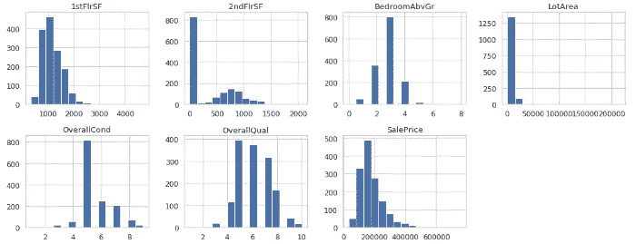

# 如何使用 Seaborn 执行探索性数据分析

> 原文：<https://towardsdatascience.com/how-to-perform-exploratory-data-analysis-with-seaborn-97e3413e841d?source=collection_archive---------1----------------------->

**探索性数据分析** ( **EDA** )是一种分析数据集以总结其主要特征的方法。它用于理解数据，获得与数据相关的一些上下文，理解变量及其之间的关系，并制定在构建预测模型时可能有用的假设。

所有的数据分析都必须以一些关键问题或目标为导向。在开始任何数据分析任务之前，您应该心中有一个明确的目标。当你的目标允许你理解你的数据和问题时，你就能从你的分析中得到有意义的结果！

在本教程中，我们将学习如何使用**数据可视化执行 EDA。**具体来说，我们将关注`**seaborn**`，这是一个构建在`matplotlib`之上的 Python 库，支持`NumPy`和`pandas`。

`seaborn`使我们能够制作出有吸引力的、信息丰富的统计图表。虽然`matplotlib`使得任何东西都有可能被可视化，但是让情节在视觉上吸引人通常是困难和乏味的。`seaborn`通常用于使默认的`matplotlib`图看起来更好，也引入了一些额外的图类型。

我们将介绍如何进行可视化分析:

*   带直方图的数值变量，
*   带计数图的分类变量，
*   散点图、联合图和配对图中数值变量之间的关系，以及
*   盒须图和复杂条件图中数值变量和分类变量之间的关系。

通过有效地可视化数据集的变量及其关系，数据分析师或数据科学家能够快速了解趋势、异常值和模式。这种理解可用于讲述故事、推动决策和创建预测模型。

## 这个简短的教程改编自 Next Tech 的完整[Python 数据分析课程](https://c.next.tech/2GbmOdL)，其中包括预装 Python、Jupyter 笔记本和seaborn 的浏览器内沙盒环境。您可以免费开始学习这门课程！


Next Tech’s environment.

# 数据准备

> 数据准备是任何数据分析的第一步，以确保数据得到清理，并以可分析的形式进行转换。

我们将在[埃姆斯住宅数据集](http://jse.amstat.org/v19n3/decock.pdf)上执行 EDA。这个数据集在那些开始学习数据科学和机器学习的人中很受欢迎，因为它包含了爱荷华州埃姆斯市出售的不同房屋的几乎每个特征的数据。这些数据可以用来预测销售价格。

该数据集已经清理完毕，可以进行分析。我们要做的就是过滤一些变量来简化我们的任务。让我们从将数据作为`pandas`数据帧读取开始:


This image only shows the info for the first five columns in the dataset.

如果您在 Next Tech 已经导入了数据集的沙箱中运行这段代码，或者在 Jupyter 笔记本中运行这段代码，您会看到有 1，460 个观察值和 81 列。每一列代表数据帧中的一个变量。我们可以从每一列的数据类型看出它是什么类型的变量。

我们将只处理一些变量——让我们将它们的名字过滤并存储在两个名为`numerical`和`categorical`的列表中，然后重新定义我们的`housing`数据帧，只包含这些变量:

```
Out: (1460, 14)
```

从`housing.shape`中，我们可以看到我们的数据框架现在只有 14 列。让我们开始一些分析吧！

# 分析数字变量

> 我们的 EDA 目标将是理解这个数据集中的变量如何与房子的销售价格相关联。

在此之前，我们需要先了解我们的变量。让我们从数字变量开始，特别是我们的目标变量`SalePrice`。

数值变量就是那些值是数字的变量。当我们有数值变量时，我们要做的第一件事是理解变量可以取什么值，以及分布和离差。这可以通过**直方图**来实现:


Distribution of the SalePrice variable.

注意，由于[一个内部笑话](https://stackoverflow.com/questions/41499857/seaborn-why-import-as-sns/44484758)，库`seaborn`被导入为`sns`。

只需一种方法`sns.set()`，我们就可以设计图形的样式、改变颜色、增加字体大小以提高可读性，以及改变图形大小。

我们使用`distplot`在`seaborn`中绘制直方图。默认情况下，这将绘制一个带有核密度估计(KDE)的直方图。你可以试着改变参数`kde=True`看看这是什么样子。

看一下柱状图，我们可以看到很少有房子的价格低于`100,000`，大多数房子在`100,000`和`200,000`之间出售，很少有房子的价格高于`400,000`。

如果我们想为所有的数字变量创建直方图，`pandas`提供了最简单的解决方案:



Distributions for each of our numerical variables.

从这个可视化中，我们获得了很多信息。我们可以看到`1stFlrSF`(一楼面积)严重向右倾斜，大多数房子没有二楼，有 3 个`BedroomAbvGr`(地上卧室)。大多数房屋以 5 的`OverallCond`和 5 或更高的`OverallQual`价格出售。视觉效果更加难以解读——但是我们可以看出，在建模之前，可能需要移除一个或多个异常值。

请注意，该图保持了我们之前使用`seaborn`设置的样式。

# 分析分类变量

分类变量是那些值被标记为类别的变量。使用**条形图**可以最好地理解分类变量的值、分布和离散度。我们来分析一下`SaleCondition`变量。`seaborn`为我们提供了一个非常简单的方法来显示每个类别中的观察值计数:`countplot`。


The bars in this plot represent the number of houses for each condition of sale.

从可视化中，我们很容易看到，大多数房屋是在`Normal`条件下出售的，极少数是在`AjdLand`(相邻土地购买)、`Alloca`(分配:两个有单独契约的关联财产)和`Family`(家庭成员之间的出售)条件下出售的。

为了可视化我们数据集中的所有分类变量，就像我们对数字变量所做的那样，我们可以循环通过`pandas`系列来创建支线剧情。

使用`plt.subplots`，我们可以创建一个 2 行 4 列的网格图形。然后我们迭代每个分类变量来创建一个带有`seaborn`的`countplot`:


Countplots for each of our categorical variables.

第二个`for`循环简单地获取每个 *x* -tick 标签，并将其旋转 90 度，以使文本更好地适合绘图(如果您想知道文本不旋转时的样子，可以删除这两行)。

就像我们的数字变量直方图一样，我们可以从这个视觉中收集很多信息——大多数房子都有`RL`(住宅低密度)分区分类，有`Regular`地块形状，还有`CentralAir`。我们还可以看到，在夏季的几个月里，房屋销售更加频繁，大多数房屋是在`NAmes`(北艾姆斯)附近售出的，2010 年的销售有所下降。

然而，如果我们进一步考察`YrSold`变量，我们可以看到这种“下降”实际上是因为只收集了截至 7 月的数据。


正如您所看到的，对变量及其值的彻底探索非常重要——如果我们在 2010 年销售额下降的假设下建立一个模型来预测销售价格，该模型可能会非常不准确。

既然我们已经探索了数字和分类变量，让我们看看这些变量之间的关系——更重要的是，这些变量如何影响我们的目标变量，`SalePrice`！

# 分析数值变量之间的关系

> 绘制变量之间的关系可以让我们很容易地获得对模式和相关性的直观理解。

**散点图**通常用于可视化两个数值变量之间的关系。创建散点图的`seaborn`方法非常简单:


Relationship between 1stFlrSF and SalePrice.

从散点图中，我们可以看到房屋的`1stFlrSF`和房屋的`SalePrice`之间存在正相关关系。换句话说，房子的一楼越大，可能的售价就越高。

您还可以看到默认情况下为我们添加了轴标签，并且标记会自动勾勒出来以使它们更清晰——这与`matplotlib`相反，在`matplotlib`中这些标签不是默认的。

`seaborn`还为我们提供了一个名为`jointplot`的好函数，它会给你一个散点图，显示两个变量之间的关系以及每个变量在边缘的直方图——也称为**边缘图**。


Jointplot showing relationship between 1stFlrSF and SalePrice and their individual distributions.

你不仅可以看到两个变量之间的关系，还可以看到它们各自是如何分布的。

# 分析数字变量和分类变量之间的关系

**盒须图**通常用于可视化数值变量和分类变量之间的关系，而**复杂条件图**用于可视化条件关系。

让我们从用`seaborn`的`boxplot`方法创建盒须图开始:


Box-and-whisker plots for each of our categorical variables and their relationships with SalePrice.

在这里，我们已经遍历了每个子图，以产生所有分类变量和`SalePrice`之间的可视化。

我们可以看到，与其他分区分类相比，具有`FV`(流动村庄住宅)分区分类的房屋具有更高的平均`SalePrice`，具有`CentralAir`的房屋以及具有`Partial`(上次评估时房屋未完工)`SaleCondition`的房屋也是如此。我们还可以看到，不同`LotShapes`的房子之间，或者`MoSold`和`YrSold`之间，平均`SalePrice`差异很小。

让我们仔细看看`Neighborhood`变量。我们看到，不同的邻域肯定有不同的分布，但可视化有点难以破译。让我们使用额外的参数`order`按照最便宜的邻域到最贵的邻域(按照中间价格)对箱线图进行排序。


Sorted box-and-whisker plot showing relationship between Neighborhood and SalePrice.

在上面的代码片段中，我们按照中间价格对我们的邻居进行了排序，并将其存储在`sorted_nb`中。然后，我们将这个邻域名称列表传递给`order`参数，以创建一个排序的盒子图。

这个数字给了我们很多信息。我们可以看到，在最便宜的社区，房子的售价中值约为 10 万美元，而在最贵的社区，房子的售价约为 30 万美元。我们还可以看到，对于一些邻近地区，价格之间的离散度非常低，这意味着所有价格彼此接近。然而，在最昂贵的街区`NridgHt`，我们看到一个大盒子——价格分布有很大的差异。

最后，`seaborn`还允许我们创建显示条件关系的图。例如，如果我们对`Neighborhood`进行调节，使用`FacetGrid`函数，我们可以看到`OverallQual`和`SalePrice`变量之间的散点图:


This image only shows the first 12 plots. There are actually 25 plots — one for each neighborhood.

对于每个单独的邻域，我们可以看到`OverallQual`和`SalePrice`之间的关系。

我们还向(可选)`hue`参数添加了另一个分类变量`CentralAir`——橙色点对应于没有`CentralAir`的房屋。正如你所看到的，这些房子往往以较低的价格出售。

`FacetGrid`方法使得生成复杂的可视化和获取有价值的信息变得非常容易。制作这些可视化效果来快速了解变量关系是一个很好的实践。

我希望你喜欢这个关于探索性数据分析和数据可视化的简短教程`seaborn`！我讲述了如何创建直方图、计数图、散点图、边际图、盒须图和条件图。

在我们的探索中，我们发现了个别变量中的异常值和趋势，以及变量之间的关系。这些知识可以用来建立一个模型来预测埃姆斯市房屋的`SalePrice`。例如，由于我们发现了`SalePrice`与变量`CentralAir`、`1stFlrSf`、`SaleCondition`和`Neighborhood`之间的相关性，我们可以从使用这些变量的简单模型开始。

## 如果您有兴趣了解如何做到这一点以及更多，我们在 Next Tech 提供了完整的**Python 数据分析**课程。从这里免费开始！

本课程探索使用`NumPy`的矢量化运算、使用`pandas`的 EDA、使用`matplotlib`的数据可视化、使用`seaborn`的附加 EDA 和可视化技术、使用`SciPy`的统计计算以及使用`scikit-learn`的机器学习。