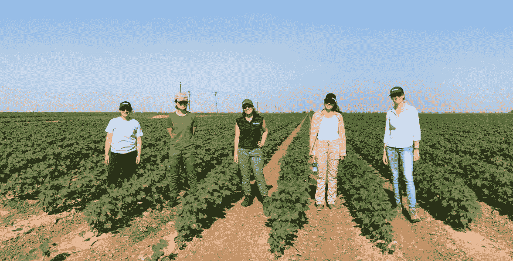

# 如何挑选一个成功的人工智能项目，第 2 部分:处理数据

> 原文：<https://towardsdatascience.com/how-to-pick-a-successful-ai-project-part-2-working-with-data-879d4f535ef9?source=collection_archive---------43----------------------->

这篇文章是“如何挑选一个成功的人工智能项目”系列文章的一部分。[第一部分](https://medium.com/@me_90946/how-to-pick-a-successful-ai-project-part-1-finding-the-problem-and-collecting-data-9e701e316977)，[第三部分](https://medium.com/@me_90946/how-to-pick-a-successful-ai-project-part-3-working-with-models-3ab4ba1db0fb)。即使你独立地阅读每一部分，它们也能很好地工作。

在这里，我将介绍在选择人工智能项目时与数据相关的技巧和诀窍。我在[人工智能深度潜水](https://aideepdive.com/)和[数据科学静修](https://datascienceretreat.com/)中指导了超过 150 人。

## 您的最小可行数据集比您想象的要小

我们如何才能在 2050 年前将粮食产量翻一番，以养活 90 亿人？两个人拿着智能手机走来走去拍照，这个解决方案能启动吗？

举一个自举数据集的例子，以 Blueriver Inc .为例，他们从事精准农业。通过精确地喷洒在正确的位置，可以减少 90%的除草剂用量。

See & Spray 机器使用深度学习来更准确地识别更多种类的植物，然后当场做出作物管理决策。定制喷嘴设计使得<1-inch spray resolution. They focus on cotton and soybeans.

In September 2017, John Deere acquired Blue River for 300 million.

What was the dataset Blue River started with? Collected by a handful of guys with phones taking pictures while walking down an entire crop field:

Often the amount of data you need for proof of concept is ‘not much’ (thanks to pretrained models!).

You can collect and label the data yourself, with tiny, tiny resources. **我指导的投资组合项目中可能有 50%是从不存在的数据开始的，而团队生成了这些数据。fast.ai 的创始人杰瑞米·霍华德也坚定地打破了“你需要谷歌大小的数据集”才能从人工智能中获得价值的神话。**

多么好的机会；现在活着是令人兴奋的，有这么多问题可以用现成的技术解决。一个农业机器人可以处理移动摄像机数据开辟了一条新的道路。下次你想出人工智能项目的时候，把蓝河作为你创造的数据的可能性的参考。

知道“你的最小可行数据集比你想象的要小”会极大地拓展你可以处理的项目范围。

## 因为有了预训练的模型，你不需要那么多数据

模型动物园是预先训练好的网络的集合。那里的每个网络都为解决类似问题的人节省了大量的时间和数据。例如:

模型动物园的管理员让你的生活轻松多了。随着最近在 ML 方面的成功，研究人员获得了更多的资助，发表了来自享有强大机器和数周计算的学术界的模型。行业领导者经常发布他们的模型，希望吸引人才或抵消竞争对手的优势。

## 一个数据科学家 80%的时间都在清理数据；另外 20%抱怨清理数据

这是个笑话，但离真相不远。如果你把大部分时间花在数据准备上，不要感到惊讶。

## 数据增强在图像上运行良好

不要‘手动’做，今天有用于最常见的数据扩充任务(水平和垂直移动、水平和垂直翻转、随机旋转等)的库。这是一个非常标准的预处理步骤。

## 通过询问公司/个人获得独特的数据

有一支队伍曾经需要鸟鸣。原来有一个鸟类观察者协会有一个巨大的歌曲数据集。他们可以把它给我们的团队，不问任何问题。

公司可能有他们不太关心的数据。其他时候，他们确实关心它们，但如果你提供一些有价值的东西作为交换，比如他们可以使用的预测模型，他们还是会把它们给你。如果你要求的话，政府通常会给你数据。

如果你想不出用更传统的方法来获取数据，试着去问。发送几封电子邮件可能是对你时间的一个很好的利用。如果学者们发表了一篇相关的论文，并且你提出了要求，他们应该分享他们的数据。不一定管用，但值得一试。寻找任何优势的小公司，只要得到一些利益，可能都想和你合伙。

## 边缘计算(联合学习)，避免隐私问题

这是我们在 2019 年的生活:华为新推出的“super zoom”P30 Pro 智能手机摄像头可以识别远处的人，并将神经网络应用于唇读。计算机视觉系统可以在同一个人改变位置(例如，从地铁站出来)时重新识别他们，这一切都表明大规模监控在技术上日益成熟。隐私是“最重要的”

企业可以接触到越来越多的公民私人数据；监管机构试图保护我们的隐私，并限制对这些数据的访问。隐私保护并非没有副作用:它经常导致科学进步受阻的情况。例如，欧洲的 **GDPR 法规**似乎是研究人员和公司将机器学习应用于许多有趣问题的严重障碍。与此同时，健康数据等数据集受益于隐私；想象一下，如果你得了一场重病，而雇主因此而不雇用你。

一个解决方案:如果不是将训练数据的语料库带到一个地方来训练模型，而是将模型带到数据生成的任何地方，会怎么样？这被称为**联合学习**，由谷歌在 2017 年首次提出。

这样，即使你不能立刻访问整个数据集，你仍然可以从中学习。

Andrew Trask, harbinger of federated learning

如果你对这个话题感兴趣，请关注安德鲁·特拉斯克。他有一门关于联合学习的 coursera 课程，还有一个方便的 jupyter 笔记本，上面有一个算出的例子。

为什么这在挑选人工智能项目的对话中很重要？因为如果你的项目使用联合学习，你可能更容易让人们给你数据和使用你的产品。它为不同类别的项目打开了大门。

## 数据重用和伙伴关系

数据具有极佳的二次价值。

也就是说，通常，您可以找到收集数据的实体没有想到的数据用途。**通常通过合作关系，数据的新用途可以产生二次收入流**。例如，您可以集成:

-关于欺诈的数据

-来自信用评分的数据，

-来自客户流失的数据，

-关于购买的数据(来自不同来源)

发布这些数据(包含个人数据)的组织可能会使用限制您使用的许可证。您需要检查他们是否明确拥有数据重用的许可，否则最好联系他们并就您项目的许可达成一致。

但是要小心问题:

1.**如果你的产品依赖于只有一个合伙人才能产生的数据，你就掌握在他们手中**。当你决定结束合作的时候，他们就结束了你的生意。

2.如果不同数据集中唯一的共享变量是一个人，那么数据整合将会非常困难。有助于识别个人身份的数据在世界上的某些地方受到监管。

即使你可以合法地整合这些不同的数据源，记住在大公司里有整个团队致力于整合。永远不要认为这会顺利进行。

使用公共数据并不是唯一的选择。有些人会抱怨，对于每个公开的数据集，已经有很多项目了。很难脱颖而出。也许值得给业内人士发邮件，获取一些别人没有的数据(数据合作)。如果你提供你的模型的结果来交换使用权，一些公司可能会被说服。

做 Kaggle 怎么样？对于投资组合项目来说，这不是一个好主意，因为 1/找到问题和数据的困难已经完成，2/很难从一群竞争者中脱颖而出，这些竞争者可能花了比你更多的时间来拟合模型，并且有更好的表现。

发现数据的二次利用是一项了不起的技能。提出项目想法可以训练这种技能。

## 使用非结构化数据

几十年来，ML 可以使用的所有数据都是表格的形式。那些作为附件到处乱飞的 excel 文件，那些 SQL 数据库…表格数据是唯一能从 ML 中获益的东西。

自 2010 年以来，这种情况发生了变化。

非结构化数据包括:

1.  形象
2.  由真实的人写的话，不遵循预先定义的模式，使用充满细微差别的语言。
3.  录像
4.  音频(包括语音)
5.  有时，传感器数据(流)

定义为[非结构化的数据每年以 55–65%的速度增长](https://www.datamation.com/big-data/structured-vs-unstructured-data.html)。电子邮件、社交媒体帖子、呼叫中心记录……这些都是非结构化数据集的优秀示例，可以为企业提供价值。

你可能认为‘每个人都知道这一点，为什么要提它’……但根据我的经验，到处都有大公司没有收到备忘录。如果您为其中一家公司工作，并且碰巧发现了他们可能拥有的非结构化数据的用例，那么您就发现了可能会改变职业生涯的东西。

以银行为例。对他们来说，数据意味着来自市场和证券价格的数字信息。例如，现在他们使用夜间光线强度、油罐阴影和停车场汽车数量的卫星图像，可以用来估计经济活动。

根据我的经验，在 [AI Deep Dive](https://aideepdive.com/) 和[数据科学务虚会](https://datascienceretreat.com/)上，大多数人选择非结构化数据用于投资组合项目。用这些很容易通过“眉毛测试”。另外，它们在野外大量存在。每个人都可以访问图片、文本…与表格数据如货币交易形成对比。

一个缺点是:非结构化数据可能会引发合规性问题。你永远不知道在一大堆文本中隐藏着什么。这些邮件里有机密信息吗？即使我们试图匿名，用户的个人数据会泄露吗？

你可能还记得美国在线的惨败。2006 年 8 月 4 日，AOL Research 在它的一个网站上发布了一个压缩文本文件，其中包含超过 650，000 个用户在 3 个月的时间内使用的 2000 万个搜索关键词，用于研究目的。8 月 7 日，AOL 删除了他们网站上的搜索数据，但在此之前，这些数据已经被镜像并在互联网上发布。AOL 在报告中没有指明用户；然而，个人身份信息出现在许多查询中，给数据集中的用户带来了隐私噩梦。

—

给你。我学到的关于挑选一个好项目的事情与收集和清理数据有关。

在本系列的最后一部分，我将讲述我在模型构建方面所学到的影响你如何选择人工智能项目的知识。