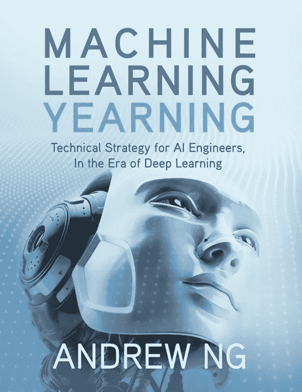
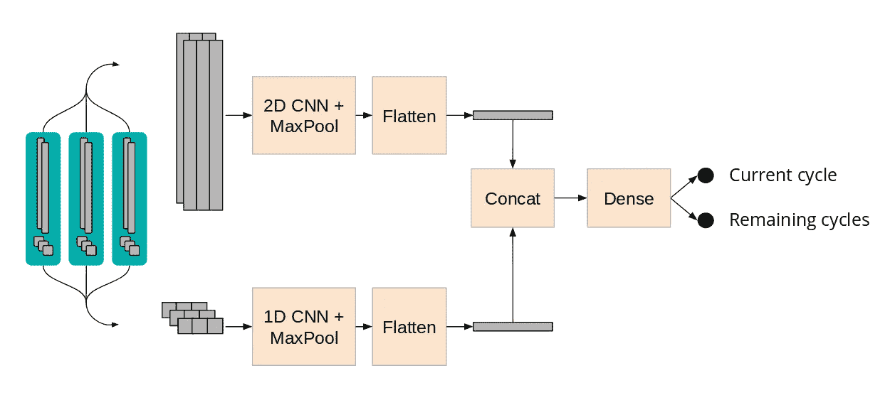

# 如何挑选一个成功的人工智能项目，第 3 部分:使用模型

> 原文：<https://towardsdatascience.com/how-to-pick-a-successful-ai-project-part-3-working-with-models-3ab4ba1db0fb?source=collection_archive---------38----------------------->

这篇文章是“如何挑选一个成功的人工智能项目”系列文章的一部分。[第一部分](https://medium.com/@me_90946/how-to-pick-a-successful-ai-project-part-1-finding-the-problem-and-collecting-data-9e701e316977)，[第二部分](https://medium.com/@me_90946/how-to-pick-a-successful-ai-project-part-2-working-with-data-879d4f535ef9)。即使你独立地阅读每一部分，它们也能很好地工作。

在这里，我将讲述我在与模型打交道中所学到的东西，以及这对选择一个将会成功的人工智能项目有多么重要。我在[人工智能深度潜水](https://aideepdive.com/)和[数据科学静修](https://datascienceretreat.com/)中指导了超过 165 人。

## 没什么理论

如果你问 meetup 主持人“你是如何选择你的架构的？”最有可能的答案是类似于“我从博客帖子或论文中复制了它，然后进行了调整。”几乎没有指导如何选择架构的理论。该领域似乎处于中世纪学徒阶段，学徒们复制大师的作品。尽管这个领域每年产生 1000 篇论文，但理论方面的文章很少。从业者产生“经验法则”来挑选架构和训练模型。一个很好的例子是吴恩达的书《机器学习的渴望》。'

这本书充满了我们所拥有的最接近“理论”的东西，用来挑选架构和微调模型。

## 你需要有一个黄金标准

你的模型必须改进一个重要的 KPI。这意味着有一些可观察的、可测量的东西，模型比基线做得更好(这通常意味着根本没有模型)。

监督学习比无监督学习更好，因为你可以证明你的模型做了什么。

如果你使用聚类分析，你的老板总是会说‘你给我看 3 个聚类，为什么不是 5 个呢？’我想有 5 个。这个没有正确答案。受监督的模型有明确的性能指标，而且经常可以“用眼睛”检查(嘿，你的狗分类器漏掉了这只看起来像蔓越莓蛋糕的狗。)

## 使用预训练模型

使用迁移学习，你不是从零开始学习过程，而是从解决不同问题时学到的模式开始。这样，你可以利用以前的学习，避免从头开始。

当您根据自己的需要重新调整预训练模型的用途时，首先要删除原始分类器，然后添加一个符合您的目的的新分类器。您可以节省时间(在处理具有数百万参数的大型深度网络时，可以节省数周时间)。

公共领域中有一些模型库，例如:

 [## cadene/pretrained-models . py torch

### pytorch 的预训练 conv net:NASNet、ResNeXt、ResNet、InceptionV4、InceptionResnetV2、Xception、DPN 等。…

github.com](https://github.com/Cadene/pretrained-models.pytorch) 

也试试 https://paperswithcode.com。顾名思义，这是一个可搜索的论文集合，具有公共实现，是一个很好的起点。

如果你已经学过 fast.ai 或者其他很多 ML 课程，你知道的已经足够开始重用预训练模型了。即使您无法找到与您的问题匹配的预训练模型，使用一个几乎不相关的模型通常比从头开始要好。如果您的数据很复杂，并且您的体系结构将超过十几层，情况就更是如此。需要很长时间(而且硬件大！)来培养大架构。

对新型号保持一定的了解是有好处的；跟踪艺术的状态是不必要的，但可以肯定的是，现在比以往任何时候都容易。Twitter 会告诉你是否有什么重要的事情突然出现。如果有人做了一个很棒的演示，Twitter 就会火起来。关注几个经常发这些东西的人就好了。

要浏览 arXiV，试试 [arxiv sanity](http://www.arxiv-sanity.com ) (这有助于捕捉趋势，如果你想成为一名 ML 从业者，我不建议你优先考虑纸质阅读。你可能需要快速行动来交付成果，以至于阅读论文成为你负担不起的奢侈品。)关于演讲视频: [https://nips.cc](https://nips.cc) 现在大多数演讲都有视频。处理 NeurIPS 是一项巨大的工作，所以很容易在人们参加后不久阅读他们的摘要。

我指导的大多数项目(至少最近一两年)都使用了迁移学习。想想 10 年前的自己。如果你告诉过去的自己，在未来，任何人都可以下载一个花了几周时间训练的最先进的 ML 模型，你会感到惊讶吗？用它来建造任何你想要的东西？

## 所有科学学科发表的论文都用 ML，但是模型都不是很强；改善它们是一个快速的胜利

例如，这篇关于如何根据放电模式预测电池寿命的论文发表在最好的科学杂志之一《自然》上。他们的机器学习充其量只是初步的；这实际上是意料之中的，因为作者是电气工程，而不是机器学习。该团队更关注他们在电气工程领域的知识，而不是机器学习部分。在第 18 批[数据科学务虚会](https://datascienceretreat.com/)上，一个非常精明的参与者团队(汉尼斯·诺布洛赫、阿德姆·弗伦克和温迪·张)看到了一个机会:如果我们用更复杂的模型让[做出更好的预测会怎么样？他们不仅设法在纸上击败了模型的性能；他们从 Bosch 那里得到了继续工作 6 个月的机会(已支付！无股权)。他们拒绝了这个提议，因为他们毕业后都有更好的计划。](/predicting-battery-lifetime-with-cnns-c5e1faeecc8f)

汉尼斯、阿德姆和温迪所做的事情，充满了机会；那么多论文提供了数据和(低)基准。忘记做 Kaggle 比赛；在这些高调的文件中有更多的机会！

## 避免大猩猩问题

以下内容仅适用于产生用户可见结果的模型。如果您的模型的最终用户是另一台机器(例如，您生产了一个其他机器使用的 API)，那么您可以跳过这一节。

你的 ML 模型为你的用户提供价值，但前提是他们信任结果。你会看到，这种信任是脆弱的。

2015 年，Google photos 使用机器学习来标记图片的内容，并改进搜索。虽然这种算法的准确度让谷歌高管批准它投入生产，但它有“灾难性的错误标注”。你可以想象这对谷歌和机器学习领域来说是一场公关灾难。谷歌发布了一个修复程序，但第一个修复程序并不充分，因此谷歌最终决定不给任何照片添加“大猩猩”标签。

我们从中学到了什么？如果你的问题依赖于一个算法，而这个算法有可能错误地分类一些破坏信任的东西:选择另一个问题。

在我监管的 200 个项目中，当一个团队提出一个有“大猩猩问题”的想法时，我会引导他们远离它。你可以花几个月的时间做那些被大猩猩问题弄得无效的一流 ML 工作。另一个例子是标记“假新闻”:如果你的算法将我的一个意见领袖(一个我盲目信任的人)标记为“假新闻”，你就永远失去了我。

## 多个模特完成一项任务(例如:捡烟头)

让无人驾驶汽车发挥作用是一系列工程问题。许多不同的 ML 模型协同工作，带你去你想去的地方(原谅这个双关语)。

我们实验室的一个例子:Emily 是一辆自动驾驶的玩具车，它能找到并捡起我们之前提到的烟头，它正在做 3 个子任务:

-识别烟头

-将车开得足够近，让烟头触手可及

-捡烟头(捅)

每个子任务都是一个模型。

请注意，烟头的毒性令人难以置信(一个烟头可以污染 40 升水)，而且很难用扫帚捡起来，因为它们太轻了)。结果，它们在公共区域堆积。一大群这样的机器人可能会造成严重的生态影响。当然，现在还为时尚早，许多实际问题依然存在:人们会为了零件而偷车吗？即使他们不这样做，他们会与会犯很多错误并可能在关键时刻阻挡他们道路的自主机器人分享街道吗？

要学习的一个经验是**结合 3 种模式让你解决一个问题，否则**无法解决。每一个孤立的问题可能并不那么棘手；事实上，这可能是一个已经解决的问题。

## 理解上下文

**这个模型试图解决什么问题？**你认识这些“产品人”？他们认为人们“雇佣”产品和服务来完成工作。你的模特正在做的工作是什么？

这有时可能很明显，但有时不那么明显，这就存在机会。

想象你在一家医院工作。经过深思熟虑后，你的老板决定你的下一个任务是建立一个模型，预测重症监护病人何时会崩溃。这个模型的“工作”是什么？

可以这么看:**工作是拯救生命**。

换个角度来看:这份工作是优化利用医院的资源。当病人崩溃时，需要很多人努力让她恢复稳定。每一个和这个病人有任何关系的护士和医生都会冲进房间，放弃他们正在做的任何工作。重新完成任务代价高昂。任务切换效率非常低；手拿天文钟多次尝试做 A 和 B 两个任务，AAAABBBBB vs ABABABAB。第二种需要更长的时间，对于几乎所有的任务 A 和 b 来说都是如此。这就是为什么被一个通知分心会对生产力造成如此大的损害。

无论如何，无论你认为你的模式是拯救生命(句号)还是优化配置医院资源(拯救更多生命！)让一切变得不同。

因为不“接近金属”的“老板”不能真正估计什么是适合模型的工作，你将不得不做它。它非常适合数据科学家的分析思维。

— -

这就是你要的。一个完整的手册来挑选一个成功的人工智能项目，分三部分。我希望这是有用的，它可以帮助你解决真实的人在机器学习中遇到的问题。活着从来没有比现在更好的时候了。这么多唾手可得的果实，这么多的杠杆作用都要归功于这种技术，如果我们能设法在人工智能方面多教育几千人，就会有这么多的生产力提高。如果本手册有所帮助，我很乐意收到您的来信，并见证您构建的项目。在 twitter 上发送给我，地址是 [@quesada](https://twitter.com/quesada) ，我的 DMs 是开放的。