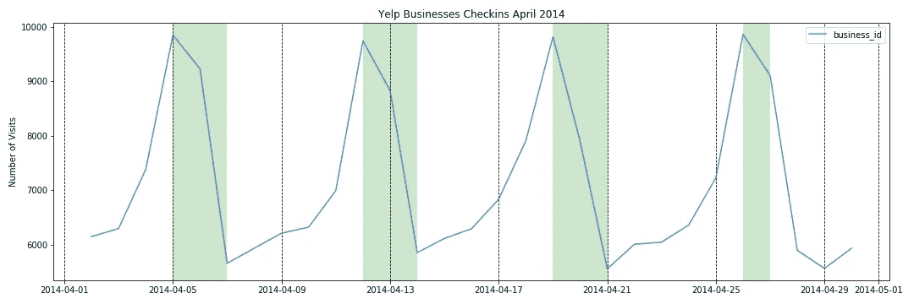

# 如何绘制时间序列

> 原文：<https://towardsdatascience.com/how-to-plot-time-series-86b5358197d6?source=collection_archive---------4----------------------->


Photo by [Chris Lawton](https://unsplash.com/@chrislawton?utm_source=medium&utm_medium=referral) on [Unsplash](https://unsplash.com?utm_source=medium&utm_medium=referral)

如果处理得当，处理时间序列可能是[探索性数据分析](https://en.wikipedia.org/wiki/Exploratory_data_analysis)中最有洞察力的部分之一。在这篇文章中，我们将使用来自 [Yelp 数据集](https://www.yelp.com/dataset)的签到日志，使用 [Pandas](https://pandas.pydata.org/) 和 [Matplotlib](https://matplotlib.org/api/pyplot_api.html) 来探索不同时间段的趋势。

# 数据采集

下载完数据后，我们需要知道使用什么。下面的块显示了基于 [Yelp 文档](https://www.yelp.com/dataset/documentation/main)的`checkin.json`文件中的一个示例条目:

```
{
    // string, 22 character business id, maps to business in business.json
    **"business_id": "tnhfDv5Il8EaGSXZGiuQGg"**

    // string which is a comma-separated list of timestamps for each checkin, each with format YYYY-MM-DD HH:MM:SS
    **"date": "2016-04-26 19:49:16, 2016-08-30 18:36:57, 2016-10-15 02:45:18, 2016-11-18 01:54:50, 2017-04-20 18:39:06, 2017-05-03 17:58:02"**
}
```

我们可以用带参数`orient=columns`和`Lines=True`的熊猫 [read_json](https://pandas.pydata.org/pandas-docs/stable/reference/api/pandas.read_json.html) 方法读取输入文件。

在读取数据时，我们的数据帧看起来像这样:


`date`列条目是字符串，每个日期由逗号分隔。通过查看它们，我们可以知道格式确实是`YYYY-MM-DD HH:MM:SS`。

# 数据争论

为了可读性，我们希望我们的数据帧看起来更像这样:


从 EDA 的角度来看，展开的事件日志更有意义，而 JSON 格式对于内存存储更有意义。

我们可以通过创建一个字典来获得这个结果，其中的键对应于日期，值对应于 business_id。在这里，我们假设日期足够细，因此没有两个日期是相同的。记住 [python 文档](https://docs.python.org/3/tutorial/datastructures.html#dictionaries)不允许在一个字典中有重复的键。

实现可以如下进行:

# 季节性

假设我们想知道所有可用年份的入住总数。我们将以此为契机，通过方法引入可以在[群内使用的](https://pandas.pydata.org/pandas-docs/stable/reference/api/pandas.DataFrame.groupby.html)[熊猫群](https://pandas.pydata.org/pandas-docs/stable/reference/api/pandas.Grouper.html)。有关频率别名的更多信息，请参考 [pandas 文档](https://pandas.pydata.org/pandas-docs/stable/user_guide/timeseries.html#offset-aliases)。

代码返回了这个简洁的图形:


这是一个好的开始，但是如果我们想潜得更深呢？我们将放大到 2014 年，尽管任何其他年份都可以。选择日期范围很简单:

季节性的第一个指标是看周末，因为数据来自美国和加拿大，周末是周六和周日。请记住，周末因国家而异，例如迪拜的周末是周五和周六。

因此，我们希望检测哪些天是周末，并为其编写一个可定制的函数:

上面的函数返回周末的指数。接下来，为了绘图，我们定义了另一个辅助函数，以在 [pyplot axvspan](https://matplotlib.org/3.1.1/api/_as_gen/matplotlib.pyplot.axvspan.html) 的帮助下突出显示与这些指数相对应的绘图范围:

最后，我们可以在一个接收数据帧的更大的函数中使用这两个函数:

结果是这个简洁的情节:


上面的情节符合人们周末出门比工作日多的直觉。为了更好地了解这种累积，我们可以使用相同的函数更仔细地查看 2014 年 4 月。



如果我们想要显示一个更细粒度的四月视图呢？由于原始数据帧中的每个条目都是一次签入，因此我们可以按 30 分钟的频率分组，并按如下方式计数:

结果就是下图:


# 绘制置信区间

我们看到了如何放大时间段来获得季节性的感觉。然而，企业也想知道给定一天的预期签到数量，以及它可能如何变化。例如，我们可能正在求解一个回归方程。

因此，我们需要构建图表来显示一周中某一天的平均签入量和某种置信区间。

我们将使用上一节中定义的`checkin_halfhour`来提取星期几:

我们的数据帧现在看起来如下:


接下来，我们使用 [pandas aggregate](https://pandas.pydata.org/pandas-docs/stable/reference/api/pandas.DataFrame.agg.html) 方法构建`day_avg`数据框架。出于我们的目的，我们将汇总:

*   总和
*   平均
*   标准偏差

下面的代码块为我们做到了这一点:

我们现在有了一个可以用来绘制区间的数据框架:


我们如何定义间隔取决于数据的分布以及窄/大间隔的商业价值。在我们的例子中，我们希望为一周中的每一天生成预期的签入，并获取两个标准偏差内的所有信息。

这样做是为了注意如下所示的`day_avg`索引中的级别:

结果图揭示了很多签入行为，举例来说，我们展示了周一、周三和周六。


# 结论

时间序列分析的数量和深度取决于我们试图解决的问题。例如，我们可能想要评估餐馆，或者只在早上 8 点到下午 3 点营业的企业，比如咖啡馆。

EDA 的一个目的是为特征提取做准备。通过上面的练习，我们可以开始考虑一些特性，比如最常见的签到时间，或者说是白天的签到。