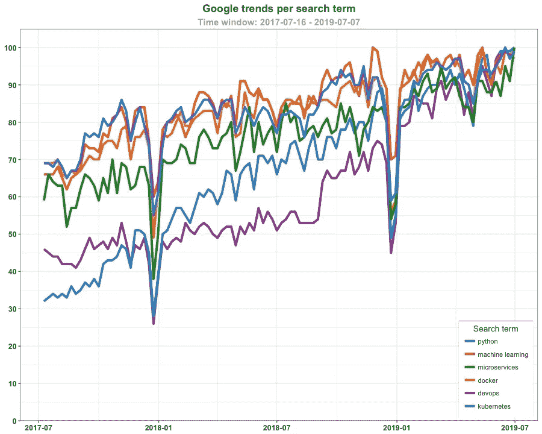
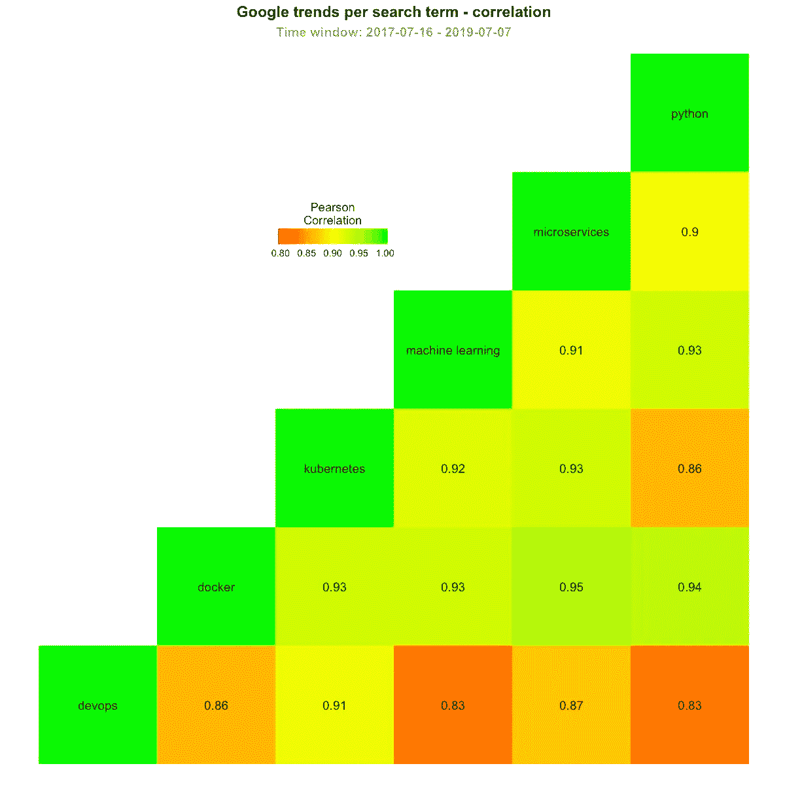
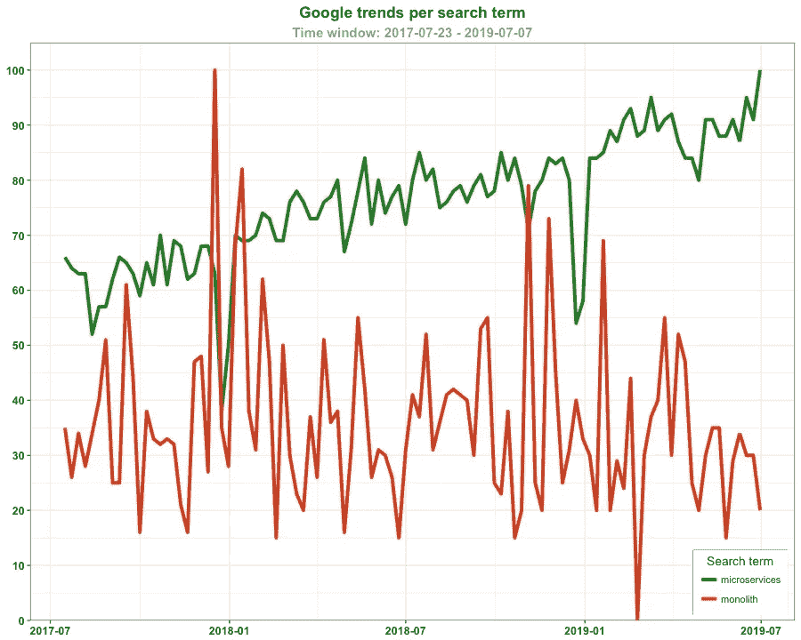
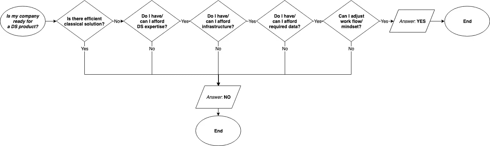
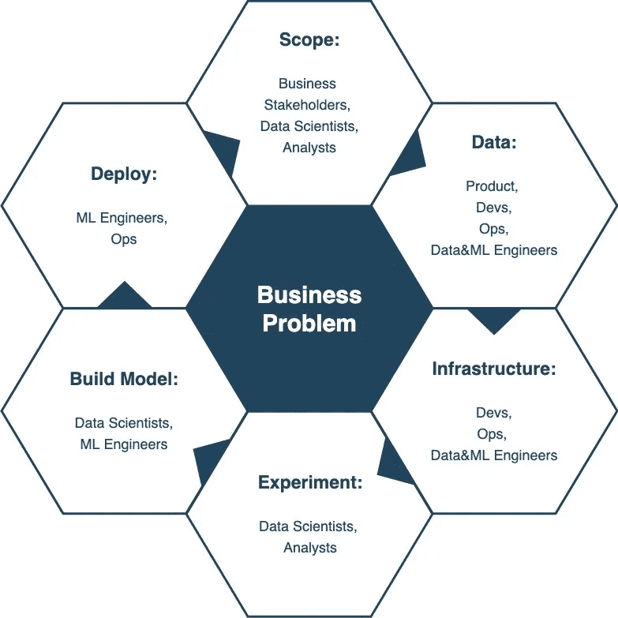
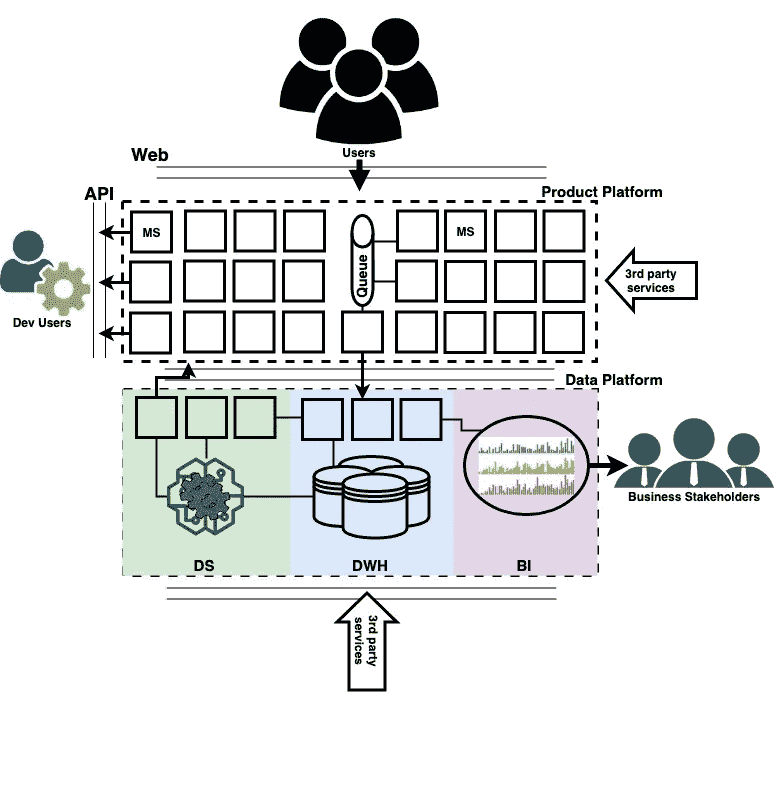

# 如何通过 python 微服务的机器学习为您的产品提供动力。一

> 原文：<https://towardsdatascience.com/how-to-power-up-your-product-by-machine-learning-with-python-microservice-pt-1-de0f2b434bec?source=collection_archive---------10----------------------->

## *文章集是我在*[*euro python 2019*](https://ep2019.europython.eu)*给的* [*工作坊*](https://www.dkisler.com/europython2019) *的总结。*

*主要动机*是展示如何开展*数据科学*和*机器学习*项目，以及如何使用*面向微服务的架构*构建机器学习服务并将其集成到软件产品中。

如果您是从事机器学习项目的*软件工程师*，或者正在考虑如何改进您的工作流程和模型交付的*数据科学家/机器学习工程师/数据工程师*，或者试图连接各个点并改进数据产品交付流程的*项目经理*，或者致力于在您的组织中采用数据科学和机器学习的*执行经理*，您可能会发现这些文章很有用。

这套物品被分成不同的部分。第一部分涉及主题的背景/介绍。

# 介绍

首先，让我们定义*微服务/面向微服务的软件架构*和*机器学习。*

简而言之，*微服务*是一种当不同的功能应用部分相互独立并通过网络上的通信协议进行通信时构建软件的方法。*每个应用组件都是独立的，并根据服务层协议 SLA* 与其他组件进行交互。

*机器学习*或 *ML* 是一种跨学科的方法，使用迭代计算技术和应用数学算法从数据中提取模式。它是*计算机科学/数据科学*的一个子域。机器学习软件产品遵循以下流程:

```
*train: data + result -> rules
serve: rules + data -> result*
```

## 为什么选择微服务和 Python？

首先，你可能会问自己两个合理的问题，*为什么是微服务*和*为什么是 python* ？我和几乎所有人一样，会用谷歌来回答这个问题:)

## 计算机编程语言



Google trends for python, microservices, machine learning, development and infrastructure related topics.



Correlation of google trends for python, microservices, machine learning, development and infrastructure related topics.

正如人们所看到的，随着时间的推移，社区对使用 *python、*微服务*软件开发、机器学习*和 *DevOps* 的兴趣正在增长，这些兴趣领域高度相关。换句话说，当人们搜索词涉及微服务，或机器学习，或 DevOps 话题时，很有可能是在 *google* 上查询了 *python* 相关搜索词。

上面的搜索趋势，事实上 *python* *是* ***继 *C* 和 *java* 之后第三个最流行的*** *通用编程语言*根据 [TIOBE 索引](https://www.tiobe.com/tiobe-index/)(截至 2019 年 7 月)和*使用 python* 引导和执行项目的相对简单性使其成为机器学习和数据科学的领导者。

## 微服务



Google trends for software architecture related topics.

至于面向微服务的软件架构，很明显，开发者社区的兴趣倾向于微服务，而不是单片软件架构。

微服务的主要优势之一是软件产品*特性服务*的独立性，使公司能够进行分布式开发，提高软件的可扩展性。这使得这种开发方法成为将机器学习集成到软件产品中的合理架构选择。

# **数据科学/机器学习项目**

## 我为什么要烦恼呢？

作为一名高管，这是一个合理的问题，*目前我应该为数据科学，还是为我的产品的机器学习而烦恼*？

它伴随着以下问题:

*   我的组织准备好实施机器学习服务了吗？
*   我们应该如何改进才能达到准备就绪的程度？



Is my organisation ready for data science/machine learning project?

上图可能有助于回答这些问题。让我们跟随它:

1.  首先要回答的问题是，是否已经有了根据业务目标交付结果的*高效经典*解决方案。 ***经典*** 这里指的是软件产品作为*“数据+预定义的业务规则=结果”*。如果答案是 ***是*** ，你可能应该关注其他问题，或者在为你的产品使用机器学习之前重新定义当前问题的范围。如果答案是 ***否*** ，我们就去点 2。
2.  更好地了解你的资源，如果你有，或者你*可以负担得起* *数据科学专家*将机器学习集成到你的产品中。如果答案是 ***否*** ，你应该缩小你的问题的范围，重组你的组织，考虑外包，或者为你的产品使用第三方服务提供商。如果答案是 ***是*** ，我们就去点 3。
3.  基础设施呢？我们有需要的东西吗？机器学习是一个计算量非常大且耗时的过程，因此为了降低成本，它需要足够的硬件资源和自动化数据管道。如果答案是 ***否*** ，您应该定义策略来供应、构建和维护基础架构，以构建和托管数据科学解决方案和机器学习模型。如果答案是**是**，我们转到第 4 点。
4.  我们需要所有必要的数据吗？ *是否所有数据都可以访问，它们是否在一个公共存储层？*这是一个非常棘手的问题，可能需要许多团队的投入，如*数据工程师、*、*产品*、*开发人员*。但是，澄清这个问题很重要，因为没有数据就没有数据科学:)如果答案是**否**，那么在数据科学项目执行之前，首要任务是构建一个统一的数据层，其中包含干净且易于访问的数据，并自动收集与您的业务问题相关的数据。如果答案是**是**，我们就转到第 5 点。
5.  我所在组织的工作流程有多灵活？我们能适应解决问题的新方法吗？这是列表中最棘手的问题，它可能没有直接的是或否。但是，如果您的组织无法支持流程和工作自动化的思维模式，您的任何数据科学计划都可能会失败。例如，如果访问数据需要几周时间，获得资源(GPU 机器、工作站等)需要几个月时间。)对于模型培训，无限小时的会议以获得业务部门的足够支持来确定问题的范围，即使很小的积极价值也不太可能通过机器学习为您的公司产生。如果答案是**否**，你的首要任务应该是重组组织的工作流程，以促进新方法的整合，从而有效地解决你的业务问题。

如果在回答了流程图中的所有问题后，我们到达最后的 ***是*** ，我们就准备好进入机器学习服务的工作点，并将其集成到产品中。让我们从*项目流程*开始。

## **数据科学/机器学习项目流程**



Data science/machine learning project cycle.

数据科学，或者说机器学习项目最重要的 ***目标是解决商业问题*** 。它是一个项目的基础，*一切都是围绕要解决的问题*来定义的。一旦设定好，数据科学/机器学习项目应该按照周期进行:

1.  ***范围*** 和项目 ***目标*** 由*业务干系人*、*项目经理*和*数据科学家设定。*

*2。必然* ***数据*** 要准备好。在这里，许多团队都参与其中:

*   *产品/项目经理*和*数据科学家*以 ***定义数据* *特性*** 进行建模。产品人员是连接数据团队和业务的桥梁。
*   *数据工程师*和*开发人员*实现新的管道，将所需数据从产品发送到 ***数据平台*** 。
*   *机器学习*和*数据工程师*在数据平台上设置**数据管道**。

3. ***基础设施*** 到*培训和部署由 SRE/DevOps 和机器学习工程师提供的模型*。一旦基础设施被设置好，它当然可以被其他 ML 项目重用。

4.一个被循环的步骤本身叫做*机器学习* ***实验*** ，它涉及数据科学家和分析师。机器学习项目的模型或*产品*在项目的这个阶段被定义。

5.步骤 ***构建模型*** 将数据科学家和机器学习工程师联系在一起。在项目的这个阶段，正在构建机器学习的产品。

6.周期的最后阶段， ***模型部署*** 涉及机器学习工程师、开发人员和 Ops/SRE/DevOps 工程师。只有完成了这一步，*项目才能被利益相关者*评估。只有在这个阶段，许多团队工作的结果才能集成到产品中，从而影响业务。如果没有这个阶段，数据科学/机器学习项目就不能被认为是一个项目，因为它永远不会以其他方式与用户交互。所有机器学习项目都应该将**部署**作为首要目标， [API 优先设计](https://medium.com/adobetech/three-principles-of-api-first-design-fa6666d9f694)是可以遵循的有用方法之一。

一旦机器学习模型/产品交付给用户，项目可以*缩小范围，*或*重新定义*以改进现有模型*，*或*新项目*可以启动以构建新模型。

## 金科玉律

当你进行数据科学/机器学习项目时，有一些规则，我会称之为**黄金** **规则**:

1. ***缺乏问题规范→模型的无限发布时间***

> 如果您错过了项目范围的阶段，无法从利益相关者那里收集需求，并为问题设定明确的业务目标，您就无法交付机器学习解决方案。

2. ***无基础设施≡不充足，或坏数据→无，或坏模型***

> 如果没有足够的数据平台，你就无法实施任何机器学习解决方案，否则你就不太可能拥有足够高质量的数据来提取系统模式、训练模型和实施你的解决方案来为你的用户服务。

3. ***精益/迭代开发→成功的 ML 项目≡产品交付***

> 机器学习只能使用精益/迭代开发方法有效地交付:
> 
> -首先部署概念验证 PoC，以测试数据管道基础设施并设置模型基线。
> 
> -要交付给利益相关方进行解决方案评估的最低可行产品、服务的 MVP。
> 
> -最终交付的服务的生产版本，作为具有监控和(自动)模型调整的最终结果。

# 数据平台

现在，当我们定义机器学习项目流程时，让我们看看如何将机器学习服务集成到产品平台中，以及可以采用什么样的数据平台逻辑架构。



Data platform integration architecture.

上图说明了软件应用的两个主要功能部分，或所谓的 ***平台*** :

*   *产品平台*，服务通过不同的接口，如 *web GUI* 或 *REST API* 端点，相互通信并与第三方服务通信，以向用户/企业客户交付价值。
*   *数据平台*提供支持内部客户/业务利益相关方的服务，并提供足够的工具，通过强调用户活动来促进决策制定。

*数据平台*可以分解为*三个部分*，可能有*三个团队*参与维护；

1.  *数据仓库、*或 *DWH —* 连接产品平台和第三方数据提供商的部分，将所有有用的数据整合到一个持久数据存储中，并转换加载的原始数据，以提供预定义的*KPI*和数据集市，供分析人员、数据科学团队和业务利益相关方进一步使用。 ***数据工程*** 团队负责这部分。团队至少有*三套 SLA:****DWH-to-BI+业务*** ，****DWH-to-Product***，****DWH-to-DS+业务*** 。**
2.  ***分析/商业智能平台、*或 *BI —* 从 *DWH* 获取数据并向业务利益相关方提供内部分析作为报告解决方案的部分，例如仪表板、描述性和说明性特别分析。 ***毕*** 和 ***数据分析*** 团队负责这部分。团队至少有*两套**SLA:****BI-to-DWH******BI-to-Business***。**
3.  ***数据科学平台、*或 *DS —* 使用来自 *DWH* 的数据来构建数据科学和机器学习服务，以改进面向内部客户/业务利益相关方的分析解决方案，或实施新产品功能来提高用户/业务客户的业务价值。 ***数据科学*** 和 ***机器学习*** 团队负责这部分。团队至少有*三套 SLA:* ***DWH 对 DWH*** ，***DS 对产品*** ，***DS 对业务*** 。**

## **机器学习项目交付**

**数据科学平台的成果可以(至少)以三种方式部署:**

1.  ***数据批处理—* 数据科学/机器学习服务按计划处理数据批处理，以进行预测，并将结果写回数据存储或分析平台，以供进一步使用。**
2.  ***报告—* 数据科学/机器学习服务生成并交付报告，例如仪表板、web-hook 消息、SMS 或电子邮件报告。**
3.  *****模型即服务*** 、 ***MaaS*** —数据科学/机器学习服务实时交付模型预测结果。它可以集成到产品平台中，以便与其他产品*功能服务*进行通信，例如与项目搜索或内容交付服务进行通信。**

**尽管是部署你的机器学习解决方案的最有用的方法之一，MaaS 在网络上几乎没有被涉及。比如只有 *5(！)2019 年 4 月至 6 月在[towardsdatascience.com](https://towardsdatascience.com/)上发布的 650 篇* *帖子*中的模型部署相关文章。**

**这让我们看到了文章集的主要技术目标，即如何构建 MaaS 的*演示。实现这一目标的最佳方式是遵循 ***边做边学的方法*** 。敬请阅读本文的*动手部分*，我将带您完成构建机器学习模型的步骤，并将其作为微服务集成到现有的 web 应用程序中。***

# *摘要*

*总结一下，要点如下:*

*   ****Python****和***微服务*** 是将机器学习集成到你的产品中的仪器的合理选择。**
*   *****数据科学项目只能在您的组织准备好*** 进行这种战略性转移时执行，例如，如果您有易于访问的通用数据层，遵循灵活的工作流程，并且能够聘请数据科学专家。**
*   *****要成功执行数据科学项目，应满足黄金法则*** 。**首先**，你要时刻牢记*数据科学/机器学习是关于解决商业问题*，而不是关于花哨的技术*缺乏项目目标规范容易导致项目失败*。**第二个**，*缺乏数据，或缺乏足够的基础设施往往不好，*或*根本没有数据科学解决方案*。**第三个**，迭代精益方法倾向于成功执行数据科学/机器学习项目。**
*   *****模型即服务*** 是一种高效、可维护和可扩展的方式，用于向您的用户或内部客户交付机器学习解决方案。**

# **参考**

1.  **关于微服务: [https://microservices.io](https://microservices.io/)**
2.  **关于机器学习:【https://link.medium.com/C9pSewGfSY】T2**
3.  **API 首次进场:【https://apifriends.com/api-creation/api-first **
4.  **API 优先方法:[http://engineering . pivotal . io/post/API-first-for-data-science/](http://engineering.pivotal.io/post/api-first-for-data-science/)**
5.  **数据科学 MVP:[https://link.medium.com/PbmMswPfSY](https://link.medium.com/PbmMswPfSY)**
6.  **精益开发:[https://lean kit . com/lean/lean/principles-of-lean-development/](https://leankit.com/learn/lean/principles-of-lean-development/)**

**我希望这篇文章对你的发展有用。欢迎留下评论，以便进一步讨论。**