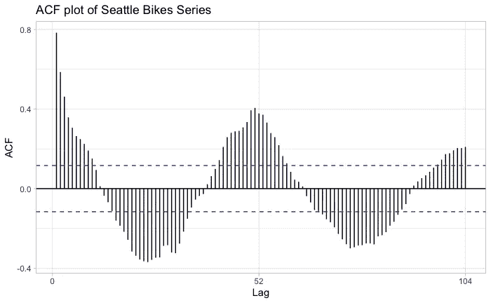
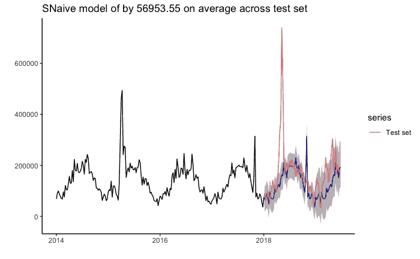

# 如何预测时间序列第 1 部分

> 原文：<https://towardsdatascience.com/how-to-predict-a-time-series-part-1-6d7eb182b540?source=collection_archive---------3----------------------->

## 真实世界预测

## 经典时间序列方法与预测包

时间序列预测与其他监督回归问题有很大不同。我的背景是商业分析，所以我对经典预测方法学(arima、指数平滑状态空间模型、移动平均等)有相当多的了解。在与许多数据科学家交谈时，我发现他们中的许多人对预测时间序列知之甚少，并将其视为其他监督学习问题，收效甚微(通常是因为他们没有设计正确的功能)。

R forecast 库是处理和预测时间序列的最完整和最流行的库之一。虽然我承认 python 在数据科学家中变得越来越流行，但这并不意味着它是万能的最佳语言。R 中的时间序列预测要成熟和常规得多。

本文的目标是逐步完成预测工作流和评估。因此，在这篇博文中，我将把数学最小化。有许多博客文章讨论了这些方法背后的数学原理，我将链接其中几个。在这篇博文中，我想分享一些我从使用预测包预测大量时间序列中学到的东西。在后续的博客文章中，我将介绍 facebook prophet 的工作流和使用监督机器学习算法提前一步预测的工作流。

不是所有用来写这篇文章的代码都会出现在博文中。更多例子的完整代码可以在我的 github 上找到。

## 时间序列预测与其他监督学习问题有何不同:

1.  使用 k 倍随机交叉验证是不符合原则的(因为保持时间顺序很重要)
2.  我们正在观察数据范围之外扩展一个趋势
3.  流行的机器学习算法(xgboost、线性回归、MLP 神经网络等)如果没有大量的特征工程，通常不会很好地工作
4.  对于决策来说，理解点估计的不确定性可能比点估计本身更重要，尤其是在商业环境中

## **数据—西雅图自行车:**

我将尝试预测的时间序列是西雅图市每周记录的自行车道流量。脚本 seatleBike.r 创建了这个数据集(从西雅图开放数据门户收集了 13 个公共数据集，按每周频率进行聚合)。

我将从一个快速的线图开始，来可视化时间序列。

```
df_day %>% 
  ggplot(aes(ds, y))+
  geom_line()+ 
  labs(x = "Date", y = "Traffic", title = "Seattle Bike Traffic")+
  theme_minimal()
```


**观察和重要提示:**

*   我们可以看到时间序列有**季节性**。**季节性**是指一种周期性模式，在几年内，与日历日、月、季度等相关
*   我们可以看到，时间序列似乎没有**趋势。**一个**趋势**是一系列长期向上或向下的方向。
*   夏季的自行车流量似乎比冬季要高得多。我们可以预料到这一点，因为西雅图冬天寒冷多雨。

预测时间序列时，我们通常使用序列的先前值来预测未来值。因为我们使用这些先前的值，所以绘制 y 向量(给定一周内自行车道上的交通量)与先前的 y 向量值的相关性很有用。该图被称为自相关图(自相关，因为它与自身相关)。

```
ggAcf(df_day %>% convert()) + theme_light() + labs(title = "ACF plot of Seattle Bikes Series")
```



**备注:**

*   相关性最强的是最近的值。这是典型的时间序列
*   我们可以看到在 26 周左右有很强的负相关性。鉴于时间序列的季节性，我们应该预料到这一点
*   这与一年前(52 周)的观察结果有很强的相关性，这是意料之中的。
*   我们可以看到，相关性下降了大约 3 或 4 个滞后。经典时间序列模型将学习这种结构，我们可以创建滞后变量，将其纳入我们的机器学习模型。

## **用季节性朴素模型设置基线:**

我们的时间序列似乎没有趋势，但它确实有季节性。当时间序列中存在季节性时(这是大多数真实世界时间序列中的典型情况)，一个好的基线模型是季节性朴素模型。

季节性朴素模型在预测时预测同一季节(去年同一周)的最后一个值。我们可以用[预测](https://cran.r-project.org/web/packages/forecast/index.html)包中的 snaive()函数来拟合这些模型。我之前说过，我会限制数学，以便放大预测工作流程。这是我将在博文中展示的唯一公式。我选择用公式来介绍预测中常用的符号。我将链接到其他模型背后的公式/数学的更多信息。


source = [https://otexts.com/fpp2/simple-methods.html](https://otexts.com/fpp2/simple-methods.html)

我在训练集上拟合模型，并在一个持续的测试集上进行预测，以查看模型如何预测它没有看到的数据。

```
naiv = train %>% 
  snaive(h=length(test), bootstrap = T, level = 0.89) 
naiv %>% 
  forecast_eval(model_name = "Seaonal Naive")
```



*   最新的预测看起来相当不错。该预测在测试集(MAE)上平均误差约为 56953.55。对于真实世界数据的简单模型来说，这已经很不错了。
*   预测区间覆盖了大部分点
*   如果数据有趋势，模型的表现会差得多
*   该模型忽略了 5 月和 4 月的大峰值，可以看到这两个峰值远远超过了预测的预测区间
*   预测的不确定性随着时间的推移而增加
*   **一个模型必须表现得比这更好才是可行的**

另一种评估预测的方法是使用 checkresiduals()函数检查训练集的模型残差。该函数返回 Ljung-Box 检验的检验统计量，这是一种零假设检验，用于确定残差是否为白噪声。我不喜欢零假设测试，所以我只做一次。


residual analysis


Nothing worse than null hypothesis tests

残差分析的另一个问题是强调点估计的准确性，而不是预测区间的准确性。这些测试还附带了一系列现实世界时间序列中通常不会遇到的假设。

## auto.arima:

auto.arima()是预测包中最受欢迎的函数之一。尽管它很受欢迎，但我并不喜欢它。根据我的经验，arima 模型最适合月度、季度或年度数据，但如果没有傅立叶项(auto.arima 不使用傅立叶项)，就无法捕捉每周或每日数据的季节性。尽管如此， **auto.arima()通常是数据科学家使用的唯一预测函数**。

```
aarim = train %>% 
  auto.arima() %>% 
  forecast(h = length(test), level = 0.89)
aarim %>% 
  forecast_eval(model_name = "Arima")
```


auto.arima

*   auto.arima()函数的性能比仅猜测去年的值(snaive()模型)差
*   arima 模型[往往不能很好地处理周数据](https://robjhyndman.com/hyndsight/forecasting-weekly-data/)(hynd man 博士写了这个包，所以如果你不相信我，就相信他)

auto.arima 函数选择了带漂移的 SARIMA(1，0，0)(1，1，0)[52]。让我们慢下来解释这个符号。

SARIMA 模型遵循形式(P，D，q)x(P，D，Q)m，ARIMA 模型遵循形式(P，D，Q):

p =自回归项的数量

d =差异数

q =移动平均项数

p =季节性自回归项的数量

d =季节差异数

q =季节性移动平均项的数量

m =频率

漂移=漂移系数或常数(arimas 和 sarimas 都可以包含漂移)

这意味着我们的模型是一个 SARIMA 模型，有一个自回归项，一个季节自回归项和一个季节差异项。该模型没有移动平均或季节性移动平均项。它还有一个漂移系数。我们可以用汇总函数来确认这一点:


Arima model summary

有兴趣了解更多 arima 模型的人可以参考包作者的书或者这个[链接](https://people.duke.edu/~rnau/411arim.htm?fbclid=IwAR0BkB6uIiFsoV1NicmHhKbGKvlgHA7Jn1VLXUhgQaoMnHk3SU8k6Jhg19Y)。

当用额外的外生回归变量和领域知识创建 arima 模型时，它们往往表现得相当好。当分析师选择只使用 auto.arima 函数时，模型往往表现不佳(尤其是对于周数据)。

## **指数平滑:**

指数平滑方法是一系列相关的模型，使用以前值的指数递减权重来预测时间序列的当前值。这些方法在商业分析和供应链领域非常流行。为了简洁起见，我将使用 ETS 函数，它适合各种指数平滑方法，并选择最佳方法。我强烈推荐你在这里阅读更多关于函数的内容。这篇文章越来越长，所以我不会进一步解释。

```
ETS = train %>% 
  ets() %>% 
  forecast(h = length(test), bootstrap = T, level = 0.89, lamda = 'auto')
ETS %>% 
forecast_eval()
```


ETS model fit

*   基于 ETS 模型的预测分布存在大量不确定性
*   该模型完全不符合季节性，因为它不处理大于 24 的频率

指数平滑模型往往适用于每日数据(如果它没有年度季节性，因此频率可以设置为 7)、每月和每年的数据，但不适用于每周数据。在许多商业情况下，我们需要预测每周数据并理解不确定性。

## TBATS:

**TBATS 是我使用预测包**预测时间序列的常用方法。像预测包中的其他方法一样，它是完全自动的。该模型本身足够灵活，可以适应一系列不同的时间序列，而且适应速度相对较快。

TBATS 是指数平滑方法的扩展，增加了 ARMA 误差和三角项。人们可以写一整篇关于这种方法的博文，所以我会选择链接一些关于这种方法的好文章给那些感兴趣的人，因为完整的解释只会让这篇文章太长。

```
TBATS = train %>% 
  tbats()TBATS_for = TBATS %>% 
  forecast(h = length(test))
TBATS_for %>% 
  forecast_eval("Tbats")
```


TBATS forecast

*   TBATS 是目前所有方法中表现最好的
*   TBATS 在表示预测的不确定性方面做得很好
*   正如软件包作者[指出的](https://otexts.com/fpp2/complexseasonality.html)，TBATS 间隔有时会太宽

## 让我们放大适合测试集的 TBATS:

我知道字幕是不正确的，预测区间是灰色的。


*   夏季和初秋的不确定性比一年中的其他时间要高得多
*   几个连续的点落在预测区间之外

## 总结:

*   TBATS 是一种灵活、精确的算法，通常优于其他经典方法
*   经典的时间序列方法无法预测大的异常
*   所有提出的模型都使用了自动模型选择程序

要了解更多关于预测的信息，我强烈推荐阅读 Rob Hyndman，这是软件包作者的书。Hyndman 博士还在使用新的[寓言](https://fable.tidyverts.org/)包开发这本书的新版本，该包为 tidyverse 带来了预测(要查看它，只需将 URL 中的 2 改为 3)。我还没能让寓言在我的机器上运行。它也可能需要一段时间才能像预测包一样成熟，所以现在我会坚持使用预测包。

[代号](https://github.com/pysr1/Forecasting)

## [西雅图开放数据门户的必要说明:](https://data.seattle.gov/stories/s/Data-Policy/6ukr-wvup/)

“此处提供的数据已经过修改，以用于其原始来源，即西雅图市。西雅图市和首席技术官(OCTO)办公室均不对本申请中包含的任何数据的完整性、及时性、准确性或内容做出任何声明；作出任何形式的陈述，包括但不限于对特定用途的准确性或适用性的保证；也不暗示或推断此处提供的信息或数据有任何此类保证。随着修改和更新的完成，数据可能会发生变化。据了解，使用网络订阅源中包含的信息需要自担风险。”

从我的代码中可以清楚地看到对数据集所做的修改。

本文授权:[https://creativecommons.org/licenses/by-sa/3.0/](https://creativecommons.org/licenses/by-sa/3.0/)