# 如何预测商业成败

> 原文：<https://towardsdatascience.com/how-to-predict-business-success-failure-3c11b9c3a04c?source=collection_archive---------24----------------------->

## 为什么一些小企业会失败，以及如何利用机器学习进行优化以取得成功


Photo by [Eaters Collective](https://unsplash.com/@eaterscollective?utm_source=medium&utm_medium=referral) on [Unsplash](https://unsplash.com?utm_source=medium&utm_medium=referral)

创业不是一件小事，有许多费用要考虑，如沉没成本、管理费用和贷款。衡量成功的标准包括但不限于增长、销售收入、客户保持率和资产负债表。

一个企业的生存能力首先取决于一个公理:**它保持开放**。

对于必须保持生存的企业和期望良好可靠服务的客户来说，这个主题是他们的主要兴趣所在。这在金融领域也很重要，在这一领域，贷款人必须证明发放贷款的正当性，并且可能有法律义务解释申请被拒绝的原因。

因此，我们将这一努力的动机和目的表述如下:**我们能否预测一家企业是开张还是关门？生存能力的主要指标是什么？**

在本文中，我们将使用 [Yelp 数据集](https://www.yelp.com/dataset)来解决这个问题，这是一个关于美国和加拿大当地企业的关系数据集合。它包含大量的综合信息:

*   668.59 万条评论
*   *192609*商家
*   *10* 都市圈
*   *1223094*提示

因此，Yelp 数据集是一个很好的案例研究，它研究了恰当设计的功能如何与机器学习模型相结合，可以预测企业在资产负债表等传统方法之外的成功。

在下一部分中，我们将呈现给定数据集的每个部分，并从中提取要素:

*   business:(business . JSON)该数据集包含与业务相关的数据，包括位置数据、餐馆属性和美食类别。
*   Reviews: (Review.json)这个数据集包含完整的评论文本数据，包括撰写评论的 user_id 和撰写评论的 business_id。
*   Checkin: (Checkin.json)这个数据集包含企业的登记信息。

# 商业

## 特征工程

`business.json`文件包含业务数据，包括位置数据、属性和类别。下面的代码片段显示了它的配置:

```
{
    // string, 22 character unique string business id
    **"business_id": "tnhfDv5Il8EaGSXZGiuQGg",**

    // string, the business's name
    **"name": "Garaje",**

    // string, the full address of the business
    **"address": "475 3rd St",**

    // string, the city
    **"city": "San Francisco",**

    // string, 2 character state code, if applicable
    **"state": "CA",**

    // string, the postal code
    **"postal code": "94107",**

    // float, latitude
    **"latitude": 37.7817529521,**

    // float, longitude
    **"longitude": -122.39612197,**

    // float, star rating, rounded to half-stars
    **"stars": 4.5,**

    // integer, number of reviews
    **"review_count": 1198,**

    // integer, 0 or 1 for closed or open, respectively
    **"is_open": 1,**

    // object, business attributes to values. note: some attribute values might be objects
    **"attributes": {
        "RestaurantsTakeOut": true,
        "BusinessParking": {
            "garage": false,
            "street": true,
            "validated": false,
            "lot": false,
            "valet": false
        },
    },**

    // an array of strings of business categories
    **"categories": [
        "Mexican",
        "Burgers",
        "Gastropubs"
    ],**

    // an object of key day to value hours, hours are using a 24hr clock
    **"hours": {
        "Monday": "10:00-21:00",
        "Tuesday": "10:00-21:00",
        "Friday": "10:00-21:00",
        "Wednesday": "10:00-21:00",
        "Thursday": "10:00-21:00",
        "Sunday": "11:00-18:00",
        "Saturday": "10:00-21:00"
    }**
}
```

目标变量是`is_open`，如 0 表示关闭，1 表示打开。

作为第一种方法，我们需要将嵌套的属性分解成相应的值。例如在`attributes`特性中，我们有一个`RestaurantsTakeOut`的二进制编码，我们需要进一步扩展`BusinessParking`特性。

在`attributes`特性中，我们可以设计分类变量，例如数值。例如,`NoiseLevel`是一个带有值的字符串输入:

*   *非常大声*
*   *声音大*
*   *平均值*
*   *安静*
*   [*楠*](https://pandas.pydata.org/pandas-docs/stable/user_guide/missing_data.html)

因此，可以用数值对这些字符串特征进行编码，例如表示噪声级别的标度。我们可以对`AgesAllowed`、`Alcohol`、`RestaurantsAttire`等属性重复同样的练习。

此外，`categories`特性包含一个不互斥的字符串列表。一家企业有可能被归入墨西哥式、汉堡式和腹肌式餐馆。因此，这些被编码为二进制特征。

在一个简单的[自然语言处理](https://en.wikipedia.org/wiki/Natural_language_processing)案例中，我们注意到大约 1000 个业务被命名为`Starbucks`，大约 800 个被命名为`McDonalds`。因此，我们定义二进制`chain`特征，如 1 表示该业务是链的一部分，并且一个名称必须至少出现 5 次才能被认为是链。

我们使用`latitude`和`longitude`特征，以便从 datataset 中提取[大地测量](https://en.wikipedia.org/wiki/Geodesy)特征。我们使用[最小包围盒](https://en.wikipedia.org/wiki/Minimum_bounding_box)方法来查询给定半径内的所有其他企业。在这个项目中，我们将半径设置为 2 公里，作为客户愿意在企业之间步行的合理距离。

从大地测量数据中，我们可以定义诸如`density`之类的特征，这是所查询的圆中的业务量。此外，我们可以通过应用 [Z 分数标准化](https://en.wikipedia.org/wiki/Feature_scaling#Standardization_(Z-score_Normalization))将每个企业与其周围环境进行比较。例如，企业价格的 Z 值是价格和群体平均值之间的差值，除以标准差。

## 借助外部资源推动业务发展

对于要素工程，在数据集之外提取信息可能会有所帮助。每个企业都有其相应的美国和加拿大格式的邮政编码。

也就是说，美国国税局发布个人收入统计数据[，加拿大统计局发布收入数据](https://www.irs.gov/statistics/soi-tax-stats-individual-income-tax-statistics-2016-zip-code-data-soi)。虽然不具体到业务本身，当地的收入可以发挥生存能力的作用。

为了保护公民的隐私，美国国税局不公布确切的收入数字，而是数据是绝对的。例如，`3`的值表示收入在*50，000-75000 美元*和`5`100，000-200，000 美元之间。

因此，我们可以将每个邮政编码与相应的家庭收入中值进行匹配，确保按照 IRS 方法将加拿大元转换为美国货币和宁滨加拿大收入数据。

# 复习

`review.json`文件包含完整的评论文本数据，包括撰写评论的用户标识和撰写评论的企业标识。

下面是展示这些属性的一个片段:

```
{
    // string, 22 character unique review id
    **"review_id": "zdSx_SD6obEhz9VrW9uAWA",**

    // string, 22 character unique user id, maps to the user in user.json
    **"user_id": "Ha3iJu77CxlrFm-vQRs_8g",**

    // string, 22 character business id, maps to business in business.json
    **"business_id": "tnhfDv5Il8EaGSXZGiuQGg",**

    // integer, star rating
    **"stars": 4,**

    // string, date formatted YYYY-MM-DD
    **"date": "2016-03-09",**

    // string, the review itself
    **"text": "Great place to hang out after work: the prices are decent, and the ambience is fun. It's a bit loud, but very lively. The staff is friendly, and the food is good. They have a good selection of drinks.",**

    // integer, number of useful votes received
    **"useful": 0,**

    // integer, number of funny votes received
    **"funny": 0,**

    // integer, number of cool votes received
    **"cool": 0**
}
```

我们可以通过`business_id`进行聚合，然后完成特性工程。然而，假设每个印象都有一个与之相关的时间戳，我们可以直接测量与给定位置相关的变化。

用户星级评定的平均值返回平均业务得分。按年份分组可以帮助我们了解业务特性是如何随年份变化的。他们是在进步还是落后了？

## 了解企业

首先要问的是那些~ 19.2 万的商家都在哪里？根据以下情节:**维加斯宝贝**！

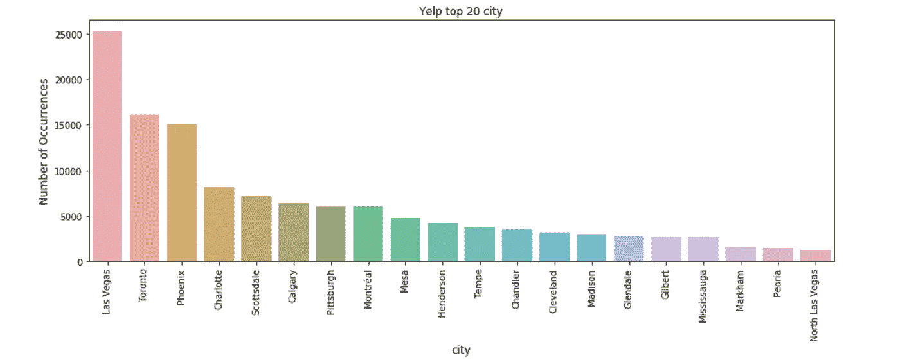

与上图相反，大多数企业位于亚利桑那州，如下图所示:

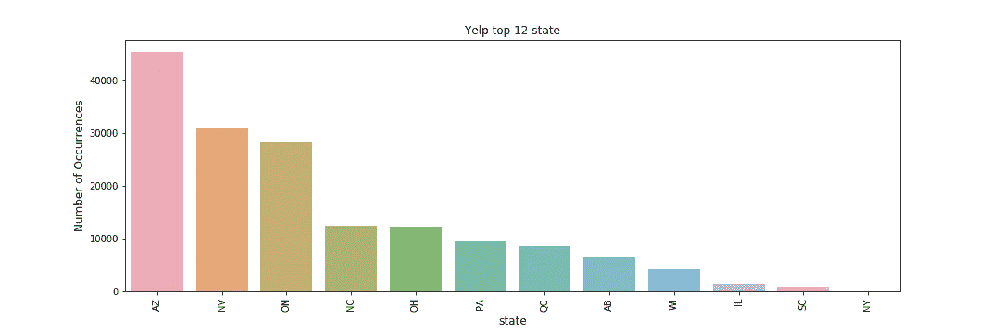

此外，我们可以看到大多数企业的评级在 3.0 到 4.5 之间，因此平均值约为 3.5。

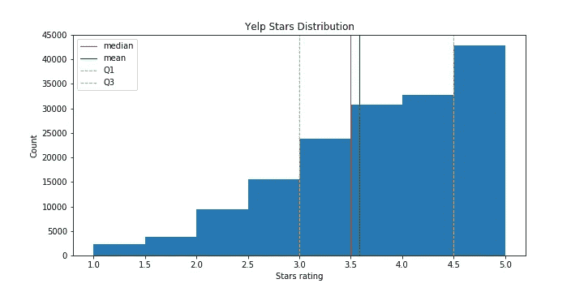

最后，我们希望通过按目标变量绘制计数和色调来比较不同业务类型的正/负标签的分布。餐馆占企业的绝大部分，关门企业的比例最高。

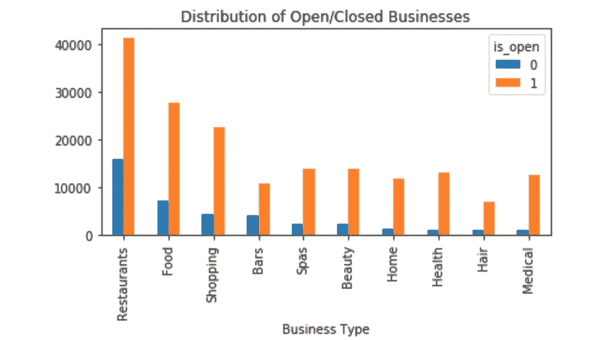

# 签入数据

`checkin.json`文件列出了所有可用的企业登记信息:

```
{
    // string, 22 character business id, maps to business in business.json
    **"business_id": "tnhfDv5Il8EaGSXZGiuQGg"**

    // string which is a comma-separated list of timestamps for each checkin, each with format YYYY-MM-DD HH:MM:SS
    **"date": "2016-04-26 19:49:16, 2016-08-30 18:36:57, 2016-10-15 02:45:18, 2016-11-18 01:54:50, 2017-04-20 18:39:06, 2017-05-03 17:58:02"**
}
```

作为第一步，我们可以探索签入的趋势，如下图所示，其中 y 轴对应于所有年份的总签入数，并以 30 分钟为间隔进行分割。例如，这个图告诉我们，从周六到周日晚上的平均签入高峰发生在晚上 8 点左右，同时提供了一个置信区间。


从更宏观的角度来看，我们也可以探索 12 月份的入住情况，其中包含了很多季节性因素。在下面的图中，高光对应的是周末。

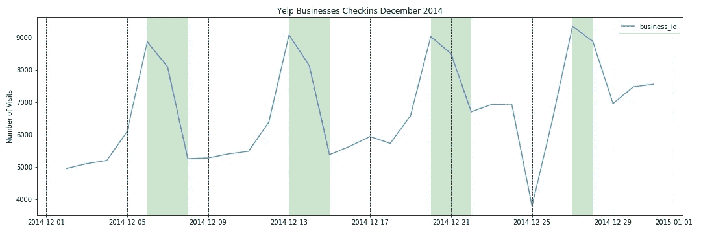

从这些数据中，我们可以提取出平均每月的签入量。此外，我们将`span`定义为第一次和最后一次登记之间的时间(以秒为单位):一家企业开业的时间越长，它保持营业的可能性就越大(参见[日出问题](https://en.wikipedia.org/wiki/Sunrise_problem))。

# 模型选择和评分

我们试图解决的问题属于[监督学习](https://en.wikipedia.org/wiki/Supervised_learning)。鉴于目标变量的严重不平衡性质，我们忽略了基于准确性的评分，并考虑以下指标:

*   [精度](https://en.wikipedia.org/wiki/Precision_and_recall#Precision)
*   [回忆](https://en.wikipedia.org/wiki/Precision_and_recall#Recall)
*   [F1 得分](https://en.wikipedia.org/wiki/F1_score)
*   [曲线下面积](https://en.wikipedia.org/wiki/Receiver_operating_characteristic#Area_under_the_curve)

在第一轮中，我们应用了几种监督学习算法。表现最好的人按升序排列:

*   [逻辑回归](https://en.wikipedia.org/wiki/Logistic_regression)
*   [梯度提升树](https://en.wikipedia.org/wiki/Gradient_boosting#Gradient_tree_boosting)
*   [随机森林](https://en.wikipedia.org/wiki/Random_forest)
*   [XGBoost](https://en.wikipedia.org/wiki/XGBoost)

在接下来的几节中，我们将更详细地阐述结合在一起产生可靠结果的各个技术。

## 分裂

特征工程的目的是获得可以直接输入算法的数据的数字表示。第一步是[在训练集和测试集之间拆分数据](https://en.wikipedia.org/wiki/Training,_validation,_and_test_sets)。

此外，我们应用最小-最大[特征缩放](https://en.wikipedia.org/wiki/Feature_scaling#Rescaling_(min-max_normalization))，其仅适用于训练数据，以避免模型泄漏。然后使用该拟合来转换训练和测试数据。

## 网格搜索交叉验证

这种也被称为 GridSearchCV 的方法很受数据科学家的欢迎，因为它非常全面。通过结合[交叉验证](https://en.wikipedia.org/wiki/Cross-validation_(statistics))和[网格搜索](https://en.wikipedia.org/wiki/Hyperparameter_optimization#Grid_search)，我们获得调整后的超参数。

## 特征相关性

某些算法，如基于树的模型，在高维空间中表现不佳。拥有太多的功能也可能会产生噪音。

用于检测噪声特征的第一种方法是通过逻辑回归的 [L1 特征选择](https://scikit-learn.org/stable/modules/feature_selection.html#l1-based-feature-selection)，其给无用特征赋予 0 的权重。第二种方法是使用 [featexp](https://github.com/abhayspawar/featexp) 包来识别噪声特征。

最终，最容易理解的方法是[特征重要性排列](https://christophm.github.io/interpretable-ml-book/feature-importance.html#feature-importance-data)。在这种情况下，我们置换一个给定的特征并计算模型预测误差的变化。如果移动特征会显著改变模型上的误差，则该特征是“重要的”，如果误差保持不变，则该特征是“不重要的”。

## 应对失衡

最后，该项目的最有影响的方面是处理不平衡的目标变量。回想一下，只有大约 20%的企业被列为关闭。

实际上，这意味着少数类被多数类淹没，使得算法没有足够的少数观察来做出决定，或者少数类被多数淹没。

解决这个问题的一个方法是通过欠采样:保持少数类不变，从多数类中随机抽取等量的观察值。相反，过采样稍微好一点:复制少数类，直到数据集平衡。

在任一采样选择中，仅将它应用于训练数据是至关重要的。对测试数据进行采样是一个常见的陷阱，因为这等同于曲解现实。

# 模型性能

下表总结了几种型号的性能。总的来说，所有模型都更擅长预测开放的企业(**第 1 类**)，而不是关闭的企业(**第 0 类**)。

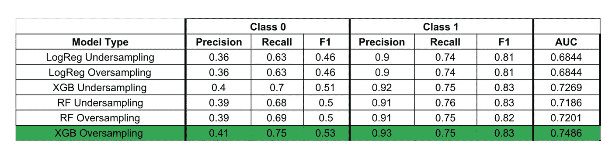

总的来说，我们可以看到基于树的模型往往在 AUC 徘徊在 *0.75* 时表现最佳。

也就是说，模型的可解释性与模型性能同等重要，如果不是更重要的话。因此，我们必须更深入地研究每个模型，以了解驱动我们决策的主要特征是什么。

下表显示了这些型号的 5 个最重要的功能。

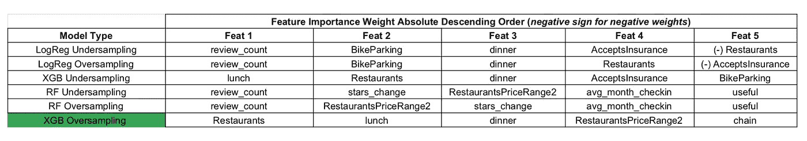

有趣的是，在逻辑回归等同一模型中，根据抽样方法的不同,`Restaurant`可能是正权重，也可能是负权重。

我们还注意到一些预期的特性，如与价格相关的`RestaurantsPriceRange2`，以及一些特殊的特性，如`AcceptsInsurance`和`BikeParking`。就保险而言，这一功能对按摩院或医生诊所等企业可能很重要。

在成功模式中，以下特征对企业成功至关重要:

*   做一个`Restaurant`
*   服务`lunch`
*   还发球`dinner`
*   你的`RestaurantsPriceRange2`很重要
*   做一个`chain`

# XGBoost 模型解释

XGBoost 的主要特性是从 [feature_importances_](https://xgboost.readthedocs.io/en/latest/python/python_api.html#xgboost.XGBRanker.feature_importances_) 属性中获得的。然而，我们希望找到一种方法来解释我们的输出，以及如何优化业务成功。

对于这项研究，我们使用 SHAP(沙普利附加解释)包来获得个性化的特征属性。 [Shapley 值](https://en.wikipedia.org/wiki/Shapley_value)主要用于每次预测的基础上，以帮助解释，并回答类似“*是什么导致我的企业被标记为关闭？*”

为了证明 SHAP 的使用是正确的，我们在 XGBoost 中给出了 [plot_importance](https://xgboost.readthedocs.io/en/latest/python/python_api.html#xgboost.plot_importance) 方法，它基于重要性类型产生了三种不同的解释。

*   `weight`特征在树中出现的次数

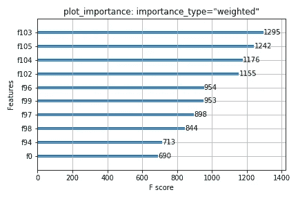

*   `gain`使用该功能的拆分的平均增益

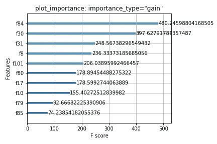

*   `cover`使用该特性的分割的平均覆盖率，其中覆盖率定义为受分割影响的样本数

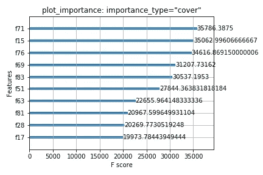

在下图中，我们显示了 SHAP 值的平均绝对值。x 轴显示从模型中隐藏特征时模型输出的平均幅度变化。考虑到隐藏一个特征会根据隐藏的其他特征而变化，Shapley 值用于加强一致性和准确性。

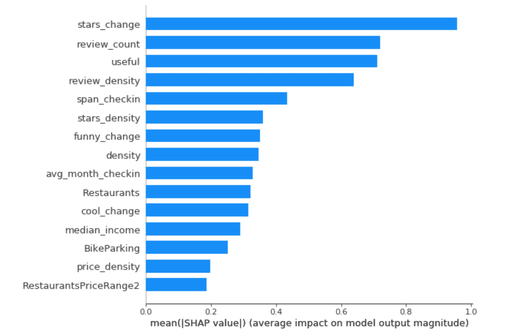

下图是每个要素的 SHAP 值的密度散点图，用于确定每个要素对数据集中每个观测值的模型输出的影响程度。摘要图结合了特征重要性和特征效果。摘要图上的每个点都是一个特征和一个实例的 Shapley 值。y 轴上的位置由特征决定，x 轴上的位置由 Shapley 值决定。颜色代表从低到高的特性值。

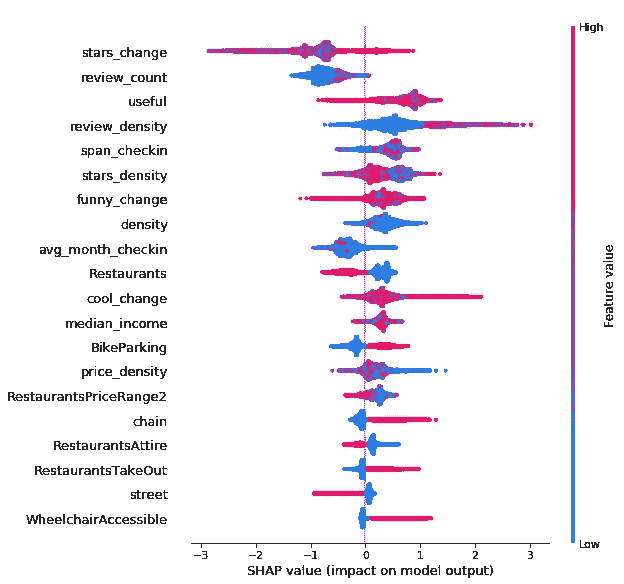

“着色”功能告诉我们，随着时间的推移，你的`stars_change`(星级的平均变化)增加是保持开放的一个很好的预测。对于`review_count`(评论数量)来说，不多会对你有害，然而`reiew_count`多也意味着负面评论多。对于第三个最重要的特性`useful`(有用评论投票总数)，这似乎是一个成功的积极指标。

该图还允许我们识别异常值，因为重叠点在 y 轴方向上抖动，因此我们可以了解每个要素的 Shapley 值的分布情况。对于一个特定的业务子集，拥有一个高计数的`useful`实际上可能是一个即将关闭的指标。比如，有人评论说“*离鸡肉远点，好像没煮熟*”也不是没听说过。

SHAP 相关图是显示单个要素对整个数据集的影响的额外可视化工具。与部分相关图相反，SHAP 考虑了特征中存在的交互作用效应，并且仅在由数据支持的输入空间的区域中定义。

下面的图表适用于`review_density`(相对于 2 公里半径内所有其他业务的标准化审查计数)。

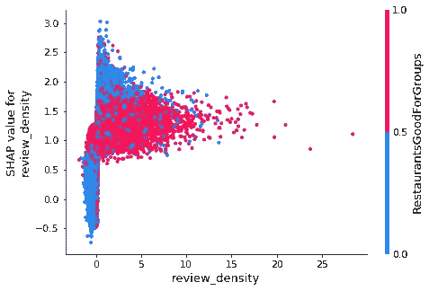

在上面的图中，垂直扩散由交互作用影响驱动，另一个特征，这里是`RestaurantsGoodForGroups`，被选择用于着色，以突出可能的交互作用。我们可以看到，相对于其他业务，拥有更高的评论数是成功的良好指标。此外，对群体有利往往与`review_density`正相关。

下面的相关矩阵与上面的图相联系。我们可以注意到`review_density`和`RestaurantsGoodForGroups`之间的正相关关系。

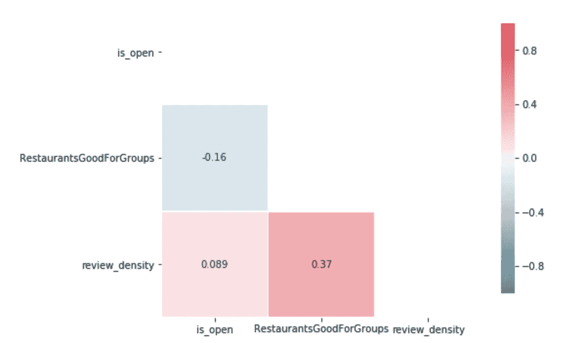

# 结论

企业家在投资前要研究清楚一家企业是关门还是继续营业。通过机器学习，我们能够识别出能够预测本文原始问题的特征。我们还能够在每个用户的基础上提供模型可解释性。

虽然可能无法获得问题的全面答案，但解决方案提供了一条前进的道路。企业可以使用模型解释来优化成功，并知道他们需要改进的指标。

展望未来，我们可以利用`review.json`文件中的文本信息。一个示例的 NLP 练习将是提取表示商业表现的时间或位置函数的情感或单词组。

多亏了 s[](https://www.sharpestminds.com/)**和 Aditya Subramanian，这个项目才得以实现。要深入了解该流程及其相应代码，请访问 GitHub 资源库:**

*[https://github.com/NadimKawwa/PredictBusinessSuccess](https://github.com/NadimKawwa/PredictBusinessSuccess/settings)*

# *参考*

*[](https://www.yelp.com/dataset/challenge) [## Yelp 数据集

### 如果你是学生，你将有机会赢得 10 个奖项中的一个，奖金为 5000 美元。我们将根据他们的…

www.yelp.com](https://www.yelp.com/dataset/challenge) [](/using-yelp-data-to-predict-restaurant-closure-8aafa4f72ad6) [## 利用 Yelp 数据预测餐馆倒闭

### 米恰伊尔·阿里菲拉克斯是一名有抱负的数据科学家，也是普林斯顿大学的化学工程博士生…

towardsdatascience.com](/using-yelp-data-to-predict-restaurant-closure-8aafa4f72ad6) [](https://christophm.github.io/interpretable-ml-book/agnostic.html) [## 第 5 章模型不可知的方法|可解释的机器学习

### 将解释从机器学习模型中分离出来有一些…

christophm.github.io](https://christophm.github.io/interpretable-ml-book/agnostic.html) [](/interpretable-machine-learning-with-xgboost-9ec80d148d27) [## 使用 XGBoost 的可解释机器学习

### 这是一个关于错误解释你的机器学习模型的危险，以及解释的价值的故事…

towardsdatascience.com](/interpretable-machine-learning-with-xgboost-9ec80d148d27)  [## 树集成的一致个性化特征属性

### 解释来自树集合方法的预测是很重要的，例如梯度推进机器和随机森林…

arxiv.org](https://arxiv.org/abs/1802.03888) [](/my-secret-sauce-to-be-in-top-2-of-a-kaggle-competition-57cff0677d3c) [## 我的秘方是在卡格尔比赛中名列前 2%

### 使用特征探索技术构建更好的 ML 模型，用于特征理解、噪声/泄漏特征检测…

towardsdatascience.com](/my-secret-sauce-to-be-in-top-2-of-a-kaggle-competition-57cff0677d3c)  [## 使用边界坐标查找纬度/经度距离内的点

### 这篇文章描述了如何有效地查询一个数据库，查找距离某一点一定距离内的地点…

扬马图舍克](http://janmatuschek.de/LatitudeLongitudeBoundingCoordinates)*