# 如何在 Power BI 中预测自定义 R 模型的值

> 原文：<https://towardsdatascience.com/how-to-predict-values-from-a-custom-r-model-in-power-bi-3364f83b0015?source=collection_archive---------10----------------------->

如果您经常在 R 中为您的客户开发预测模型，您可能需要为他们提供一个实用的 GUI 来测试他们的模型。一个真正简单方便的方法是为用户提供与模型输入特性一样多的滑块和/或组合框，以及一个显示预测值的简单标签。对于研发人员来说，第一个显而易见的选择是一个闪亮的应用程序。但是，如果您的客户 IT 基础架构以微软为中心，Power BI 报告可能是最佳选择。

# 我们的测试预测模型

首先，我们创建一个 R 模型，用 Power BI 报告进行测试。我们将使用`mtcars`数据集，这是一个从 1974 年*汽车趋势*美国杂志中提取的数据集，包括 32 款汽车(1973-74 款)的燃油消耗以及汽车设计和性能的 10 个方面。深入分析后，您可以在此处找到，最终适合的型号如下:

```
finalfit <- lm(mpg ~ wt+qsec+factor(am), data = mtcars)
```

我们可以将训练数据加载到 Power BI 模型中，以便在报告中进行训练。但是以这种方式，每次输入参数改变时，都需要模型训练，失去了预测的实时效果。最好的方法是将已经训练好的模型用于 Power BI 报告中。所以，让我们在文件系统上序列化它:

# 让我们设置电源 BI 报告

为了从 Power BI Desktop 执行 R 代码，您需要安装 R 引擎。如果您已经将 RStudio 与 CRAN R 一起使用，那么 R 脚本的 Power BI 桌面选项应该是这样的:

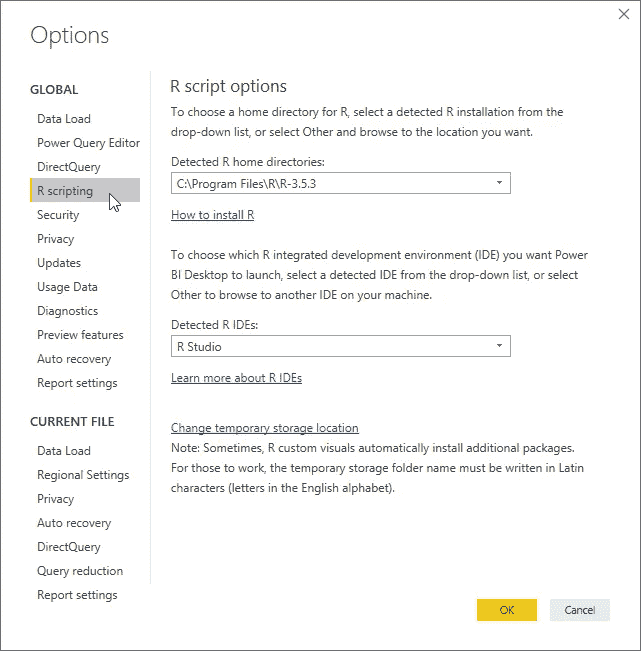

fig. 1 — Power BI Options for R Scripting

如果你想使用微软 R Open 引擎，确保它已经安装在你的机器上，然后正确地修改 R home 目录。

将 R 语言集成到 Power BI Desktop 中非常有效。您可以使用 R 脚本来:

*   输入数据
*   转换数据
*   创建可视化效果

您还可以导入基于 R 的自定义视觉效果。更多信息，你可以阅读这篇[博文](https://www.red-gate.com/simple-talk/sql/bi/power-bi-introduction-working-with-r-scripts-in-power-bi-desktop-part-3/)。

对于我们的目标，我们肯定需要一个 *R 脚本可视化*来从模型中预测目标值，然后将其显示为文本。数字特征可以通过[假设参数](https://docs.microsoft.com/en-us/power-bi/desktop-what-if)输入。分类的可以通过 [OK Viz 智能滤镜](https://okviz.com/smart-filter/)输入(只需下载 *pbiviz* 文件[导入](https://docs.microsoft.com/en-us/power-bi/power-bi-custom-visuals#import-a-custom-visual-from-a-file))。

## 加载 R 模型

因为我们在 RDS 文件中序列化了我们的模型，所以我们需要首先加载它，然后将它反序列化到我们的报告中。如果我们在 R 脚本可视化中做了这两个步骤，那么每次通过切片器或组合框修改输入值时，我们都会有一个 I/O 操作(加载步骤)。为了最大限度地减少 I/O 操作，从而获得更好的预测性能，最好从磁盘加载我们的预测模型一次(在 Power BI 报告开始时的*导入数据*阶段)，然后将我们的预测放入 R 脚本可视化中。

Power BI 只有在 *data.frame* 或 *data.table* 类型时才能通过 R 脚本加载数据(详见[此处](https://michaeladrianjohnson.com/2017/02/26/importing-data-into-power-bi-using-r/))。那么，如何才能将一个序列化的模型加载到 Power BI 中呢？

> 诀窍是将模型序列化为一个字节串，然后将其存储在 dataframe 中。

所以，点击获取数据→更多…，只需搜索“脚本”，选择“R 脚本”，点击“连接”即可:

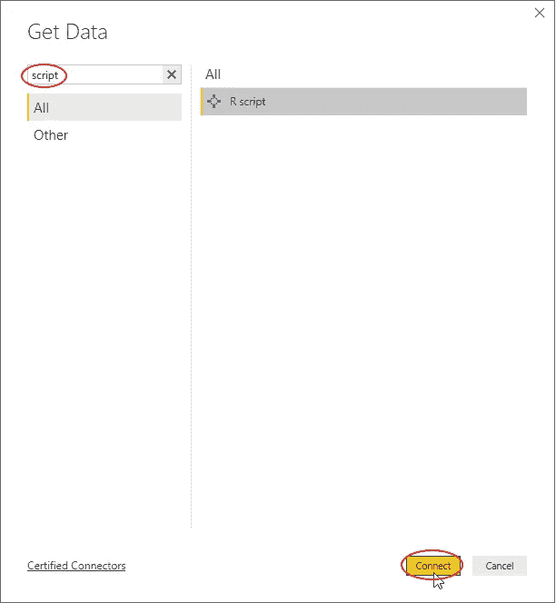

fig. 2 — Get data from an R script

现在只需在弹出的 R script 窗口中输入以下代码(感谢 [Danny Shah](https://medium.com/u/c958e7874a0c?source=post_page-----3364f83b0015--------------------------------) 解决了 Power BI 中由于长字符串截断而导致的错误):

注意到*项目文件夹*变量需要一个绝对路径。

在上一个窗口中点击“确定”后，需要选择 *model_df* 数据框，然后点击“加载”:

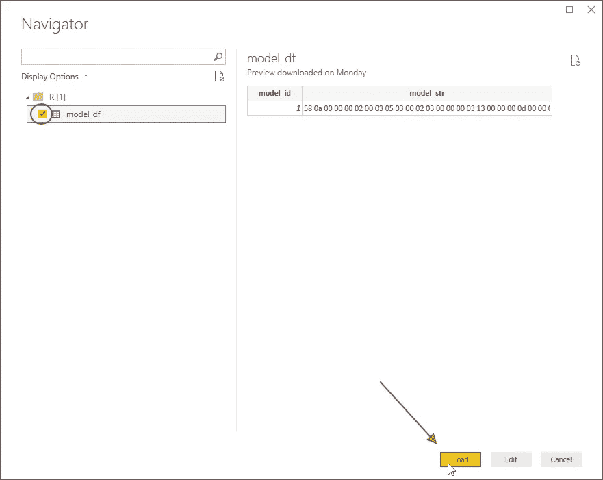

fig. 3 — Load the R dataframe into Power BI

就是这样！R 模型现已纳入我们的 Power BI 报告。

## 添加切片器和组合框

现在是时候给我们的报告添加视觉效果了。由于输入特征是数值型( *wt* 和 *qsec* 和分类型( *am* )的，所以我们添加两个*假设参数*和一个*智能过滤器*。点击建模选项卡中的*新参数*后:

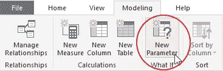

fig. 4 — Create a new What If Parameter

弹出一个新的对话框，询问参数细节。在检查了 *wt* 的最小值、平均值和最大值后，输入值如下:

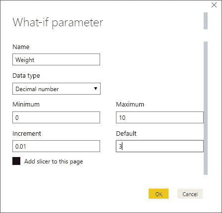

fig. 5 — Details for the Weight What If Parameter

单击“确定”时，将添加一个新的计算表。重命名其对象，如下图所示:

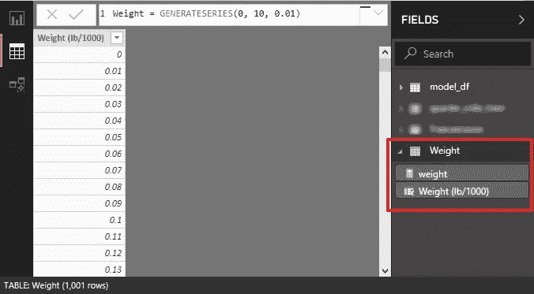

fig. 6 — Calculated table added with the Weight What If Parameter

关联的切片器如下所示:

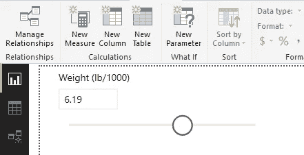

fig. 7 — The slicer for the new What If Parameter

对 *qsec* 参数做同样的操作:

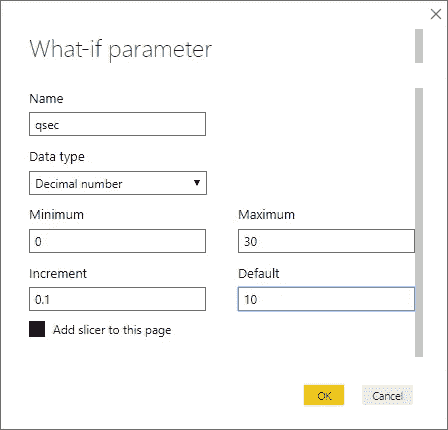

fig. 8 — Details for the qsec What If Parameter

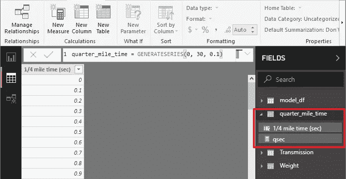

fig. 9 — Calculated table added with the qsec What If Parameter

为了为 *am* 分类值创建过滤器，首先我们需要创建一个新的表格来输入手动数据:

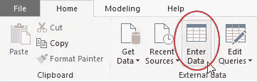

fig. 10 — Create a manual table

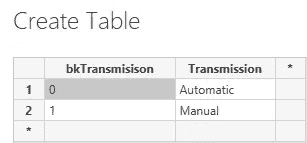

fig. 11 — Entering manual data in a table

然后，我们可以添加一个智能滤波器，选择*传输*值作为字段:

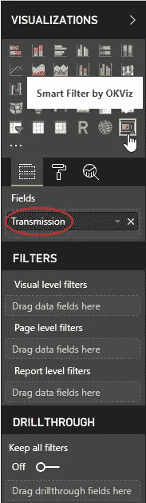

fig. 12 — Adding the Smart Filter

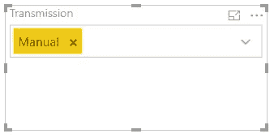

fig. 13 — The Transmission Smart Filter

现在我们有了输入输入参数所需的所有控件。我们只是错过了从模型中预测值的“核心”R 代码。

## 添加 R 脚本可视化

我们可以使用 R Script Visual 来取消模型的序列化，然后将预测值显示为标签中的字符串。让我们添加它，在组件中拖动以下值:

*   *型号标识*
*   *型号 _str*
*   *重量*
*   *qsec*
*   *上午*

自定义视觉效果如下:

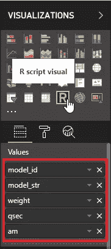

fig. 14 — Adding the R Script Visual

添加到相关联的 *R 脚本编辑器*的代码如下(感谢[丹尼·沙阿](https://medium.com/u/c958e7874a0c?source=post_page-----3364f83b0015--------------------------------)修复了丢失尾随空格的问题):

带有预测的结果标签如下:

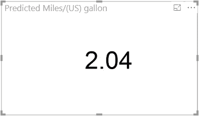

fig. 15 — The predicted value shown in the visual

就是这样！在与它的几次交互中，这里显示了完整的报告:

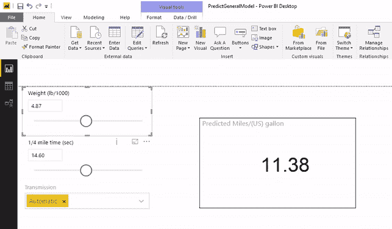

fig. 16 — Interacting with the report

完整的 *pbix* 文件和保存为 *rds* 文件的模型可在[此链接](https://1drv.ms/u/s!AtgrmeCPhKh7kYYBCQkn7bvN0E74RQ)获得。

## 发布报告

如果这个工具必须在涉众之间共享呢？一个解决方案是共享这两个文件( *pbix* 和 model *rds* 文件)，这样用户就可以在他们的笔记本电脑上使用它们。这个解决方案的主要问题是指向 *rds* 文件的路径必须根据用户下载它的新位置手动更改。所以用户必须编辑 *pbix* 文件(对于普通用户来说不那么明显)。

更简单的解决方案是将报告发布给 *Power BI 服务*。预测模型已经在 Power BI 模型中序列化，因此不再依赖外部文件。唯一的预见是确保报告中使用的 R 包已经安装在 Power BI 服务上。服务上支持的 R 包是[这个链接](https://docs.microsoft.com/en-us/power-bi/service-r-packages-support)上的。

由于我们使用了 CRAN 标准软件包，我们的报告可以轻松发布。只需几次点击(按下主页选项卡上的发布按钮并选择报告目的地)即可完成:

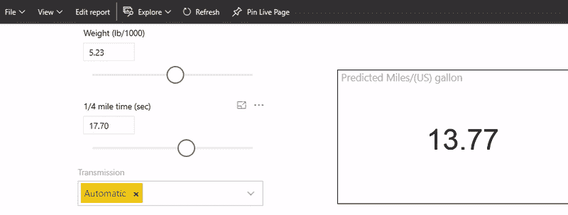

fig. 17 — Interacting with the report published on the Power BI service

显然，如果我们尝试刷新底层报表数据集:

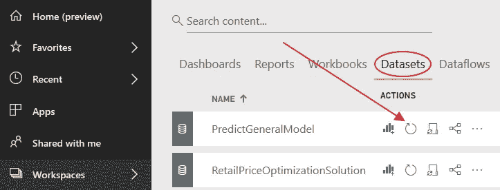

fig. 18 — Trying to refresh the dataset

我们将得到一个错误，因为没有连接到模型文件的网关来检索序列化的模型:

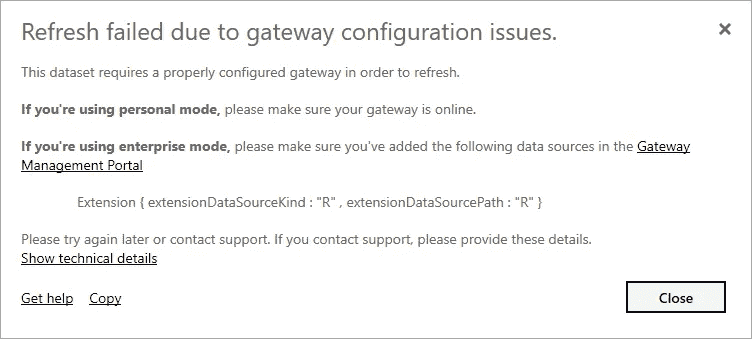

fig. 19 — Error after trying to refresh the dataset

您可以在 RDS 文件所在的机器上安装一个[个人网关](https://docs.microsoft.com/en-us/power-bi/service-gateway-personal-mode)来绕过这个错误。

请记住，今天(2019 年 4 月)R 视觉仍然不支持 [*发布到网络*](https://docs.microsoft.com/en-us/power-bi/service-publish-to-web) 功能:

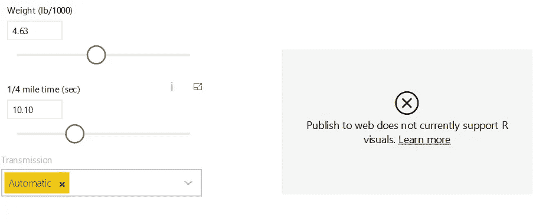

fig. 20 — R Visuals are not allowed by Publish to Web

如果你希望微软在未来的版本中考虑这个特性，你可以投票[这个特性请求](https://ideas.powerbi.com/forums/265200-power-bi-ideas/suggestions/17899522-support-r-visuals-to-publish-to-web)。

# 结论

在数据科学家训练出一个预测模型来解决一个业务问题之后，他必须向利益相关者提供工具来测试它。最好的工具是一个动态工具，让他们拖动滑块并通过过滤器选择分类值，以实时查看预测值。Power BI 报告可以管理所有这些需求，也可以通过 Power BI 服务轻松共享。

你可以在我的书“**用 Python 和 R** 扩展 Power BI”中找到这篇文章中使用的技术的更多细节，包括用 R 和 Python 开发的模型:


它在亚马逊上全球都有售。这里有几个链接:

📕[亚马逊美国](https://www.amazon.com/Extending-Power-Python-transform-visualize-dp-1801078203/dp/1801078203/)
📗[亚马逊 IT](https://www.amazon.it/gp/product/B09CQ5G53Y)
📘[亚马逊 JP](https://www.amazon.co.jp/-/en/Luca-Zavarella-ebook/dp/B09CQ5G53Y/)📙[亚马逊盟](https://www.amazon.com.au/Extending-Power-Python-transform-visualize-ebook/dp/B09CQ5G53Y/)

希望你会觉得有趣！🙂