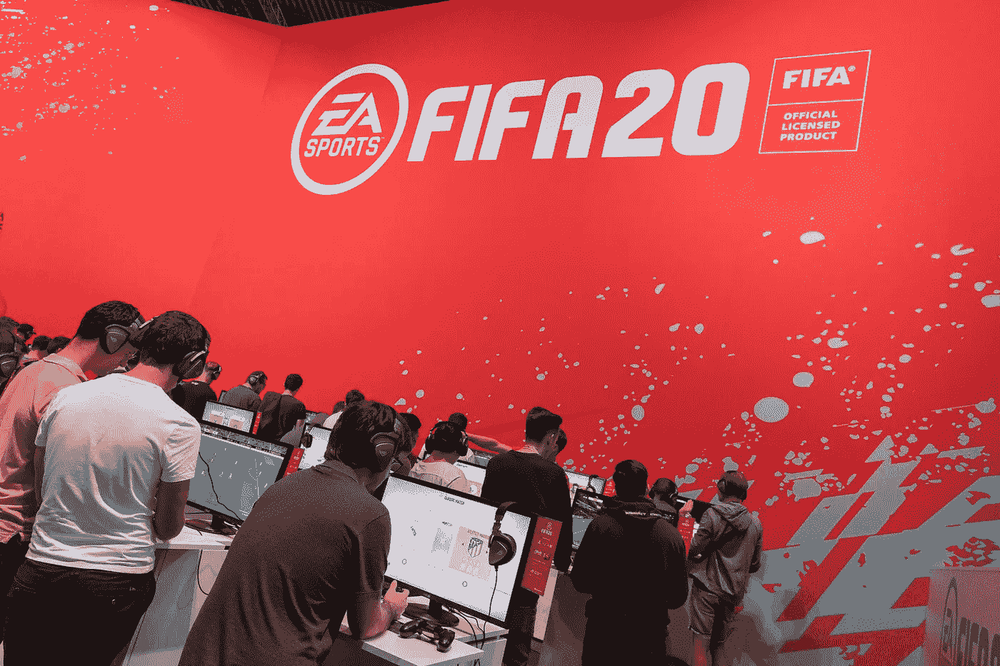

# 如何预测你的最佳足球运动员的 FIFA 20 评分？

> 原文：<https://towardsdatascience.com/how-to-predict-your-best-footballers-fifa-20-ratings-9d1147ced401?source=collection_archive---------20----------------------->



## 创建一个机器学习算法来预测 FIFA 20 球员的评分。

我把球从米尔纳传给萨拉赫。萨拉赫快速运球，把球传给菲尔米诺。菲尔米诺时髦地给马内做了一个 360 度的转身。马内用左脚将球踢入门柱的右上角。这是一个目标。备受好评的利物浦足球俱乐部队的又一次强有力的努力。

这种能在虚拟世界里控制自己喜欢的玩家，让他们做不同技能的感觉深不可测。我在国际足联有过一些最好的经历。我可以看到足球运动员做我想让他们做的事情，并有机会控制比赛的节奏和结果，这就是为什么我对玩 FIFA 20 如此兴奋。

EA sports 每年都会发布一款新的 FIFA 游戏。今年，我最喜欢的球员，维吉尔·范·迪克登上了封面。我不能只是等待安装游戏，并使用一个 91 额定范迪克发挥对对手。我也渴望体验新的游戏活动，如沃尔塔足球，家规和国际足联终极团队。

看着球员的评分，我想起了我前一阵子写的一篇文章(可以在这里找到[这里](https://medium.com/@Mubarak_Ganiyu/how-to-justify-your-best-footballers-fifa-ratings-f12c96a93ea0))，我在文章中用机器学习算法预测了 FIFA 19 球员的评分。因此，我决定写一篇关于预测 FIFA 20 球员评分的新文章。

这是通过两种方式完成的。首先，通过使用国际足联 20 名球员的属性。然后，通过使用开发的机器学习算法来预测 FIFA 19 球员的收视率。

# 数据集

找到了具有正确属性的数据集。从这个[链接](https://www.kaggle.com/stefanoleone992/fifa-20-complete-player-dataset)获得了由 2019 年 FIFA 评分和 2020 年 FIFA 评分组成的两个数据集。在他们被获得之后，他们被装载并且清洗进 Jupyter 笔记本。为数据分析保留的主要特征是:姓名、总体情况、年龄、价值、工资和潜力。


Top five rows of the FIFA 20 dataset


Top five rows of the FIFA 19 dataset

# 将 FIFA 20 名球员的属性与其总体评分进行比较

创建了一个散点图来找出 FIFA 20 球员的总体评分与他们的潜力之间的关系。在散点图中也建立了回归线。


A scatterplot of FIFA 20 players’ overall ratings vs potential

该散点图的相关系数约为 0.647，表明两个变量之间存在适度的正相关关系。

下表显示了所有变量之间的相关系数。


The correlation coefficient table for all the variables

在回顾了其他变量与总体评分的关系后，得出的结论是，年龄、工资和价值也与总体评分有适度的正相关关系。

# 基于 FIFA 20 属性的预测模型

数据集分为两组:训练数据集和测试数据集。训练数据集保留了整个数据集的 87.5 %，而测试数据集保留了整个数据集的 12.5 %。

将数据集分成两组的目的是使用训练数据集来了解自变量(年龄、潜力、价值和工资)如何与因变量(总体)相互作用。然后，从这种交互开发的算法用于预测测试数据集的总体评级。

下面是拆分、训练和测试数据集的代码。

## 分割数据集

```
**import** **numpy** **as** **np**
split = np.random.rand(len(df_fifa1)) < 0.875
train = df_fifa1[split]
test = df_fifa1[~split]

regr = linear_model.LinearRegression()
```

## 训练数据集

```
*## Trainig & fitting the model*
fifa_x_train = train[['age','value_eur','potential','wage_eur']]
fifa_y_train = train[['overall']]
poly = PolynomialFeatures(degree=4)
fifa_x_train_poly = poly.fit_transform(fifa_x_train)
regr.fit(fifa_x_train_poly, fifa_y_train)
```

## 测试数据集

```
*## Testing the model*
fifa_x_test = test[['age','value_eur','potential', 'wage_eur']]
fifa_y_test = test[['overall']]
fifa_x_test_poly = poly.fit_transform(fifa_x_test)
```

使用 a 为四次的多元多项式回归进行预测，并使用 r2 分数、皮尔逊相关系数和 p 值测试其准确性。

机器学习算法非常准确。其 r2 分数约为 97.6 %，皮尔逊相关系数为 98.8 %，p 值为 0。

# 预测的玩家评分

进行预测后，创建两个表来显示训练数据集的预测评级和测试数据集的预测评级。


First 20 rows of the training datasets’ predicted ratings


First 20 rows of the testing datasets’ predicted ratings

在这两个数据集中，玩家的预测评分可以在右边第一列看到。这使得莱昂内尔·梅西的预测评分为 93.59，罗纳尔多的预测评分为 93.27，内马尔的预测评分为 91.00。因此，显示了他们的评级与他们分别为 94、93 和 92 的实际评级相比有多准确，并证明了该模型 97.6 %的准确性。

# 利用 FIFA 19 预测模型预测 FIFA 20 球员的评分

基于属性为 FIFA 20 球员的评级生成预测模型的相同过程被重复用于 FIFA 19 球员的数据集。然后，来自 FIFA 19 数据集的预测模型用于使用 FIFA 20 球员的属性生成 FIFA 20 评级的预测评级。

这个模型也被证明是准确的。它的 r-2 值为 97.4 %，皮尔逊相关系数为 98.8 %，p 值为 0。

# 预测的玩家评分


First 20 rows of FIFA 20 predicted players’ ratings based on FIFA 19 predictive model in descending order

从表中可以看出，大部分预测收视率与总体收视率相当接近。然而，马克·特尔·斯特根似乎是一个异数。他的评分预计为 104 分，而一个人最多只能得到 100 分。欧洲足联年度最佳球员维吉尔·范迪克的预测得分为 92.9。他的综合评分是 91 分。国际足联年度最佳球员莱昂内尔·梅西的预测评分为 92.14 分。他的综合评分是 94 分。

# 结论

查看用于预测收视率的两种方法的结果，可以得出结论，国际足联每年都使用相同的指标来确定球员的收视率。

**用于构建这些预测模型的代码完整版本可见** [**此处为**](https://github.com/MUbarak123-56/DataBEL/blob/master/FIFA%2020%20Players'%20Ratings%20Predictor.ipynb) **。**