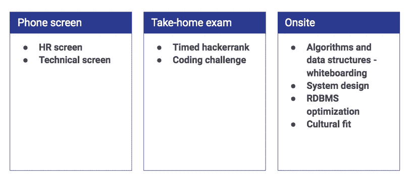
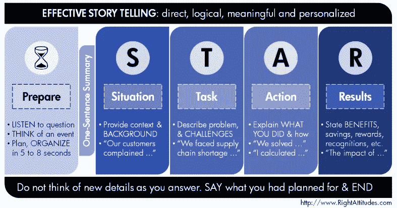

# 如何准备你的数据工程面试

> 原文：<https://towardsdatascience.com/how-to-prepare-for-your-data-engineering-interview-d245519da45c?source=collection_archive---------0----------------------->

## 得到了你梦想中的公司的回电，但不确定该期待什么，以及如何准备接下来的步骤？我们是来帮忙的！

在 [Insight](https://www.insightdatascience.com/) ，我们已经成功地让数百名同事做好准备，在他们梦想的公司中过渡到数据工程师和机器学习工程师的职位。在任何工程职位的面试中，面试官都希望了解你是否具有良好的分析能力、解决问题的能力、沟通能力、工作文化和构建技术解决方案的能力。具体到数据工程，他们还想了解你是否有处理大数据和构建可扩展的健壮系统的技能。在本文中，我们将讨论如何最好地准备和执行每种类型的数据工程面试，从算法、系统设计、SQL 问题到基本的行为组件。

The typical Data Engineering interview process.

# 手机屏幕

有两种类型的电话屏幕:人力资源，一般都是行为问题，和技术电话屏幕。

人力资源电话筛选通常为 15-30 分钟，由公司的非技术人员进行，如招聘人员。你会被问到一些软问题，比如*你为什么想成为一名数据工程师？你认为自己五年后会怎样？你为什么想在我们公司工作？*更重要的是，*你期望的薪水是多少？如果你不知道这些问题背后的真正原因，这些问题可能会显得无聊或奇怪:人力资源部门希望找到适合他们团队的合适人选。他们希望应聘者能够与同事和经理很好地沟通，并在公司呆很长时间，因为招聘和入职成本很高！*

就像 HR 电话屏幕是基本沟通能力的过滤器一样，技术电话屏幕是基本技术能力的过滤器。现场面试在时间和团队资源方面的成本非常高，所以公司不想在一个不会编程的候选人身上花费几个小时。评估基本的 SWE 知识和将复杂的想法分解成更小的可理解的部分的能力是技术电话屏幕的最重要的原因。

## **HR 电话屏幕汇总**

期待一个 15-30 分钟的电话会议，讨论你的背景、目标和对他们公司的兴趣。

**他们正在寻找**清晰的沟通，一个愉快的合作伙伴，一个对公司充满热情并做过调查的人，最好是一个愿意留在公司并快乐工作的忠诚员工。

**例题包括**说说你的背景。你为什么想成为【公司】的数据工程师？你期望的工资范围是多少？

**准备:**

1.为你的背景写一个剧本并练习。
2。深入了解公司价值观，并相应调整你的答案。
3。通过电话与你的同龄人练习(我们知道这可能会很尴尬)。
4。面试前至少 10 分钟，找一个安静的地方，有良好的网络连接。

## **技术电话屏幕总结**

**期待**一个 30-60 分钟的电话会议，回答基本的 DE 概念或经典的 SWE 问题，通常由工程团队成员提出。

**他们正在寻找具备 SWE 和 DE 基础知识、解决问题的技能以及交流技术信息能力的人。**

**例题包括**什么是链表？你会如何用你选择的语言编写它们呢？在列表中查找所有重复项。你什么时候使用 SQL 和 NoSQL 数据库？

**准备:** 1。阅读[数据工程食谱](https://github.com/andkret/Cookbook)并回答至少 50 个问题。
2。和你的同伴一起练习书中的随机问题。
3。做 50 道简单的 [LeetCode](http://leetcode.com) 题。
4。面试前至少 10 分钟，找一个安静的地方，有良好的网络连接。

# 课后考试

你的简历上说你有多年的经验，领导过多个项目，还是个摇滚明星。公司怎么知道你是否真的那么好？在大多数情况下，无法访问你的旧公司 GitHub 库，阅读和理解个人 GitHub 项目需要时间——更不用说他们不会确定代码是你写的。带回家的编码挑战是评估您的代码的生产就绪程度、您如何考虑边缘情况和异常处理，以及您是否能够以最佳方式解决给定问题的最简单和最快的方法。有两种主要的考试类型:

## 定时黑客排名

**预计**1.5-2 小时的考试，包含 3-5 个简单的中级黑客问题
，包括 SQL、正则表达式、算法和数据结构

他们在寻找知道解决标准计算机科学问题的有效算法和数据结构、考虑边缘情况并快速提供解决方案的工程师

**准备:** 1。解决至少 100 个 LeetCode/HackerRank 问题
2。用[虚拟 Leetcode 竞赛](https://leetcode.com/contest/)练习——所有免费的过去竞赛，你可以在任何时间参加，并尝试在第一次尝试时快速正确地解决问题
3。划出一大块时间，让你处在一个舒适的环境中，你通常在那里做技术工作，确保你不会被打扰，并有足够的水和零食(如果需要的话)。

## 编码挑战

**预计**1–7 天编写代码，回答 1–3 个数据集上的 1–10 个问题，将其推送到您的 GitHub 存储库并提交链接。

**他们正在寻找**清晰的模块化代码、清晰的自述文件、单元测试和异常处理。

**例题**清理并分析一个员工工资和地点的数据集。不同地点的工资分布情况如何？编写一个 SQL 查询来完成相同的任务。

**准备
准备** 1。阅读并消化[谷歌风格指南](http://google.github.io/styleguide/pyguide.html)。
2。用 Python 或类似语言练习使用 [unittest](https://docs.python.org/3/library/unittest.html) 库。
3。阅读 [GitHub 最佳实践](https://www.google.com/search?q=github+best+practices&oq=github+best+&aqs=chrome.0.0j69i57j0l4.2999j0j4&sourceid=chrome&ie=UTF-8)。

# 现场面试

如果你到了现场面试，你应该会觉得很有成就感，但是最难的部分还在后面！在 3-6 个小时内与 4-10 个人进行现场面试是一件非常累人的事情，尤其是在你没有准备好的情况下。知道会发生什么，提前做好现实的准备，对减少恐惧和紧张大有帮助。

## 白板算法和数据结构

这是最常见的面试类型，因为算法和数据结构的知识对于节省成本和时间的代码至关重要。它通常在白板上完成，以评估您在没有 IDE/堆栈溢出的情况下的编码技能以及您的技术交流技能。

**期待**30-45 分钟的面试，在白板上回答 1-2 个中等难度的问题，不断与面试官交流需求和解决方案。

他们想要的是你面试前的准备，基础知识和良好的沟通能力。不要在沉默中解决问题——让它成为你和面试官之间的对话。

**准备**
1。在纸张/白板上解决 80-150 个 LeetCode 问题
2。作为受访者，与同行或专业人士进行至少 20 次练习。
3。练习在白板上书写清晰易读的代码。

## 白板系统设计

作为一名数据工程师，每天你都要从头开始设计整个系统，或者给巨大的现有管道添加小功能。即使你在简历中提到了这些技能，公司在现实生活中检验你的能力也是至关重要的。

**预计**30-45 分钟的面试将设计出符合规格的数据工程系统。

**例题:**设计 Twitter——需要哪些系统块？你会使用什么样的数据库和模式？缓存和负载平衡呢？系统的权衡是什么？

他们在寻找你清晰沟通和缩小需求范围、设计概念级管道的能力，以及分布式系统基础知识。

**准备** 1。阅读[数据工程食谱](https://github.com/andkret/Cookbook)、[数据工程生态系统](https://blog.insightdatascience.com/the-data-engineering-ecosystem-in-2017-2c2a3429350e)和[进行系统设计面试](https://www.educative.io/collection/5668639101419520/5649050225344512)。
2。与同伴或导师在白板上练习至少 10 个不同的问题。
3。练习在白板上绘制清晰易读的系统图。

## 结构化查询语言

大多数公司都是语言不可知的。你可以从 Scala 过渡到 Python 再到 Java，但是对 SQL 的深刻理解是数据库工作的基础，是不可替代的，即使是 NoSQL 数据库。这就是为什么超过 50%的公司将这种类型的面试作为现场数据工程的一部分。

**预计**一次**30-45 分钟的采访，包括 1-3 个难题 [HackerRank SQL](https://www.hackerrank.com/domains/sql) 问题+规范化、索引、分析-解释查询**

****例题包括**打印一个表格列的第 n 个最大条目。**

****他们正在寻找**您编写查询和优化他们现有 RDBMS 的能力。**

****准备**1。练习 [57 SQL 问题](https://www.amazon.com/SQL-Practice-Problems-learn-doing-ebook/dp/B01N41VQFO)书。
2。Google 并了解*查询优化。***

## **文化契合度**

**技术过硬，知识渊博很重要，但这还不够！如果你不能传达你的优秀想法，那么没有人能够理解和使用它们。面试的行为类型，比如文化契合度，意在展示你如何讲述自己的故事，并解释你如何处理艰难的工作环境。**

****

**The STAR method.**

**期待一次 30-45 分钟的面试，问 2-4 个关于你过去情况的问题。**

****他们使用 STAR(情境、任务、行动、结果)方法寻找**一致且完整的答案。**

****示例问题包括**告诉我们一次你在工作中遇到重大截止日期的经历。告诉我们你与其他团队成员发生冲突的一次经历。你是如何处理这些情况的？**

****准备**
1。单独练习至少 30 个[文化契合面试问题](https://articles.bplans.com/hiring-employees-here-are-over-70-must-ask-interview-questions/)，写脚本，如果需要的话自己录音。
2。遵循 STAR 方法，与同伴一起练习至少 10 个问题。**

# **TLDR**

**如果你喜欢看视频，这是我们就同一主题举办的网络研讨会:**