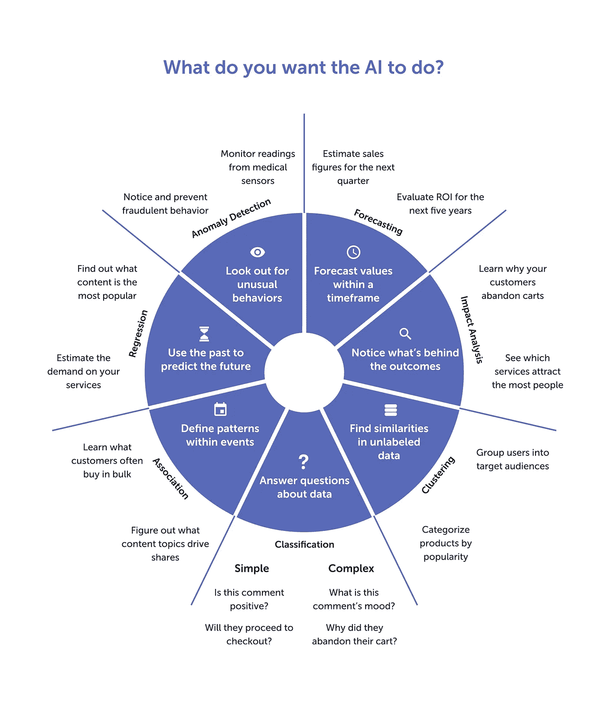
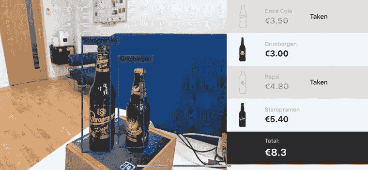
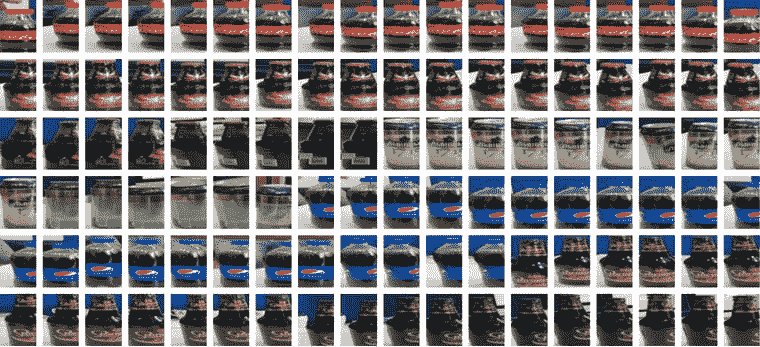
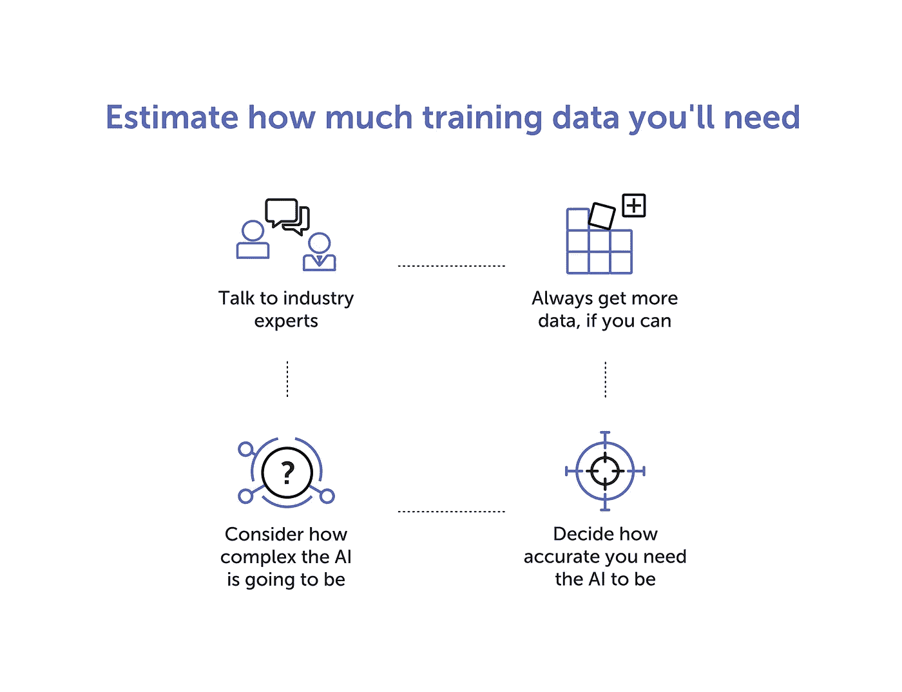
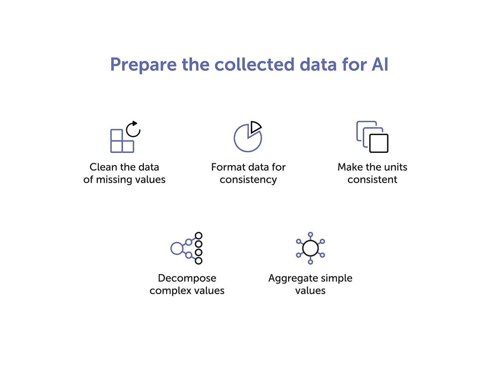

# 如何为更好的 AI 准备训练数据？

> 原文：<https://towardsdatascience.com/how-to-prepare-training-data-for-better-ai-43c52e782c8a?source=collection_archive---------37----------------------->

人工智能(AI)可以给你的产品带来竞争优势。但要真正用 AI 产生价值，你需要高质量的 AI 训练数据。

为了获得这些训练数据，**首先要决定你想用你的人工智能系统**完成什么。带着这个目标，**计算出你需要什么样的训练数据**以及需要多少。然后，最后，你可以**收集和准备数据来训练你的 AI** 。

# 决定你想用你的人工智能系统实现什么

我们应该先说，人工智能不是所有问题的唯一解决方案。通常，您可以使用更有效、更复杂的技术。

例如，让我们想象一下**你想让读者在你的网站上停留更长时间**。有多种方法可以做到这一点，并不是所有的方法都需要构建一个定制的人工智能引擎。

*   一种方法是专注于降低你博客的跳出率。您可以通过多种方法实现这一点，包括更改页面设计、添加新的共享功能以及创建更好的内容。
*   然而，如果你选择用与他们最相关的内容来吸引读者，建立一个人工智能支持的内容推荐系统实际上是你最好的选择。

通过尽早设定一个明确的目标，你将完成两件事:1)确保人工智能是你真正需要的，2)简化为它选择、收集和准备训练数据的过程。

一个定制的人工智能可以帮助你**预测和预测值**，**检测异常行为**，**发现模式**，**分析影响**，以及**构造**或**分类数据**。

## 价值预测

有了*回归分析*，你就可以预测未来在一定条件下会发生什么。回归是一种很好的统计方法，可以帮助你分析几个变量之间的联系，看看它们是如何相互影响的。

例如，回归分析可以通过分析过去影响你销售额的因素来帮助你预测明年的销售额。以类似的方式，您可以使用回归分析来估计需求、收入、客户满意度等方面的波动。

## 价值预测

使用*价值预测*来计算在某个时间段内会发生什么。通过分析过去的事件，价值预测人工智能可以帮助你预测在给定的时间内形势将如何发展。

这种方法的一些实际实现包括估计未来的销售数字，计算何时开始产生投资回报，以及计算全年需求增长最快的时间。

## 异常检测

您可以通过*异常检测*注意到异常情况和行为。异常检测人工智能分析过去的数据，了解什么被认为是正常的行为，然后寻找任何不符合标准的行为。

借助异常检测，您可以防止客户欺诈、构建智能安全系统、分析医疗传感器的读数、维护工业环境的稳定性等等。

## 影响分析

*影响分析*可以帮你决定哪些因素对结果影响最大。推动销售的因素很可能是有限的，影响分析可以帮助你确定这些因素。

这种方法的其他实际实现包括找出什么内容驱动了最大的流量和转化率，以及什么内容可能会损害您所在行业的客户满意度。

## 联合

使用*关联*方法，您可以在各种事件序列中找到模式。例如，你可以让人工智能分析客户可能会一起购买哪些商品，然后向其他潜在客户推荐这些商品。

在工业环境中，关联方法可以帮助您在系统崩溃之前追溯跟踪传感器读数的变化，以避免将来发生类似的崩溃。您还可以记录顾客在结账时的行为，找出那些继续付款的顾客和那些放弃购物车的顾客之间的相似之处。

> 了解 Lemberg 如何构建用于个人卫生控制的[数据科学设备。](https://lembergsolutions.com/work/hand-hygiene-monitor)

## 使聚集

通过*聚类*，人工智能使得根据相似性将数据组织成类别变得容易。这种方法非常适合您想要理解您所拥有的任何数据的时候。

聚类的一些例子是划分目标受众，分析竞争对手提供的服务的异同，以及建立基于客户的营销策略。

## 分类

通过实现*分类*方法，你可以构建一个人工智能来回答简单和复杂的数据问题。

数据分类可以帮助你更好地了解你的受众和客户:根据他们的推文和评论，他们对你的服务有多满意，他们完成结账的可能性有多大，你可以做些什么来为他们提供更好的体验，等等。

请记住，并不是所有的 AI 开发都是从解决某个行业问题的愿望开始的。有时候，你有很多数据，你想从中产生价值，这也很好。**不管你从什么开始，尽可能缩小你的最终目标。**

# 用你的目标来决定你需要什么样的 AI 训练数据

为了训练人工智能解决问题或实现你确定的目标，你需要给它足够的与目标或问题相关的数据。这些数据将构成您的训练数据集。

根据任务的不同，你要么需要监督人工智能的学习过程，要么让人工智能自学。

*   有了**监督学习**，你需要给人工智能输入标签数据，告诉人工智能什么输入应该导致什么输出。当你已经知道你想要人工智能产生什么结果(分类，异常检测等)时，这种方法是很好的。).
*   **然而，无监督学习**意味着人工智能将分析数据，然后自己决定产生什么输出。如果您不确定从您拥有的数据中能得到什么(聚类、值预测和预测等)，您应该实现这种方法。)

当开发 BarHelper(一个具有计算机视觉功能的人工智能，可以识别瓶装和罐装饮料并计算订单的总成本)时，我们必须训练人工智能:

1.  在图像和视频中识别特定的罐子和瓶子，以及
2.  弄清楚每种饮料的名称和价格。

*Interface of BarHelper, our drink recognition system*

BarHelper AI 在监督下学会了提供我们期望的结果。为了实现这一点，我们的工程师选择了几种瓶装饮料，并从不同角度拍摄了多达一千张照片。

*Examples of data we collected to train the BarHelper AI*

这大概也是你应该做的。确定一个目标，然后考虑哪些数据可以帮助你实现这个目标。然而，重要的是，你**只在有意义的数据上训练你的人工智能**。你无法通过向任何人工智能提供藏着可乐罐的汽车图像来教它识别可乐罐。

听听 Lemberg 首席数据科学家帕夫洛·特卡琴科的话:*“为了训练一个人工智能产生你期望的结果，你应该给它与这些结果有明确、有意义联系的训练数据。你永远不要指望人工智能能建立你自己无法建立的联系。”*

你不仅需要相关的训练数据，还需要大量的数据。但是多少训练数据足以开始开发一个 AI 呢？

# 估计你需要多少训练数据来开始

一个很好的经验法则是**你拥有的高质量训练数据越多，你能开发的 AI 就越好**。然而，如果你想更精确一点，看看你的解决方案有多复杂，你需要它有多精确。

例如，在开发风力涡轮机异常检测系统时，帕夫洛·特卡琴科必须创建一个解决方案，能够*快速且极其准确地检测系统行为中的任何异常*。鉴于风力涡轮机的整体复杂性和人工智能的要求，帕夫洛需要至少一年的风力涡轮机传感器读数，以 5 到 10 分钟的间隔持续记录。

这些数据足以教会人工智能在全年不同天气条件下正常的风力涡轮机性能。一旦人工智能了解到正常的性能，它就能够提前两天准确地检测到系统行为的异常。

以此类推，你应该准备足够的训练数据来完全包含你对人工智能的期望。为了帮助您得出正确的结论，我们建议您:

*   与行业专家交流
*   想想人工智能会有多复杂
*   决定你需要人工智能有多精确
*   如果可以的话，总是获取更多的数据

## 与行业专家交流

你对开发人工智能解决方案的领域了解得越多，你就越有可能创造出有价值的产品。即使你认为自己无所不知，也要考虑尽可能多地从行业专家那里获取意见。每一个新的输入都可以帮助你提出一个稍微好一点的解决方案，即使是最微小的优势也可以让你在竞争中脱颖而出。

行业专家可以帮助你发现你以前可能没有注意到的数据之间的联系。这将帮助你**找出什么样的训练数据可能是最有用的，**并可能促使你考虑使用你以前没有考虑过的数据。

## 想想人工智能会有多复杂

请记住，人工智能所做的只是将输入与输出相匹配。它以创造性的方式做到这一点，并且可以同时保存许多输入和输出，但本质上这就是它所做的全部。你的人工智能需要的输入数量决定了它的复杂性。通常，**你需要的数据样本至少是输入的十倍。**

例如，要构建一个智能内容推荐系统，你需要分析你的读者的行为，这可以通过收集关于读者的数据来完成。假设您将收集五个数据点:年龄、性别、居住国家和查看次数最多和最少的文章标签。这些都将成为你的人工智能的输入。所以要通过这五个数据点来分析用户，你需要从至少 50 个人那里收集数据。要分析的输入越多，需要的训练数据就越多。

## 决定你需要人工智能有多精确

根据您正在构建的系统，您可能有不同程度的容错能力。尽管人们总是希望系统尽可能精确，但可以说，医疗监护仪对错误的容忍度远不如智能广告宣传。

决定你允许的容错程度，并以此为基础开展工作。**你希望人工智能越精确，你就需要越多的训练数据。**

## 总是获取更多数据

如果你有一个明确的目标，并且坚持不懈地收集有意义的数据，那么总是要尝试收集更多的数据。如果存在，是因为数据的质量往往比数量更有意义。然而，随着人工智能的发展，我们总是会回到第一条规则:**你拥有的高质量数据越多，你的人工智能就越好。**

因此，尽早建立有效的数据收集和准备流程非常重要。

> 了解更多:[开始使用活动跟踪应用程序。机器学习算法的数据收集](https://lembergsolutions.com/blog/getting-started-activity-tracking-app-data-collection-machine-learning-algorithm)

# 建立一致的数据收集和准备流程

决定了目标，选择了要收集的训练数据，并估计了开始需要多少数据后，您可以开始为您的 AI 实际收集和准备训练数据。

您收集培训数据的过程将根据您设定的目标而有所不同。它可能包括汇总销售数据、调查客户和用户、收集传感器读数等。现阶段唯一真正的建议是**保持数据收集的一致性**。

每个新的训练数据集必须具有与前一个相同的输入。如果您的第一个数据集包含用户的年龄、性别和母语列，那么您的下一个数据集也应该包含相同的列-不多也不少。不应该有一个包含年龄、性别和母语的训练数据集，另一个包含年龄和性别，第三个只包含年龄。如果不一致，人工智能将无法理解训练数据。

我们说*应该*和*不应该*，因为不一致不会在数据收集阶段制造或破坏人工智能。总是有办法在以后完善数据，但是如果您能够从一开始就收集一致的数据，您真的不想浪费时间清理和格式化数据。

为了收集 BarHelper 的训练数据，我们的工程师拍摄了几个瓶子的照片。然而，照片本身不足以训练人工智能。

我们通过建立图像失真算法来补救这种情况。它扭曲、拉伸、调整大小、模糊，并通过其他方式扭曲瓶子图像，以复制不同相机在不同情况下可能查看瓶子的方式。这有助于我们为训练数据集带来必要的数量和多样性。

这就是数据准备的内容:你获取你所拥有的任何数据，并应用各种技术使其对你的人工智能完美。您可以专注于向数据集添加更多数据，就像我们对 BarHelper 所做的那样，或者减少数据量以确保其质量和一致性——或者根据需要执行这两种操作。

## 清除丢失值的数据

缺失的值会大大降低你的 AI 的准确性。您可以**用虚拟值或平均值替换丢失的值**来修复它们。如果无法填充缺失的行和列，您也可以考虑将它们一起删除:拥有较少的干净数据比拥有大量的脏数据要好。

## 格式化数据以保持一致性

如果您的数据集聚集了来自不同来源的数据，或者如果不同的人负责在不同的时间更新它，**确保记录的一致性**。例如，所有的日期必须遵循相同的格式，所有的地址应该以相同的方式填写，所有的货币价值应该遵循相同的风格，等等。

## 使单位一致

使用一致的单位很重要，因为这将提高人工智能的速度和准确性。不应该同时有千克和磅的值，也不应该把不同的货币混在一起。**将所有相同类型的值放入相同的单位:**将所有重量转换为千克，将所有货币转换为美元，以此类推。

## 分解复数值

有时，你会收集复合值，人工智能将能够理解它们。然而，有些情况下你需要**将复杂的值分解成简单的值**以便更快更准确地处理:将月分解成天，将大的注释分解成关键字，等等。

## 聚合简单值

或者，有时小而具体的值会妨碍 AI 效率。为了补救这一点，**将较小的数据点合并成较大的数据点**:不是按照精确的年龄而是按照年龄范围对用户进行分组；不收集单一的传感器读数，而是计算给定一天或一周的平均值，等等。

这份数据准备技术清单远非详尽无遗。根据任务的不同，数据工程师可以选择以各种方式转换数据，确保他们可能从人工智能中获得的最高准确性和效率。

# 摘要

你的第一步应该是确定你到底想要实现什么。一个明确的目标将帮助你决定你需要收集哪些数据，并估计你需要多少数据来开始。然后，您仍然需要认真对待收集和准备数据的本质——对于在数据科学和工程方面几乎没有实践经验的人来说，这是一个令人疲惫的过程。

这就是为什么我们强烈建议[雇佣有经验的数据科学家和工程师](https://lembergsolutions.com/services/machine-learning)来帮助你开发最好的人工智能。

[给我们写一封短信](https://lembergsolutions.com/contact)了解 Lemberg 如何帮助你开发一个出色的人工智能系统。

*最初发表于*[*【https://lembergsolutions.com】*](https://lembergsolutions.com/blog/how-prepare-training-data-better-ai)*。*