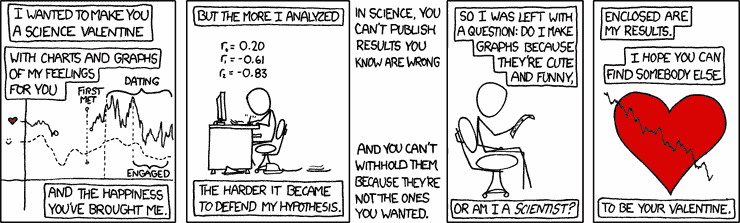
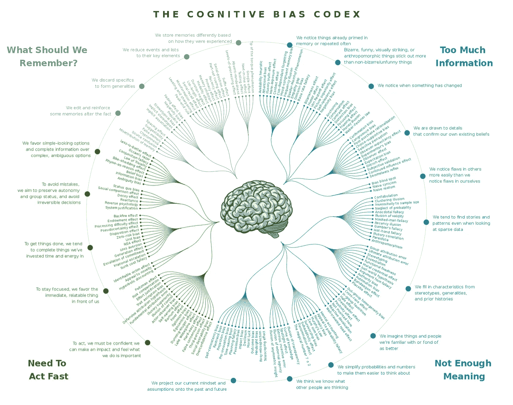
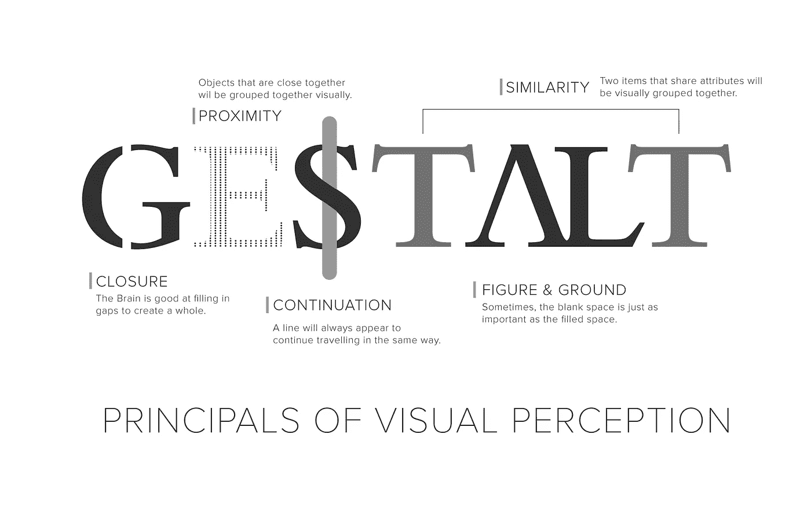
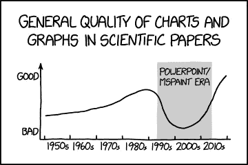
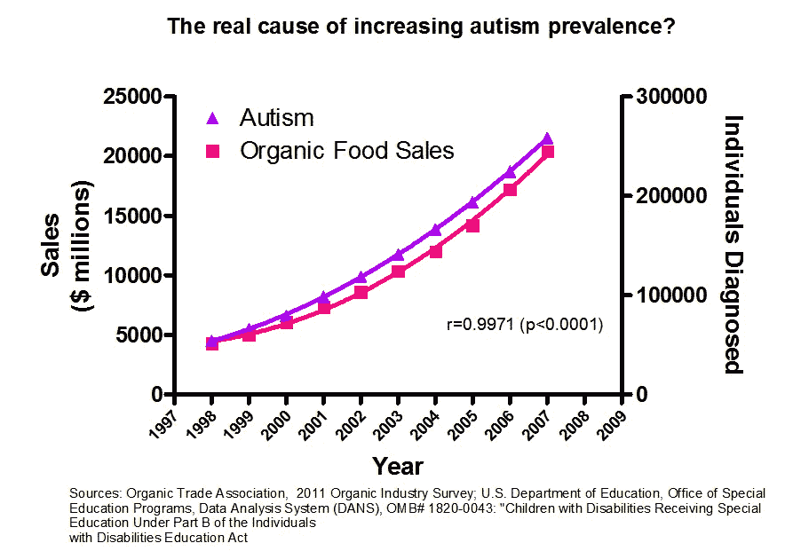
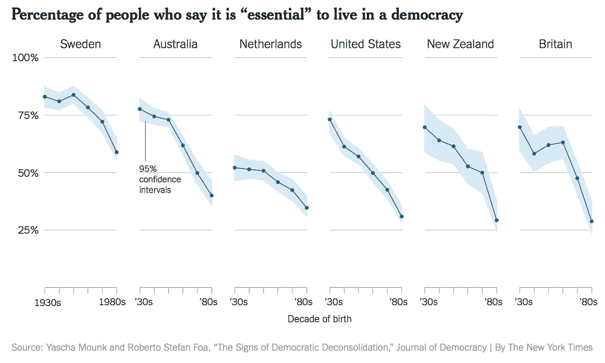
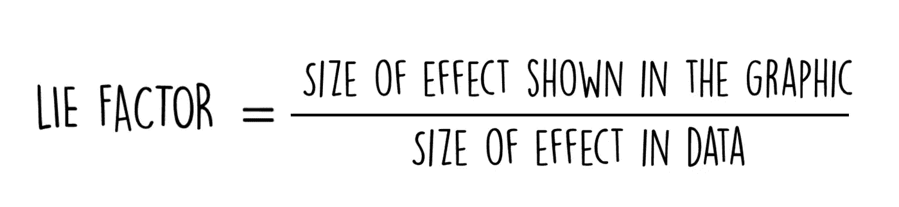

# 数据可视化如何防止误传？

> 原文：<https://towardsdatascience.com/how-to-prevent-misinformation-in-data-visualization-1521a96e6431?source=collection_archive---------17----------------------->

## 图表、图形、地图和图解不会说谎。设计它的人会。

Science Valentine from xkcd - Randall Munroe

**数据可视化**方法涉及图形**表示**的设计，以总结**分析**过程中的数据。

从这第一个陈述来看，让公司理解**假信息**和**假信息**可能代表的风险是很重要的。

虽然**假信息**被定义为“*故意且经常秘密传播的虚假信息，以影响公众舆论或掩盖真相*”，但**假信息**与众不同。所以没错，图表会误导人。而且，我们都会同意，有时，实现没有任何错误信息风险的美学可视化是一门真正的艺术。然而，我们需要记住的是**图表、图形、地图和示意图只是分析结果的图标。**

# 误传是如何发生的？

这并不意外。一个图形可以通过集体意义的使用引发错误的见解，这种集体意义往往偏向于自我确认。无论是通过暴露、过度简化还是世界观，通过数据可视化得到的错误信息都是基于个体和各种成分的。

我个人偏爱的**特拉维斯综合症**，这种人往往会高估当下的意义。但是，他们还有很多其他人:

*   单纯接触效应:人们因熟悉事物而产生偏好的效应。
*   熟悉度逆火效应:熟悉度增加人们接受真实信息的机会的效应。
*   **矫枉过正的逆火效应**:较少的信息和更容易处理的信息更容易被接受为真实的效应。
*   **确认偏见**:以确认一个人已有信念的方式搜索、解释、关注和回忆信息的倾向。
*   世界观逆火效应:对一个人坚定信念的事实和反驳只会强化这些信念的效应。

这种偏差样本可用于制作误导性图表，这提高了考虑这些偏差对商业和经济决策以及人类总体行为产生影响的重要性。认知偏差的完整列表可在[**这里**](https://en.wikipedia.org/wiki/List_of_cognitive_biases) 获得。

Designed by John Manoogian III — Categorized by Buster Benson

# 在数据可视化中，可以使用哪些技术来防止有偏见的视图？

## 遵循可视化的 4 个支柱

当你对以下问题回答“是”时，你就认为可视化是成功的:

*   **目的明确吗？**由于**目的**规定了可交付成果，因此需要明确定义。
*   内容是否支持目的？考虑到包含的内容和排除的内容同样重要，只需要包含相关的**内容**。提醒一下，内容，即**现实**和**数据**之间的关系，必须始终**去政治化**和**政治化**。
*   **结构是否揭示了内容？**需要用一个合适的结构来清晰地表现**现实**和**图形**之间的关系。
*   可视化有助于消费吗？**可视化，**是**图形**和**数据之间的链接，**必须通过突出显示重要的内容并删除其余内容来发挥作用。

通过使用这四个支柱，图形的创建可以最接近现实和数据。越是远离这些条件的图形，越会导致歧义。

## 学习格式塔原则

格式塔这个术语的意思是“形式”或“形状”。在心理学中，格式塔是指当作为一个整体考虑时具有特殊性质，但当作为单独部分考虑时并不明显的东西。

心理学家马克斯·韦特海默、沃尔夫冈·科勒、库尔特·考夫卡以及后来加入的库尔特·勒温研究了感知，并得出结论:感知者应该被认为是主动的，而不是被动的。事实上，他们认为感知者不只是收集信息。为了理解数据，他们主动处理和重组数据。这是一个感知过程，某些因素会影响这一感知过程。

根据格式塔心理学:

*   我们倾向于用大脑看事情。
*   头脑把外部刺激理解为整体，而不是部分的总和
*   我们倾向于在**的基础上**有规律的**、**有序的**、**对称的**和**简单的**来排列我们的经验**。

Key principles of Gestalt

## **注意所有的技巧**

from xkcd — Randall Munroe

*   **建立相反的故事**:引入不相关的信息，鼓励我们对较大的部分赋予较大的价值。 *(Cudmore，2014)*
*   **坏的/错误的标度:**改变 Y 范围讲述了一个不同的故事，*(Jones 2006—Peltier 2011)*

Shut up about the Y-axis — Vox

*   **摘樱桃**:将信息隐藏在其他数据中，以缓和影响。
*   **错误的因果关系**:根据格式塔原理，当两条或更多的线一起出现在图表中，并且它们看起来彼此相似，我们倾向于假设它们是相关的。 *(Cudmore，2014)*

*   **【邪恶的】政客**:描绘政客们经常用来夸大斜坡、衰退、增长的伎俩。*(安德伍德，2013)*
*   **花里胡哨的样子**:用来在你应该关注信息的时候分散你的注意力。
*   **不公正地划分选区**:操纵地理边界对数据进行分组，以改变结果。*(参见格式塔:邻近法则)*
*   **通过操纵**隐藏差异:要么对一张图片使用不同的尺度 *(Brown，2013)* 、累积数据、时间间隔 *(Huff，1993)* 、绝对值，要么使用对数尺度来看起来不那么引人注目。*(安德伍德，2013)*
*   **省略数据**:主要用于饼图/圆环图，在作为一个整体呈现之前排除缺失的记录。
*   **“视错觉”使用 3D:** 很难区分什么对象是背景，什么是前景，很难解释图形，以及在给定周围颜色的情况下，对象的颜色在哪里被不同地感知。
*   **过度拟合**:创建一个过度适应你现有数据的模型，它不能代表总体趋势。
*   **面积感知:**通过不标注标签来评估一个结果所占比例的难度。*(怀特洛-琼斯，2013)*
*   **均值的问题:**当一个方向或另一个方向存在异常值时，均值具有误导性。在这种情况下，中值或众数更好。 *(Vembunarayanan，2014)*
*   **抽样偏差**:从不代表总体的样本中得出结论。 *(Vembunarayanan，2014)*
*   **辛普森悖论** ***(与“摘樱桃”相反)*** :当一个趋势出现在不同的数据子集中，但在组合各组时消失或反转。
*   **尺寸作为错误的指标:**容易因不恰当使用气泡尺寸而产生误导。
*   将数据分割成许多图表:来自每个类别的各种观察总是在一个条形图中更好。*(考希克，2014)*

## **如果还不够，你还可以****使用“谎言因子”**

不太引人注意但同样重要的是，爱德华·塔夫特提出了一个叫做“谎言因子”的公式来计算图形的精确程度。谎言因子越接近 1.0，图形越精确。

The “Lie Factor” — Edward Tufte (1983)

数据就是力量，可视化就是力量的运用。更多的观众将准备好处理数据驱动的视觉效果，他们将能够识别和避免错误和谎言。不幸的是，无论我们如何指出和谴责误导性图表，我们永远不会让它们消失。所以，如果你认为一个可视化不**准确**、**清晰**、**知识性**、**教育性**、**非政治化**、**包容性**、**真正的**、**支持性**和**非判断性**，不要让自己上当。通过提问来消除噪音。毕竟，数据可视化永远不应该被认为是某种真理，而只是用来显示显而易见性、事实和支持论点。

想获得更多操作指南吗？ [*上还有很多*](https://www.datakoch.com) *:)*