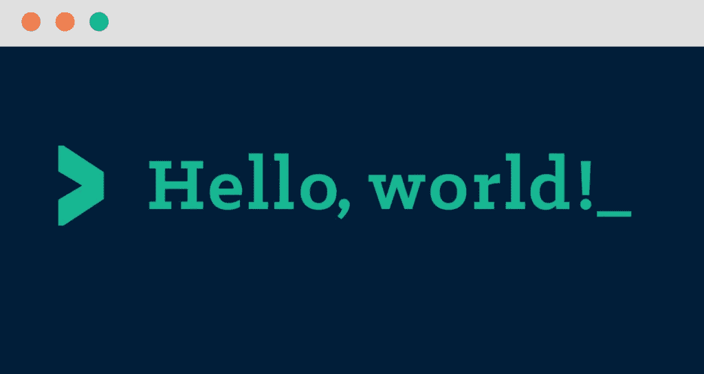

# 如何用 12 种最流行的编程语言打印“Hello World”

> 原文：<https://towardsdatascience.com/how-to-print-hello-world-in-top-12-most-popular-programming-languages-736d49c6c61c?source=collection_archive---------12----------------------->

*Img source: yen.io*

你好，世界！

当你开始学习编程时，或者当你只是在学习一门新的编程语言时，首先要做的事情之一就是做一些非常简单的事情。你要做的第一步是打印一个简单的文本。当你读这篇文章的时候，你可能知道哪一篇文章是最常见的，也是我所指的那一篇。

我正在谈论的文本是*你好世界。*

当你刚刚踏上一个重要的旅程时，这篇文章应该是你向世界问候的一种方式。尽可能多的学习之旅。

如果你很好奇，想看看如何在 12 种最流行的编程语言中做到这一点，那么让我们开始吧。不过在我们开始之前有一件事:流行度的排序是基于 GitHub 和 Tiobe 的，正如这里的[所示。](https://stackify.com/popular-programming-languages-2018/#wpautbox_about)

# 1.Java 语言(一种计算机语言，尤用于创建网站)

# 2.C

# 3.计算机编程语言

# 4.C++

# 5.C#

# 6.Visual Basic。网

# 7.Java Script 语言

# 8.服务器端编程语言（Professional Hypertext Preprocessor 的缩写）

# 9.目标-C

# 10.结构化查询语言

# 11.红宝石

# 12.矩阵实验室

这些例子来自下面的[库](https://github.com/Omkar-Ajnadkar/Hello-World)，在那里你可以找到更多的例子。

它是开源的，如果你知道其他没有列出的编程语言，你也可以对它做出贡献。