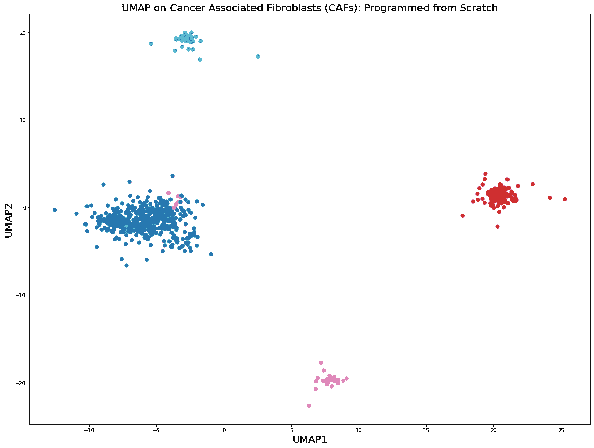

# 如何从零开始编程 UMAP

> 原文：<https://towardsdatascience.com/how-to-program-umap-from-scratch-e6eff67f55fe?source=collection_archive---------4----------------------->

## [生命科学的数理统计和机器学习](https://towardsdatascience.com/tagged/stats-ml-life-sciences)

## 以及如何改善 UMAP

[Image source](https://twitter.com/leland_mcinnes)

这是我的专栏 [**生命科学的数理统计和机器学习**](https://towardsdatascience.com/tagged/stats-ml-life-sciences?source=post_page---------------------------) 的第十三篇文章，我试图解释一些在生物信息学、生物医学、遗传学等领域使用的神秘分析技术。以一种简单的方式。在上一篇文章 [**中，我首先直观地解释了 UMAP 背后的数学原理。学习它的最好方法是从头开始为 UMAP 编程，这就是我们今天要做的。这篇文章的想法是要表明，每个人都可以相对容易地创建自己的邻居图降维技术，这种技术甚至可以提供比 UMAP 更好的可视化效果。这将是大量的编码，扣好安全带！**](/how-exactly-umap-works-13e3040e1668)

# 构建高维概率

作为测试数据集，我们将使用[癌症相关成纤维细胞(CAFs)](https://www.nature.com/articles/s41467-018-07582-3) scRNAseq 数据。我们从导入 Python 库(主要使用 numpy 和 scikit-learn)开始，查看数据矩阵并检查数据集的维度。请注意，这里的行是细胞，列是基因，最后一列包含聚类结果的编码，即每个细胞属于 id 为#1、2、3 和 4 的 4 个聚类之一:

从一开始就要定义的一个重要的全局变量是初始**高维** scRNAseq 数据集的**平方成对欧几里德距离**的矩阵，这个矩阵将在未来的代码中大量使用。在这里，我们还定义了**局部连通性** **参数 rho** ，作为到第一个最近邻居的距离，关于该参数含义的更详细解释，参见[上一篇文章](/how-exactly-umap-works-13e3040e1668)。

使用平方成对欧几里德距离的矩阵，我们将计算高维空间中的概率矩阵。知道了这个矩阵，我们可以很容易地计算出每个细胞的熵和最近邻的数量，k = 2^Entropy.请注意函数的自变量*。这意味着作为*的函数的概率矩阵将在以后用于二分搜索法过程，该过程为固定数量的最近邻居计算最优*。***

***这里的一个技巧是，为了方便起见，我们为每个第 I 个单元计算一个 1D 概率数组，这意味着为平方成对欧几里德距离矩阵的每个第 I 行(或列)(从第 I 个单元到数据集中所有其他单元的距离)。这样做是因为等式中有未知的 *σ_i* :***

****

**我们必须使用**二分搜索法**来为数据集中的第 I 个单元格找到 *σ_i* 。对于每个第 I 个单元格，给定高维概率的 1D 数组，我们可以对数组的元素求和，并根据定义计算最近邻的数量， **k** :**

****

**所以现在我们有了一个函数，它为每个第 I 个单元格的每个 *σ_ i* 生成最近邻的数量、 **k** 、(标量)值。我们可以固定最近邻值的数量(期望的 **k** 超参数)并将该函数输入到二分搜索法过程中，以便计算每个第 I 个单元的 *σ_i* 。**

**计算 *σ_i* 对于每个细胞，我们得到 n 个细胞的概率 1D 阵列，它们一起构建了一个高维概率矩阵。根据 UMAP 算法，该矩阵必须满足**对称条件**:**

****

**然而，根据我的经验，下面更简单的对称条件提供了一个更好的可视化，我们将在后面看到。**

**我鼓励读者尝试不同的方法来获得高维概率的对称矩阵，并检查最终的可视化是如何变化的。**

# **构建低维概率**

**接下来，我们将计算高维相邻图的布局，即根据 UMAP 定义的低维概率矩阵:**

****

**由于 UMAP 算法的目标是找到低维嵌入的最佳坐标， **y_i** ，其通过梯度下降过程被更新，我期望 **a** 和 **b** 参数也应该在每个梯度下降迭代中被更新。然而，在最初的 UMAP 算法中，它们似乎在最开始就被固定为 **min_dist** 超参数的期望值:**

**同样，在这里我看到了改进和实验的空间。为了简单起见，下面我将设置 **a=1** 和 **b=1** ，以便得到一种 UMAP 和 tSNE 的混合。那么低维概率矩阵由下式给出:**

# **学习低维嵌入**

**最后，我们将编码 UMAP 的代价函数，即**交叉熵**，请参见[上一篇文章](/how-exactly-umap-works-13e3040e1668)了解该代价函数如何保持全局距离的详细信息。实际上，我们感兴趣的不是交叉熵本身，而是稍后将在**梯度下降**过程中使用的**梯度**。**

**请注意 CE_gradient 函数中的 Q 矩阵。不应该根据 UMAP 算法对其进行归一化。然而，根据我的经验，这种规范化提高了低维可视化。我再次鼓励每个人在这里尝试。最后，我们用图拉普拉斯算子初始化低维嵌入的坐标 **y_i** ,并启动梯度下降过程:**

****

**交叉熵似乎在减少，并达到一个平台。请注意，这里为了简单起见，我实现了常规梯度下降，而不是 UMAP 最初实现使用的随机梯度下降。这是因为这篇文章的目的是展示 UMAP 的想法，而不是提供一个优化的漂亮的代码。现在，我们可以将低维嵌入可视化:**

****

**我们还可以很容易地动画显示不同的聚类是如何从拉普拉斯嵌入开始形成的，这是通过将每次迭代的图合并到 gif 文件中来完成的。**

****

**UMAP 的从头实现看起来工作良好，4 个细胞群的集群清晰可辨。如果我们在上面的低维嵌入中运行聚类算法，那么它们在识别细胞群体时不会有问题。**

**让我们将上图与最初的 UMAP Python + numba 实现进行比较。我们将使用 n_neighbors = 15 和 min_dist = 0.25，即与之前的从零开始 UMAP 实现中相同的 UMAP 超参数值。**

****

**我们在这里可以看到，从某种意义上说，与最初的 UMAP 实现相比，从头开始的实现提供了更独特的集群。这是由于在方法上应用了小的改变，例如略微不同的对称条件和交叉熵梯度中 Q 矩阵的归一化。**

# **摘要**

**在这篇文章中，我们了解到用 Python 从头开始实现 UMAP 相对容易。因此，我的预测是，UMAP 只是一个开始，在不久的将来，单细胞基因组学研究领域将会出现更多、**可能更好的**降维技术。**很简单**调整低维和高维分布，制定更好的标准化和对称条件，更好的成本函数，并利用吸引力/排斥力来解决 N 体问题，以获得更好的低维表示。**

**在下面的评论中让我知道**生命科学中的哪些分析技术**对你来说似乎**特别神秘**，我会在以后的帖子中尽量涉及它们。检查我的 [github](https://github.com/NikolayOskolkov/HowUMAPWorks) 上的帖子中的代码。在 Medium [关注我，在 Twitter @NikolayOskolkov 关注我，在 Linkedin](https://medium.com/u/8570b484f56c?source=post_page-----e6eff67f55fe--------------------------------) 关注我。下一次，我将转向进化生物学，并展示如何利用古代 DNA 来估算种群数量，敬请关注。**